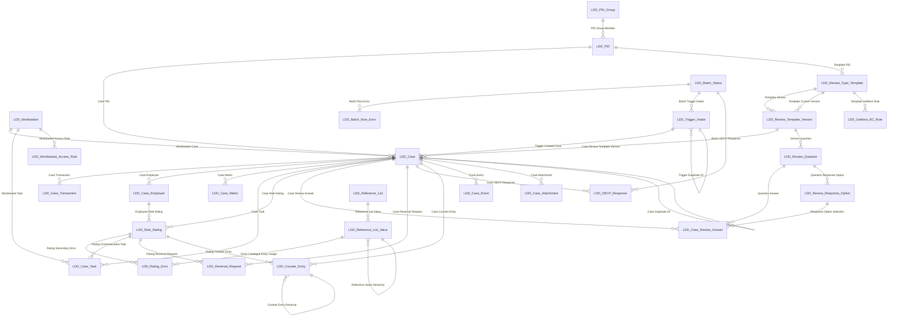

# Lending Due Diligence (LDD) — Dataverse Data Model

**Pega to Power Apps Code App Migration — Data Model Document v1.0**

> **Status: Draft with Open Decisions. This document is a proposed design. It is not approved, and no Dataverse component has been created.**

## 1. Document Control

| Attribute | Value |
|---|---|
| Document Title | Lending Due Diligence — Dataverse Data Model |
| Project Name | Lending Due Diligence (LDD) — Pega to Power Apps Code App Migration |
| Project ID | CIBC-LDD-PPMIG |
| Client | CIBC — Personal & Business Banking / Simplii Financial |
| Data Model Version | 1.0 |
| Data Model Status | Draft with Open Decisions |
| Requirements Baseline Version | 1.0 |
| Solution Design Version | 1.0 |
| Date Generated | 2026-08-27 |
| Author | Power Platform Delivery Orchestrator (agent generated) |
| Publisher Name | To be confirmed against the CIBC Power Platform publisher standard — not assumed |
| Publisher Prefix | {PublisherPrefix} — PLACEHOLDER. Not confirmed. Must never be invented or changed once established (CON-05). |
| Target Solution Name | CIBCLendingDueDiligence (proposed, not confirmed) |
| Target Environment Type | DEV (non-production). Production is explicitly not targeted by this design. |
| Approval Status | Not approved. An agent-generated model is never marked Approved. |
| Provisioning Ready | **No** — see Section 34. |

**Version history**

| Version | Date | Author | Change |
|---|---|---|---|
| 1.0 | 2026-08-27 | Agent | Initial data model derived from requirements baseline v1.0 and Solution Design v1.0. |

**Terminology used to classify every statement in this document**

| Marker | Meaning |
|---|---|
| Confirmed Requirement | Traceable to an approved requirement ID in the baseline. |
| Approved Decision | An architectural decision carried forward from the Solution Design. |
| Proposed Design | A design choice made by this skill, awaiting review. |
| Recommendation | A suggested option that a human must select. |
| Assumption | Recorded in Section 30 with a DMASS ID. Not confirmed. |
| Open Decision | Recorded in Section 33 with a DMQ or DMDEC ID. |
| Blocked Item | Cannot be designed until a blocking decision is resolved. |
| Out of Scope | Explicitly excluded — Section 6. |

## 2. Executive Summary

This document defines the conceptual, logical and physical Dataverse data model for the migration of CIBC's Pega **Lending Due Diligence (LDD)** application to a Power Apps Code App. It is derived exclusively from the approved requirements baseline (v1.0, 161 requirements across functional, non-functional, data, reporting, security and integration categories) and the approved Solution Design (v1.0).

**What the model contains**

| Element | Count |
|---|---|
| Proposed new Dataverse tables | 36 |
| Tables requiring a decision before physical design (virtual/blocked) | 3 |
| Total table designs | 39 |
| Standard Dataverse tables reused | 4 |
| Proposed columns | 443 |
| Choices | 32 |
| Relationships | 40 |
| Alternate keys | 15 |
| Record lifecycles | 6 |
| Validation and data quality rules | 22 |
| Derived (formula/rollup) columns | 10 |
| Forms | 16 |
| Views | 17 |
| Business rules | 10 |
| Integration mappings | 8 |
| Migration mappings | 5 |
| Performance considerations | 10 |
| Customisations reviewed | 8 |
| Assumptions / Risks / Dependencies | 12 / 10 / 14 |
| Open questions / decisions | 15 / 6 |

**The five design decisions that shape everything else**

1. **The snapshot pattern (TBL-002, TBL-003, TBL-004).** The Metric feed alone carries 91,250,000 rows per month, growing 30 percent annually, and the Transaction feed 18,250,000 rows per month. Landing that in Dataverse is not viable, and FR-032 independently requires that an inflight case sees a frozen view of its data while FR-058 and FR-059 permit an analyst to amend it. Both problems have the same answer: copy only the rows relevant to an actual case into per-case snapshot tables. Dataverse volume is then bounded by case count, not feed count, immutability is structural, and analyst amendments are recorded against the snapshot with a justification rather than against the source.

2. **Review template versioning (TBL-018).** FR-086 requires that changing a review definition must not disturb cases already in flight. Stamping a *version* record onto the case, rather than pointing at a mutable definition, makes that requirement structurally true instead of procedurally hoped for.

3. **The counter is a ledger, not a running total (TBL-011).** Escalation level is a function of the counter *as at the moment of rating*. Because the reset basis is configurable (fiscal year 01 November to 31 October, or rolling 365 days) and RM ratings are excluded from BC counters, a stored running total would be unexplainable and unreproducible. An immutable entry ledger, plus persistence of `Counter Value At Rating` on TBL-006, keeps every escalation defensible.

4. **Business history is a table, not the audit log (TBL-012, TBL-031).** Users must read, filter, report on and export case history. The Dataverse audit log supports none of that from a Canvas App. Platform auditing runs in parallel as the tamper-evident technical control; it is not a substitute.

5. **Three entities have no physical design, deliberately.** Transaction, Employee and Metric (TBL-037, TBL-038, TBL-039) carry only projection keys and a blocking note, because the system of record (OQ-001) and data residency (OQ-002) are unresolved blocking decisions. Designing physical columns for data whose ownership is unknown would be an invention, and this skill does not invent.

**Readiness.** `provisioning_ready` is **false**. The publisher prefix is not confirmed and has not been invented — `{PublisherPrefix}` appears throughout as a labelled placeholder. Five upstream blocking decisions (OQ-001 to OQ-005) and a number of data-model questions remain open. Section 34 lists every blocking reason.

## 3. Source Documents and Versions

| Source | Version | Role |
|---|---|---|
| requirements-baseline.json | 1.0 | Primary source of truth for requirement IDs. IDs are stable and unchanged. |
| solution-design.json | 1.0 | Approved architecture, component IDs, data architecture dispositions DAT-001 to DAT-005. |
| LDD Application Design Document (ADD) | 1.3 | Functional behaviour, screens, escalation and counter rules. |
| LDD Pega Application Document | n/a | Legacy application structure. |
| Lending Due Diligence Ingestion Files IA | 2.0 | Inbound file specifications including the 128-field Transaction record. |
| Lending Due Diligence Extract IA | 1.5 | Outbound extract specification. |
| RM Escalation Flow Screenshots | n/a | RM escalation behaviour and UI evidence. |

**Existing Dataverse metadata:** No CIBC Dataverse environment or existing solution metadata was supplied to this engagement. Reuse analysis was therefore performed against the Dataverse standard table catalogue only. A metadata comparison against the target CIBC environment remains outstanding (DMQ-009).

**Source precedence applied:** approved baseline, then approved Solution Design, then approved architectural decisions, then source documents, then explicitly labelled assumptions. Where sources conflicted, the conflict was recorded as an open question rather than silently resolved.

## 4. Data-Modelling Principles

These principles were applied and are auditable against the design that follows.

**Dataverse first, not Dataverse only.** Each information category was assessed for its correct home. Case, rating, task, configuration and history data belongs in Dataverse. The raw Transaction, Employee and Metric feeds do not, and are held in their source store with only per-case snapshots copied in. Case attachments are held as Dataverse file columns on TBL-013 rather than in SharePoint, because they are evidence bound to a single case with no collaboration, co-authoring or records-management requirement — the reasoning is set out in Section 11 under TBL-013.

**Reuse before create.** Four standard tables are reused (`systemuser`, `team`, `businessunit`, `annotation`). Four candidate reuses were examined and rejected with reasons, recorded in DMDEC-005 and Section 10.

**Normalise appropriately.** Reference data is separated from transactional data. Repeated text is replaced by lookups where the value has a lifecycle. Normalisation stops short of fragmenting the model where delegation and reporting would suffer — the snapshot tables are deliberately wide and flat for exactly that reason.

**Stable identifiers.** Upstream requirement IDs and Solution Design component IDs are preserved unchanged. New IDs (TBL, COL, REL, CHC, KEY, VIEW, FORM, BR, IDX, MIG, DQ, DMASS, DMRISK, DMQ, DMDEC) are assigned once and are stable from this version forward.

**Naming standards.** Display names are business-friendly title case. Logical names are lowercase without spaces. Schema names carry the publisher prefix. No abbreviation is used without explanation. The publisher prefix is not invented — `{PublisherPrefix}` is a placeholder.

**Security by design.** Ownership type is chosen per table from the access requirement, not by default. Field-level security is specified for sensitive columns. No access control in this model depends on a hidden or disabled application control (SEC-013).

**Auditability by design.** Auditing is targeted at the columns that carry decisions, not switched on everywhere. Where users must consume history, an explicit history table exists.

**Configuration before code.** Required levels, choices, relationships, formula columns, business rules and Power Automate are preferred in that order. Every proposed departure is justified in Section 28.

## 5. Scope

In scope for this data model:

- The Dataverse schema supporting the BC and RM lending due diligence case lifecycle: Initialization, Triage, Review, Recommendation and Action.
- Case data, rating data, task and workbasket data, reversal requests, counters and escalation, review templates and their versions, reference and configuration data, and business history.
- Per-case snapshots of transaction, employee and metric data.
- Inbound and outbound integration landing structures and mapping definitions.
- Migration target structures for legacy BC cases from 01 November 2021.
- Choices, relationships, keys, lifecycles, validation rules, forms, views and business rules supporting the above.
- Reporting, performance, security and auditing considerations for every table.

## 6. Out of Scope

Explicitly out of scope for this skill and this document:

- Creation or modification of any Dataverse component. Nothing in this design has been provisioned.
- Security role definitions. Section 19 is a design-level privilege summary only; roles are created by a later activity.
- Canvas App screens, controls and formulas.
- Power Automate flow definitions and the ingestion pipeline implementation.
- Azure DevOps work items.
- Physical column design for Transaction, Employee and Metric, which is blocked by OQ-001 and OQ-002.
- Any activity targeting a Production environment.
- Legacy Pega data beyond the migration scope stated in Section 24.

## 7. Conceptual Data Model

The requirements baseline identified fourteen conceptual data entities (DR-001 to DR-014). Every one has an explicit disposition below. No entity is left without a decision.

| DR ID | Conceptual Entity | Business Purpose | Disposition | Status |
|---|---|---|---|---|
| DR-001 | Transaction | Lending transaction under review | Dataverse table(s): TBL-002, TBL-037 | Decision Required |
| DR-002 | Employee | Lender/partner employee master | Dataverse table(s): TBL-003, TBL-038 | Decision Required |
| DR-003 | Metric | Employee- and transaction-level review criteria values | Dataverse table(s): TBL-004, TBL-039 | Decision Required |
| DR-004 | Trigger | Instruction to create a case | Dataverse table(s): TBL-034 | Designed |
| DR-005 | Case | BC or RM due diligence case | Dataverse table(s): TBL-001, TBL-002, TBL-012, TBL-013, TBL-036 | Designed |
| DR-006 | Task / Assignment | Unit of work routed to a user or workbasket | Dataverse table(s): TBL-005 | Designed |
| DR-007 | Workbasket / Queue | Routing container | Dataverse table(s): TBL-015, TBL-016 | Designed |
| DR-008 | Review Type Template | Configurable question set | Dataverse table(s): TBL-008, TBL-017, TBL-018, TBL-019, TBL-020 | Designed |
| DR-009 | Rating and Recommendation | Per-role rating outcome | Dataverse table(s): TBL-003, TBL-006, TBL-007, TBL-009 | Designed |
| DR-010 | Counter (Coaching/Escalation/FYI) | Running counts per operator | Dataverse table(s): TBL-011 | Designed |
| DR-011 | Administration Configuration | Business-maintained reference data | Dataverse table(s): TBL-021, TBL-022, TBL-023, TBL-024, TBL-025, TBL-026, TBL-027, TBL-028, TBL-029, TBL-030, TBL-031 | Designed |
| DR-012 | Batch Status | Ingestion run tracking | Dataverse table(s): TBL-032, TBL-033, TBL-035 | Designed |
| DR-013 | Legacy / Migrated Case | Historical BC cases from Nov 01 2021 onward | Dataverse table(s): TBL-014 | Designed |
| DR-014 | OECP Response | Consolidated coaching/escalation decision | Dataverse table(s): TBL-010 | Designed |

**Proposed systems of record**

| Information category | Proposed system of record | Status |
|---|---|---|
| Case, rating, task, reversal, counter, review template, configuration, history | Dataverse (this solution) | Proposed Design |
| Transaction, Employee, Metric source data | External — **unresolved**, blocking decision OQ-001 | Blocked |
| User identity | Microsoft Entra ID via `systemuser`. Correlation to COINS ID unresolved (OQ-003) | Decision Required |
| Case attachments | Dataverse file columns on TBL-013 | Proposed Design |
| Outbound extract files | SFTP destination system | Confirmed Requirement |
| Legacy BC case history | Dataverse TBL-014, migrated from 01 November 2021 | Proposed Design |

**Data volumes.** Only volumes stated in the source documents are recorded. No volume has been invented. Where a figure was not supplied — notably case counts — the entry says so explicitly.

| Feed | Stated volume | Growth |
|---|---|---|
| Metric.txt | 91,250,000 rows per month | +30% per year |
| Transaction1/2.txt | 18,250,000 rows per month; 50,000 per day; max 50,000 per file; max 100,000 per day | +15% per year |
| Employee.txt | 20,000 rows per month | Not stated |
| Trigger_bc.txt | 2,600 rows per day | Not stated |
| Trigger_rm.txt | 2,600 rows per day | Not stated |
| LDDOECPResponse.txt | 2,600 rows per day | Not stated |

## 8. Logical Data Model

The logical model sits between the fourteen conceptual entities and the physical Dataverse design. It is documented here so that the reasoning is visible rather than implied by the physical tables.

**Logical entity groups**

| Group | Logical entities | Purpose |
|---|---|---|
| Case core | Case; Case Transaction Snapshot; Case Employee Snapshot; Case Metric Snapshot | The unit of work and the frozen data it was assessed against. |
| Assessment | Role Rating; Rating Error; Review Answer; Reversal Request; OECP Response | What the analyst concluded, against which role, and what was challenged. |
| Work distribution | Task; Workbasket; Workbasket Access Rule; GetNext configuration | How work reaches a person. |
| Escalation | Counter Entry; Counter Configuration; Communication configuration | How repeated findings escalate. |
| Review definition | Review Type; Review Template; Review Template Version; Review Question | What questions a case must answer, and which version applies. |
| Reference data | Dropdown Value; PID; Rating Role; Reversal Reason | Business-maintainable controlled values. |
| History | Case Event; Config Change Log | Business-facing, user-readable history. |
| Operations | Batch Load; Batch Row Error; Extract Run; Trigger Row; Migration Run | Integration and batch outcomes. |
| External | Transaction; Employee; Metric | Held outside Dataverse; system of record unresolved. |

**Logical relationship summary (business meaning, not implementation)**

- A **Case** is raised from exactly one **Trigger Row** and holds exactly one snapshot of each of Transaction, Employee and Metric data.
- A **Case** carries many **Role Ratings**, one per rated role (Lender, Overrider, UW-CA, IVO, RCS, Other 1 to 3). Each Role Rating may carry many **Rating Errors**.
- A **Case** answers many **Review Questions**, recorded as **Review Answers**, all belonging to a single stamped **Review Template Version**.
- A **Role Rating** may be challenged by at most one open **Reversal Request**, which resolves to one of four outcomes.
- A **Role Rating** that results in a finding writes one immutable **Counter Entry** against the rated Operator ID.
- A **Case** generates many **Tasks**, each routed to exactly one **Workbasket** and optionally assigned to one user.
- Every material change to a **Case** writes one **Case Event**.

**Candidate identifiers, cardinality, lifecycle, ownership, sensitivity, retention, integration and reporting considerations** for each logical entity are carried forward without loss into the physical design and are documented per table in Sections 10 to 21, so that a reader has a single place to look rather than two competing descriptions.

## 9. Physical Dataverse Model

**Naming convention.** Every custom component uses the publisher prefix. Because the prefix is **not confirmed**, this document renders it as `{PublisherPrefix}`. For example, the LDD Case table appears as:

- Display name: `LDD Case`
- Plural display name: `LDD Cases`
- Logical name: `{PublisherPrefix}_case`
- Schema name: `{PublisherPrefix}_Case`

The placeholder must be substituted exactly once, at provisioning time, with the prefix confirmed by the CIBC Power Platform CoE (DEP-001, DMQ-002). It must never be changed afterwards.

**Table classification summary**

| Classification | Count |
|---|---|
| New custom table | 36 |
| Virtual table — DECISION REQUIRED | 3 |

**Ownership type summary**

| Ownership type | Count | Rationale |
|---|---|---|
| Organisation owned | 29 | Shared reference or configuration data; row-level ownership is unnecessary and would obstruct administration. |
| User or Team owned | 10 | Row-level ownership, assignment and sharing are required. |

## 10. Table Catalogue

Thirty-nine table designs and four standard-table reuses. Each entry states its purpose, its requirement trace, and the reasoning behind its configuration.

### TBL-001 — LDD Case

A Business Controls or Risk Management lending due diligence case. The central transactional entity of the solution.

| Attribute | Value |
|---|---|
| Display / Plural | LDD Case / LDD Cases |
| Logical name | `{PublisherPrefix}_case` |
| Schema name | `{PublisherPrefix}_Case` |
| Classification | New custom table |
| Ownership type | User or Team owned |
| Primary name column | COL-001 — Case ID |
| Activity table | No |
| Notes / Attachments / Connections | Yes / No / No |
| Auditing enabled | Yes |
| Change tracking | Yes |
| Duplicate detection | Yes |
| Quick Create | Yes |
| Offline | No |
| Dataverse search | Yes |
| Data classification | Confidential — contains customer and employee personal data |
| Retention | Purge 7 years after the end of the calendar year in which the case was closed (NFR-017). Legal hold exempts a case from purge. |
| Expected volume | Derived from trigger volumes: approximately 5,200 trigger rows per day across BC and RM feeds, before duplicate suppression. No case-count figure was supplied in the source documents and none has been invented. |
| Existing component reuse | No standard Dataverse table represents a due diligence case. Reviewed and rejected: Incident (Case) — its service-management semantics, SLA model and entitlement behaviour do not fit, and its status model cannot carry the four-stage LDD lifecycle without overloading. |
| Columns | 33 (COL-001 to COL-033) |
| Requirement IDs | FR-025, FR-026, FR-030, FR-031, FR-032, FR-033, FR-045, FR-047, FR-061, FR-062, FR-063, FR-075, DR-005 |
| Upstream conceptual entities | DR-005 |
| Design status | Designed |

### TBL-002 — LDD Case Transaction

An immutable-at-creation snapshot of the transaction attributes relevant to the case, plus any analyst amendments. This table is the mechanism that satisfies two requirements at once: FR-032 requires inflight cases to be unaffected by later data changes, and FR-059 permits an analyst to amend transaction details on the case. Neither can be met by reading live from the Transaction system of record. Only the reviewed and displayed subset of the 128-field Transaction specification is snapshotted; the full record remains in the Transaction system of record (TBL-038).

| Attribute | Value |
|---|---|
| Display / Plural | LDD Case Transaction / LDD Case Transactions |
| Logical name | `{PublisherPrefix}_casetransaction` |
| Schema name | `{PublisherPrefix}_Casetransaction` |
| Classification | New custom table |
| Ownership type | User or Team owned |
| Primary name column | COL-034 — Transaction Reference |
| Activity table | No |
| Notes / Attachments / Connections | No / No / No |
| Auditing enabled | Yes |
| Change tracking | Yes |
| Duplicate detection | No |
| Quick Create | No |
| Offline | No |
| Dataverse search | No |
| Data classification | Confidential — customer personal and financial data |
| Retention | Purged with the parent case (NFR-017). |
| Expected volume | One row per case. Bounded by case volume, not by the 18,250,000 monthly transaction rows. |
| Existing component reuse | No reuse candidate. |
| Columns | 45 (COL-034 to COL-078) |
| Requirement IDs | FR-032, FR-059, FR-073, FR-075, DR-001 |
| Upstream conceptual entities | DR-001, DR-005 |
| Design status | Designed |

### TBL-003 — LDD Case Employee

A point-in-time snapshot of an employee accountable on the case, including the derived four-level manager hierarchy used for escalation. Snapshotting is essential: the escalation target must be the manager who was in place when the case was rated, not the manager in place when someone later opens the record.

| Attribute | Value |
|---|---|
| Display / Plural | LDD Case Employee / LDD Case Employees |
| Logical name | `{PublisherPrefix}_caseemployee` |
| Schema name | `{PublisherPrefix}_Caseemployee` |
| Classification | New custom table |
| Ownership type | User or Team owned |
| Primary name column | COL-079 — Employee Display |
| Activity table | No |
| Notes / Attachments / Connections | No / No / No |
| Auditing enabled | Yes |
| Change tracking | Yes |
| Duplicate detection | No |
| Quick Create | No |
| Offline | No |
| Dataverse search | No |
| Data classification | Confidential — employee personal data |
| Retention | Purged with the parent case. |
| Expected volume | One row per accountable role per case — up to eight rows per case per CHC-007. |
| Existing component reuse | Reviewed systemuser: rejected. The rated party is frequently not an application user (partners, back-office staff), and the record must be an immutable point-in-time snapshot including a four-level manager hierarchy, which systemuser cannot provide. |
| Columns | 31 (COL-079 to COL-109) |
| Requirement IDs | FR-042, FR-058, FR-073, DR-002, DR-009 |
| Upstream conceptual entities | DR-002, DR-009 |
| Design status | Designed |

### TBL-004 — LDD Case Metric

The review criteria values relevant to the case, snapshotted from the Metric system of record at case creation. Surfaces the Additional Metrics behaviour (FR-076).

| Attribute | Value |
|---|---|
| Display / Plural | LDD Case Metric / LDD Case Metrics |
| Logical name | `{PublisherPrefix}_casemetric` |
| Schema name | `{PublisherPrefix}_Casemetric` |
| Classification | New custom table |
| Ownership type | User or Team owned |
| Primary name column | COL-110 — Review Criterion |
| Activity table | No |
| Notes / Attachments / Connections | No / No / No |
| Auditing enabled | No |
| Change tracking | No |
| Duplicate detection | No |
| Quick Create | No |
| Offline | No |
| Dataverse search | No |
| Data classification | Internal |
| Retention | Purged with the parent case. |
| Expected volume | Bounded by the number of review criteria applicable to a case. NOT the 91,250,000 monthly Metric rows — only the criteria relevant to the case are snapshotted. |
| Existing component reuse | No reuse candidate. |
| Columns | 8 (COL-110 to COL-117) |
| Requirement IDs | FR-076, FR-073, DR-003 |
| Upstream conceptual entities | DR-003 |
| Design status | Designed |

### TBL-005 — LDD Case Task

A unit of work routed to a user or a workbasket. Covers review tasks, lender tasks, fraud review tasks, second opinion requests, cross-team referrals and branch accountability tasks.

| Attribute | Value |
|---|---|
| Display / Plural | LDD Case Task / LDD Case Tasks |
| Logical name | `{PublisherPrefix}_casetask` |
| Schema name | `{PublisherPrefix}_Casetask` |
| Classification | New custom table |
| Ownership type | User or Team owned |
| Primary name column | COL-118 — Task Name |
| Activity table | No |
| Notes / Attachments / Connections | Yes / No / No |
| Auditing enabled | Yes |
| Change tracking | Yes |
| Duplicate detection | No |
| Quick Create | Yes |
| Offline | No |
| Dataverse search | Yes |
| Data classification | Internal |
| Retention | Purged with the parent case. |
| Expected volume | Multiple tasks per case; no figure supplied. |
| Existing component reuse | Reviewed the standard Task activity table: rejected. Task is an activity table with a fixed regarding model and an activity party structure that does not carry workbasket routing, hold/release semantics or role scoping. Modelling as a custom table keeps routing explicit and server-enforced. |
| Columns | 18 (COL-118 to COL-135) |
| Requirement IDs | FR-027, FR-029, FR-056, FR-057, FR-064, FR-065, FR-066, FR-067, FR-068, FR-088, FR-089, DR-006 |
| Upstream conceptual entities | DR-006 |
| Design status | Designed |

### TBL-006 — LDD Role Rating

The rating outcome for one accountable role on a case. Each of the eight role rating tabs in the reviewer workspace corresponds to one row. Rating Status, Reversal Status and Final Rating are deliberately separate columns because they change independently and at different points in the process.

| Attribute | Value |
|---|---|
| Display / Plural | LDD Role Rating / LDD Role Ratings |
| Logical name | `{PublisherPrefix}_rolerating` |
| Schema name | `{PublisherPrefix}_Rolerating` |
| Classification | New custom table |
| Ownership type | User or Team owned |
| Primary name column | COL-136 — Rating Display |
| Activity table | No |
| Notes / Attachments / Connections | Yes / No / No |
| Auditing enabled | Yes |
| Change tracking | Yes |
| Duplicate detection | No |
| Quick Create | No |
| Offline | No |
| Dataverse search | Yes |
| Data classification | Confidential — employee performance data |
| Retention | Purged with the parent case. |
| Expected volume | Up to eight rows per case. |
| Existing component reuse | No reuse candidate. |
| Columns | 24 (COL-136 to COL-159) |
| Requirement IDs | FR-038, FR-039, FR-040, FR-043, FR-044, DR-009 |
| Upstream conceptual entities | DR-009 |
| Design status | Designed |

### TBL-007 — LDD Rating Error

The secondary errors recorded against a role rating. Modelled as an intersect table with its own attributes rather than as a multi-select choice, because the error catalogue is business-maintained, bilingual, and requires sequence and per-error commentary — none of which a multi-select choice can carry.

| Attribute | Value |
|---|---|
| Display / Plural | LDD Rating Error / LDD Rating Errors |
| Logical name | `{PublisherPrefix}_ratingerror` |
| Schema name | `{PublisherPrefix}_Ratingerror` |
| Classification | New custom table |
| Ownership type | User or Team owned |
| Primary name column | COL-160 — Rating Error |
| Activity table | No |
| Notes / Attachments / Connections | No / No / No |
| Auditing enabled | Yes |
| Change tracking | No |
| Duplicate detection | No |
| Quick Create | No |
| Offline | No |
| Dataverse search | No |
| Data classification | Confidential |
| Retention | Purged with the parent case. |
| Expected volume | Zero to many secondary errors per rating. |
| Existing component reuse | No reuse candidate. |
| Columns | 5 (COL-160 to COL-164) |
| Requirement IDs | FR-039, NFR-023 |
| Upstream conceptual entities | DR-009 |
| Design status | Designed |

### TBL-008 — LDD Case Review Answer

The analyst's answer to one question from the review template version stamped onto the case.

| Attribute | Value |
|---|---|
| Display / Plural | LDD Case Review Answer / LDD Case Review Answers |
| Logical name | `{PublisherPrefix}_casereviewanswer` |
| Schema name | `{PublisherPrefix}_Casereviewanswer` |
| Classification | New custom table |
| Ownership type | User or Team owned |
| Primary name column | COL-165 — Answer Display |
| Activity table | No |
| Notes / Attachments / Connections | No / No / No |
| Auditing enabled | Yes |
| Change tracking | No |
| Duplicate detection | No |
| Quick Create | No |
| Offline | No |
| Dataverse search | No |
| Data classification | Confidential |
| Retention | Purged with the parent case. |
| Expected volume | One row per question in the stamped review template version. |
| Existing component reuse | No reuse candidate. |
| Columns | 8 (COL-165 to COL-172) |
| Requirement IDs | FR-034, FR-035, FR-036, FR-037, FR-082, DR-008 |
| Upstream conceptual entities | DR-008 |
| Design status | Designed |

### TBL-009 — LDD Reversal Request

An immutable business record of a reversal request and its decision. Held as its own table, not as columns on the rating, because reversal is a business-facing history that users read, report on and extract, and because a rating can be challenged more than once. Dataverse platform auditing is not an acceptable substitute for a history users must see.

| Attribute | Value |
|---|---|
| Display / Plural | LDD Reversal Request / LDD Reversal Requests |
| Logical name | `{PublisherPrefix}_reversalrequest` |
| Schema name | `{PublisherPrefix}_Reversalrequest` |
| Classification | New custom table |
| Ownership type | User or Team owned |
| Primary name column | COL-173 — Reversal Reference |
| Activity table | No |
| Notes / Attachments / Connections | Yes / No / No |
| Auditing enabled | Yes |
| Change tracking | Yes |
| Duplicate detection | No |
| Quick Create | No |
| Offline | No |
| Dataverse search | Yes |
| Data classification | Confidential — employee performance data |
| Retention | Purged with the parent case. |
| Expected volume | Zero to many per rating. |
| Existing component reuse | No reuse candidate. |
| Columns | 13 (COL-173 to COL-185) |
| Requirement IDs | FR-090, FR-091, BP-009, DR-009 |
| Upstream conceptual entities | DR-009 |
| Design status | Designed |

### TBL-010 — LDD OECP Response

The consolidated coaching/escalation decision returned by OECP. Held as a landed record of the inbound file, separate from the Reversal Request records it generates, so that the file as received remains reconcilable against the decisions applied.

| Attribute | Value |
|---|---|
| Display / Plural | LDD OECP Response / LDD OECP Responses |
| Logical name | `{PublisherPrefix}_oecpresponse` |
| Schema name | `{PublisherPrefix}_Oecpresponse` |
| Classification | New custom table |
| Ownership type | Organisation owned |
| Primary name column | COL-186 — OECP Reference |
| Activity table | No |
| Notes / Attachments / Connections | No / No / No |
| Auditing enabled | Yes |
| Change tracking | No |
| Duplicate detection | Yes |
| Quick Create | No |
| Offline | No |
| Dataverse search | No |
| Data classification | Confidential |
| Retention | Retain with the related case; purge on the case retention schedule. |
| Expected volume | 2,600 rows per day per the Interface Agreement. |
| Existing component reuse | No reuse candidate. |
| Columns | 16 (COL-186 to COL-201) |
| Requirement IDs | FR-012, FR-092, BP-008, DR-014 |
| Upstream conceptual entities | DR-014 |
| Design status | Designed |

### TBL-011 — LDD Counter Entry

An immutable ledger entry recording a counter movement for an operator. Modelled as a ledger rather than as a mutable running total on the employee record, because the escalation matrix depends on the counter value as at a point in time, the reset basis is configurable between fiscal year and rolling 12 months, and RM ratings must be excluded from BC counters. A stored total could satisfy none of those three requirements reliably.

| Attribute | Value |
|---|---|
| Display / Plural | LDD Counter Entry / LDD Counter Entries |
| Logical name | `{PublisherPrefix}_counterentry` |
| Schema name | `{PublisherPrefix}_Counterentry` |
| Classification | New custom table |
| Ownership type | Organisation owned |
| Primary name column | COL-202 — Counter Entry |
| Activity table | No |
| Notes / Attachments / Connections | No / No / No |
| Auditing enabled | Yes |
| Change tracking | Yes |
| Duplicate detection | No |
| Quick Create | No |
| Offline | No |
| Dataverse search | No |
| Data classification | Confidential — employee performance data |
| Retention | Retain for the counter reset window plus the case retention period. Counter entries are the evidence base for escalation decisions and must outlive the reset cycle. |
| Expected volume | One row per counted outcome per operator. |
| Existing component reuse | No reuse candidate. |
| Columns | 13 (COL-202 to COL-214) |
| Requirement IDs | FR-041, FR-085, FR-087, DR-010 |
| Upstream conceptual entities | DR-010 |
| Design status | Designed |

### TBL-012 — LDD Case Event

The business-facing, append-only case history displayed by FR-069 and extracted daily. This is deliberately NOT Dataverse platform auditing: users must read, filter, report on and export this history, and the audit log supports none of those. Platform auditing remains enabled in parallel as the technical control.

| Attribute | Value |
|---|---|
| Display / Plural | LDD Case Event / LDD Case Events |
| Logical name | `{PublisherPrefix}_caseevent` |
| Schema name | `{PublisherPrefix}_Caseevent` |
| Classification | New custom table |
| Ownership type | Organisation owned |
| Primary name column | COL-215 — Event |
| Activity table | No |
| Notes / Attachments / Connections | No / No / No |
| Auditing enabled | No |
| Change tracking | No |
| Duplicate detection | No |
| Quick Create | No |
| Offline | No |
| Dataverse search | Yes |
| Data classification | Confidential |
| Retention | Purged with the parent case. |
| Expected volume | High relative to case volume — many events per case. A candidate for elastic table classification; see DMQ-008. |
| Existing component reuse | No reuse candidate. |
| Columns | 12 (COL-215 to COL-226) |
| Requirement IDs | FR-069, NFR-014, SEC-011 |
| Upstream conceptual entities | DR-005 |
| Design status | Designed |

### TBL-013 — LDD Case Attachment

A document attached to a case, stored in a Dataverse file column per ADR-009. SharePoint was evaluated and rejected: it would fragment the security model and the 7-year purge across two stores, and the documents require no co-authoring, versioning or records-centre metadata.

| Attribute | Value |
|---|---|
| Display / Plural | LDD Case Attachment / LDD Case Attachments |
| Logical name | `{PublisherPrefix}_caseattachment` |
| Schema name | `{PublisherPrefix}_Caseattachment` |
| Classification | New custom table |
| Ownership type | User or Team owned |
| Primary name column | COL-227 — Attachment Name |
| Activity table | No |
| Notes / Attachments / Connections | No / No / No |
| Auditing enabled | Yes |
| Change tracking | No |
| Duplicate detection | No |
| Quick Create | No |
| Offline | No |
| Dataverse search | Yes |
| Data classification | Confidential — may contain customer documents |
| Retention | Purged with the parent case. File content must be destroyed, not merely dereferenced. |
| Expected volume | No figure supplied. |
| Existing component reuse | Reviewed the standard annotation (Note) table, which is enabled on TBL-001 for informal notes. A dedicated table is used for controlled attachments because they require category classification, explicit retention treatment and column-level security — none of which annotation supports. |
| Columns | 8 (COL-227 to COL-234) |
| Requirement IDs | FR-078 |
| Upstream conceptual entities | DR-005 |
| Design status | Designed |

### TBL-014 — LDD Legacy Case

Historical BC cases migrated from the legacy Pega system, retained for Related Cases display and counter continuity. Held in a separate table rather than merged into TBL-001 because the legacy field set is not the LDD field set, migrated rows must never re-enter the case workflow, and provenance must remain unambiguous.

| Attribute | Value |
|---|---|
| Display / Plural | LDD Legacy Case / LDD Legacy Cases |
| Logical name | `{PublisherPrefix}_legacycase` |
| Schema name | `{PublisherPrefix}_Legacycase` |
| Classification | New custom table |
| Ownership type | Organisation owned |
| Primary name column | COL-235 — Legacy Case ID |
| Activity table | No |
| Notes / Attachments / Connections | No / No / No |
| Auditing enabled | Yes |
| Change tracking | No |
| Duplicate detection | Yes |
| Quick Create | No |
| Offline | No |
| Dataverse search | Yes |
| Data classification | Confidential |
| Retention | Retain per the LDD retention policy calculated from the legacy closure date. Cases closed more than seven years before cutover must not be migrated at all. |
| Expected volume | BC cases created from 01 November 2021 onward, loaded over four migration runs. No row count was supplied. |
| Existing component reuse | No reuse candidate. |
| Columns | 8 (COL-235 to COL-242) |
| Requirement IDs | FR-013, FR-077, BP-012, DR-013 |
| Upstream conceptual entities | DR-013 |
| Design status | Partially Designed |

### TBL-015 — LDD Workbasket

A routing container for cases and tasks. Organisation owned because a workbasket is shared configuration, not a record any individual owns.

| Attribute | Value |
|---|---|
| Display / Plural | LDD Workbasket / LDD Workbaskets |
| Logical name | `{PublisherPrefix}_workbasket` |
| Schema name | `{PublisherPrefix}_Workbasket` |
| Classification | New custom table |
| Ownership type | Organisation owned |
| Primary name column | COL-243 — Workbasket Name |
| Activity table | No |
| Notes / Attachments / Connections | No / No / No |
| Auditing enabled | Yes |
| Change tracking | No |
| Duplicate detection | Yes |
| Quick Create | No |
| Offline | No |
| Dataverse search | Yes |
| Data classification | Internal |
| Retention | Retain for the life of the solution; deactivate rather than delete. |
| Expected volume | 16 workbaskets are enumerated in the source: 9 BC and 7 RM. |
| Existing component reuse | Reviewed the standard Queue table: rejected. Dataverse queues are tightly coupled to activity and queue-item routing, cannot carry the BC access matrix or the RM channel-scoping rule as data, and would place routing configuration outside the reach of business administrators. |
| Columns | 9 (COL-243 to COL-251) |
| Requirement IDs | FR-027, FR-029, FR-048, FR-050, FR-051, SEC-004, DR-007 |
| Upstream conceptual entities | DR-007 |
| Design status | Designed |

### TBL-016 — LDD Workbasket Access Rule

The BC workbasket access matrix and the RM channel-scoping rules, expressed as data. Modelled as an explicit intersect table with attributes rather than a native many-to-many, because each grant carries a capability set, a channel scope and an active flag. This table is configuration that informs security; it is not itself the security boundary — Dataverse teams and roles enforce access.

| Attribute | Value |
|---|---|
| Display / Plural | LDD Workbasket Access Rule / LDD Workbasket Access Rules |
| Logical name | `{PublisherPrefix}_workbasketaccessrule` |
| Schema name | `{PublisherPrefix}_Workbasketaccessrule` |
| Classification | New custom table |
| Ownership type | Organisation owned |
| Primary name column | COL-252 — Access Rule |
| Activity table | No |
| Notes / Attachments / Connections | No / No / No |
| Auditing enabled | Yes |
| Change tracking | No |
| Duplicate detection | No |
| Quick Create | No |
| Offline | No |
| Dataverse search | No |
| Data classification | Internal — security configuration |
| Retention | Retain for the life of the solution; changes recorded in the configuration change log. |
| Expected volume | Bounded by the BC access matrix and the RM role set. |
| Existing component reuse | No reuse candidate. |
| Columns | 8 (COL-252 to COL-259) |
| Requirement IDs | FR-049, FR-051, SEC-004, SEC-005, DR-007 |
| Upstream conceptual entities | DR-007 |
| Design status | Designed |

### TBL-017 — LDD Review Type Template

A configurable review question set. The template is the stable business object; its content is versioned in TBL-018.

| Attribute | Value |
|---|---|
| Display / Plural | LDD Review Type Template / LDD Review Type Templates |
| Logical name | `{PublisherPrefix}_reviewtypetemplate` |
| Schema name | `{PublisherPrefix}_Reviewtypetemplate` |
| Classification | New custom table |
| Ownership type | Organisation owned |
| Primary name column | COL-260 — Template Name |
| Activity table | No |
| Notes / Attachments / Connections | No / No / No |
| Auditing enabled | Yes |
| Change tracking | No |
| Duplicate detection | Yes |
| Quick Create | No |
| Offline | No |
| Dataverse search | Yes |
| Data classification | Internal |
| Retention | Never deleted. Deactivated only — closed cases reference historical templates. |
| Expected volume | No figure supplied. |
| Existing component reuse | No reuse candidate. |
| Columns | 11 (COL-260 to COL-270) |
| Requirement IDs | FR-022, FR-028, FR-082, FR-086, DR-008 |
| Upstream conceptual entities | DR-008 |
| Design status | Designed |

### TBL-018 — LDD Review Template Version

An immutable published version of a review template. This table is what makes ADR-017 real: a case is stamped with a version at creation, so a later configuration change genuinely cannot alter an inflight case. Without versioning, FR-032 and FR-086 would be procedural promises rather than enforced behaviour.

| Attribute | Value |
|---|---|
| Display / Plural | LDD Review Template Version / LDD Review Template Versions |
| Logical name | `{PublisherPrefix}_reviewtemplateversion` |
| Schema name | `{PublisherPrefix}_Reviewtemplateversion` |
| Classification | New custom table |
| Ownership type | Organisation owned |
| Primary name column | COL-271 — Version Name |
| Activity table | No |
| Notes / Attachments / Connections | No / No / No |
| Auditing enabled | Yes |
| Change tracking | No |
| Duplicate detection | No |
| Quick Create | No |
| Offline | No |
| Dataverse search | No |
| Data classification | Internal |
| Retention | Never deleted — closed cases reference the version they were rated under. |
| Expected volume | One row per published change to a template. |
| Existing component reuse | No reuse candidate. |
| Columns | 9 (COL-271 to COL-279) |
| Requirement IDs | FR-032, FR-082, FR-086, NFR-015, DR-008 |
| Upstream conceptual entities | DR-008 |
| Design status | Designed |

### TBL-019 — LDD Review Question

A question within a published review template version.

| Attribute | Value |
|---|---|
| Display / Plural | LDD Review Question / LDD Review Questions |
| Logical name | `{PublisherPrefix}_reviewquestion` |
| Schema name | `{PublisherPrefix}_Reviewquestion` |
| Classification | New custom table |
| Ownership type | Organisation owned |
| Primary name column | COL-280 — Question Text |
| Activity table | No |
| Notes / Attachments / Connections | No / No / No |
| Auditing enabled | Yes |
| Change tracking | No |
| Duplicate detection | No |
| Quick Create | No |
| Offline | No |
| Dataverse search | Yes |
| Data classification | Internal |
| Retention | Never deleted. |
| Expected volume | No figure supplied. |
| Existing component reuse | No reuse candidate. |
| Columns | 9 (COL-280 to COL-288) |
| Requirement IDs | FR-034, FR-035, FR-036, FR-037, FR-082, NFR-023, DR-008 |
| Upstream conceptual entities | DR-008 |
| Design status | Designed |

### TBL-020 — LDD Review Response Option

A permitted response for a review question. Held as reference data rather than as a Dataverse choice because the values are business-maintained at runtime by administrators (FR-082); a choice would require a solution deployment to change a permitted answer.

| Attribute | Value |
|---|---|
| Display / Plural | LDD Review Response Option / LDD Review Response Options |
| Logical name | `{PublisherPrefix}_reviewresponseoption` |
| Schema name | `{PublisherPrefix}_Reviewresponseoption` |
| Classification | New custom table |
| Ownership type | Organisation owned |
| Primary name column | COL-289 — Option Label |
| Activity table | No |
| Notes / Attachments / Connections | No / No / No |
| Auditing enabled | Yes |
| Change tracking | No |
| Duplicate detection | No |
| Quick Create | No |
| Offline | No |
| Dataverse search | No |
| Data classification | Internal |
| Retention | Never deleted. |
| Expected volume | No figure supplied. |
| Existing component reuse | No reuse candidate. |
| Columns | 7 (COL-289 to COL-295) |
| Requirement IDs | FR-035, FR-082, NFR-023, DR-008 |
| Upstream conceptual entities | DR-008 |
| Design status | Designed |

### TBL-021 — LDD Reference List

A business-maintained dropdown list. Dataverse choices were evaluated and rejected for these values: FR-080 requires administrators to maintain the lists at runtime, and choice options cannot be added without a solution change. Choices are reserved in this model for value sets with a stable lifecycle that the business does not edit.

| Attribute | Value |
|---|---|
| Display / Plural | LDD Reference List / LDD Reference Lists |
| Logical name | `{PublisherPrefix}_referencelist` |
| Schema name | `{PublisherPrefix}_Referencelist` |
| Classification | New custom table |
| Ownership type | Organisation owned |
| Primary name column | COL-296 — Reference List Name |
| Activity table | No |
| Notes / Attachments / Connections | No / No / No |
| Auditing enabled | Yes |
| Change tracking | No |
| Duplicate detection | Yes |
| Quick Create | No |
| Offline | No |
| Dataverse search | No |
| Data classification | Internal |
| Retention | Retain for the life of the solution. |
| Expected volume | No figure supplied. |
| Existing component reuse | No reuse candidate. |
| Columns | 6 (COL-296 to COL-301) |
| Requirement IDs | FR-080, FR-086, NFR-015, DR-011 |
| Upstream conceptual entities | DR-011 |
| Design status | Designed |

### TBL-022 — LDD Reference List Value

A value within a business-maintained list. Also serves as the bilingual error catalogue referenced by primary and secondary error selection.

| Attribute | Value |
|---|---|
| Display / Plural | LDD Reference List Value / LDD Reference List Values |
| Logical name | `{PublisherPrefix}_referencelistvalue` |
| Schema name | `{PublisherPrefix}_Referencelistvalue` |
| Classification | New custom table |
| Ownership type | Organisation owned |
| Primary name column | COL-302 — Value Label |
| Activity table | No |
| Notes / Attachments / Connections | No / No / No |
| Auditing enabled | Yes |
| Change tracking | No |
| Duplicate detection | No |
| Quick Create | Yes |
| Offline | No |
| Dataverse search | Yes |
| Data classification | Internal |
| Retention | Never deleted — deactivated only, because closed cases reference historical values. |
| Expected volume | No figure supplied. |
| Existing component reuse | No reuse candidate. |
| Columns | 11 (COL-302 to COL-312) |
| Requirement IDs | FR-039, FR-080, FR-086, NFR-023, DR-011 |
| Upstream conceptual entities | DR-011 |
| Design status | Designed |

### TBL-023 — LDD PID Group

A grouping of product identifiers, maintained by administrators.

| Attribute | Value |
|---|---|
| Display / Plural | LDD PID Group / LDD PID Groups |
| Logical name | `{PublisherPrefix}_pidgroup` |
| Schema name | `{PublisherPrefix}_Pidgroup` |
| Classification | New custom table |
| Ownership type | Organisation owned |
| Primary name column | COL-313 — PID Group Name |
| Activity table | No |
| Notes / Attachments / Connections | No / No / No |
| Auditing enabled | Yes |
| Change tracking | No |
| Duplicate detection | Yes |
| Quick Create | No |
| Offline | No |
| Dataverse search | No |
| Data classification | Internal |
| Retention | Retain for the life of the solution. |
| Expected volume | No figure supplied. |
| Existing component reuse | No reuse candidate. |
| Columns | 4 (COL-313 to COL-316) |
| Requirement IDs | FR-081, DR-011 |
| Upstream conceptual entities | DR-011 |
| Design status | Designed |

### TBL-024 — LDD PID

A product identifier and its description, maintained by administrators and used in review template selection and reporting.

| Attribute | Value |
|---|---|
| Display / Plural | LDD PID / LDD PIDs |
| Logical name | `{PublisherPrefix}_pid` |
| Schema name | `{PublisherPrefix}_Pid` |
| Classification | New custom table |
| Ownership type | Organisation owned |
| Primary name column | COL-317 — PID Code |
| Activity table | No |
| Notes / Attachments / Connections | No / No / No |
| Auditing enabled | Yes |
| Change tracking | No |
| Duplicate detection | Yes |
| Quick Create | Yes |
| Offline | No |
| Dataverse search | Yes |
| Data classification | Internal |
| Retention | Never deleted — deactivated only. |
| Expected volume | No figure supplied. |
| Existing component reuse | No reuse candidate. |
| Columns | 5 (COL-317 to COL-321) |
| Requirement IDs | FR-081, FR-086, DR-011 |
| Upstream conceptual entities | DR-011 |
| Design status | Designed |

### TBL-025 — LDD BC Communication Rule

The BC communication method per channel: Real Time, Hold or Consolidate, with the consolidation frequency where applicable. Real Time is the default.

| Attribute | Value |
|---|---|
| Display / Plural | LDD BC Communication Rule / LDD BC Communication Rules |
| Logical name | `{PublisherPrefix}_bccommunicationrule` |
| Schema name | `{PublisherPrefix}_Bccommunicationrule` |
| Classification | New custom table |
| Ownership type | Organisation owned |
| Primary name column | COL-322 — Rule Name |
| Activity table | No |
| Notes / Attachments / Connections | No / No / No |
| Auditing enabled | Yes |
| Change tracking | No |
| Duplicate detection | Yes |
| Quick Create | No |
| Offline | No |
| Dataverse search | No |
| Data classification | Internal — business configuration |
| Retention | Retain for the life of the solution; changes logged. |
| Expected volume | One row per channel. |
| Existing component reuse | No reuse candidate. |
| Columns | 7 (COL-322 to COL-328) |
| Requirement IDs | FR-083, FR-086, FR-088, FR-089, FR-092, BP-008, DR-011 |
| Upstream conceptual entities | DR-011 |
| Design status | Designed |

### TBL-026 — LDD RM Communication Rule

RM communication is Hold by default. Only the Channel + Review Name + Role combinations recorded in this table become Real Time. The table is therefore an allow-list, and the absence of a row is meaningful — which is why the default is expressed as an application setting rather than being inferred.

| Attribute | Value |
|---|---|
| Display / Plural | LDD RM Communication Rule / LDD RM Communication Rules |
| Logical name | `{PublisherPrefix}_rmcommunicationrule` |
| Schema name | `{PublisherPrefix}_Rmcommunicationrule` |
| Classification | New custom table |
| Ownership type | Organisation owned |
| Primary name column | COL-329 — Rule Name |
| Activity table | No |
| Notes / Attachments / Connections | No / No / No |
| Auditing enabled | Yes |
| Change tracking | No |
| Duplicate detection | Yes |
| Quick Create | No |
| Offline | No |
| Dataverse search | No |
| Data classification | Internal — business configuration |
| Retention | Retain for the life of the solution; changes logged. |
| Expected volume | One row per manually added Channel + Review Name + Role combination. |
| Existing component reuse | No reuse candidate. |
| Columns | 8 (COL-329 to COL-336) |
| Requirement IDs | FR-084, FR-086, BP-008, DR-011 |
| Upstream conceptual entities | DR-011 |
| Design status | Designed |

### TBL-027 — LDD GetNext BC Rule

BC GetNext complexity configuration, keyed on Review Template ID plus Review Name, with a complexity value from 0 to 90 in increments of 1.

| Attribute | Value |
|---|---|
| Display / Plural | LDD GetNext BC Rule / LDD GetNext BC Rules |
| Logical name | `{PublisherPrefix}_getnextbcrule` |
| Schema name | `{PublisherPrefix}_Getnextbcrule` |
| Classification | New custom table |
| Ownership type | Organisation owned |
| Primary name column | COL-337 — Rule Name |
| Activity table | No |
| Notes / Attachments / Connections | No / No / No |
| Auditing enabled | Yes |
| Change tracking | No |
| Duplicate detection | Yes |
| Quick Create | No |
| Offline | No |
| Dataverse search | No |
| Data classification | Internal — business configuration |
| Retention | Retain for the life of the solution. |
| Expected volume | One row per Review Template ID + Review Name combination. |
| Existing component reuse | No reuse candidate. |
| Columns | 6 (COL-337 to COL-342) |
| Requirement IDs | FR-052, FR-053, FR-086, DR-011 |
| Upstream conceptual entities | DR-011 |
| Design status | Designed |

### TBL-028 — LDD GetNext RM Rule

RM GetNext configuration mapping a Review Name to the analysts eligible to receive that work. Modelled one row per analyst rather than as a delimited list of COINS IDs, so that the mapping is queryable, individually deactivable and auditable.

| Attribute | Value |
|---|---|
| Display / Plural | LDD GetNext RM Rule / LDD GetNext RM Rules |
| Logical name | `{PublisherPrefix}_getnextrmrule` |
| Schema name | `{PublisherPrefix}_Getnextrmrule` |
| Classification | New custom table |
| Ownership type | Organisation owned |
| Primary name column | COL-343 — Rule Name |
| Activity table | No |
| Notes / Attachments / Connections | No / No / No |
| Auditing enabled | Yes |
| Change tracking | No |
| Duplicate detection | Yes |
| Quick Create | No |
| Offline | No |
| Dataverse search | No |
| Data classification | Confidential — contains employee identifiers |
| Retention | Retain for the life of the solution. |
| Expected volume | One row per Review Name plus analyst combination. |
| Existing component reuse | No reuse candidate. |
| Columns | 6 (COL-343 to COL-348) |
| Requirement IDs | FR-054, FR-055, FR-086, DR-011 |
| Upstream conceptual entities | DR-011 |
| Design status | Designed |

### TBL-029 — LDD Escalation Rule

The escalation matrix as data rather than as code: counter 0 or 1 escalates one level, 2 escalates two levels, 3 escalates three levels, 4 or more escalates four levels. Expressed as bounded ranges so that the matrix can be re-tuned by administrators without a code change.

| Attribute | Value |
|---|---|
| Display / Plural | LDD Escalation Rule / LDD Escalation Rules |
| Logical name | `{PublisherPrefix}_escalationrule` |
| Schema name | `{PublisherPrefix}_Escalationrule` |
| Classification | New custom table |
| Ownership type | Organisation owned |
| Primary name column | COL-349 — Rule Name |
| Activity table | No |
| Notes / Attachments / Connections | No / No / No |
| Auditing enabled | Yes |
| Change tracking | No |
| Duplicate detection | No |
| Quick Create | No |
| Offline | No |
| Dataverse search | No |
| Data classification | Internal — business configuration |
| Retention | Retain for the life of the solution. |
| Expected volume | Four rows in the documented matrix. |
| Existing component reuse | No reuse candidate. |
| Columns | 8 (COL-349 to COL-356) |
| Requirement IDs | FR-042, FR-087, BP-008, DR-011 |
| Upstream conceptual entities | DR-011 |
| Design status | Designed |

### TBL-030 — LDD Application Setting

Business-maintained singleton settings, notably the counter reset basis. Deliberately distinct from Dataverse environment variables: environment variables are deployment-time technical configuration changed by makers through ALM, whereas these settings are changed by business administrators at runtime and must be versioned and attributable under NFR-015. No credential, secret, key or connection string is ever stored here.

| Attribute | Value |
|---|---|
| Display / Plural | LDD Application Setting / LDD Application Settings |
| Logical name | `{PublisherPrefix}_applicationsetting` |
| Schema name | `{PublisherPrefix}_Applicationsetting` |
| Classification | New custom table |
| Ownership type | Organisation owned |
| Primary name column | COL-357 — Setting Name |
| Activity table | No |
| Notes / Attachments / Connections | No / No / No |
| Auditing enabled | Yes |
| Change tracking | No |
| Duplicate detection | Yes |
| Quick Create | No |
| Offline | No |
| Dataverse search | No |
| Data classification | Internal — business configuration |
| Retention | Retain for the life of the solution. |
| Expected volume | Small. |
| Existing component reuse | No reuse candidate. |
| Columns | 8 (COL-357 to COL-364) |
| Requirement IDs | FR-085, FR-086, NFR-015, DR-011 |
| Upstream conceptual entities | DR-011 |
| Design status | Designed |

### TBL-031 — LDD Configuration Change Log

An append-only, business-readable log of every administrative configuration change, attributable to a named user with a timestamp. NFR-015 requires configuration changes to be versioned and attributable; the Dataverse audit log alone cannot satisfy this because administrators must be able to view and report on the history themselves, and audit retention is an environment-level setting not a business control.

| Attribute | Value |
|---|---|
| Display / Plural | LDD Configuration Change Log / LDD Configuration Change Log Entries |
| Logical name | `{PublisherPrefix}_configchangelog` |
| Schema name | `{PublisherPrefix}_Configchangelog` |
| Classification | New custom table |
| Ownership type | Organisation owned |
| Primary name column | COL-365 — Change |
| Activity table | No |
| Notes / Attachments / Connections | No / No / No |
| Auditing enabled | No |
| Change tracking | No |
| Duplicate detection | No |
| Quick Create | No |
| Offline | No |
| Dataverse search | Yes |
| Data classification | Internal — audit evidence |
| Retention | Retain for the regulatory audit period. Must not be purged with cases; configuration history outlives individual cases. |
| Expected volume | One row per administrative configuration change. |
| Existing component reuse | No reuse candidate. |
| Columns | 12 (COL-365 to COL-376) |
| Requirement IDs | FR-086, NFR-015, SEC-011 |
| Upstream conceptual entities | DR-011 |
| Design status | Designed |

### TBL-032 — LDD Batch Status

Ingestion run tracking, carried forward from the Pega Batch Status entity with its prescribed FileType and status codes preserved exactly.

| Attribute | Value |
|---|---|
| Display / Plural | LDD Batch Status / LDD Batch Statuses |
| Logical name | `{PublisherPrefix}_batchstatus` |
| Schema name | `{PublisherPrefix}_Batchstatus` |
| Classification | New custom table |
| Ownership type | Organisation owned |
| Primary name column | COL-377 — Batch Reference |
| Activity table | No |
| Notes / Attachments / Connections | No / No / No |
| Auditing enabled | Yes |
| Change tracking | No |
| Duplicate detection | No |
| Quick Create | No |
| Offline | No |
| Dataverse search | Yes |
| Data classification | Internal — operational |
| Retention | Retain 24 months for operational trend analysis, then purge. No retention period for batch metadata is stated in the source documents; 24 months is a labelled assumption (DMASS-007). |
| Expected volume | One row per file per run; 8 files per day. |
| Existing component reuse | No reuse candidate. |
| Columns | 16 (COL-377 to COL-392) |
| Requirement IDs | FR-019, FR-020, FR-021, RPT-007, DR-012 |
| Upstream conceptual entities | DR-012 |
| Design status | Designed |

### TBL-033 — LDD Batch Row Error

One row per rejected inbound row. FR-017 requires a single error per row in the notification; this table holds one record per rejected row carrying that single reported error, with any additional detected errors retained separately for diagnosis without breaching the notification rule.

| Attribute | Value |
|---|---|
| Display / Plural | LDD Batch Row Error / LDD Batch Row Errors |
| Logical name | `{PublisherPrefix}_batchrowerror` |
| Schema name | `{PublisherPrefix}_Batchrowerror` |
| Classification | New custom table |
| Ownership type | Organisation owned |
| Primary name column | COL-393 — Row Error |
| Activity table | No |
| Notes / Attachments / Connections | No / No / No |
| Auditing enabled | No |
| Change tracking | No |
| Duplicate detection | No |
| Quick Create | No |
| Offline | No |
| Dataverse search | No |
| Data classification | Confidential — rejected rows may contain personal data |
| Retention | Retain 90 days then purge. Rejected-row payloads contain personal data and must not be retained longer than reprocessing requires. No period is stated in the source; 90 days is a labelled assumption (DMASS-008). |
| Expected volume | Variable. Potentially high on a bad file day — a candidate for elastic classification (DMQ-008). |
| Existing component reuse | No reuse candidate. |
| Columns | 9 (COL-393 to COL-401) |
| Requirement IDs | FR-016, FR-017, FR-020, DR-012 |
| Upstream conceptual entities | DR-012 |
| Design status | Designed |

### TBL-034 — LDD Trigger Intake

A landed case-creation instruction from Trigger_bc.txt or Trigger_rm.txt. Landing triggers as records rather than processing them transiently is what makes FR-024 duplicate handling and FR-022 inactive-template rejection auditable: the rejected instruction is retained and explicable, not silently discarded.

| Attribute | Value |
|---|---|
| Display / Plural | LDD Trigger Intake / LDD Trigger Intakes |
| Logical name | `{PublisherPrefix}_triggerintake` |
| Schema name | `{PublisherPrefix}_Triggerintake` |
| Classification | New custom table |
| Ownership type | Organisation owned |
| Primary name column | COL-402 — Trigger Reference |
| Activity table | No |
| Notes / Attachments / Connections | No / No / No |
| Auditing enabled | Yes |
| Change tracking | Yes |
| Duplicate detection | Yes |
| Quick Create | No |
| Offline | No |
| Dataverse search | Yes |
| Data classification | Internal |
| Retention | Retain 13 months to support duplicate detection across a full annual cycle, then purge. No period is stated in the source; 13 months is a labelled assumption (DMASS-009). |
| Expected volume | 2,600 rows per day per feed across two feeds — approximately 1.9 million rows per year. Within standard Dataverse capability; elastic classification is not justified at this volume. |
| Existing component reuse | No reuse candidate. |
| Columns | 13 (COL-402 to COL-414) |
| Requirement IDs | FR-010, FR-011, FR-022, FR-024, FR-025, FR-029, DR-004 |
| Upstream conceptual entities | DR-004 |
| Design status | Designed |

### TBL-035 — LDD Extract Run

A run of the daily outbound case extract delivered at 05:00 EST, including manifest and integrity information and the retry state required by NFR-025.

| Attribute | Value |
|---|---|
| Display / Plural | LDD Extract Run / LDD Extract Runs |
| Logical name | `{PublisherPrefix}_extractrun` |
| Schema name | `{PublisherPrefix}_Extractrun` |
| Classification | New custom table |
| Ownership type | Organisation owned |
| Primary name column | COL-415 — Extract Reference |
| Activity table | No |
| Notes / Attachments / Connections | No / No / No |
| Auditing enabled | Yes |
| Change tracking | No |
| Duplicate detection | No |
| Quick Create | No |
| Offline | No |
| Dataverse search | No |
| Data classification | Internal — operational |
| Retention | Retain 24 months (DMASS-007). |
| Expected volume | One row per daily run. |
| Existing component reuse | No reuse candidate. |
| Columns | 13 (COL-415 to COL-427) |
| Requirement IDs | RPT-005, RPT-006, NFR-025, INT-008 |
| Upstream conceptual entities | DR-012 |
| Design status | Designed |

### TBL-036 — LDD Retention Job

Execution evidence for the retention and purge service that closes the compliance gap Pega left open (ADR-012). Records what was archived or purged, when, and under what authority. Retained permanently because destruction evidence is the artefact a regulator asks for.

| Attribute | Value |
|---|---|
| Display / Plural | LDD Retention Job / LDD Retention Jobs |
| Logical name | `{PublisherPrefix}_retentionjob` |
| Schema name | `{PublisherPrefix}_Retentionjob` |
| Classification | New custom table |
| Ownership type | Organisation owned |
| Primary name column | COL-428 — Retention Job |
| Activity table | No |
| Notes / Attachments / Connections | No / No / No |
| Auditing enabled | Yes |
| Change tracking | No |
| Duplicate detection | No |
| Quick Create | No |
| Offline | No |
| Dataverse search | No |
| Data classification | Internal — compliance evidence |
| Retention | Retain permanently. The evidence that data was destroyed must outlive the data destroyed. |
| Expected volume | One row per purge or archive execution. |
| Existing component reuse | No reuse candidate. |
| Columns | 12 (COL-428 to COL-439) |
| Requirement IDs | FR-023, NFR-017, NFR-018 |
| Upstream conceptual entities | DR-005 |
| Design status | Designed |

### TBL-037 — LDD Transaction

The full 128-field lending transaction record. Proposed as a Dataverse virtual table projecting the Azure system of record, NOT as a physical Dataverse table. At 18,250,000 rows per month growing 15% annually, physical Dataverse storage is not a defensible choice. NO PHYSICAL COLUMN DESIGN IS PRODUCED FOR THIS TABLE: the system of record is blocked on OQ-001 and the residency position is blocked on OQ-002, and the skill's own rules prohibit physically designing an entity whose system of record is undecided. The full 128-field specification, with the maximum lengths required by NFR-024, is carried in the Ingestion Interface Agreement v2.0 sections 407 to 687 and is the authoritative source once OQ-001 resolves.

| Attribute | Value |
|---|---|
| Display / Plural | LDD Transaction / LDD Transactions |
| Logical name | `{PublisherPrefix}_transaction` |
| Schema name | `{PublisherPrefix}_Transaction` |
| Classification | Virtual table — DECISION REQUIRED |
| Ownership type | Organisation owned |
| Primary name column | COL-440 — Transaction Unique ID |
| Activity table | No |
| Notes / Attachments / Connections | No / No / No |
| Auditing enabled | No |
| Change tracking | No |
| Duplicate detection | No |
| Quick Create | No |
| Offline | No |
| Dataverse search | Yes |
| Data classification | Confidential — customer personal and financial data |
| Retention | Archival or purge of ingested transaction data is required by NFR-018 to protect performance. The Pega intent was a quarterly delete or archive, which was deferred and never implemented. |
| Expected volume | 18,250,000 rows per month; 50,000 per day; maximum 50,000 per file and 100,000 per day; 15% annual growth. |
| Existing component reuse | No reuse candidate. |
| Columns | 1 (COL-440 to COL-440) |
| Requirement IDs | FR-007, FR-018, NFR-010, NFR-018, NFR-024, DR-001 |
| Upstream conceptual entities | DR-001 |
| Design status | Decision Required |
| **Blocking note** | BLOCKED by OQ-001 (system of record for high-volume data) and OQ-002 (data residency). Only the projection key is defined. The remaining 127 fields will be specified against the confirmed system of record, with explicit maximum lengths matching the Interface Agreement per NFR-024. |

### TBL-038 — LDD Employee

The employee and lender master with the manager hierarchy. Proposed as a virtual table over the Azure system of record. At 20,000 rows per month this entity is materially smaller than Transaction and Metric, and a physical Dataverse table would be technically viable; it is nevertheless held with them because the Employee, Transaction and Metric feeds are ingested by one pipeline and split by the same OQ-001 decision. If OQ-001 resolves in favour of splitting at a different boundary, Employee is the strongest candidate to move into Dataverse.

| Attribute | Value |
|---|---|
| Display / Plural | LDD Employee / LDD Employees |
| Logical name | `{PublisherPrefix}_employee` |
| Schema name | `{PublisherPrefix}_Employee` |
| Classification | Virtual table — DECISION REQUIRED |
| Ownership type | Organisation owned |
| Primary name column | COL-441 — Employee Unique ID |
| Activity table | No |
| Notes / Attachments / Connections | No / No / No |
| Auditing enabled | No |
| Change tracking | No |
| Duplicate detection | No |
| Quick Create | No |
| Offline | No |
| Dataverse search | Yes |
| Data classification | Confidential — employee personal data |
| Retention | Subject to the enterprise identity purge and expiry rules under SEC-014. |
| Expected volume | 20,000 rows per month. |
| Existing component reuse | Reviewed systemuser: rejected as the system of record. The Employee feed covers parties who are not application users and carries a manager hierarchy and role attributes systemuser does not hold. |
| Columns | 2 (COL-441 to COL-442) |
| Requirement IDs | FR-008, FR-018, FR-042, NFR-024, DR-002 |
| Upstream conceptual entities | DR-002 |
| Design status | Decision Required |
| **Blocking note** | BLOCKED by OQ-001 and OQ-002. Only the projection keys are defined. |

### TBL-039 — LDD Metric

Employee- and transaction-level review criteria values. Proposed as a virtual table over the Azure system of record. 91,250,000 rows per month growing at 30% annually is the volume that makes physical Dataverse storage untenable and is the reason the hybrid data tier exists at all. No physical column design is produced while OQ-001 remains open.

| Attribute | Value |
|---|---|
| Display / Plural | LDD Metric / LDD Metrics |
| Logical name | `{PublisherPrefix}_metric` |
| Schema name | `{PublisherPrefix}_Metric` |
| Classification | Virtual table — DECISION REQUIRED |
| Ownership type | Organisation owned |
| Primary name column | COL-443 — Metric Unique ID |
| Activity table | No |
| Notes / Attachments / Connections | No / No / No |
| Auditing enabled | No |
| Change tracking | No |
| Duplicate detection | No |
| Quick Create | No |
| Offline | No |
| Dataverse search | No |
| Data classification | Internal |
| Retention | Subject to NFR-018 archival and purge. |
| Expected volume | 91,250,000 rows per month with 30% annual growth — the single largest data volume in the solution and the primary driver of ADR-003. |
| Existing component reuse | No reuse candidate. |
| Columns | 1 (COL-443 to COL-443) |
| Requirement IDs | FR-009, FR-018, NFR-010, NFR-018, DR-003 |
| Upstream conceptual entities | DR-003 |
| Design status | Decision Required |
| **Blocking note** | BLOCKED by OQ-001 and OQ-002. Only the projection key is defined. |

### Standard tables reused

| Standard table | Display name | Why it is used | Reuse decision | Requirement IDs |
|---|---|---|---|---|
| systemuser | User | Identity of application users. Referenced by every 'performed by' and assignment lookup. | Reuse. Not extended in this design. Correlation to COINS ID is an open decision (OQ-003). | FR-001, FR-002, SEC-001, SEC-003 |
| team | Team | Team ownership underpins workbasket access and BC/RM segregation. | Reuse. Dataverse teams are the enforcement mechanism behind TBL-015 and TBL-016, satisfying SEC-013 and NFR-006 server-side. | FR-048, FR-049, FR-050, FR-051, SEC-004, SEC-005 |
| businessunit | Business Unit | Business-unit boundaries between BC and RM. | Reuse. The BC/RM boundary is a candidate business-unit split; confirmation depends on the CIBC tenant business-unit structure, which was not supplied (DMQ-010). | SEC-005 |
| annotation | Note | Informal case notes. | Reuse. Notes are enabled on TBL-001 for free-text notes. Controlled attachments use TBL-013 instead, because they require categorisation, explicit retention and column-level security. | FR-078 |

### Reuse candidates examined and rejected

Reuse was tested against logical meaning, not display name. Four candidates were rejected, each for a stated reason (DMDEC-005):

| Candidate | Rejected because |
|---|---|
| `incident` (Case) | Its service-management semantics, SLA model and entitlement behaviour do not fit a due diligence review, and its status model cannot carry the four-stage LDD lifecycle without overloading a single column — which Section 15 explicitly forbids. |
| `task` (activity table) | The activity table has no concept of workbasket routing, hold, or role-scoped visibility. Every one of those would have to be bolted on, leaving an activity table that behaves like nothing else in the platform. |
| `queue` | Queues are configured by system administrators. FR-048 and FR-050 require business administrators to maintain workbaskets and their access rules at runtime, which queue configuration does not permit. |
| `systemuser` as the Employee system of record | Rated parties are frequently not users of this application. Making the user table the employee master would silently exclude them. |

## 11. Column Catalogue

443 proposed columns across 39 tables. Required levels are set from the data requirement, not from one screen: a column is Business Required only when every creation path — user, integration, migration and automation — can satisfy it.

### TBL-001 — LDD Case (33 columns)

| Column ID | Display name | Logical name | Data type | Required level | Audit | Search | Description and design notes | Status |
|---|---|---|---|---|---|---|---|---|
| COL-001 | Case ID | `{PublisherPrefix}_caseid` | Autonumber | Business Required | Yes | — | Human-readable case identifier in the format BC-yyyymmddnnnnn or RM-yyyymmddnnnnn. Primary name column.  — max length 20; format: Prefixed date-sequence. BC- or RM- prefix selected by case type; yyyymmdd is the creation date; nnnnn is a daily sequence.; reporting: Primary reporting key; example: BC-2026082700142; source: System generated; **open question: Dataverse autonumber cannot vary its prefix by row. See DMQ-001 — two autonumber sequences with a formula presentation column, or a Power Automate/plug-in generator, is required.** | Decision Required |
| COL-002 | Case Type | `{PublisherPrefix}_casetype` | Choice | Business Required | Yes | — | Whether this is a BC or an RM case.  — choice CHC-002 LDD Case Type; reporting: Primary dimension; source: Trigger feed or manual creation | Designed |
| COL-003 | Team | `{PublisherPrefix}_team` | Choice | Business Required | Yes | — | Owning line of business.  — choice CHC-001 LDD Team; reporting: Security and reporting dimension; source: Derived from case type | Designed |
| COL-004 | Case Stage | `{PublisherPrefix}_casestage` | Choice | Business Required | Yes | — | Current stage in the four-stage lifecycle.  — choice CHC-003 LDD Case Stage; reporting: Dimension | Designed |
| COL-005 | Case Status | `{PublisherPrefix}_casestatus` | Choice | Business Required | Yes | — | Current processing status.  — choice CHC-004 LDD Case Status; reporting: Dimension | Designed |
| COL-006 | Queue Type | `{PublisherPrefix}_queuetype` | Choice | Business Recommended | Yes | — | Queue type supplied on the trigger.  — choice CHC-005 LDD Queue Type; integration: Trigger_bc.txt / Trigger_rm.txt → QUEUE_TYPE | Designed |
| COL-007 | Review Name | `{PublisherPrefix}_reviewname` | Single line of text | Business Recommended | Yes | Yes | Review name supplied on the trigger; a GetNext and routing key.  — max length 100; integration: Trigger files → Review_Name | Designed |
| COL-008 | Transaction Unique ID | `{PublisherPrefix}_transactionuniqueid` | Single line of text | Business Required | Yes | Yes | The TRANSACTION_LEVEL_UNIQUE_ID of the transaction under review. The integration matching key to the Transaction system of record.  — max length 50; integration: Trigger files and Transaction files → TRANSACTION_LEVEL_UNIQUE_ID; reporting: Join key | Designed |
| COL-009 | Case Owner | `{PublisherPrefix}_ownerid` | Owner | Business Required | Yes | — | Dataverse owner (user or team). Drives row-level security and workbasket semantics.  — source: Routing rules | Designed |
| COL-010 | Originator | `{PublisherPrefix}_originatorid` | Lookup | Optional | Yes | — | The user who created the case, where creation was manual.  — source: Manual creation | Designed |
| COL-011 | Creation Mode | `{PublisherPrefix}_creationmode` | Choice | Business Required | Yes | — | Whether the case was created automatically from a trigger or manually.  — local choice | Designed |
| COL-012 | Current Workbasket | `{PublisherPrefix}_workbasketid` | Lookup | Optional | Yes | — | The workbasket the case is currently routed to. | Designed |
| COL-013 | Review Type Template Version | `{PublisherPrefix}_reviewtemplateversionid` | Lookup | Business Recommended | Yes | — | The specific version of the review template stamped onto the case at creation. Stamping the version, rather than the template, is what makes ADR-017 enforceable — later configuration changes cannot alter an inflight case.  — source: Selected at case creation from active configuration | Designed |
| COL-014 | Channel | `{PublisherPrefix}_channel` | Single line of text | Business Recommended | Yes | — | Origination channel. Drives RM partner scoping and BC communication method.  — max length 50; integration: Transaction → CHANNEL; reporting: Dimension | Designed |
| COL-015 | Product Type | `{PublisherPrefix}_producttype` | Single line of text | Optional | No | — | Product type of the transaction under review.  — max length 50; integration: Transaction → PRODUCT_TYPE; reporting: Dimension | Designed |
| COL-016 | Purpose | `{PublisherPrefix}_purpose` | Single line of text | Optional | No | — | Transaction purpose.  — max length 100; integration: Transaction → PURPOSE | Designed |
| COL-017 | PID | `{PublisherPrefix}_pid` | Lookup | Optional | No | — | Product identifier reference.  — integration: Transaction → PID | Designed |
| COL-018 | PID Description | `{PublisherPrefix}_piddescription` | Single line of text | Optional | No | — | Denormalised PID description held for reporting and for point-in-time accuracy if the PID reference data later changes.  — max length 200; integration: Transaction → PID_DESCRIPTION | Designed |
| COL-019 | SLA Business Days | `{PublisherPrefix}_slabusinessdays` | Whole number | Optional | No | — | Service level for the case expressed in business days.  — precision 0; **open question: The SLA value set was held in Pega configuration and is not stated in the supplied documents. See DMQ-006.** | Partially Designed |
| COL-020 | Due Date | `{PublisherPrefix}_duedate` | Date and time | Optional | Yes | — | Calculated case due date.  — behaviour: User local; calculation: Derived from case creation date plus SLA Business Days using the business calendar | Designed |
| COL-021 | Duplicate Case Indicator | `{PublisherPrefix}_isduplicate` | Yes/No | Business Recommended | Yes | — | Whether this case was identified as a duplicate of an existing case.  — default: No | Designed |
| COL-022 | Duplicate Of Case | `{PublisherPrefix}_duplicateofcaseid` | Lookup | Optional | Yes | — | The case this case duplicates. | Designed |
| COL-023 | Resolved By | `{PublisherPrefix}_resolvedbyid` | Lookup | Optional | Yes | — | User who resolved the case. | Designed |
| COL-024 | Resolved On | `{PublisherPrefix}_resolvedon` | Date and time | Optional | Yes | — | Timestamp of case resolution. Time-zone independent so that closure timestamps reconcile exactly with the outbound extract and with the retention calculation.  — behaviour: Time-zone independent; reporting: Retention and extract driver | Designed |
| COL-025 | Case Close Date | `{PublisherPrefix}_caseclosedate` | Date only | Optional | Yes | — | Business closure date used for counter attribution and retention.  — behaviour: Date only; calculation: Date component of Resolved On; reporting: Counter and retention key | Designed |
| COL-026 | Reopened Count | `{PublisherPrefix}_reopenedcount` | Whole number | Optional | Yes | — | Number of times the case has been reopened.  — precision 0; default: 0 | Designed |
| COL-027 | Out Of Scope Reason | `{PublisherPrefix}_outofscopereason` | Multiple lines of text | Optional | Yes | — | Justification recorded when a case is closed as out of scope. RM out-of-scope closure additionally requires manager approval (SEC-007).  — max length 4000 | Designed |
| COL-028 | Manager Approval Provided | `{PublisherPrefix}_managerapprovalprovided` | Yes/No | Optional | Yes | — | Whether manager approval was recorded for out-of-scope closure.  — default: No | Designed |
| COL-029 | Manager Approver | `{PublisherPrefix}_managerapproverid` | Lookup | Optional | Yes | — | The manager who approved out-of-scope closure. | Designed |
| COL-030 | Legal Hold | `{PublisherPrefix}_legalhold` | Yes/No | Business Recommended | Yes | — | When set, the case is exempt from the 7-year retention purge.  — default: No; **field-level security required** | Designed |
| COL-031 | Retention Purge Due | `{PublisherPrefix}_retentionpurgedue` | Date only | Optional | Yes | — | The computed date on which the case becomes eligible for purge: 31 December of the seventh year following the closure year.  — behaviour: Date only; calculation: Derived from Case Close Date; persisted so that the purge service can query it directly and so that the eligibility date is auditable | Designed |
| COL-032 | Source Trigger | `{PublisherPrefix}_triggerintakeid` | Lookup | Optional | Yes | — | The inbound trigger instruction that created this case. | Designed |
| COL-033 | Legacy Case ID | `{PublisherPrefix}_legacycaseid` | Single line of text | Optional | Yes | Yes | The identifier of the corresponding case in the legacy Pega system, where migrated.  — max length 50; integration: LDDMigration.txt → LegacyCaseID | Designed |

### TBL-002 — LDD Case Transaction (45 columns)

| Column ID | Display name | Logical name | Data type | Required level | Audit | Search | Description and design notes | Status |
|---|---|---|---|---|---|---|---|---|
| COL-034 | Transaction Reference | `{PublisherPrefix}_transactionreference` | Single line of text | Business Required | Yes | — | Display name — the transaction unique ID.  — max length 50 | Designed |
| COL-035 | Case | `{PublisherPrefix}_caseid` | Lookup | Business Required | Yes | — | Parent case. | Designed |
| COL-036 | Source | `{PublisherPrefix}_source` | Single line of text | Optional | No | — | Source system of the transaction.  — max length 50; integration: Transaction → SOURCE | Designed |
| COL-037 | Application Date | `{PublisherPrefix}_applicationdate` | Date only | Optional | No | — | Date of the credit application.  — behaviour: Date only; integration: Transaction → APPLICATION_DATE | Designed |
| COL-038 | Application Number | `{PublisherPrefix}_applicationnumber` | Single line of text | Optional | No | — | Application number.  — max length 50; integration: Transaction → APPLICATION_NUMBER | Designed |
| COL-039 | Security Type | `{PublisherPrefix}_securitytype` | Single line of text | Optional | No | — | Security type.  — max length 50; integration: Transaction → SECURITY_TYPE | Designed |
| COL-040 | Product Family | `{PublisherPrefix}_productfamily` | Single line of text | Optional | No | — | Product family.  — max length 50; integration: Transaction → PRODUCT_FAMILY | Designed |
| COL-041 | Approval Type | `{PublisherPrefix}_approvaltype` | Single line of text | Optional | No | — | Approval type.  — max length 50; integration: Transaction → APPROVAL_TYPE | Designed |
| COL-042 | Transit | `{PublisherPrefix}_transit` | Single line of text | Optional | No | — | Branch transit.  — max length 20; integration: Transaction → TRANSIT | Designed |
| COL-043 | Customer Name | `{PublisherPrefix}_customername` | Single line of text | Optional | Yes | — | Primary customer name.  — max length 200; integration: Transaction → CUSTOMER_NAME; **sensitive: Personal data**; **field-level security required** | Designed |
| COL-044 | Co-borrower Name | `{PublisherPrefix}_coborrowername` | Single line of text | Optional | Yes | — | Co-borrower name.  — max length 200; integration: Transaction → COBORROWER_NAME (TRANSACTION_ADDITIONAL_DETAIL_1); **sensitive: Personal data**; **field-level security required** | Designed |
| COL-045 | Property Address | `{PublisherPrefix}_propertyaddress` | Single line of text | Optional | No | — | Property street address.  — max length 250; integration: Transaction → PROPERTY_ADDRESS; **sensitive: Personal data**; **field-level security required** | Designed |
| COL-046 | Property City | `{PublisherPrefix}_propertycity` | Single line of text | Optional | No | — | Property city.  — max length 100; integration: Transaction → PROPERTY_CITY | Designed |
| COL-047 | Property Province | `{PublisherPrefix}_propertyprovince` | Single line of text | Optional | No | — | Property province.  — max length 50; integration: Transaction → PROPERTY_PROVINCE | Designed |
| COL-048 | Property Postal Code | `{PublisherPrefix}_propertypostalcode` | Single line of text | Optional | No | — | Property postal code.  — max length 10; integration: Transaction → PROPERTY_POSTAL_CODE; **sensitive: Personal data**; **field-level security required** | Designed |
| COL-049 | Property Type | `{PublisherPrefix}_propertytype` | Single line of text | Optional | No | — | Property type.  — max length 50; integration: Transaction → PROPERTY_TYPE | Designed |
| COL-050 | Property Usage | `{PublisherPrefix}_propertyusage` | Single line of text | Optional | No | — | Property usage.  — max length 50; integration: Transaction → PROPERTY_USAGE | Designed |
| COL-051 | Applicant Beacon Score | `{PublisherPrefix}_applicantbeaconscore` | Whole number | Optional | Yes | — | Applicant Beacon score.  — precision 0; integration: Transaction → APPLICANT_BEACON_SCORE; **sensitive: Credit data**; **field-level security required** | Designed |
| COL-052 | BNI Score | `{PublisherPrefix}_bniscore` | Whole number | Optional | No | — | BNI score.  — precision 0; integration: Transaction → BNI_SCORE; **sensitive: Credit data**; **field-level security required** | Designed |
| COL-053 | Credit Score | `{PublisherPrefix}_creditscore` | Whole number | Optional | No | — | Credit score.  — precision 0; integration: Transaction → CREDIT_SCORE; **sensitive: Credit data**; **field-level security required** | Designed |
| COL-054 | TDSR | `{PublisherPrefix}_tdsr` | Decimal number | Optional | No | — | Total debt service ratio.  — precision 4; integration: Transaction → TDSR; **sensitive: Financial data**; **field-level security required**; **open question: Source precision is not stated in the Interface Agreement; 4 decimal places is a labelled assumption (DMASS-004).** | Designed |
| COL-055 | GDSR | `{PublisherPrefix}_gdsr` | Decimal number | Optional | No | — | Gross debt service ratio.  — precision 4; integration: Transaction → GDSR; **sensitive: Financial data**; **field-level security required** | Designed |
| COL-056 | Loan To Value | `{PublisherPrefix}_loantovalue` | Decimal number | Optional | No | — | Loan to value ratio.  — precision 4; integration: Transaction → LOAN_TO_VALUE | Designed |
| COL-057 | Requested Amount | `{PublisherPrefix}_requestedamount` | Currency | Optional | No | — | Requested credit amount.  — precision 2; integration: Transaction → REQUESTED_AMOUNT; **sensitive: Financial data**; **field-level security required** | Designed |
| COL-058 | Funded Amount | `{PublisherPrefix}_fundedamount` | Currency | Optional | No | — | Funded amount.  — precision 2; integration: Transaction → FUNDED_AMOUNT; **sensitive: Financial data**; **field-level security required** | Designed |
| COL-059 | Actual Credit Limit | `{PublisherPrefix}_actualcreditlimit` | Currency | Optional | No | — | Approved credit limit.  — precision 2; integration: Transaction → ACTUAL_CREDIT_LIMIT; **sensitive: Financial data**; **field-level security required** | Designed |
| COL-060 | Fulfillment Amount | `{PublisherPrefix}_fulfillmentamount` | Currency | Optional | No | — | Fulfillment amount.  — precision 2; integration: Transaction → FULFILLMENT_AMOUNT | Designed |
| COL-061 | Appraisal Value | `{PublisherPrefix}_appraisalvalue` | Currency | Optional | No | — | Appraisal value.  — precision 2; integration: Transaction → APPRAISAL_VALUE | Designed |
| COL-062 | Total Monthly Income | `{PublisherPrefix}_totalmonthlyincome` | Currency | Optional | Yes | — | Total monthly income.  — precision 2; integration: Transaction → TOTAL_MONTHLY_INCOME; **sensitive: Personal financial data**; **field-level security required** | Designed |
| COL-063 | Employer Name | `{PublisherPrefix}_employername` | Single line of text | Optional | No | — | Employer name.  — max length 200; integration: Transaction → EMPLOYER_NAME; **sensitive: Personal data**; **field-level security required** | Designed |
| COL-064 | Self Employed Indicator | `{PublisherPrefix}_selfemployedindicator` | Yes/No | Optional | No | — | Whether the applicant is self-employed.  — integration: Transaction → SELF_EMPLOYED_INDICATOR | Designed |
| COL-065 | Income Type | `{PublisherPrefix}_incometype` | Single line of text | Optional | No | — | Income type.  — max length 50; integration: Transaction → INCOME_TYPE | Designed |
| COL-066 | Quoted Rate | `{PublisherPrefix}_quotedrate` | Decimal number | Optional | No | — | Quoted interest rate.  — precision 4; integration: Transaction → QUOTED_RATE | Designed |
| COL-067 | Amortization Period | `{PublisherPrefix}_amortizationperiod` | Whole number | Optional | No | — | Amortization period in months.  — precision 0; integration: Transaction → AMORTIZATION_PERIOD | Designed |
| COL-068 | VIN | `{PublisherPrefix}_vin` | Single line of text | Optional | No | — | Vehicle identification number, where the security is a vehicle.  — max length 20; integration: Transaction → VIN; **sensitive: Personal data**; **field-level security required** | Designed |
| COL-069 | Decision | `{PublisherPrefix}_decision` | Single line of text | Optional | No | — | Credit decision.  — max length 50; integration: Transaction → DECISION | Designed |
| COL-070 | Approval Date | `{PublisherPrefix}_approvaldate` | Date only | Optional | No | — | Approval date.  — behaviour: Date only; integration: Transaction → APPROVAL_DATE | Designed |
| COL-071 | Funded Date | `{PublisherPrefix}_fundeddate` | Date only | Optional | No | — | Funded date.  — behaviour: Date only; integration: Transaction → FUNDED_DATE | Designed |
| COL-072 | Declined Date | `{PublisherPrefix}_declineddate` | Date only | Optional | No | — | Declined date.  — behaviour: Date only; integration: Transaction → DECLINED_DATE | Designed |
| COL-073 | Funded Indicator | `{PublisherPrefix}_fundedindicator` | Yes/No | Optional | No | — | Whether the transaction funded.  — integration: Transaction → FUNDED_INDICATOR | Designed |
| COL-074 | Operator Language | `{PublisherPrefix}_operatorlanguage` | Choice | Optional | No | — | Operator language of the originating lender.  — choice CHC-023 LDD Language; integration: Transaction → OPERATOR_LANGUAGE | Designed |
| COL-075 | Insurer | `{PublisherPrefix}_insurer` | Single line of text | Optional | No | — | Mortgage insurer.  — max length 100; integration: Transaction → INSURER | Designed |
| COL-076 | Amended By Analyst | `{PublisherPrefix}_amendedbyanalyst` | Yes/No | Business Recommended | Yes | — | Set when any snapshot value has been amended on the case under FR-059. Persisted rather than derived so that amended cases are directly filterable and extractable.  — default: No | Designed |
| COL-077 | Amendment Justification | `{PublisherPrefix}_amendmentjustification` | Multiple lines of text | Optional | Yes | — | Required justification when transaction details are amended.  — max length 4000 | Designed |
| COL-078 | Snapshot Taken On | `{PublisherPrefix}_snapshottakenon` | Date and time | Business Required | Yes | — | When the snapshot was captured from the system of record.  — behaviour: Time-zone independent | Designed |

### TBL-003 — LDD Case Employee (31 columns)

| Column ID | Display name | Logical name | Data type | Required level | Audit | Search | Description and design notes | Status |
|---|---|---|---|---|---|---|---|---|
| COL-079 | Employee Display | `{PublisherPrefix}_employeedisplay` | Single line of text | Business Required | Yes | — | Display name — employee name and operator ID.  — max length 250 | Designed |
| COL-080 | Case | `{PublisherPrefix}_caseid` | Lookup | Business Required | Yes | — | Parent case. | Designed |
| COL-081 | Rating Role | `{PublisherPrefix}_ratingrole` | Choice | Business Required | Yes | — | The role this employee holds on the case.  — choice CHC-007 LDD Rating Role | Designed |
| COL-082 | Operator ID | `{PublisherPrefix}_operatorid` | Single line of text | Business Required | Yes | Yes | Operator ID — the counter attribution key and the join key to legacy cases.  — max length 50; integration: Employee → OPERATOR_ID; **sensitive: Employee identifier**; **field-level security required** | Designed |
| COL-083 | COINS ID | `{PublisherPrefix}_coinsid` | Single line of text | Optional | Yes | — | COINS identifier — the identity correlation key.  — max length 50; integration: Employee → COINS_ID; **sensitive: Employee identifier**; **field-level security required**; **open question: Correlation of COINS ID to Entra ID is unresolved — OQ-003.** | Decision Required |
| COL-084 | Employee Name | `{PublisherPrefix}_employeename` | Single line of text | Optional | No | — | Employee name.  — max length 200; integration: Employee → EMPLOYEE_NAME; **sensitive: Personal data**; **field-level security required** | Designed |
| COL-085 | Email Address | `{PublisherPrefix}_emailaddress` | Single line of text | Optional | No | — | Employee email address.  — max length 200; format: Email; integration: Employee → EMAIL_ADDRESS; **sensitive: Personal data**; **field-level security required** | Designed |
| COL-086 | Job Title | `{PublisherPrefix}_jobtitle` | Single line of text | Optional | No | — | Job title.  — max length 150; integration: Employee → JOB_TITLE | Designed |
| COL-087 | Job Family | `{PublisherPrefix}_jobfamily` | Single line of text | Optional | No | — | Job family.  — max length 150; integration: Employee → JOB_FAMILY | Designed |
| COL-088 | Channel | `{PublisherPrefix}_channel` | Single line of text | Optional | No | — | Employee channel.  — max length 50; integration: Employee → CHANNEL | Designed |
| COL-089 | Transit | `{PublisherPrefix}_transit` | Single line of text | Optional | No | — | Transit.  — max length 20; integration: Employee → TRANSIT | Designed |
| COL-090 | Community | `{PublisherPrefix}_community` | Single line of text | Optional | No | — | Community.  — max length 100; integration: Employee → COMMUNITY | Designed |
| COL-091 | Market | `{PublisherPrefix}_market` | Single line of text | Optional | No | — | Market.  — max length 100; integration: Employee → MARKET | Designed |
| COL-092 | Region | `{PublisherPrefix}_region` | Single line of text | Optional | No | — | Region.  — max length 100; integration: Employee → REGION; reporting: Dimension | Designed |
| COL-093 | City | `{PublisherPrefix}_city` | Single line of text | Optional | No | — | City.  — max length 100; integration: Employee → CITY | Designed |
| COL-094 | Province | `{PublisherPrefix}_province` | Single line of text | Optional | No | — | Province.  — max length 50; integration: Employee → PROVINCE | Designed |
| COL-095 | Months In Role | `{PublisherPrefix}_monthsinrole` | Whole number | Optional | No | — | Months in role.  — precision 0; integration: Employee → MONTH_IN_ROLE | Designed |
| COL-096 | Active In Role | `{PublisherPrefix}_activeinrole` | Choice | Optional | No | — | Active-in-role indicator; blank is a distinct meaningful value.  — choice CHC-030 LDD Active In Role; integration: Employee → ACTIVE_IN_ROLE | Designed |
| COL-097 | DLA Signing Authority | `{PublisherPrefix}_dlasigningauthority` | Single line of text | Optional | Yes | — | Delegated lending authority.  — max length 100; integration: Employee → DLA_SIGNING_AUTHORITY | Designed |
| COL-098 | Manager 1 ID | `{PublisherPrefix}_manager1id` | Single line of text | Optional | Yes | — | Direct manager operator ID — escalation level one.  — max length 50; integration: Employee → MANAGER_ID | Designed |
| COL-099 | Manager 1 Name | `{PublisherPrefix}_manager1name` | Single line of text | Optional | No | — | Direct manager name.  — max length 200; integration: Employee → MANAGER; **sensitive: Personal data**; **field-level security required** | Designed |
| COL-100 | Manager 2 ID | `{PublisherPrefix}_manager2id` | Single line of text | Optional | Yes | — | Second-level manager operator ID.  — max length 50; calculation: Derived by recursive resolution of MANAGER_ID through the Employee system of record at case creation; **open question: The Employee feed supplies only a single MANAGER_ID. Four-level derivation is unproven — RSK-005 / DMRISK-002.** | Partially Designed |
| COL-101 | Manager 2 Name | `{PublisherPrefix}_manager2name` | Single line of text | Optional | No | — | Second-level manager name.  — max length 200; **sensitive: Personal data**; **field-level security required** | Partially Designed |
| COL-102 | Manager 3 ID | `{PublisherPrefix}_manager3id` | Single line of text | Optional | No | — | Third-level manager operator ID.  — max length 50 | Partially Designed |
| COL-103 | Manager 3 Name | `{PublisherPrefix}_manager3name` | Single line of text | Optional | No | — | Third-level manager name.  — max length 200; **sensitive: Personal data**; **field-level security required** | Partially Designed |
| COL-104 | Manager 4 ID | `{PublisherPrefix}_manager4id` | Single line of text | Optional | No | — | Fourth-level manager operator ID.  — max length 50 | Partially Designed |
| COL-105 | Manager 4 Name | `{PublisherPrefix}_manager4name` | Single line of text | Optional | No | — | Fourth-level manager name.  — max length 200; **sensitive: Personal data**; **field-level security required** | Partially Designed |
| COL-106 | Hierarchy Resolved Levels | `{PublisherPrefix}_hierarchyresolvedlevels` | Whole number | Optional | Yes | — | How many management levels were successfully resolved. Recorded explicitly so that an incomplete hierarchy is visible to the analyst rather than silently escalating to the wrong person.  — precision 0 | Designed |
| COL-107 | Amended By Analyst | `{PublisherPrefix}_amendedbyanalyst` | Yes/No | Business Recommended | Yes | — | Set when employee details were amended on the case under FR-058.  — default: No | Designed |
| COL-108 | Amendment Justification | `{PublisherPrefix}_amendmentjustification` | Multiple lines of text | Optional | Yes | — | Justification for amending employee details.  — max length 4000 | Designed |
| COL-109 | Snapshot Taken On | `{PublisherPrefix}_snapshottakenon` | Date and time | Business Required | Yes | — | When the snapshot was captured.  — behaviour: Time-zone independent | Designed |

### TBL-004 — LDD Case Metric (8 columns)

| Column ID | Display name | Logical name | Data type | Required level | Audit | Search | Description and design notes | Status |
|---|---|---|---|---|---|---|---|---|
| COL-110 | Review Criterion | `{PublisherPrefix}_reviewcriterion` | Single line of text | Business Required | No | — | The metric review criterion description.  — max length 250; integration: Metric → Metric_Review_Criterion_Description | Designed |
| COL-111 | Case | `{PublisherPrefix}_caseid` | Lookup | Business Required | No | — | Parent case. | Designed |
| COL-112 | Entity Type | `{PublisherPrefix}_entitytype` | Choice | Business Required | No | — | Whether the criterion applies at employee or transaction level.  — choice CHC-021 LDD Entity Type; integration: Metric → Entity_Type | Designed |
| COL-113 | Unique ID | `{PublisherPrefix}_uniqueid` | Single line of text | Business Required | No | — | The employee-level or transaction-level unique ID the criterion is keyed to.  — max length 50; integration: Metric → Unique_ID | Designed |
| COL-114 | Review Criteria Type | `{PublisherPrefix}_reviewcriteriatype` | Choice | Business Required | No | — | Data type of the criterion value.  — choice CHC-022 LDD Review Criteria Type; integration: Metric → Review_Criteria_Type | Designed |
| COL-115 | Criterion Value | `{PublisherPrefix}_criterionvalue` | Single line of text | Optional | No | — | The criterion value as supplied. Held as text because the source is polymorphic across string, numeric and boolean types, with the type carried in Review Criteria Type.  — max length 500; integration: Metric → Metric_Review_Criterion_Value | Designed |
| COL-116 | Criterion Numeric Value | `{PublisherPrefix}_criterionnumericvalue` | Decimal number | Optional | No | — | The numeric interpretation of the value, populated only when Review Criteria Type is Numeric. Persisted so that numeric criteria remain sortable, filterable and delegable in the application.  — precision 4; calculation: Parsed at ingestion when Review Criteria Type = 2 | Designed |
| COL-117 | Snapshot Taken On | `{PublisherPrefix}_snapshottakenon` | Date and time | Business Required | No | — | When the snapshot was captured.  — behaviour: Time-zone independent | Designed |

### TBL-005 — LDD Case Task (18 columns)

| Column ID | Display name | Logical name | Data type | Required level | Audit | Search | Description and design notes | Status |
|---|---|---|---|---|---|---|---|---|
| COL-118 | Task Name | `{PublisherPrefix}_taskname` | Single line of text | Business Required | Yes | Yes | Task name.  — max length 200 | Designed |
| COL-119 | Case | `{PublisherPrefix}_caseid` | Lookup | Business Required | Yes | — | Parent case. | Designed |
| COL-120 | Task Type | `{PublisherPrefix}_tasktype` | Choice | Business Required | Yes | — | The kind of task.  — local choice | Designed |
| COL-121 | Task Status | `{PublisherPrefix}_taskstatus` | Choice | Business Required | Yes | — | Current task status.  — choice CHC-006 LDD Task Status | Designed |
| COL-122 | Assigned To | `{PublisherPrefix}_assignedtoid` | Lookup | Optional | Yes | — | User the task is assigned to. Null when the task sits in a workbasket. | Designed |
| COL-123 | Workbasket | `{PublisherPrefix}_workbasketid` | Lookup | Optional | Yes | — | Workbasket the task is queued in. | Designed |
| COL-124 | Assigned Team | `{PublisherPrefix}_assignedteamid` | Lookup | Optional | Yes | — | Dataverse team the task is assigned to, where team ownership applies. | Designed |
| COL-125 | Goal | `{PublisherPrefix}_goal` | Date and time | Optional | No | — | Goal time for the task.  — behaviour: User local | Designed |
| COL-126 | Deadline | `{PublisherPrefix}_deadline` | Date and time | Optional | Yes | — | Deadline for the task.  — behaviour: User local | Designed |
| COL-127 | Completion Date | `{PublisherPrefix}_completiondate` | Date and time | Optional | Yes | — | When the task was completed.  — behaviour: Time-zone independent | Designed |
| COL-128 | Completed By | `{PublisherPrefix}_completedbyid` | Lookup | Optional | Yes | — | User who completed the task. | Designed |
| COL-129 | Hold Released On | `{PublisherPrefix}_holdreleasedon` | Date and time | Optional | Yes | — | When a held task was released for action. Central to the Hold and Consolidate communication methods.  — behaviour: Time-zone independent | Designed |
| COL-130 | Communication Method | `{PublisherPrefix}_communicationmethod` | Choice | Optional | Yes | — | The communication method in force when the task was created.  — choice CHC-014 LDD BC Communication Method | Designed |
| COL-131 | Related Role Rating | `{PublisherPrefix}_roleratingid` | Lookup | Optional | Yes | — | The role rating this task communicates, where applicable. | Designed |
| COL-132 | Escalation Level | `{PublisherPrefix}_escalationlevel` | Choice | Optional | Yes | — | The management level the task was escalated to.  — choice CHC-017 LDD Escalation Level | Designed |
| COL-133 | Escalation Target Operator ID | `{PublisherPrefix}_escalationtargetoperatorid` | Single line of text | Optional | Yes | — | Operator ID of the manager the task was escalated to.  — max length 50; **sensitive: Employee identifier**; **field-level security required** | Designed |
| COL-134 | Channel Scope | `{PublisherPrefix}_channelscope` | Single line of text | Optional | Yes | — | Channel the task is scoped to, enforcing RM partner channel restrictions.  — max length 50 | Designed |
| COL-135 | Instructions | `{PublisherPrefix}_instructions` | Multiple lines of text | Optional | No | — | Task instructions.  — max length 4000 | Designed |

### TBL-006 — LDD Role Rating (24 columns)

| Column ID | Display name | Logical name | Data type | Required level | Audit | Search | Description and design notes | Status |
|---|---|---|---|---|---|---|---|---|
| COL-136 | Rating Display | `{PublisherPrefix}_ratingdisplay` | Single line of text | Business Required | Yes | — | Display name — case ID and rated role.  — max length 200 | Designed |
| COL-137 | Case | `{PublisherPrefix}_caseid` | Lookup | Business Required | Yes | — | Parent case. | Designed |
| COL-138 | Case Employee | `{PublisherPrefix}_caseemployeeid` | Lookup | Business Recommended | Yes | — | The snapshotted employee being rated. | Designed |
| COL-139 | Rating Role | `{PublisherPrefix}_ratingrole` | Choice | Business Required | Yes | — | The role being rated.  — choice CHC-007 LDD Rating Role | Designed |
| COL-140 | Operator ID | `{PublisherPrefix}_operatorid` | Single line of text | Business Recommended | Yes | — | Operator ID of the rated employee — the counter attribution key.  — max length 50; **sensitive: Employee identifier**; **field-level security required** | Designed |
| COL-141 | Rating Status | `{PublisherPrefix}_ratingstatus` | Choice | Business Required | Yes | — | Progress of this rating.  — choice CHC-011 LDD Rating Status | Designed |
| COL-142 | Primary Error | `{PublisherPrefix}_primaryerrorid` | Lookup | Optional | Yes | — | The single primary error selected for this role. | Designed |
| COL-143 | Due Diligence Outcome | `{PublisherPrefix}_duediligenceoutcome` | Choice | Optional | Yes | — | The BC due diligence outcome, which drives counter increment and escalation level.  — choice CHC-008 LDD Due Diligence Outcome | Designed |
| COL-144 | Employee Accountable | `{PublisherPrefix}_employeeaccountable` | Yes/No | Optional | Yes | — | Whether the employee is held accountable. | Designed |
| COL-145 | Alignment Change | `{PublisherPrefix}_alignmentchange` | Yes/No | Optional | Yes | — | Whether an alignment change was applied.  — default: No | Designed |
| COL-146 | Analyst Comments | `{PublisherPrefix}_analystcomments` | Multiple lines of text | Optional | Yes | — | Comments recorded by the reviewing analyst. 4,000 characters per the Application Design Document.  — max length 4000 | Designed |
| COL-147 | Frontline Manager Comments | `{PublisherPrefix}_frontlinemanagercomments` | Multiple lines of text | Optional | Yes | — | Comments recorded by the frontline manager. 4,000 characters.  — max length 4000 | Designed |
| COL-148 | Attestation Provided | `{PublisherPrefix}_attestationprovided` | Choice | Optional | Yes | — | Whether attestation was provided for this rating.  — choice CHC-010 LDD Attestation Response | Designed |
| COL-149 | Response Date | `{PublisherPrefix}_responsedate` | Date and time | Optional | Yes | — | When the partner responded.  — behaviour: Time-zone independent | Designed |
| COL-150 | Current Reversal Status | `{PublisherPrefix}_currentreversalstatus` | Choice | Optional | Yes | — | The prevailing reversal outcome. Denormalised from the latest Reversal Request for query and extract performance; the authoritative history lives in TBL-009.  — choice CHC-012 LDD Reversal Status | Designed |
| COL-151 | Final Rating | `{PublisherPrefix}_finalrating` | Choice | Optional | Yes | — | The final rating applied to this role.  — choice CHC-009 LDD Final Rating; reporting: Primary measure | Designed |
| COL-152 | Final Credit Decision | `{PublisherPrefix}_finalcreditdecision` | Single line of text | Optional | Yes | — | Final credit decision recorded on the rating.  — max length 100 | Designed |
| COL-153 | Final Due Diligence | `{PublisherPrefix}_finalduediligence` | Single line of text | Optional | Yes | — | Final due diligence assessment.  — max length 200 | Designed |
| COL-154 | Final DLA | `{PublisherPrefix}_finaldla` | Single line of text | Optional | Yes | — | Final delegated lending authority assessment.  — max length 100 | Designed |
| COL-155 | Overturn | `{PublisherPrefix}_overturn` | Yes/No | Optional | Yes | — | Whether the original rating was overturned.  — default: No | Designed |
| COL-156 | Shared On | `{PublisherPrefix}_sharedon` | Date and time | Optional | Yes | — | When the preliminary or final result was shared with the partner.  — behaviour: Time-zone independent | Designed |
| COL-157 | Shared By | `{PublisherPrefix}_sharedbyid` | Lookup | Optional | Yes | — | The user who shared the result. Senior (peer review) Analysts are prohibited from sharing — enforced server-side per SEC-006, not by hiding the control. | Designed |
| COL-158 | Counter Value At Rating | `{PublisherPrefix}_countervalueatrating` | Whole number | Optional | Yes | — | The operator's prevailing counter value at the moment of rating, which determined the escalation level. Persisted because the escalation decision must remain explicable after later counter movements.  — precision 0 | Designed |
| COL-159 | Escalation Level | `{PublisherPrefix}_escalationlevel` | Choice | Optional | Yes | — | The escalation level derived from the counter value at rating.  — choice CHC-017 LDD Escalation Level | Designed |

### TBL-007 — LDD Rating Error (5 columns)

| Column ID | Display name | Logical name | Data type | Required level | Audit | Search | Description and design notes | Status |
|---|---|---|---|---|---|---|---|---|
| COL-160 | Rating Error | `{PublisherPrefix}_ratingerrordisplay` | Single line of text | Business Required | No | — | Display name.  — max length 250 | Designed |
| COL-161 | Role Rating | `{PublisherPrefix}_roleratingid` | Lookup | Business Required | Yes | — | Parent rating. | Designed |
| COL-162 | Error | `{PublisherPrefix}_errorid` | Lookup | Business Required | Yes | — | The error from the business-maintained error catalogue. | Designed |
| COL-163 | Sequence | `{PublisherPrefix}_sequence` | Whole number | Optional | No | — | Display order of the secondary error.  — precision 0 | Designed |
| COL-164 | Comments | `{PublisherPrefix}_comments` | Multiple lines of text | Optional | Yes | — | Per-error commentary.  — max length 4000 | Designed |

### TBL-008 — LDD Case Review Answer (8 columns)

| Column ID | Display name | Logical name | Data type | Required level | Audit | Search | Description and design notes | Status |
|---|---|---|---|---|---|---|---|---|
| COL-165 | Answer Display | `{PublisherPrefix}_answerdisplay` | Single line of text | Business Required | No | — | Display name.  — max length 250 | Designed |
| COL-166 | Case | `{PublisherPrefix}_caseid` | Lookup | Business Required | Yes | — | Parent case. | Designed |
| COL-167 | Review Question | `{PublisherPrefix}_reviewquestionid` | Lookup | Business Required | Yes | — | The question answered. | Designed |
| COL-168 | Selected Response Option | `{PublisherPrefix}_responseoptionid` | Lookup | Optional | Yes | — | The permitted response selected. | Designed |
| COL-169 | Free Text Answer | `{PublisherPrefix}_freetextanswer` | Multiple lines of text | Optional | Yes | — | Free-text answer where the question permits one.  — max length 4000 | Designed |
| COL-170 | Answered By | `{PublisherPrefix}_answeredbyid` | Lookup | Optional | Yes | — | User who recorded the answer. | Designed |
| COL-171 | Answered On | `{PublisherPrefix}_answeredon` | Date and time | Optional | Yes | — | When the answer was recorded.  — behaviour: Time-zone independent | Designed |
| COL-172 | Stage | `{PublisherPrefix}_stage` | Choice | Optional | No | — | Stage in which the answer was recorded, distinguishing triage answers from review answers.  — choice CHC-003 LDD Case Stage | Designed |

### TBL-009 — LDD Reversal Request (13 columns)

| Column ID | Display name | Logical name | Data type | Required level | Audit | Search | Description and design notes | Status |
|---|---|---|---|---|---|---|---|---|
| COL-173 | Reversal Reference | `{PublisherPrefix}_reversaldisplay` | Single line of text | Business Required | No | — | Display name.  — max length 200 | Designed |
| COL-174 | Case | `{PublisherPrefix}_caseid` | Lookup | Business Required | Yes | — | Parent case. | Designed |
| COL-175 | Role Rating | `{PublisherPrefix}_roleratingid` | Lookup | Business Required | Yes | — | The rating being challenged. | Designed |
| COL-176 | Requested By | `{PublisherPrefix}_requestedbyid` | Lookup | Optional | Yes | — | User who raised the reversal request. | Designed |
| COL-177 | Requested By Operator ID | `{PublisherPrefix}_requestedbyoperatorid` | Single line of text | Optional | No | — | Operator ID of the requester, where the requester is not an application user.  — max length 50; **sensitive: Employee identifier**; **field-level security required** | Designed |
| COL-178 | Requested On | `{PublisherPrefix}_requestedon` | Date and time | Business Required | Yes | — | When the request was raised.  — behaviour: Time-zone independent | Designed |
| COL-179 | Reason For Reversal | `{PublisherPrefix}_reasonforreversal` | Choice | Business Required | Yes | — | The reason selected from the seven permitted values.  — choice CHC-013 LDD Reversal Reason; reporting: Dimension | Designed |
| COL-180 | Reason Comments | `{PublisherPrefix}_reasoncomments` | Multiple lines of text | Optional | Yes | — | Supporting commentary. Mandatory in the application when the reason is Other.  — max length 4000 | Designed |
| COL-181 | Reversal Status | `{PublisherPrefix}_reversalstatus` | Choice | Optional | Yes | — | The decision outcome.  — choice CHC-012 LDD Reversal Status; reporting: Measure | Designed |
| COL-182 | Decided By | `{PublisherPrefix}_decidedbyid` | Lookup | Optional | Yes | — | User who decided the reversal. | Designed |
| COL-183 | Decided On | `{PublisherPrefix}_decidedon` | Date and time | Optional | Yes | — | When the decision was recorded.  — behaviour: Time-zone independent | Designed |
| COL-184 | Decision Comments | `{PublisherPrefix}_decisioncomments` | Multiple lines of text | Optional | Yes | — | Decision commentary. 4,000 characters.  — max length 4000 | Designed |
| COL-185 | Source | `{PublisherPrefix}_source` | Choice | Optional | Yes | — | Whether the reversal was raised in the application or returned on the OECP response file.  — local choice | Designed |

### TBL-010 — LDD OECP Response (16 columns)

| Column ID | Display name | Logical name | Data type | Required level | Audit | Search | Description and design notes | Status |
|---|---|---|---|---|---|---|---|---|
| COL-186 | OECP Reference | `{PublisherPrefix}_oecpdisplay` | Single line of text | Business Required | No | — | Display name — case ID and receipt date.  — max length 200 | Designed |
| COL-187 | Case | `{PublisherPrefix}_caseid` | Lookup | Business Recommended | Yes | — | The related case, resolved on Case_Id. | Designed |
| COL-188 | Case ID Text | `{PublisherPrefix}_caseidtext` | Single line of text | Business Required | No | Yes | Case_Id exactly as supplied on the file, retained even when lookup resolution fails.  — max length 50; integration: LDDOECPResponse.txt → Case_Id | Designed |
| COL-189 | Lender Operator ID | `{PublisherPrefix}_lenderoperatorid` | Single line of text | Business Required | No | — | Lender operator ID.  — max length 50; integration: → Lender_Operator_ID; **sensitive: Employee identifier**; **field-level security required** | Designed |
| COL-190 | Attestation For Lender Rating | `{PublisherPrefix}_attestationforlenderrating` | Choice | Business Required | No | — | Lender attestation.  — choice CHC-010 LDD Attestation Response; integration: → Attestation_For_Lender_Rating | Designed |
| COL-191 | Lender Rating Reversal Status | `{PublisherPrefix}_lenderratingreversalstatus` | Choice | Optional | No | — | Lender reversal status.  — choice CHC-012 LDD Reversal Status; integration: → Lender_Rating_Reversal_Status | Designed |
| COL-192 | Reason For Lender Reversal | `{PublisherPrefix}_reasonforlenderreversal` | Choice | Optional | No | — | Reason for lender rating reversal.  — choice CHC-013 LDD Reversal Reason; integration: → Reason_for_Reversal_for_Lender_Rating | Designed |
| COL-193 | Lender Final Decision Comment | `{PublisherPrefix}_lenderfinaldecisioncomment` | Multiple lines of text | Optional | No | — | Lender final rating decision comment. Maximum length 4,000 is specified in the Interface Agreement.  — max length 4000; integration: → Lender_Final_Rating_Decision_Comment | Designed |
| COL-194 | Overrider Operator ID | `{PublisherPrefix}_overrideroperatorid` | Single line of text | Optional | No | — | Overrider operator ID. Source field name is spelled Overridder_Operator_ID in the Interface Agreement; the misspelling is preserved in the mapping, not in the Dataverse name.  — max length 50; integration: → Overridder_Operator_ID; **sensitive: Employee identifier**; **field-level security required** | Designed |
| COL-195 | Attestation For Overrider Rating | `{PublisherPrefix}_attestationforoverriderrating` | Choice | Optional | No | — | Overrider attestation.  — choice CHC-010 LDD Attestation Response; integration: → Attestation_For_Overidr_Rating | Designed |
| COL-196 | Overrider Rating Reversal Status | `{PublisherPrefix}_overriderratingreversalstatus` | Choice | Optional | No | — | Overrider reversal status.  — choice CHC-012 LDD Reversal Status; integration: → Overridder_Rating_Reversal_Status | Designed |
| COL-197 | Reason For Overrider Reversal | `{PublisherPrefix}_reasonforoverriderreversal` | Choice | Optional | No | — | Reason for overrider rating reversal.  — choice CHC-013 LDD Reversal Reason; integration: → Reason_for_Reversal_for_Overrider_Rating | Designed |
| COL-198 | Overrider Final Decision Comment | `{PublisherPrefix}_overriderfinaldecisioncomment` | Multiple lines of text | Optional | No | — | Overrider final rating decision comment, 4,000 characters.  — max length 4000; integration: → Overridder_Final_Rating_Decision_Comment | Designed |
| COL-199 | Batch Status | `{PublisherPrefix}_batchstatusid` | Lookup | Optional | No | — | The ingestion run that landed this row. | Designed |
| COL-200 | Applied On | `{PublisherPrefix}_appliedon` | Date and time | Optional | Yes | — | When the decision was applied to the case.  — behaviour: Time-zone independent | Designed |
| COL-201 | Processing Status | `{PublisherPrefix}_processingstatus` | Choice | Optional | Yes | — | Whether the response has been applied.  — local choice | Designed |

### TBL-011 — LDD Counter Entry (13 columns)

| Column ID | Display name | Logical name | Data type | Required level | Audit | Search | Description and design notes | Status |
|---|---|---|---|---|---|---|---|---|
| COL-202 | Counter Entry | `{PublisherPrefix}_counterdisplay` | Single line of text | Business Required | No | — | Display name.  — max length 200 | Designed |
| COL-203 | Operator ID | `{PublisherPrefix}_operatorid` | Single line of text | Business Required | Yes | Yes | The operator the counter is attributed to. Counters are maintained at Operator ID level irrespective of the role held.  — max length 50; **sensitive: Employee identifier**; **field-level security required** | Designed |
| COL-204 | Case | `{PublisherPrefix}_caseid` | Lookup | Business Recommended | Yes | — | The case that generated the movement. | Designed |
| COL-205 | Role Rating | `{PublisherPrefix}_roleratingid` | Lookup | Optional | Yes | — | The rating that generated the movement. | Designed |
| COL-206 | Team | `{PublisherPrefix}_team` | Choice | Business Required | Yes | — | BC or RM. RM ratings are excluded from BC counters — this column is what makes that exclusion queryable rather than procedural.  — choice CHC-001 LDD Team | Designed |
| COL-207 | Counter Type | `{PublisherPrefix}_countertype` | Choice | Business Required | Yes | — | Which counter this entry contributes to.  — choice CHC-016 LDD Counter Type | Designed |
| COL-208 | Counter Delta | `{PublisherPrefix}_counterdelta` | Whole number | Business Required | Yes | — | The movement, normally +1. Negative values record a reversal that withdraws a prior count.  — precision 0; default: 1 | Designed |
| COL-209 | Effective Date | `{PublisherPrefix}_effectivedate` | Date only | Business Required | Yes | — | The business date the movement is attributed to — the case close date. Date only, because counter windows are whole-day business periods and a timestamp would introduce time-zone ambiguity at period boundaries.  — behaviour: Date only | Designed |
| COL-210 | Fiscal Year | `{PublisherPrefix}_fiscalyear` | Single line of text | Optional | No | — | The CIBC fiscal year (01 November to 31 October) the movement falls in. Persisted so that fiscal-basis counting does not require a date calculation on every read.  — max length 10; calculation: Derived from Effective Date using the 01 November to 31 October fiscal calendar | Designed |
| COL-211 | Final Rating | `{PublisherPrefix}_finalrating` | Choice | Optional | No | — | The final rating that caused the movement.  — choice CHC-009 LDD Final Rating | Designed |
| COL-212 | Case Close Date | `{PublisherPrefix}_caseclosedate` | Date only | Optional | No | — | Case close date, denormalised for counter queries.  — behaviour: Date only | Designed |
| COL-213 | Reversed | `{PublisherPrefix}_reversed` | Yes/No | Optional | Yes | — | Whether this entry has been withdrawn by a later reversal.  — default: No | Designed |
| COL-214 | Reversed By Entry | `{PublisherPrefix}_reversedbyentryid` | Lookup | Optional | No | — | The offsetting entry that withdrew this one. | Designed |

### TBL-012 — LDD Case Event (12 columns)

| Column ID | Display name | Logical name | Data type | Required level | Audit | Search | Description and design notes | Status |
|---|---|---|---|---|---|---|---|---|
| COL-215 | Event | `{PublisherPrefix}_eventdisplay` | Single line of text | Business Required | No | — | Display name.  — max length 250 | Designed |
| COL-216 | Case | `{PublisherPrefix}_caseid` | Lookup | Business Required | No | — | Parent case. | Designed |
| COL-217 | Event Type | `{PublisherPrefix}_eventtype` | Choice | Business Required | No | — | Classification of the event.  — choice CHC-027 LDD Case Event Type; reporting: Dimension | Designed |
| COL-218 | Event Timestamp | `{PublisherPrefix}_eventtimestamp` | Date and time | Business Required | No | — | When the event occurred. Time-zone independent so that history sequencing is unambiguous across users in different time zones.  — behaviour: Time-zone independent | Designed |
| COL-219 | Performed By | `{PublisherPrefix}_performedbyid` | Lookup | Optional | No | — | The user who performed the action. | Designed |
| COL-220 | Performed By Name | `{PublisherPrefix}_performedbyname` | Single line of text | Optional | No | — | Name of the actor, captured at the time. Persisted because the history must remain readable after an identity is purged under SEC-014.  — max length 200 | Designed |
| COL-221 | Performed By Process | `{PublisherPrefix}_performedbyprocess` | Single line of text | Optional | No | — | The automated process that performed the action, where not a user.  — max length 100 | Designed |
| COL-222 | From Value | `{PublisherPrefix}_fromvalue` | Single line of text | Optional | No | — | Prior value, where the event is a change.  — max length 500 | Designed |
| COL-223 | To Value | `{PublisherPrefix}_tovalue` | Single line of text | Optional | No | — | New value.  — max length 500 | Designed |
| COL-224 | Details | `{PublisherPrefix}_details` | Multiple lines of text | Optional | No | — | Narrative detail.  — max length 4000 | Designed |
| COL-225 | Related Record Type | `{PublisherPrefix}_relatedrecordtype` | Single line of text | Optional | No | — | Logical name of the related record, where the event concerns a child record.  — max length 100 | Designed |
| COL-226 | Related Record ID | `{PublisherPrefix}_relatedrecordid` | Single line of text | Optional | No | — | Identifier of the related record.  — max length 100 | Designed |

### TBL-013 — LDD Case Attachment (8 columns)

| Column ID | Display name | Logical name | Data type | Required level | Audit | Search | Description and design notes | Status |
|---|---|---|---|---|---|---|---|---|
| COL-227 | Attachment Name | `{PublisherPrefix}_attachmentname` | Single line of text | Business Required | Yes | Yes | File name.  — max length 250 | Designed |
| COL-228 | Case | `{PublisherPrefix}_caseid` | Lookup | Business Required | Yes | — | Parent case. | Designed |
| COL-229 | File | `{PublisherPrefix}_file` | File | Optional | No | — | The document content.  — **sensitive: May contain customer personal data**; **field-level security required**; File type and maximum size restrictions are not stated in the source documents; the CIBC platform standard applies and must be confirmed (DMQ-007). | Designed |
| COL-230 | Category | `{PublisherPrefix}_category` | Choice | Business Recommended | Yes | — | Attachment classification.  — choice CHC-032 LDD Attachment Category | Designed |
| COL-231 | Description | `{PublisherPrefix}_description` | Multiple lines of text | Optional | No | — | Description of the attachment.  — max length 2000 | Designed |
| COL-232 | Uploaded By | `{PublisherPrefix}_uploadedbyid` | Lookup | Optional | Yes | — | User who uploaded the document. | Designed |
| COL-233 | Uploaded On | `{PublisherPrefix}_uploadedon` | Date and time | Optional | Yes | — | Upload timestamp.  — behaviour: Time-zone independent | Designed |
| COL-234 | Contains Personal Data | `{PublisherPrefix}_containspersonaldata` | Yes/No | Business Recommended | Yes | — | Flag driving export masking under NFR-020 and SEC-008.  — default: Yes | Designed |

### TBL-014 — LDD Legacy Case (8 columns)

| Column ID | Display name | Logical name | Data type | Required level | Audit | Search | Description and design notes | Status |
|---|---|---|---|---|---|---|---|---|
| COL-235 | Legacy Case ID | `{PublisherPrefix}_legacycaseid` | Single line of text | Business Required | Yes | Yes | The legacy case identifier — the migration primary key.  — max length 50; integration: LDDMigration.txt → LegacyCaseID | Designed |
| COL-236 | Operator ID | `{PublisherPrefix}_operatorid` | Single line of text | Business Required | Yes | Yes | Operator ID — the join key to current cases and counters.  — max length 50; **sensitive: Employee identifier**; **field-level security required** | Designed |
| COL-237 | Case Close Date | `{PublisherPrefix}_caseclosedate` | Date only | Optional | Yes | — | Legacy closure date, used for counter attribution and retention.  — behaviour: Date only | Designed |
| COL-238 | Final Rating | `{PublisherPrefix}_finalrating` | Choice | Optional | No | — | Legacy final rating.  — choice CHC-009 LDD Final Rating | Designed |
| COL-239 | Team | `{PublisherPrefix}_team` | Choice | Optional | No | — | Always Business Controls — only BC cases are in migration scope.  — choice CHC-001 LDD Team | Designed |
| COL-240 | Migration Run | `{PublisherPrefix}_migrationrun` | Whole number | Optional | No | — | Which of the four migration runs loaded this row.  — precision 0 | Designed |
| COL-241 | Migration Status | `{PublisherPrefix}_migrationstatus` | Choice | Optional | Yes | — | Reconciliation status.  — choice CHC-031 LDD Migration Status | Designed |
| COL-242 | Source Payload | `{PublisherPrefix}_sourcepayload` | Multiple lines of text | Optional | No | — | The source row as supplied, retained for reconciliation. The full legacy field list was not specified in the source documents (GAP-002), so the payload is preserved verbatim rather than discarded.  — max length 100000 | Partially Designed |

### TBL-015 — LDD Workbasket (9 columns)

| Column ID | Display name | Logical name | Data type | Required level | Audit | Search | Description and design notes | Status |
|---|---|---|---|---|---|---|---|---|
| COL-243 | Workbasket Name | `{PublisherPrefix}_workbasketname` | Single line of text | Business Required | Yes | Yes | Workbasket name, for example BCToRMReferralWB.  — max length 100 | Designed |
| COL-244 | Workbasket Code | `{PublisherPrefix}_workbasketcode` | Single line of text | Business Required | Yes | — | Stable code used by routing logic and integrations. Separate from the display name so that the name can be re-worded without breaking routing.  — max length 50 | Designed |
| COL-245 | Team | `{PublisherPrefix}_team` | Choice | Business Required | Yes | — | Owning team.  — choice CHC-001 LDD Team | Designed |
| COL-246 | Description | `{PublisherPrefix}_description` | Multiple lines of text | Optional | No | — | Purpose of the workbasket.  — max length 2000 | Designed |
| COL-247 | Channel Scope | `{PublisherPrefix}_channelscope` | Single line of text | Optional | Yes | — | Channel this workbasket is restricted to, supporting the RM partner channel-scoping rule.  — max length 50 | Designed |
| COL-248 | Dataverse Team | `{PublisherPrefix}_dataverseteamid` | Lookup | Optional | Yes | — | The Dataverse team that holds access to this workbasket's records. This is the link that makes workbasket access a server-side security control rather than a UI filter, satisfying SEC-013 and NFR-006. | Designed |
| COL-249 | Supports GetNext | `{PublisherPrefix}_supportsgetnext` | Yes/No | Optional | No | — | Whether GetNext can draw work from this workbasket.  — default: Yes | Designed |
| COL-250 | Active | `{PublisherPrefix}_active` | Yes/No | Business Required | Yes | — | Whether the workbasket is in use.  — default: Yes | Designed |
| COL-251 | Sequence | `{PublisherPrefix}_sequence` | Whole number | Optional | No | — | Display order.  — precision 0 | Designed |

### TBL-016 — LDD Workbasket Access Rule (8 columns)

| Column ID | Display name | Logical name | Data type | Required level | Audit | Search | Description and design notes | Status |
|---|---|---|---|---|---|---|---|---|
| COL-252 | Access Rule | `{PublisherPrefix}_accessruledisplay` | Single line of text | Business Required | No | — | Display name.  — max length 250 | Designed |
| COL-253 | Workbasket | `{PublisherPrefix}_workbasketid` | Lookup | Business Required | Yes | — | The workbasket. | Designed |
| COL-254 | Security Role Reference | `{PublisherPrefix}_securityrolereference` | Single line of text | Business Required | Yes | — | The LDD security role the rule grants to, referencing the Solution Design role register ROL-001 to ROL-019.  — max length 100 | Designed |
| COL-255 | Can View | `{PublisherPrefix}_canview` | Yes/No | Business Required | Yes | — | Whether the role can view items in the workbasket.  — default: No | Designed |
| COL-256 | Can Take | `{PublisherPrefix}_cantake` | Yes/No | Business Required | Yes | — | Whether the role can take work from the workbasket.  — default: No | Designed |
| COL-257 | Can Assign | `{PublisherPrefix}_canassign` | Yes/No | Business Required | Yes | — | Whether the role can assign items from the workbasket to others.  — default: No | Designed |
| COL-258 | Channel Scope | `{PublisherPrefix}_channelscope` | Single line of text | Optional | Yes | — | Channel restriction applied to this grant.  — max length 50 | Designed |
| COL-259 | Active | `{PublisherPrefix}_active` | Yes/No | Business Required | Yes | — | Whether the rule is in force.  — default: Yes | Designed |

### TBL-017 — LDD Review Type Template (11 columns)

| Column ID | Display name | Logical name | Data type | Required level | Audit | Search | Description and design notes | Status |
|---|---|---|---|---|---|---|---|---|
| COL-260 | Template Name | `{PublisherPrefix}_templatename` | Single line of text | Business Required | Yes | Yes | Review template name.  — max length 200 | Designed |
| COL-261 | Review Type ID | `{PublisherPrefix}_reviewtypeid` | Autonumber | Business Required | Yes | — | System-generated review type identifier, as in the legacy system.  — max length 20; format: Sequential with a fixed prefix | Designed |
| COL-262 | Team | `{PublisherPrefix}_team` | Choice | Business Required | Yes | — | Owning team.  — choice CHC-001 LDD Team | Designed |
| COL-263 | Queue Type | `{PublisherPrefix}_queuetype` | Choice | Optional | Yes | — | Queue type the template applies to.  — choice CHC-005 LDD Queue Type | Designed |
| COL-264 | Channel | `{PublisherPrefix}_channel` | Single line of text | Optional | Yes | — | Channel the template applies to.  — max length 50 | Designed |
| COL-265 | PID | `{PublisherPrefix}_pidid` | Lookup | Optional | Yes | — | PID the template applies to. | Designed |
| COL-266 | Product Type | `{PublisherPrefix}_producttype` | Single line of text | Optional | Yes | — | Product type the template applies to.  — max length 50 | Designed |
| COL-267 | Purpose | `{PublisherPrefix}_purpose` | Single line of text | Optional | Yes | — | Purpose the template applies to.  — max length 100 | Designed |
| COL-268 | Active | `{PublisherPrefix}_active` | Yes/No | Business Required | Yes | — | Whether the template is active. Triggers referencing an inactive template are rejected under FR-022.  — default: No | Designed |
| COL-269 | Current Version | `{PublisherPrefix}_currentversionid` | Lookup | Optional | Yes | — | The version currently stamped onto new cases. | Designed |
| COL-270 | Description | `{PublisherPrefix}_description` | Multiple lines of text | Optional | No | — | Purpose and usage notes.  — max length 2000 | Designed |

### TBL-018 — LDD Review Template Version (9 columns)

| Column ID | Display name | Logical name | Data type | Required level | Audit | Search | Description and design notes | Status |
|---|---|---|---|---|---|---|---|---|
| COL-271 | Version Name | `{PublisherPrefix}_versionname` | Single line of text | Business Required | Yes | — | Display name — template name and version number.  — max length 250 | Designed |
| COL-272 | Review Type Template | `{PublisherPrefix}_reviewtypetemplateid` | Lookup | Business Required | Yes | — | Parent template. | Designed |
| COL-273 | Version Number | `{PublisherPrefix}_versionnumber` | Whole number | Business Required | Yes | — | Sequential version number.  — precision 0 | Designed |
| COL-274 | Published On | `{PublisherPrefix}_publishedon` | Date and time | Business Required | Yes | — | When the version was published.  — behaviour: Time-zone independent | Designed |
| COL-275 | Published By | `{PublisherPrefix}_publishedbyid` | Lookup | Business Recommended | Yes | — | The administrator who published the version. | Designed |
| COL-276 | Effective From | `{PublisherPrefix}_effectivefrom` | Date only | Optional | Yes | — | First date the version applies to new cases.  — behaviour: Date only | Designed |
| COL-277 | Effective To | `{PublisherPrefix}_effectiveto` | Date only | Optional | Yes | — | Last date the version applied. Null while current.  — behaviour: Date only | Designed |
| COL-278 | Change Summary | `{PublisherPrefix}_changesummary` | Multiple lines of text | Optional | Yes | — | What changed and why.  — max length 4000 | Designed |
| COL-279 | Is Current | `{PublisherPrefix}_iscurrent` | Yes/No | Business Required | Yes | — | Whether this is the current published version.  — default: No | Designed |

### TBL-019 — LDD Review Question (9 columns)

| Column ID | Display name | Logical name | Data type | Required level | Audit | Search | Description and design notes | Status |
|---|---|---|---|---|---|---|---|---|
| COL-280 | Question Text | `{PublisherPrefix}_questiontext` | Multiple lines of text | Business Required | Yes | Yes | Question text in English.  — max length 2000 | Designed |
| COL-281 | Question Text French | `{PublisherPrefix}_questiontextfr` | Multiple lines of text | Optional | Yes | — | Question text in French. Held as a sibling column rather than relying on Dataverse label translation, because this is business-maintained content, not metadata (NFR-023).  — max length 2000 | Designed |
| COL-282 | Review Template Version | `{PublisherPrefix}_reviewtemplateversionid` | Lookup | Business Required | Yes | — | Parent version. | Designed |
| COL-283 | Question Code | `{PublisherPrefix}_questioncode` | Single line of text | Business Required | Yes | — | Stable code, preserved across versions so that answers remain comparable over time.  — max length 50 | Designed |
| COL-284 | Sequence | `{PublisherPrefix}_sequence` | Whole number | Business Required | No | — | Display order.  — precision 0 | Designed |
| COL-285 | Response Type | `{PublisherPrefix}_responsetype` | Choice | Business Required | Yes | — | How the question is answered.  — local choice | Designed |
| COL-286 | Stage | `{PublisherPrefix}_stage` | Choice | Optional | No | — | The stage the question is asked in.  — choice CHC-003 LDD Case Stage | Designed |
| COL-287 | Mandatory | `{PublisherPrefix}_mandatory` | Yes/No | Business Required | Yes | — | Whether an answer is required to complete the stage.  — default: No | Designed |
| COL-288 | Guidance | `{PublisherPrefix}_guidance` | Multiple lines of text | Optional | No | — | Reviewer guidance.  — max length 4000 | Designed |

### TBL-020 — LDD Review Response Option (7 columns)

| Column ID | Display name | Logical name | Data type | Required level | Audit | Search | Description and design notes | Status |
|---|---|---|---|---|---|---|---|---|
| COL-289 | Option Label | `{PublisherPrefix}_optionlabel` | Single line of text | Business Required | Yes | — | Response label in English.  — max length 250 | Designed |
| COL-290 | Option Label French | `{PublisherPrefix}_optionlabelfr` | Single line of text | Optional | Yes | — | Response label in French.  — max length 250 | Designed |
| COL-291 | Review Question | `{PublisherPrefix}_reviewquestionid` | Lookup | Business Required | Yes | — | Parent question. | Designed |
| COL-292 | Option Code | `{PublisherPrefix}_optioncode` | Single line of text | Business Required | Yes | — | Stable code.  — max length 50 | Designed |
| COL-293 | Sequence | `{PublisherPrefix}_sequence` | Whole number | Optional | No | — | Display order.  — precision 0 | Designed |
| COL-294 | Triggers Error Selection | `{PublisherPrefix}_triggerserrorselection` | Yes/No | Optional | No | — | Whether selecting this response requires an error to be recorded.  — default: No | Designed |
| COL-295 | Active | `{PublisherPrefix}_active` | Yes/No | Business Required | Yes | — | Whether the option is selectable.  — default: Yes | Designed |

### TBL-021 — LDD Reference List (6 columns)

| Column ID | Display name | Logical name | Data type | Required level | Audit | Search | Description and design notes | Status |
|---|---|---|---|---|---|---|---|---|
| COL-296 | Reference List Name | `{PublisherPrefix}_referencelistname` | Single line of text | Business Required | Yes | — | Name of the list, for example Error Catalogue or Product Type.  — max length 150 | Designed |
| COL-297 | List Code | `{PublisherPrefix}_listcode` | Single line of text | Business Required | Yes | — | Stable code used by the application to resolve the list.  — max length 50 | Designed |
| COL-298 | Description | `{PublisherPrefix}_description` | Multiple lines of text | Optional | No | — | Purpose of the list.  — max length 2000 | Designed |
| COL-299 | Team | `{PublisherPrefix}_team` | Choice | Optional | No | — | Team the list belongs to, where team-specific.  — choice CHC-001 LDD Team | Designed |
| COL-300 | Bilingual | `{PublisherPrefix}_bilingual` | Yes/No | Optional | No | — | Whether values require French labels.  — default: Yes | Designed |
| COL-301 | Active | `{PublisherPrefix}_active` | Yes/No | Business Required | Yes | — | Whether the list is in use.  — default: Yes | Designed |

### TBL-022 — LDD Reference List Value (11 columns)

| Column ID | Display name | Logical name | Data type | Required level | Audit | Search | Description and design notes | Status |
|---|---|---|---|---|---|---|---|---|
| COL-302 | Value Label | `{PublisherPrefix}_valuelabel` | Single line of text | Business Required | Yes | Yes | Label in English.  — max length 250 | Designed |
| COL-303 | Value Label French | `{PublisherPrefix}_valuelabelfr` | Single line of text | Optional | Yes | — | Label in French, supporting the bilingual error pickers.  — max length 250 | Designed |
| COL-304 | Reference List | `{PublisherPrefix}_referencelistid` | Lookup | Business Required | Yes | — | Parent list. | Designed |
| COL-305 | Value Code | `{PublisherPrefix}_valuecode` | Single line of text | Business Required | Yes | — | Stable code. Extracts and integrations carry the code, never the label, so that re-wording a label cannot break a downstream consumer.  — max length 50 | Designed |
| COL-306 | Sequence | `{PublisherPrefix}_sequence` | Whole number | Optional | No | — | Display order.  — precision 0 | Designed |
| COL-307 | Parent Value | `{PublisherPrefix}_parentvalueid` | Lookup | Optional | Yes | — | Parent value, supporting hierarchical lists. Self-referencing. | Designed |
| COL-308 | Applies To Team | `{PublisherPrefix}_appliestoteam` | Choice | Optional | No | — | Team scope.  — choice CHC-001 LDD Team | Designed |
| COL-309 | Applies To Role | `{PublisherPrefix}_appliestorole` | Choice | Optional | No | — | Rating role scope, where an error applies only to certain roles.  — choice CHC-007 LDD Rating Role | Designed |
| COL-310 | Active | `{PublisherPrefix}_active` | Yes/No | Business Required | Yes | — | Whether the value is selectable for new cases. Deactivation never removes the value from historical records.  — default: Yes | Designed |
| COL-311 | Effective From | `{PublisherPrefix}_effectivefrom` | Date only | Optional | No | — | First date the value is selectable.  — behaviour: Date only | Designed |
| COL-312 | Effective To | `{PublisherPrefix}_effectiveto` | Date only | Optional | No | — | Last date the value is selectable.  — behaviour: Date only | Designed |

### TBL-023 — LDD PID Group (4 columns)

| Column ID | Display name | Logical name | Data type | Required level | Audit | Search | Description and design notes | Status |
|---|---|---|---|---|---|---|---|---|
| COL-313 | PID Group Name | `{PublisherPrefix}_pidgroupname` | Single line of text | Business Required | Yes | — | Group name.  — max length 150 | Designed |
| COL-314 | PID Group Code | `{PublisherPrefix}_pidgroupcode` | Single line of text | Business Required | Yes | — | Stable code.  — max length 50 | Designed |
| COL-315 | Description | `{PublisherPrefix}_description` | Multiple lines of text | Optional | No | — | Description.  — max length 2000 | Designed |
| COL-316 | Active | `{PublisherPrefix}_active` | Yes/No | Business Required | Yes | — | Whether the group is in use.  — default: Yes | Designed |

### TBL-024 — LDD PID (5 columns)

| Column ID | Display name | Logical name | Data type | Required level | Audit | Search | Description and design notes | Status |
|---|---|---|---|---|---|---|---|---|
| COL-317 | PID Code | `{PublisherPrefix}_pidcode` | Single line of text | Business Required | Yes | Yes | The PID value.  — max length 50 | Designed |
| COL-318 | PID Description | `{PublisherPrefix}_piddescription` | Single line of text | Business Required | Yes | Yes | The PID description.  — max length 200 | Designed |
| COL-319 | PID Description French | `{PublisherPrefix}_piddescriptionfr` | Single line of text | Optional | No | — | French description.  — max length 200 | Designed |
| COL-320 | PID Group | `{PublisherPrefix}_pidgroupid` | Lookup | Optional | Yes | — | Parent group. | Designed |
| COL-321 | Active | `{PublisherPrefix}_active` | Yes/No | Business Required | Yes | — | Whether the PID is selectable.  — default: Yes | Designed |

### TBL-025 — LDD BC Communication Rule (7 columns)

| Column ID | Display name | Logical name | Data type | Required level | Audit | Search | Description and design notes | Status |
|---|---|---|---|---|---|---|---|---|
| COL-322 | Rule Name | `{PublisherPrefix}_bcrulename` | Single line of text | Business Required | Yes | — | Display name.  — max length 150 | Designed |
| COL-323 | Channel | `{PublisherPrefix}_channel` | Single line of text | Business Required | Yes | — | The channel the rule applies to.  — max length 50 | Designed |
| COL-324 | Communication Method | `{PublisherPrefix}_communicationmethod` | Choice | Business Required | Yes | — | Real Time, Hold or Consolidate.  — choice CHC-014 LDD BC Communication Method; default: Real Time | Designed |
| COL-325 | Frequency | `{PublisherPrefix}_frequency` | Single line of text | Optional | Yes | — | Consolidation frequency where the method is Consolidate.  — max length 50 | Designed |
| COL-326 | Effective From | `{PublisherPrefix}_effectivefrom` | Date only | Business Recommended | Yes | — | First date the rule applies. Configuration changes apply to new cases only (FR-086); the effective date is what makes that determinable.  — behaviour: Date only | Designed |
| COL-327 | Effective To | `{PublisherPrefix}_effectiveto` | Date only | Optional | Yes | — | Last date the rule applied.  — behaviour: Date only | Designed |
| COL-328 | Active | `{PublisherPrefix}_active` | Yes/No | Business Required | Yes | — | Whether the rule is in force.  — default: Yes | Designed |

### TBL-026 — LDD RM Communication Rule (8 columns)

| Column ID | Display name | Logical name | Data type | Required level | Audit | Search | Description and design notes | Status |
|---|---|---|---|---|---|---|---|---|
| COL-329 | Rule Name | `{PublisherPrefix}_rmrulename` | Single line of text | Business Required | Yes | — | Display name.  — max length 200 | Designed |
| COL-330 | Channel | `{PublisherPrefix}_channel` | Single line of text | Business Required | Yes | — | Channel.  — max length 50 | Designed |
| COL-331 | Review Name | `{PublisherPrefix}_reviewname` | Single line of text | Business Required | Yes | — | Review name.  — max length 100 | Designed |
| COL-332 | Rating Role | `{PublisherPrefix}_ratingrole` | Choice | Business Required | Yes | — | Role.  — choice CHC-007 LDD Rating Role | Designed |
| COL-333 | Communication Method | `{PublisherPrefix}_communicationmethod` | Choice | Business Required | Yes | — | Always Real Time for rows present in this allow-list.  — choice CHC-014 LDD BC Communication Method; default: Real Time | Designed |
| COL-334 | Effective From | `{PublisherPrefix}_effectivefrom` | Date only | Business Recommended | Yes | — | First date the rule applies.  — behaviour: Date only | Designed |
| COL-335 | Effective To | `{PublisherPrefix}_effectiveto` | Date only | Optional | Yes | — | Last date the rule applied.  — behaviour: Date only | Designed |
| COL-336 | Active | `{PublisherPrefix}_active` | Yes/No | Business Required | Yes | — | Whether the rule is in force.  — default: Yes | Designed |

### TBL-027 — LDD GetNext BC Rule (6 columns)

| Column ID | Display name | Logical name | Data type | Required level | Audit | Search | Description and design notes | Status |
|---|---|---|---|---|---|---|---|---|
| COL-337 | Rule Name | `{PublisherPrefix}_getnextbcname` | Single line of text | Business Required | Yes | — | Display name.  — max length 200 | Designed |
| COL-338 | Review Type Template | `{PublisherPrefix}_reviewtypetemplateid` | Lookup | Business Required | Yes | — | The review template. | Designed |
| COL-339 | Review Name | `{PublisherPrefix}_reviewname` | Single line of text | Business Required | Yes | — | Review name.  — max length 100 | Designed |
| COL-340 | Complexity | `{PublisherPrefix}_complexity` | Whole number | Business Required | Yes | — | Complexity score from 0 to 90 inclusive, in increments of 1. Minimum and maximum values are enforced at the column level so that the constraint holds for every write path, including imports and integrations.  — precision 0; range 0–90 | Designed |
| COL-341 | Effective From | `{PublisherPrefix}_effectivefrom` | Date only | Business Recommended | Yes | — | First date the rule applies.  — behaviour: Date only | Designed |
| COL-342 | Active | `{PublisherPrefix}_active` | Yes/No | Business Required | Yes | — | Whether the rule is in force.  — default: Yes | Designed |

### TBL-028 — LDD GetNext RM Rule (6 columns)

| Column ID | Display name | Logical name | Data type | Required level | Audit | Search | Description and design notes | Status |
|---|---|---|---|---|---|---|---|---|
| COL-343 | Rule Name | `{PublisherPrefix}_getnextrmname` | Single line of text | Business Required | Yes | — | Display name.  — max length 200 | Designed |
| COL-344 | Review Name | `{PublisherPrefix}_reviewname` | Single line of text | Business Required | Yes | — | Review name.  — max length 100 | Designed |
| COL-345 | Analyst COINS ID | `{PublisherPrefix}_analystcoinsid` | Single line of text | Business Required | Yes | — | COINS ID of an eligible analyst.  — max length 50; **sensitive: Employee identifier**; **field-level security required** | Designed |
| COL-346 | Analyst User | `{PublisherPrefix}_analystuserid` | Lookup | Optional | Yes | — | The resolved application user, where COINS-to-Entra correlation is available.  — **open question: Correlation depends on OQ-003.** | Decision Required |
| COL-347 | Sequence | `{PublisherPrefix}_sequence` | Whole number | Optional | No | — | Allocation order.  — precision 0 | Designed |
| COL-348 | Active | `{PublisherPrefix}_active` | Yes/No | Business Required | Yes | — | Whether the analyst is currently eligible.  — default: Yes | Designed |

### TBL-029 — LDD Escalation Rule (8 columns)

| Column ID | Display name | Logical name | Data type | Required level | Audit | Search | Description and design notes | Status |
|---|---|---|---|---|---|---|---|---|
| COL-349 | Rule Name | `{PublisherPrefix}_escalationrulename` | Single line of text | Business Required | Yes | — | Display name.  — max length 150 | Designed |
| COL-350 | Team | `{PublisherPrefix}_team` | Choice | Business Required | Yes | — | Team the matrix applies to.  — choice CHC-001 LDD Team | Designed |
| COL-351 | Counter Type | `{PublisherPrefix}_countertype` | Choice | Business Required | Yes | — | Which counter the threshold reads.  — choice CHC-016 LDD Counter Type | Designed |
| COL-352 | Counter From | `{PublisherPrefix}_counterfrom` | Whole number | Business Required | Yes | — | Lower bound of the counter range, inclusive.  — precision 0; range 0– | Designed |
| COL-353 | Counter To | `{PublisherPrefix}_counterto` | Whole number | Optional | Yes | — | Upper bound of the counter range, inclusive. Null means unbounded, which expresses the 4-or-more rule without inventing a ceiling.  — precision 0 | Designed |
| COL-354 | Escalation Level | `{PublisherPrefix}_escalationlevel` | Choice | Business Required | Yes | — | The management level to escalate to.  — choice CHC-017 LDD Escalation Level | Designed |
| COL-355 | Effective From | `{PublisherPrefix}_effectivefrom` | Date only | Business Recommended | Yes | — | First date the rule applies.  — behaviour: Date only | Designed |
| COL-356 | Active | `{PublisherPrefix}_active` | Yes/No | Business Required | Yes | — | Whether the rule is in force.  — default: Yes | Designed |

### TBL-030 — LDD Application Setting (8 columns)

| Column ID | Display name | Logical name | Data type | Required level | Audit | Search | Description and design notes | Status |
|---|---|---|---|---|---|---|---|---|
| COL-357 | Setting Name | `{PublisherPrefix}_settingname` | Single line of text | Business Required | Yes | — | Setting display name.  — max length 150 | Designed |
| COL-358 | Setting Key | `{PublisherPrefix}_settingkey` | Single line of text | Business Required | Yes | — | Stable key used by the application.  — max length 100 | Designed |
| COL-359 | Setting Value | `{PublisherPrefix}_settingvalue` | Single line of text | Optional | Yes | — | Current value.  — max length 500 | Designed |
| COL-360 | Counter Reset Basis | `{PublisherPrefix}_counterresetbasis` | Choice | Optional | Yes | — | The counter reset basis, where this setting governs it.  — choice CHC-015 LDD Counter Reset Basis | Designed |
| COL-361 | Team | `{PublisherPrefix}_team` | Choice | Optional | Yes | — | Team scope, where the setting differs by team.  — choice CHC-001 LDD Team | Designed |
| COL-362 | Data Type | `{PublisherPrefix}_datatype` | Choice | Optional | No | — | Interpretation of the value.  — local choice | Designed |
| COL-363 | Effective From | `{PublisherPrefix}_effectivefrom` | Date only | Business Recommended | Yes | — | First date the setting applies.  — behaviour: Date only | Designed |
| COL-364 | Description | `{PublisherPrefix}_description` | Multiple lines of text | Optional | No | — | What the setting controls.  — max length 2000 | Designed |

### TBL-031 — LDD Configuration Change Log (12 columns)

| Column ID | Display name | Logical name | Data type | Required level | Audit | Search | Description and design notes | Status |
|---|---|---|---|---|---|---|---|---|
| COL-365 | Change | `{PublisherPrefix}_changelogdisplay` | Single line of text | Business Required | No | — | Display name.  — max length 250 | Designed |
| COL-366 | Change Type | `{PublisherPrefix}_changetype` | Choice | Business Required | No | — | Create, update, deactivate or reactivate.  — choice CHC-026 LDD Configuration Change Type; reporting: Dimension | Designed |
| COL-367 | Configuration Area | `{PublisherPrefix}_configurationarea` | Single line of text | Business Required | No | Yes | Which configuration area changed, for example Review Template, BC Communication, GetNext BC.  — max length 150 | Designed |
| COL-368 | Target Table | `{PublisherPrefix}_targettable` | Single line of text | Business Required | No | — | Logical name of the configuration table changed.  — max length 100 | Designed |
| COL-369 | Target Record ID | `{PublisherPrefix}_targetrecordid` | Single line of text | Business Required | No | — | Identifier of the configuration record changed.  — max length 100 | Designed |
| COL-370 | Target Record Name | `{PublisherPrefix}_targetrecordname` | Single line of text | Optional | No | — | Readable name of the record changed.  — max length 250 | Designed |
| COL-371 | Changed By | `{PublisherPrefix}_changedbyid` | Lookup | Business Required | No | — | The administrator who made the change. | Designed |
| COL-372 | Changed By Name | `{PublisherPrefix}_changedbyname` | Single line of text | Business Required | No | — | Name captured at the time of change, so the log remains readable after identity purge under SEC-014.  — max length 200 | Designed |
| COL-373 | Changed On | `{PublisherPrefix}_changedon` | Date and time | Business Required | No | — | When the change was made.  — behaviour: Time-zone independent | Designed |
| COL-374 | Field Changes | `{PublisherPrefix}_fieldchanges` | Multiple lines of text | Optional | No | — | Structured before-and-after values for the changed fields.  — max length 100000 | Designed |
| COL-375 | Reason | `{PublisherPrefix}_reason` | Multiple lines of text | Optional | No | — | Business reason for the change.  — max length 4000 | Designed |
| COL-376 | Applies From | `{PublisherPrefix}_appliesfrom` | Date only | Optional | No | — | Date from which the change takes effect for new cases.  — behaviour: Date only | Designed |

### TBL-032 — LDD Batch Status (16 columns)

| Column ID | Display name | Logical name | Data type | Required level | Audit | Search | Description and design notes | Status |
|---|---|---|---|---|---|---|---|---|
| COL-377 | Batch Reference | `{PublisherPrefix}_batchdisplay` | Single line of text | Business Required | No | Yes | Display name — file type and business date.  — max length 200 | Designed |
| COL-378 | File Type | `{PublisherPrefix}_filetype` | Choice | Business Required | Yes | — | File type code.  — choice CHC-018 LDD File Type; reporting: Dimension | Designed |
| COL-379 | File Name | `{PublisherPrefix}_filename` | Single line of text | Business Required | Yes | Yes | File name exactly as received. File names are case-sensitive and must be preserved verbatim (ADR-007).  — max length 250 | Designed |
| COL-380 | Business Date | `{PublisherPrefix}_businessdate` | Date only | Business Required | Yes | — | The business date of the file.  — behaviour: Date only; reporting: Dimension | Designed |
| COL-381 | File Load Date | `{PublisherPrefix}_fileloaddate` | Date and time | Optional | Yes | — | When the file was received.  — behaviour: Time-zone independent | Designed |
| COL-382 | File Load Status | `{PublisherPrefix}_fileloadstatus` | Choice | Business Required | Yes | — | 0 complete, 1 not started. Default 1 per the Interface Agreement.  — choice CHC-019 LDD Load Status; default: Not Started | Designed |
| COL-383 | Table Load Date | `{PublisherPrefix}_tableloaddate` | Date and time | Optional | Yes | — | When the data was loaded to the target store.  — behaviour: Time-zone independent | Designed |
| COL-384 | Table Load Status | `{PublisherPrefix}_tableloadstatus` | Choice | Business Required | Yes | — | 0 complete, 1 not started. Default 1.  — choice CHC-019 LDD Load Status; default: Not Started | Designed |
| COL-385 | Rows Loaded | `{PublisherPrefix}_rowsloaded` | Whole number | Optional | Yes | — | Count of rows successfully loaded.  — precision 0; reporting: Measure | Designed |
| COL-386 | Rows Received | `{PublisherPrefix}_rowsreceived` | Whole number | Optional | Yes | — | Row count declared in the trailer.  — precision 0; reporting: Measure | Designed |
| COL-387 | Rows Rejected | `{PublisherPrefix}_rowsrejected` | Whole number | Optional | Yes | — | Count of rows rejected by row-level validation.  — precision 0; reporting: Measure | Designed |
| COL-388 | Batch Outcome | `{PublisherPrefix}_batchoutcome` | Choice | Optional | Yes | — | Overall run outcome including the rejection states.  — choice CHC-020 LDD Batch Outcome; reporting: Dimension | Designed |
| COL-389 | Failure Reason | `{PublisherPrefix}_failurereason` | Multiple lines of text | Optional | Yes | — | Reason for header, trailer or technical failure.  — max length 4000 | Designed |
| COL-390 | Notification Sent On | `{PublisherPrefix}_notificationsenton` | Date and time | Optional | No | — | When the success or failure notification was despatched.  — behaviour: Time-zone independent | Designed |
| COL-391 | File Size MB | `{PublisherPrefix}_filesizemb` | Decimal number | Optional | No | — | File size in megabytes.  — precision 2 | Designed |
| COL-392 | Archive Location Reference | `{PublisherPrefix}_archivelocationreference` | Single line of text | Optional | No | — | Reference to the archived file in the landing zone. A location reference only — never a credential, key or connection string.  — max length 500 | Designed |

### TBL-033 — LDD Batch Row Error (9 columns)

| Column ID | Display name | Logical name | Data type | Required level | Audit | Search | Description and design notes | Status |
|---|---|---|---|---|---|---|---|---|
| COL-393 | Row Error | `{PublisherPrefix}_rowerrordisplay` | Single line of text | Business Required | No | — | Display name.  — max length 250 | Designed |
| COL-394 | Batch Status | `{PublisherPrefix}_batchstatusid` | Lookup | Business Required | No | — | The ingestion run. | Designed |
| COL-395 | Row Number | `{PublisherPrefix}_rownumber` | Whole number | Business Required | No | — | Position of the row in the file.  — precision 0 | Designed |
| COL-396 | Reported Error | `{PublisherPrefix}_reportederror` | Single line of text | Business Required | No | — | The single error reported in the notification for this row.  — max length 500 | Designed |
| COL-397 | Reported Error Code | `{PublisherPrefix}_reportederrorcode` | Single line of text | Optional | No | — | Error code.  — max length 50 | Designed |
| COL-398 | All Detected Errors | `{PublisherPrefix}_alldetectederrors` | Multiple lines of text | Optional | No | — | Every error detected on the row, retained for diagnosis but not reported, preserving the single-error-per-row notification rule.  — max length 10000 | Designed |
| COL-399 | Row Payload | `{PublisherPrefix}_rowpayload` | Multiple lines of text | Optional | No | — | The rejected row as received.  — max length 100000; **sensitive: May contain customer and employee personal data**; **field-level security required** | Designed |
| COL-400 | Reprocessed | `{PublisherPrefix}_reprocessed` | Yes/No | Optional | No | — | Whether the row was successfully reprocessed.  — default: No | Designed |
| COL-401 | Reprocessed On | `{PublisherPrefix}_reprocessedon` | Date and time | Optional | No | — | When reprocessing succeeded.  — behaviour: Time-zone independent | Designed |

### TBL-034 — LDD Trigger Intake (13 columns)

| Column ID | Display name | Logical name | Data type | Required level | Audit | Search | Description and design notes | Status |
|---|---|---|---|---|---|---|---|---|
| COL-402 | Trigger Reference | `{PublisherPrefix}_triggerdisplay` | Single line of text | Business Required | No | Yes | Display name.  — max length 200 | Designed |
| COL-403 | Trigger Source | `{PublisherPrefix}_triggersource` | Choice | Business Required | Yes | — | BC or RM feed.  — choice CHC-024 LDD Trigger Source | Designed |
| COL-404 | Queue Type | `{PublisherPrefix}_queuetype` | Single line of text | Business Required | Yes | — | QUEUE_TYPE as supplied. Held as text at intake to preserve the raw value even when it does not match a known choice value; the resolved choice is stamped on the case.  — max length 100; integration: Trigger files → QUEUE_TYPE | Designed |
| COL-405 | Review Type Template ID | `{PublisherPrefix}_reviewtypetemplateidtext` | Single line of text | Business Required | Yes | — | REVIEW_TYPE_TEMPLATE_ID as supplied.  — max length 50; integration: → REVIEW_TYPE_TEMPLATE_ID | Designed |
| COL-406 | Transaction Unique ID | `{PublisherPrefix}_transactionuniqueid` | Single line of text | Business Required | Yes | Yes | TRANSACTION_LEVEL_UNIQUE_ID as supplied.  — max length 50; integration: → TRANSACTION_LEVEL_UNIQUE_ID | Designed |
| COL-407 | Review Name | `{PublisherPrefix}_reviewname` | Single line of text | Business Required | Yes | — | Review_Name as supplied.  — max length 100; integration: → Review_Name | Designed |
| COL-408 | Business Date | `{PublisherPrefix}_businessdate` | Date only | Business Required | Yes | — | Business date of the trigger file.  — behaviour: Date only | Designed |
| COL-409 | Batch Status | `{PublisherPrefix}_batchstatusid` | Lookup | Optional | No | — | The ingestion run that landed this row. | Designed |
| COL-410 | Processing Status | `{PublisherPrefix}_processingstatus` | Choice | Business Required | Yes | — | Outcome of processing this instruction.  — choice CHC-025 LDD Trigger Processing Status; default: Pending; reporting: Dimension | Designed |
| COL-411 | Processing Message | `{PublisherPrefix}_processingmessage` | Multiple lines of text | Optional | Yes | — | Why the instruction was rejected or flagged.  — max length 4000 | Designed |
| COL-412 | Created Case | `{PublisherPrefix}_createdcaseid` | Lookup | Optional | Yes | — | The case created from this instruction. | Designed |
| COL-413 | Duplicate Of Trigger | `{PublisherPrefix}_duplicateoftriggerid` | Lookup | Optional | Yes | — | The earlier instruction this row duplicates. Self-referencing. | Designed |
| COL-414 | Processed On | `{PublisherPrefix}_processedon` | Date and time | Optional | Yes | — | When the instruction was processed.  — behaviour: Time-zone independent | Designed |

### TBL-035 — LDD Extract Run (13 columns)

| Column ID | Display name | Logical name | Data type | Required level | Audit | Search | Description and design notes | Status |
|---|---|---|---|---|---|---|---|---|
| COL-415 | Extract Reference | `{PublisherPrefix}_extractdisplay` | Single line of text | Business Required | No | — | Display name.  — max length 200 | Designed |
| COL-416 | Business Date | `{PublisherPrefix}_businessdate` | Date only | Business Required | Yes | — | Business date of the extract.  — behaviour: Date only | Designed |
| COL-417 | Scheduled For | `{PublisherPrefix}_scheduledfor` | Date and time | Business Required | Yes | — | Scheduled run time — 05:00 EST daily. Time-zone independent, because the schedule is fixed to Eastern time and must not shift with a viewing user's locale.  — behaviour: Time-zone independent | Designed |
| COL-418 | Run Status | `{PublisherPrefix}_runstatus` | Choice | Business Required | Yes | — | Run status.  — choice CHC-028 LDD Extract Run Status | Designed |
| COL-419 | Attempt Number | `{PublisherPrefix}_attemptnumber` | Whole number | Optional | Yes | — | Which attempt this is. Maximum 3 retries before an operational alert.  — precision 0; range 1–4 | Designed |
| COL-420 | Archive File Name | `{PublisherPrefix}_archivefilename` | Single line of text | Optional | Yes | — | Name of the produced .zip archive.  — max length 250 | Designed |
| COL-421 | Record Count | `{PublisherPrefix}_recordcount` | Whole number | Optional | Yes | — | Rows in the extract.  — precision 0; reporting: Measure | Designed |
| COL-422 | Character Encoding | `{PublisherPrefix}_characterencoding` | Single line of text | Optional | Yes | — | Encoding of the produced files. ISO-8859-1 for outbound extracts per the Interface Agreement.  — max length 30; default: ISO-8859-1 | Designed |
| COL-423 | Manifest Produced | `{PublisherPrefix}_manifestproduced` | Yes/No | Optional | Yes | — | Whether the manifest file was produced.  — default: No | Designed |
| COL-424 | Integrity Check Value | `{PublisherPrefix}_integritycheckvalue` | Single line of text | Optional | No | — | Checksum or integrity value published with the extract. An integrity value, not a secret.  — max length 200 | Designed |
| COL-425 | Delivered On | `{PublisherPrefix}_deliveredon` | Date and time | Optional | Yes | — | When the archive was delivered to the SFTP target.  — behaviour: Time-zone independent | Designed |
| COL-426 | Failure Reason | `{PublisherPrefix}_failurereason` | Multiple lines of text | Optional | Yes | — | Reason for failure.  — max length 4000 | Designed |
| COL-427 | Alert Raised | `{PublisherPrefix}_alertraised` | Yes/No | Optional | Yes | — | Whether an operational alert was raised after the third retry.  — default: No | Designed |

### TBL-036 — LDD Retention Job (12 columns)

| Column ID | Display name | Logical name | Data type | Required level | Audit | Search | Description and design notes | Status |
|---|---|---|---|---|---|---|---|---|
| COL-428 | Retention Job | `{PublisherPrefix}_retentiondisplay` | Single line of text | Business Required | No | — | Display name.  — max length 200 | Designed |
| COL-429 | Run Date | `{PublisherPrefix}_rundate` | Date and time | Business Required | Yes | — | When the job ran.  — behaviour: Time-zone independent | Designed |
| COL-430 | Action | `{PublisherPrefix}_action` | Choice | Business Required | Yes | — | Archive, purge or hold.  — choice CHC-029 LDD Retention Action | Designed |
| COL-431 | Target Table | `{PublisherPrefix}_targettable` | Single line of text | Business Required | Yes | — | Logical name of the table processed.  — max length 100 | Designed |
| COL-432 | Policy Applied | `{PublisherPrefix}_policyapplied` | Single line of text | Business Required | Yes | — | The retention rule applied, for example 7 years after closure year.  — max length 250 | Designed |
| COL-433 | Eligibility Cutoff Date | `{PublisherPrefix}_eligibilitycutoffdate` | Date only | Optional | Yes | — | The cutoff date used to select records.  — behaviour: Date only | Designed |
| COL-434 | Records Selected | `{PublisherPrefix}_recordsselected` | Whole number | Optional | Yes | — | Records identified as eligible.  — precision 0 | Designed |
| COL-435 | Records Processed | `{PublisherPrefix}_recordsprocessed` | Whole number | Optional | Yes | — | Records archived or purged.  — precision 0 | Designed |
| COL-436 | Records Exempted | `{PublisherPrefix}_recordsexempted` | Whole number | Optional | Yes | — | Records skipped due to legal hold.  — precision 0 | Designed |
| COL-437 | Outcome | `{PublisherPrefix}_outcome` | Single line of text | Optional | Yes | — | Job outcome.  — max length 100 | Designed |
| COL-438 | Approved By | `{PublisherPrefix}_approvedbyid` | Lookup | Optional | Yes | — | The person who authorised the purge cycle. Destruction of regulated records is not left to a schedule alone. | Designed |
| COL-439 | Details | `{PublisherPrefix}_details` | Multiple lines of text | Optional | No | — | Execution detail and exceptions.  — max length 100000 | Designed |

### TBL-037 — LDD Transaction (1 columns)

> **Decision Required** BLOCKED by OQ-001 (system of record for high-volume data) and OQ-002 (data residency). Only the projection key is defined. The remaining 127 fields will be specified against the confirmed system of record, with explicit maximum lengths matching the Interface Agreement per NFR-024.

| Column ID | Display name | Logical name | Data type | Required level | Audit | Search | Description and design notes | Status |
|---|---|---|---|---|---|---|---|---|
| COL-440 | Transaction Unique ID | `{PublisherPrefix}_transactionuniqueid` | Single line of text | Business Required | No | — | TRANSACTION_LEVEL_UNIQUE_ID — the primary business key and the projection key.  — max length 50; integration: Transaction1.txt / Transaction2.txt → TRANSACTION_LEVEL_UNIQUE_ID | Decision Required |

### TBL-038 — LDD Employee (2 columns)

> **Decision Required** BLOCKED by OQ-001 and OQ-002. Only the projection keys are defined.

| Column ID | Display name | Logical name | Data type | Required level | Audit | Search | Description and design notes | Status |
|---|---|---|---|---|---|---|---|---|
| COL-441 | Employee Unique ID | `{PublisherPrefix}_employeeuniqueid` | Single line of text | Business Required | No | — | Employee_Level_Unique_ID — the primary business key.  — max length 50; integration: Employee.txt → Employee_Level_Unique_ID | Decision Required |
| COL-442 | Operator ID | `{PublisherPrefix}_operatorid` | Single line of text | Business Required | No | — | OPERATOR_ID — stated as unique in the Interface Agreement and used as the integration matching key and counter attribution key.  — max length 50; integration: Employee.txt → OPERATOR_ID | Decision Required |

### TBL-039 — LDD Metric (1 columns)

> **Decision Required** BLOCKED by OQ-001 and OQ-002. Only the projection key is defined.

| Column ID | Display name | Logical name | Data type | Required level | Audit | Search | Description and design notes | Status |
|---|---|---|---|---|---|---|---|---|
| COL-443 | Metric Unique ID | `{PublisherPrefix}_metricuniqueid` | Single line of text | Business Required | No | — | Unique_ID — an employee-level or transaction-level identifier, interpreted according to Entity_Type.  — max length 50; integration: Metric.txt → Unique_ID | Decision Required |

**Date and time behaviour.** Every date column was assigned a behaviour deliberately:

- **Time-zone independent** for closure dates, history timestamps and schedules, because a case closed on a given business date must read the same in Toronto and in Bangalore, and because the outbound extract and regulatory reporting are date-based.
- **Date only** for counter business dates and retention dates, where time is not meaningful.
- **User local** for goals and deadlines, where the user's own working day is the point.

**Text length.** Lengths are set from the source specification where one exists (for example, 4,000 characters for reversal and rating comments, stated in the ADD) and are otherwise set to a reasonable business length with an assumption recorded. No column defaults to the maximum supported length.

**Currency and precision.** Monetary values from the Transaction feed use Currency. Non-monetary precise values such as ratios and scores use Decimal with the precision stated in the Interface Agreement. Where the source did not state precision, none has been invented and DMASS-007 records the gap.

**File columns.** TBL-013 Case Attachment uses a Dataverse file column rather than SharePoint. The reasoning: attachments are single-case evidence, they require no co-authoring, no version history and no independent records-management metadata, and binding them to the case row means they inherit case row-level security automatically. Had collaboration or document lifecycle been required, SharePoint would have been the correct answer.

## 12. Choice Catalogue

32 choices. Global scope is used only where the same controlled value set is genuinely shared across tables; local scope is used where the values belong to one column and have no credible reuse.

> **Integer values are placeholders.** CIBC's choice value allocation convention was not supplied. Every integer value below is marked as a placeholder and must be confirmed before provisioning — once deployed, choice integers are permanent identifiers. The only exceptions are CHC-019 (Load Status, values 0 and 1) and CHC-022 (Review Criteria Type, values 1, 2 and 3), which are prescribed by the Interface Agreement and are therefore fixed, not proposed. This is recorded as DMRISK-003 and is a provisioning blocking reason.

### CHC-001 — LDD Team

Identifies whether a record belongs to the Business Controls (BC) or Risk Management (RM) line of business. Drives workbasket access, routing and result-sharing rules.

| Attribute | Value |
|---|---|
| Logical name | `{PublisherPrefix}_lddteam` |
| Schema name | `{PublisherPrefix}_Lddteam` |
| Scope | Global |
| Default value | None — must be set explicitly by the creating process |
| Translation required | English only confirmed. French requirement not stated; DMASS-011 refers. |
| Requirement IDs | FR-048, FR-050, SEC-005 |
| Status | Designed |

| Label | Business meaning | Integer value | Sort | Active | Value source |
|---|---|---|---|---|---|
| Business Controls | BC due diligence team | 1 | 1 | Yes | **Placeholder** |
| Risk Management | RM due diligence team | 2 | 2 | Yes | **Placeholder** |

### CHC-002 — LDD Case Type

Type of due diligence case. Determines the case ID prefix, the review path and the applicable workbasket set.

| Attribute | Value |
|---|---|
| Logical name | `{PublisherPrefix}_lddcasetype` |
| Schema name | `{PublisherPrefix}_Lddcasetype` |
| Scope | Global |
| Default value | None |
| Translation required | English only confirmed. French requirement not stated; DMASS-011 refers. |
| Requirement IDs | FR-025, FR-026, FR-030 |
| Status | Designed |

| Label | Business meaning | Integer value | Sort | Active | Value source |
|---|---|---|---|---|---|
| BC Case | Business Controls due diligence case, ID prefix BC- | 1 | 1 | Yes | **Placeholder** |
| RM Case | Risk Management due diligence case, ID prefix RM- | 2 | 2 | Yes | **Placeholder** |

### CHC-003 — LDD Case Stage

The four-stage LDD case lifecycle carried forward from the Pega work class. Stage is distinct from Status; a case moves through stages while its status reflects its processing state within the stage.

| Attribute | Value |
|---|---|
| Logical name | `{PublisherPrefix}_lddcasestage` |
| Schema name | `{PublisherPrefix}_Lddcasestage` |
| Scope | Global |
| Default value | Initialization |
| Translation required | English only confirmed. French requirement not stated; DMASS-011 refers. |
| Requirement IDs | FR-033, FR-060 |
| Status | Designed |

| Label | Business meaning | Integer value | Sort | Active | Value source |
|---|---|---|---|---|---|
| Initialization | Case created; data assembled from Transaction, Employee and Metric sources | 1 | 1 | Yes | **Placeholder** |
| Triage | Case screened for scope, duplication and review type | 2 | 2 | Yes | **Placeholder** |
| Review | Role ratings and review questions completed | 3 | 3 | Yes | **Placeholder** |
| Recommendation and Action | Final rating, communication and closure activities | 4 | 4 | Yes | **Placeholder** |

### CHC-004 — LDD Case Status

Processing status of the case. Deliberately separate from Stage (CHC-003), from Rating Status (CHC-011) and from Reversal Status (CHC-013) because each changes independently.

| Attribute | Value |
|---|---|
| Logical name | `{PublisherPrefix}_lddcasestatus` |
| Schema name | `{PublisherPrefix}_Lddcasestatus` |
| Scope | Global |
| Default value | Open |
| Translation required | English only confirmed. French requirement not stated; DMASS-011 refers. |
| Requirement IDs | FR-033, FR-045, FR-047, FR-061, FR-062, FR-063 |
| Status | Designed |

| Label | Business meaning | Integer value | Sort | Active | Value source |
|---|---|---|---|---|---|
| Open | Case is active and available for work | 1 | 1 | Yes | **Placeholder** |
| Pending Partner Response | Awaiting frontline manager or partner attestation/reversal response | 2 | 2 | Yes | **Placeholder** |
| Pending Second Opinion | Referred for peer/senior review | 3 | 3 | Yes | **Placeholder** |
| Referred | Referred to the other team (BC↔RM) | 4 | 4 | Yes | **Placeholder** |
| Resolved-Completed | Case closed following full review | 5 | 5 | Yes | **Placeholder** |
| Resolved-Out of Scope | Closed as out of scope | 6 | 6 | Yes | **Placeholder** |
| Resolved-Incomplete | RM case closed incomplete | 7 | 7 | Yes | **Placeholder** |
| Resolved-Cancelled | Case cancelled | 8 | 8 | Yes | **Placeholder** |
| Resolved-Duplicate | Closed as a duplicate of an existing case | 9 | 9 | Yes | **Placeholder** |
| Reopened | Previously resolved case reopened | 10 | 10 | Yes | **Placeholder** |

### CHC-005 — LDD Queue Type

Queue type supplied on the inbound trigger file and used to select the review template and routing path.

| Attribute | Value |
|---|---|
| Logical name | `{PublisherPrefix}_lddqueuetype` |
| Schema name | `{PublisherPrefix}_Lddqueuetype` |
| Scope | Global |
| Default value | None |
| Translation required | English only confirmed. French requirement not stated; DMASS-011 refers. |
| Requirement IDs | FR-010, FR-011, FR-028, DR-004 |
| Status | Designed |

| Label | Business meaning | Integer value | Sort | Active | Value source |
|---|---|---|---|---|---|
| Manual Income Queue | Manually triggered income verification review | 1 | 1 | Yes | **Placeholder** |
| Standard Queue | Standard triggered review | 2 | 2 | Yes | **Placeholder** |
| Targeted Queue | Targeted/thematic review | 3 | 3 | Yes | **Placeholder** |

### CHC-006 — LDD Task Status

Status of an individual assignment routed to a user or workbasket.

| Attribute | Value |
|---|---|
| Logical name | `{PublisherPrefix}_lddtaskstatus` |
| Schema name | `{PublisherPrefix}_Lddtaskstatus` |
| Scope | Global |
| Default value | Open |
| Translation required | English only confirmed. French requirement not stated; DMASS-011 refers. |
| Requirement IDs | FR-027, FR-056, FR-088, FR-089 |
| Status | Designed |

| Label | Business meaning | Integer value | Sort | Active | Value source |
|---|---|---|---|---|---|
| Open | Task available for work | 1 | 1 | Yes | **Placeholder** |
| In Progress | Task opened by an assignee | 2 | 2 | Yes | **Placeholder** |
| On Hold | Task created but withheld pending consolidation or communication method | 3 | 3 | Yes | **Placeholder** |
| Completed | Task finished | 4 | 4 | Yes | **Placeholder** |
| Cancelled | Task withdrawn | 5 | 5 | Yes | **Placeholder** |

### CHC-007 — LDD Rating Role

The role being rated on a case. Maps directly to the eight role rating tabs in the reviewer workspace.

| Attribute | Value |
|---|---|
| Logical name | `{PublisherPrefix}_lddratingrole` |
| Schema name | `{PublisherPrefix}_Lddratingrole` |
| Scope | Global |
| Default value | None |
| Translation required | English only confirmed. French requirement not stated; DMASS-011 refers. |
| Requirement IDs | FR-038, DR-009 |
| Status | Designed |

| Label | Business meaning | Integer value | Sort | Active | Value source |
|---|---|---|---|---|---|
| Lender | Originating lender | 1 | 1 | Yes | **Placeholder** |
| Overrider | Approving overrider | 2 | 2 | Yes | **Placeholder** |
| UW-CA | Underwriter / Credit Adjudicator | 3 | 3 | Yes | **Placeholder** |
| IVO | Income Verification Officer | 4 | 4 | Yes | **Placeholder** |
| RCS | Retail Credit Support | 5 | 5 | Yes | **Placeholder** |
| Other 1 | Additional accountable party 1 | 6 | 6 | Yes | **Placeholder** |
| Other 2 | Additional accountable party 2 | 7 | 7 | Yes | **Placeholder** |
| Other 3 | Additional accountable party 3 | 8 | 8 | Yes | **Placeholder** |

### CHC-008 — LDD Due Diligence Outcome

The BC due diligence outcome recorded against a rated role, which drives counter increment and the escalation level.

| Attribute | Value |
|---|---|
| Logical name | `{PublisherPrefix}_lddduediligenceoutcome` |
| Schema name | `{PublisherPrefix}_Lddduediligenceoutcome` |
| Scope | Global |
| Default value | None |
| Translation required | English only confirmed. French requirement not stated; DMASS-011 refers. |
| Requirement IDs | FR-040, FR-041, FR-087, DR-009 |
| Status | Designed |

| Label | Business meaning | Integer value | Sort | Active | Value source |
|---|---|---|---|---|---|
| Coaching | Coaching outcome — increments the coaching counter | 1 | 1 | Yes | **Placeholder** |
| Escalation | Escalation outcome — increments the escalation counter | 2 | 2 | Yes | **Placeholder** |
| FYI | For information only | 3 | 3 | Yes | **Placeholder** |
| No Finding | No due diligence finding | 4 | 4 | Yes | **Placeholder** |

### CHC-009 — LDD Final Rating

The final rating applied to a role on the case after any reversal or attestation activity.

| Attribute | Value |
|---|---|
| Logical name | `{PublisherPrefix}_lddfinalrating` |
| Schema name | `{PublisherPrefix}_Lddfinalrating` |
| Scope | Global |
| Default value | None |
| Translation required | English only confirmed. French requirement not stated; DMASS-011 refers. |
| Requirement IDs | FR-043, FR-044, DR-009, DR-010 |
| Status | Designed |

| Label | Business meaning | Integer value | Sort | Active | Value source |
|---|---|---|---|---|---|
| Coaching | Final rating of coaching | 1 | 1 | Yes | **Placeholder** |
| Escalation | Final rating of escalation | 2 | 2 | Yes | **Placeholder** |
| FYI | Final rating of FYI | 3 | 3 | Yes | **Placeholder** |
| No Finding | No finding on final rating | 4 | 4 | Yes | **Placeholder** |
| Reversed | Rating reversed following attestation | 5 | 5 | Yes | **Placeholder** |

### CHC-010 — LDD Attestation Response

Whether the frontline manager or partner provided attestation for a rating.

| Attribute | Value |
|---|---|
| Logical name | `{PublisherPrefix}_lddattestationresponse` |
| Schema name | `{PublisherPrefix}_Lddattestationresponse` |
| Scope | Global |
| Default value | None |
| Translation required | English only confirmed. French requirement not stated; DMASS-011 refers. |
| Requirement IDs | FR-090, FR-091, DR-014 |
| Status | Designed |

| Label | Business meaning | Integer value | Sort | Active | Value source |
|---|---|---|---|---|---|
| Yes | Attestation provided | 1 | 1 | Yes | **Placeholder** |
| No | Attestation not provided | 2 | 2 | Yes | **Placeholder** |

### CHC-011 — LDD Rating Status

Progress of an individual role rating, independent of the case status and of any reversal.

| Attribute | Value |
|---|---|
| Logical name | `{PublisherPrefix}_lddratingstatus` |
| Schema name | `{PublisherPrefix}_Lddratingstatus` |
| Scope | Global |
| Default value | Not Started |
| Translation required | English only confirmed. French requirement not stated; DMASS-011 refers. |
| Requirement IDs | FR-038, FR-043, FR-044 |
| Status | Designed |

| Label | Business meaning | Integer value | Sort | Active | Value source |
|---|---|---|---|---|---|
| Not Started | Rating tab not yet completed | 1 | 1 | Yes | **Placeholder** |
| In Progress | Rating partially completed | 2 | 2 | Yes | **Placeholder** |
| Preliminary | Preliminary rating recorded, not yet shared | 3 | 3 | Yes | **Placeholder** |
| Shared | Preliminary rating shared with the partner | 4 | 4 | Yes | **Placeholder** |
| Final | Final rating confirmed | 5 | 5 | Yes | **Placeholder** |

### CHC-012 — LDD Reversal Status

Outcome of a reversal request raised against a rating.

| Attribute | Value |
|---|---|
| Logical name | `{PublisherPrefix}_lddreversalstatus` |
| Schema name | `{PublisherPrefix}_Lddreversalstatus` |
| Scope | Global |
| Default value | None |
| Translation required | English only confirmed. French requirement not stated; DMASS-011 refers. |
| Requirement IDs | FR-090, FR-091, BP-009, DR-009, DR-014 |
| Status | Designed |

| Label | Business meaning | Integer value | Sort | Active | Value source |
|---|---|---|---|---|---|
| Reversal Accepted | Reversal accepted; rating withdrawn | 1 | 1 | Yes | **Placeholder** |
| Reversal Declined | Reversal declined; rating stands | 2 | 2 | Yes | **Placeholder** |
| Reduced to Coaching | Escalation reduced to coaching | 3 | 3 | Yes | **Placeholder** |
| Justification Required | Further justification requested from the partner | 4 | 4 | Yes | **Placeholder** |

### CHC-013 — LDD Reversal Reason

The reason selected when a reversal is requested. The seven values are explicitly enumerated in the Application Design Document.

| Attribute | Value |
|---|---|
| Logical name | `{PublisherPrefix}_lddreversalreason` |
| Schema name | `{PublisherPrefix}_Lddreversalreason` |
| Scope | Global |
| Default value | None |
| Translation required | English only confirmed. French requirement not stated; DMASS-011 refers. |
| Requirement IDs | FR-090, FR-091, BP-009 |
| Status | Designed |

| Label | Business meaning | Integer value | Sort | Active | Value source |
|---|---|---|---|---|---|
| LDDM Error | Error made by the LDD reviewer | 1 | 1 | Yes | **Placeholder** |
| Risk Mgmt Error | Error made by Risk Management | 2 | 2 | Yes | **Placeholder** |
| Underwriter Error | Error made by the underwriter | 3 | 3 | Yes | **Placeholder** |
| Back Office Error | Error made by back office | 4 | 4 | Yes | **Placeholder** |
| Documents provided Post review | Supporting documents supplied after the review | 5 | 5 | Yes | **Placeholder** |
| Lender Benefit | Outcome benefited the lender | 6 | 6 | Yes | **Placeholder** |
| Other | Other reason — comments required | 7 | 7 | Yes | **Placeholder** |

### CHC-014 — LDD BC Communication Method

How BC results are communicated for a given channel. Real Time is the platform default.

| Attribute | Value |
|---|---|
| Logical name | `{PublisherPrefix}_lddbccommunicationmethod` |
| Schema name | `{PublisherPrefix}_Lddbccommunicationmethod` |
| Scope | Global |
| Default value | Real Time |
| Translation required | English only confirmed. French requirement not stated; DMASS-011 refers. |
| Requirement IDs | FR-083, FR-088, FR-089, FR-092, BP-008 |
| Status | Designed |

| Label | Business meaning | Integer value | Sort | Active | Value source |
|---|---|---|---|---|---|
| Real Time | Task created and released immediately on rating | 1 | 1 | Yes | **Placeholder** |
| Hold | Task created but held; released by a later action | 2 | 2 | Yes | **Placeholder** |
| Consolidate | Held and sent to OECP for consolidated decisioning, then returned | 3 | 3 | Yes | **Placeholder** |

### CHC-015 — LDD Counter Reset Basis

The basis on which coaching and escalation counters are reset for an operator.

| Attribute | Value |
|---|---|
| Logical name | `{PublisherPrefix}_lddcounterresetbasis` |
| Schema name | `{PublisherPrefix}_Lddcounterresetbasis` |
| Scope | Global |
| Default value | Fiscal Year |
| Translation required | English only confirmed. French requirement not stated; DMASS-011 refers. |
| Requirement IDs | FR-085, DR-010 |
| Status | Designed |

| Label | Business meaning | Integer value | Sort | Active | Value source |
|---|---|---|---|---|---|
| Fiscal Year | CIBC fiscal year, 01 November to 31 October | 1 | 1 | Yes | **Placeholder** |
| Rolling 12 Months | Trailing 365 days from the evaluation date | 2 | 2 | Yes | **Placeholder** |

### CHC-016 — LDD Counter Type

Which running counter a ledger entry contributes to.

| Attribute | Value |
|---|---|
| Logical name | `{PublisherPrefix}_lddcountertype` |
| Schema name | `{PublisherPrefix}_Lddcountertype` |
| Scope | Global |
| Default value | None |
| Translation required | English only confirmed. French requirement not stated; DMASS-011 refers. |
| Requirement IDs | FR-041, DR-010 |
| Status | Designed |

| Label | Business meaning | Integer value | Sort | Active | Value source |
|---|---|---|---|---|---|
| Coaching | Coaching counter | 1 | 1 | Yes | **Placeholder** |
| Escalation | Escalation counter | 2 | 2 | Yes | **Placeholder** |
| FYI | FYI counter | 3 | 3 | Yes | **Placeholder** |

### CHC-017 — LDD Escalation Level

The management level to which a case outcome is escalated, derived from the operator's prior counter value per the escalation matrix.

| Attribute | Value |
|---|---|
| Logical name | `{PublisherPrefix}_lddescalationlevel` |
| Schema name | `{PublisherPrefix}_Lddescalationlevel` |
| Scope | Global |
| Default value | None |
| Translation required | English only confirmed. French requirement not stated; DMASS-011 refers. |
| Requirement IDs | FR-042, FR-087, BP-008 |
| Status | Designed |

| Label | Business meaning | Integer value | Sort | Active | Value source |
|---|---|---|---|---|---|
| One Level Up | Counter of 0 or 1 — escalate one management level | 1 | 1 | Yes | **Placeholder** |
| Two Levels Up | Counter of 2 — escalate two management levels | 2 | 2 | Yes | **Placeholder** |
| Three Levels Up | Counter of 3 — escalate three management levels | 3 | 3 | Yes | **Placeholder** |
| Four Levels Up | Counter of 4 or more — escalate four management levels | 4 | 4 | Yes | **Placeholder** |

### CHC-018 — LDD File Type

Inbound file type code used by the Batch Status record. Codes are taken verbatim from the Interface Agreement.

| Attribute | Value |
|---|---|
| Logical name | `{PublisherPrefix}_lddfiletype` |
| Schema name | `{PublisherPrefix}_Lddfiletype` |
| Scope | Global |
| Default value | None |
| Translation required | English only confirmed. French requirement not stated; DMASS-011 refers. |
| Requirement IDs | FR-019, DR-012 |
| Status | Designed |

| Label | Business meaning | Integer value | Sort | Active | Value source |
|---|---|---|---|---|---|
| T1 | Transaction1.txt | 1 | 1 | Yes | **Placeholder** |
| T2 | Transaction2.txt | 2 | 2 | Yes | **Placeholder** |
| E | Employee.txt | 3 | 3 | Yes | **Placeholder** |
| M | Metric.txt | 4 | 4 | Yes | **Placeholder** |
| TB | Trigger_bc.txt | 5 | 5 | Yes | **Placeholder** |
| TR | Trigger_rm.txt | 6 | 6 | Yes | **Placeholder** |

### CHC-019 — LDD Load Status

File and table load status. Integer values 0 and 1 are prescribed by the Interface Agreement and are therefore NOT placeholders.

| Attribute | Value |
|---|---|
| Logical name | `{PublisherPrefix}_lddloadstatus` |
| Schema name | `{PublisherPrefix}_Lddloadstatus` |
| Scope | Global |
| Default value | Not Started |
| Translation required | English only confirmed. French requirement not stated; DMASS-011 refers. |
| Requirement IDs | FR-019, DR-012 |
| Status | Designed |

| Label | Business meaning | Integer value | Sort | Active | Value source |
|---|---|---|---|---|---|
| Complete | Load completed successfully | 0 | 1 | Yes | Prescribed by the Interface Agreement — fixed |
| Not Started | Load has not started — the specified default | 1 | 2 | Yes | Prescribed by the Interface Agreement — fixed |

### CHC-020 — LDD Batch Outcome

Overall outcome of an ingestion run, extending the binary load status with the rejection and partial states the validation rules require.

| Attribute | Value |
|---|---|
| Logical name | `{PublisherPrefix}_lddbatchoutcome` |
| Schema name | `{PublisherPrefix}_Lddbatchoutcome` |
| Scope | Global |
| Default value | None |
| Translation required | English only confirmed. French requirement not stated; DMASS-011 refers. |
| Requirement IDs | FR-014, FR-015, FR-016, FR-020, FR-021 |
| Status | Designed |

| Label | Business meaning | Integer value | Sort | Active | Value source |
|---|---|---|---|---|---|
| Succeeded | All rows accepted | 1 | 1 | Yes | **Placeholder** |
| Succeeded With Row Errors | File accepted; some rows rejected | 2 | 2 | Yes | **Placeholder** |
| Rejected — Header Validation | File rejected on header validation | 3 | 3 | Yes | **Placeholder** |
| Rejected — Trailer Validation | File rejected on trailer/row-count validation | 4 | 4 | Yes | **Placeholder** |
| Failed — Technical | Technical failure during ingestion | 5 | 5 | Yes | **Placeholder** |

### CHC-021 — LDD Entity Type

Whether a Metric row is keyed to an Employee or to a Transaction. Taken verbatim from the Metric file specification.

| Attribute | Value |
|---|---|
| Logical name | `{PublisherPrefix}_lddentitytype` |
| Schema name | `{PublisherPrefix}_Lddentitytype` |
| Scope | Global |
| Default value | None |
| Translation required | English only confirmed. French requirement not stated; DMASS-011 refers. |
| Requirement IDs | FR-009, DR-003 |
| Status | Designed |

| Label | Business meaning | Integer value | Sort | Active | Value source |
|---|---|---|---|---|---|
| Employee | Metric applies at employee level | 1 | 1 | Yes | **Placeholder** |
| Transaction | Metric applies at transaction level | 2 | 2 | Yes | **Placeholder** |

### CHC-022 — LDD Review Criteria Type

Data type of a metric review criterion value. Integer values 1, 2 and 3 are prescribed by the Interface Agreement and are NOT placeholders.

| Attribute | Value |
|---|---|
| Logical name | `{PublisherPrefix}_lddreviewcriteriatype` |
| Schema name | `{PublisherPrefix}_Lddreviewcriteriatype` |
| Scope | Global |
| Default value | None |
| Translation required | English only confirmed. French requirement not stated; DMASS-011 refers. |
| Requirement IDs | FR-009, DR-003 |
| Status | Designed |

| Label | Business meaning | Integer value | Sort | Active | Value source |
|---|---|---|---|---|---|
| String | Criterion value is textual | 1 | 1 | Yes | Prescribed by the Interface Agreement — fixed |
| Numeric | Criterion value is numeric | 2 | 2 | Yes | Prescribed by the Interface Agreement — fixed |
| Boolean | Criterion value is true/false | 3 | 3 | Yes | Prescribed by the Interface Agreement — fixed |

### CHC-023 — LDD Language

Operator language preference, driving bilingual UI and bilingual rating content.

| Attribute | Value |
|---|---|
| Logical name | `{PublisherPrefix}_lddlanguage` |
| Schema name | `{PublisherPrefix}_Lddlanguage` |
| Scope | Global |
| Default value | English |
| Translation required | English only confirmed. French requirement not stated; DMASS-011 refers. |
| Requirement IDs | FR-005, NFR-023 |
| Status | Designed |

| Label | Business meaning | Integer value | Sort | Active | Value source |
|---|---|---|---|---|---|
| English | English | 1 | 1 | Yes | **Placeholder** |
| French | French | 2 | 2 | Yes | **Placeholder** |

### CHC-024 — LDD Trigger Source

Which trigger feed a case-creation instruction arrived on.

| Attribute | Value |
|---|---|
| Logical name | `{PublisherPrefix}_lddtriggersource` |
| Schema name | `{PublisherPrefix}_Lddtriggersource` |
| Scope | Global |
| Default value | None |
| Translation required | English only confirmed. French requirement not stated; DMASS-011 refers. |
| Requirement IDs | FR-010, FR-011, DR-004 |
| Status | Designed |

| Label | Business meaning | Integer value | Sort | Active | Value source |
|---|---|---|---|---|---|
| BC | Trigger_bc.txt | 1 | 1 | Yes | **Placeholder** |
| RM | Trigger_rm.txt | 2 | 2 | Yes | **Placeholder** |

### CHC-025 — LDD Trigger Processing Status

Processing state of an individual trigger instruction, including the duplicate and rejected outcomes required by FR-022 and FR-024.

| Attribute | Value |
|---|---|
| Logical name | `{PublisherPrefix}_lddtriggerprocessingstatus` |
| Schema name | `{PublisherPrefix}_Lddtriggerprocessingstatus` |
| Scope | Global |
| Default value | Pending |
| Translation required | English only confirmed. French requirement not stated; DMASS-011 refers. |
| Requirement IDs | FR-022, FR-024, FR-029 |
| Status | Designed |

| Label | Business meaning | Integer value | Sort | Active | Value source |
|---|---|---|---|---|---|
| Pending | Awaiting case creation | 1 | 1 | Yes | **Placeholder** |
| Case Created | Case created successfully | 2 | 2 | Yes | **Placeholder** |
| Duplicate | Duplicate of an existing trigger or case | 3 | 3 | Yes | **Placeholder** |
| Rejected — Inactive Template | Review template inactive at the point of processing | 4 | 4 | Yes | **Placeholder** |
| Rejected — Validation | Failed row-level validation | 5 | 5 | Yes | **Placeholder** |
| Exception | Routed to the exception workbasket | 6 | 6 | Yes | **Placeholder** |

### CHC-026 — LDD Configuration Change Type

Type of administrative configuration change recorded in the immutable configuration change log.

| Attribute | Value |
|---|---|
| Logical name | `{PublisherPrefix}_lddconfigchangetype` |
| Schema name | `{PublisherPrefix}_Lddconfigchangetype` |
| Scope | Global |
| Default value | None |
| Translation required | English only confirmed. French requirement not stated; DMASS-011 refers. |
| Requirement IDs | FR-086, NFR-015, SEC-011 |
| Status | Designed |

| Label | Business meaning | Integer value | Sort | Active | Value source |
|---|---|---|---|---|---|
| Create | New configuration record created | 1 | 1 | Yes | **Placeholder** |
| Update | Existing configuration record amended | 2 | 2 | Yes | **Placeholder** |
| Deactivate | Configuration record deactivated | 3 | 3 | Yes | **Placeholder** |
| Reactivate | Configuration record reactivated | 4 | 4 | Yes | **Placeholder** |

### CHC-027 — LDD Case Event Type

Classifies an entry in the business-facing, immutable case history. This is a business history that users read, report on and extract — it is not a substitute for, nor substituted by, Dataverse platform auditing.

| Attribute | Value |
|---|---|
| Logical name | `{PublisherPrefix}_lddcaseeventtype` |
| Schema name | `{PublisherPrefix}_Lddcaseeventtype` |
| Scope | Global |
| Default value | None |
| Translation required | English only confirmed. French requirement not stated; DMASS-011 refers. |
| Requirement IDs | FR-069, NFR-014, SEC-011 |
| Status | Designed |

| Label | Business meaning | Integer value | Sort | Active | Value source |
|---|---|---|---|---|---|
| Case Created | Case created | 1 | 1 | Yes | **Placeholder** |
| Stage Changed | Case moved between stages | 2 | 2 | Yes | **Placeholder** |
| Status Changed | Case status changed | 3 | 3 | Yes | **Placeholder** |
| Assigned | Case or task assigned | 4 | 4 | Yes | **Placeholder** |
| Task Created | Task created | 5 | 5 | Yes | **Placeholder** |
| Task Completed | Task completed | 6 | 6 | Yes | **Placeholder** |
| Rating Recorded | Role rating recorded or amended | 7 | 7 | Yes | **Placeholder** |
| Result Shared | Preliminary or final result shared | 8 | 8 | Yes | **Placeholder** |
| Reversal Requested | Reversal requested | 9 | 9 | Yes | **Placeholder** |
| Reversal Decided | Reversal decision recorded | 10 | 10 | Yes | **Placeholder** |
| Referred | Case referred across teams | 11 | 11 | Yes | **Placeholder** |
| Reopened | Case reopened | 12 | 12 | Yes | **Placeholder** |
| Closed | Case closed | 13 | 13 | Yes | **Placeholder** |
| Data Amended | Employee or transaction detail amended on the case | 14 | 14 | Yes | **Placeholder** |
| Note Added | Note or attachment added | 15 | 15 | Yes | **Placeholder** |

### CHC-028 — LDD Extract Run Status

Status of the daily outbound extract run, including the retry states required by NFR-025.

| Attribute | Value |
|---|---|
| Logical name | `{PublisherPrefix}_lddextractrunstatus` |
| Schema name | `{PublisherPrefix}_Lddextractrunstatus` |
| Scope | Global |
| Default value | None |
| Translation required | English only confirmed. French requirement not stated; DMASS-011 refers. |
| Requirement IDs | RPT-005, RPT-006, NFR-025 |
| Status | Designed |

| Label | Business meaning | Integer value | Sort | Active | Value source |
|---|---|---|---|---|---|
| Scheduled | Run scheduled | 1 | 1 | Yes | **Placeholder** |
| Running | Extract in progress | 2 | 2 | Yes | **Placeholder** |
| Succeeded | Extract produced and delivered | 3 | 3 | Yes | **Placeholder** |
| Retrying | Failed; retry in progress (maximum 3 retries) | 4 | 4 | Yes | **Placeholder** |
| Failed | Failed after 3 retries; operational alert raised | 5 | 5 | Yes | **Placeholder** |

### CHC-029 — LDD Retention Action

Action performed by the retention and purge service.

| Attribute | Value |
|---|---|
| Logical name | `{PublisherPrefix}_lddretentionaction` |
| Schema name | `{PublisherPrefix}_Lddretentionaction` |
| Scope | Global |
| Default value | None |
| Translation required | English only confirmed. French requirement not stated; DMASS-011 refers. |
| Requirement IDs | NFR-017, NFR-018, FR-023 |
| Status | Designed |

| Label | Business meaning | Integer value | Sort | Active | Value source |
|---|---|---|---|---|---|
| Archive | Record archived to the retention store | 1 | 1 | Yes | **Placeholder** |
| Purge | Record permanently destroyed | 2 | 2 | Yes | **Placeholder** |
| Hold | Record placed under legal or regulatory hold and exempted from purge | 3 | 3 | Yes | **Placeholder** |

### CHC-030 — LDD Active In Role

Employee active-in-role indicator. Modelled as a three-value choice rather than a Yes/No because the Interface Agreement explicitly permits Y, N and blank, and blank carries a distinct meaning from N.

| Attribute | Value |
|---|---|
| Logical name | `{PublisherPrefix}_lddactiveinrole` |
| Schema name | `{PublisherPrefix}_Lddactiveinrole` |
| Scope | Global |
| Default value | None |
| Translation required | English only confirmed. French requirement not stated; DMASS-011 refers. |
| Requirement IDs | FR-008, DR-002 |
| Status | Designed |

| Label | Business meaning | Integer value | Sort | Active | Value source |
|---|---|---|---|---|---|
| Yes | Employee is active in role (Y) | 1 | 1 | Yes | **Placeholder** |
| No | Employee is not active in role (N) | 2 | 2 | Yes | **Placeholder** |
| Not Supplied | Source supplied a blank value | 3 | 3 | Yes | **Placeholder** |

### CHC-031 — LDD Migration Status

Reconciliation status of a migrated historical BC case.

| Attribute | Value |
|---|---|
| Logical name | `{PublisherPrefix}_lddmigrationstatus` |
| Schema name | `{PublisherPrefix}_Lddmigrationstatus` |
| Scope | Global |
| Default value | None |
| Translation required | English only confirmed. French requirement not stated; DMASS-011 refers. |
| Requirement IDs | FR-013, BP-012, DR-013 |
| Status | Designed |

| Label | Business meaning | Integer value | Sort | Active | Value source |
|---|---|---|---|---|---|
| Loaded | Row loaded into the legacy case table | 1 | 1 | Yes | **Placeholder** |
| Reconciled | Row reconciled against the source count | 2 | 2 | Yes | **Placeholder** |
| Exception | Row failed validation or reconciliation | 3 | 3 | Yes | **Placeholder** |
| Superseded | Row replaced by a later migration run | 4 | 4 | Yes | **Placeholder** |

### CHC-032 — LDD Attachment Category

Classification of a case attachment, used to drive retention and sensitivity handling.

| Attribute | Value |
|---|---|
| Logical name | `{PublisherPrefix}_lddattachmentcategory` |
| Schema name | `{PublisherPrefix}_Lddattachmentcategory` |
| Scope | Global |
| Default value | None |
| Translation required | English only confirmed. French requirement not stated; DMASS-011 refers. |
| Requirement IDs | FR-078 |
| Status | Designed |

| Label | Business meaning | Integer value | Sort | Active | Value source |
|---|---|---|---|---|---|
| Supporting Document | Evidence supporting the review | 1 | 1 | Yes | **Placeholder** |
| Partner Response | Document supplied by the frontline manager or partner | 2 | 2 | Yes | **Placeholder** |
| Correspondence | Email or correspondence record | 3 | 3 | Yes | **Placeholder** |
| Other | Other attachment | 4 | 4 | Yes | **Placeholder** |

## 13. Relationship Catalogue

40 relationships. Cascade behaviour was reviewed explicitly for every one; it is not left at a default.

**Delete behaviour policy (DMDEC-002).** No relationship in this model cascades delete, with six deliberate exceptions: the three per-case snapshot tables, Case Event, Case Attachment and Batch Row Error. Those six exist only as part of their parent and have no meaning without it. Everywhere else, delete is **Restrict** or **Remove Link**, because accidental destruction of a rating, a reversal, a counter entry or a review answer would create audit, retention and regulatory exposure that no convenience justifies.

### REL-001 — Case Transaction

A case has exactly one transaction snapshot. Parental so that the snapshot inherits the case's ownership and sharing, and is destroyed with the case at purge.

| Attribute | Value |
|---|---|
| Parent table | TBL-001 LDD Case |
| Child table | TBL-002 LDD Case Transaction |
| Relationship type | One-to-many |
| Lookup column | on TBL-002, logical `{PublisherPrefix}_caseid` |
| Display name | Case Transaction |
| Logical / Schema name | `{PublisherPrefix}_casetransaction` / `{PublisherPrefix}_CaseTransaction` |
| Required | Business Required |
| Referential behaviour | Parental |
| Cascade — Assign / Share / Unshare | Cascade All / Cascade All / Cascade All |
| Cascade — Reparent / Delete / Merge | Cascade All / Cascade All / Cascade All |
| Security implications | Inherits case row-level security; the snapshot must never be readable by anyone who cannot read the case. |
| Reporting implications | Joined to the case for all transaction-level reporting. |
| Integration implications | Populated at case creation from the Transaction system of record. |
| Requirement IDs | FR-032, FR-059, DR-001, NFR-017 |
| Status | Designed |
| Open questions | None |

### REL-002 — Case Employee

A case has one snapshotted employee record per accountable role, up to eight.

| Attribute | Value |
|---|---|
| Parent table | TBL-001 LDD Case |
| Child table | TBL-003 LDD Case Employee |
| Relationship type | One-to-many |
| Lookup column | on TBL-003, logical `{PublisherPrefix}_caseid` |
| Display name | Case Employee |
| Logical / Schema name | `{PublisherPrefix}_caseemployee` / `{PublisherPrefix}_CaseEmployee` |
| Required | Business Required |
| Referential behaviour | Parental |
| Cascade — Assign / Share / Unshare | Cascade All / Cascade All / Cascade All |
| Cascade — Reparent / Delete / Merge | Cascade All / Cascade All / Cascade All |
| Security implications | Inherits case security. Employee identifiers are additionally column-secured. |
| Reporting implications | Region, channel and manager dimensions for rating reporting. |
| Integration implications | Populated at case creation from the Employee system of record. |
| Requirement IDs | FR-042, FR-058, DR-002, DR-009 |
| Status | Designed |
| Open questions | None |

### REL-003 — Case Metric

A case carries the review criteria values relevant to it.

| Attribute | Value |
|---|---|
| Parent table | TBL-001 LDD Case |
| Child table | TBL-004 LDD Case Metric |
| Relationship type | One-to-many |
| Lookup column | on TBL-004, logical `{PublisherPrefix}_caseid` |
| Display name | Case Metric |
| Logical / Schema name | `{PublisherPrefix}_casemetric` / `{PublisherPrefix}_CaseMetric` |
| Required | Optional |
| Referential behaviour | Parental |
| Cascade — Assign / Share / Unshare | Cascade All / Cascade All / Cascade All |
| Cascade — Reparent / Delete / Merge | Cascade All / Cascade All / Cascade All |
| Security implications | Inherits case security. |
| Reporting implications | Additional Metrics display and analysis. |
| Integration implications | Populated at case creation from the Metric system of record. |
| Requirement IDs | FR-076, DR-003 |
| Status | Designed |
| Open questions | None |

### REL-004 — Case Task

A case has many tasks.

| Attribute | Value |
|---|---|
| Parent table | TBL-001 LDD Case |
| Child table | TBL-005 LDD Case Task |
| Relationship type | One-to-many |
| Lookup column | on TBL-005, logical `{PublisherPrefix}_caseid` |
| Display name | Case Task |
| Logical / Schema name | `{PublisherPrefix}_casetask` / `{PublisherPrefix}_CaseTask` |
| Required | Business Required |
| Referential behaviour | Parental |
| Cascade — Assign / Share / Unshare | Cascade All / Cascade All / Cascade All |
| Cascade — Reparent / Delete / Merge | Cascade All / Cascade All / Cascade All |
| Security implications | Task visibility follows case ownership and workbasket team access. |
| Reporting implications | Task ageing and throughput reporting. |
| Integration implications | Tasks are extracted in the daily case extract. |
| Requirement IDs | FR-027, FR-056, DR-006 |
| Status | Designed |
| Open questions | None |

### REL-005 — Case Role Rating

A case has up to eight role ratings, one per accountable role.

| Attribute | Value |
|---|---|
| Parent table | TBL-001 LDD Case |
| Child table | TBL-006 LDD Role Rating |
| Relationship type | One-to-many |
| Lookup column | on TBL-006, logical `{PublisherPrefix}_caseid` |
| Display name | Case Role Rating |
| Logical / Schema name | `{PublisherPrefix}_caserolerating` / `{PublisherPrefix}_CaseRoleRating` |
| Required | Business Required |
| Referential behaviour | Parental |
| Cascade — Assign / Share / Unshare | Cascade All / Cascade All / Cascade All |
| Cascade — Reparent / Delete / Merge | Cascade All / Cascade All / Cascade All |
| Security implications | Inherits case security; ratings are employee performance data. |
| Reporting implications | The primary fact table for rating and outcome reporting. |
| Integration implications | Ratings are the core payload of the daily extract. |
| Requirement IDs | FR-038, FR-043, FR-044, DR-009 |
| Status | Designed |
| Open questions | None |

### REL-006 — Employee Role Rating

A rating is about a specific snapshotted employee. Referential with Restrict delete, because deleting a snapshot that a rating depends on would orphan a regulated performance record.

| Attribute | Value |
|---|---|
| Parent table | TBL-003 LDD Case Employee |
| Child table | TBL-006 LDD Role Rating |
| Relationship type | One-to-many |
| Lookup column | on TBL-006, logical `{PublisherPrefix}_caseemployeeid` |
| Display name | Employee Role Rating |
| Logical / Schema name | `{PublisherPrefix}_employeerolerating` / `{PublisherPrefix}_EmployeeRoleRating` |
| Required | Business Recommended |
| Referential behaviour | Referential |
| Cascade — Assign / Share / Unshare | No Cascade / No Cascade / No Cascade |
| Cascade — Reparent / Delete / Merge | No Cascade / Restrict / No Cascade |
| Security implications |  |
| Reporting implications | Links ratings to employee dimensions. |
| Integration implications |  |
| Requirement IDs | FR-038, DR-009 |
| Status | Designed |
| Open questions | None |

### REL-007 — Rating Secondary Error

A rating has zero or many secondary errors.

| Attribute | Value |
|---|---|
| Parent table | TBL-006 LDD Role Rating |
| Child table | TBL-007 LDD Rating Error |
| Relationship type | One-to-many |
| Lookup column | on TBL-007, logical `{PublisherPrefix}_roleratingid` |
| Display name | Rating Secondary Error |
| Logical / Schema name | `{PublisherPrefix}_ratingsecondaryerror` / `{PublisherPrefix}_RatingSecondaryError` |
| Required | Business Required |
| Referential behaviour | Parental |
| Cascade — Assign / Share / Unshare | Cascade All / Cascade All / Cascade All |
| Cascade — Reparent / Delete / Merge | Cascade All / Cascade All / Cascade All |
| Security implications | Inherits rating security. |
| Reporting implications | Error frequency analysis by role and channel. |
| Integration implications |  |
| Requirement IDs | FR-039 |
| Status | Designed |
| Open questions | None |

### REL-008 — Error Catalogue Entry Usage

A secondary error references a value in the business-maintained error catalogue. Restrict delete: a catalogue value used by a historical rating must never be removable. Deactivation is the supported withdrawal path.

| Attribute | Value |
|---|---|
| Parent table | TBL-022 LDD Reference List Value |
| Child table | TBL-007 LDD Rating Error |
| Relationship type | One-to-many |
| Lookup column | on TBL-007, logical `{PublisherPrefix}_errorid` |
| Display name | Error Catalogue Entry Usage |
| Logical / Schema name | `{PublisherPrefix}_errorcatalogueentryusage` / `{PublisherPrefix}_ErrorCatalogueEntryUsage` |
| Required | Business Required |
| Referential behaviour | Referential |
| Cascade — Assign / Share / Unshare | No Cascade / No Cascade / No Cascade |
| Cascade — Reparent / Delete / Merge | No Cascade / Restrict / No Cascade |
| Security implications |  |
| Reporting implications | Error catalogue is a reporting dimension. |
| Integration implications |  |
| Requirement IDs | FR-039, FR-080 |
| Status | Designed |
| Open questions | None |

### REL-009 — Rating Communication Task

A task may communicate a specific rating outcome to a partner.

| Attribute | Value |
|---|---|
| Parent table | TBL-006 LDD Role Rating |
| Child table | TBL-005 LDD Case Task |
| Relationship type | One-to-many |
| Lookup column | on TBL-005, logical `{PublisherPrefix}_roleratingid` |
| Display name | Rating Communication Task |
| Logical / Schema name | `{PublisherPrefix}_ratingcommunicationtask` / `{PublisherPrefix}_RatingCommunicationTask` |
| Required | Optional |
| Referential behaviour | Referential |
| Cascade — Assign / Share / Unshare | No Cascade / No Cascade / No Cascade |
| Cascade — Reparent / Delete / Merge | No Cascade / Remove Link / No Cascade |
| Security implications |  |
| Reporting implications |  |
| Integration implications |  |
| Requirement IDs | FR-088, FR-089, BP-008 |
| Status | Designed |
| Open questions | None |

### REL-010 — Case Review Answer

A case has one answer per question in its stamped template version.

| Attribute | Value |
|---|---|
| Parent table | TBL-001 LDD Case |
| Child table | TBL-008 LDD Case Review Answer |
| Relationship type | One-to-many |
| Lookup column | on TBL-008, logical `{PublisherPrefix}_caseid` |
| Display name | Case Review Answer |
| Logical / Schema name | `{PublisherPrefix}_casereviewanswer` / `{PublisherPrefix}_CaseReviewAnswer` |
| Required | Business Required |
| Referential behaviour | Parental |
| Cascade — Assign / Share / Unshare | Cascade All / Cascade All / Cascade All |
| Cascade — Reparent / Delete / Merge | Cascade All / Cascade All / Cascade All |
| Security implications | Inherits case security. |
| Reporting implications | Answer analysis by review type. |
| Integration implications |  |
| Requirement IDs | FR-035, FR-036, FR-037 |
| Status | Designed |
| Open questions | None |

### REL-011 — Question Answer

An answer references the question it responds to. Restrict delete protects historical answers.

| Attribute | Value |
|---|---|
| Parent table | TBL-019 LDD Review Question |
| Child table | TBL-008 LDD Case Review Answer |
| Relationship type | One-to-many |
| Lookup column | on TBL-008, logical `{PublisherPrefix}_reviewquestionid` |
| Display name | Question Answer |
| Logical / Schema name | `{PublisherPrefix}_questionanswer` / `{PublisherPrefix}_QuestionAnswer` |
| Required | Business Required |
| Referential behaviour | Referential |
| Cascade — Assign / Share / Unshare | No Cascade / No Cascade / No Cascade |
| Cascade — Reparent / Delete / Merge | No Cascade / Restrict / No Cascade |
| Security implications |  |
| Reporting implications |  |
| Integration implications |  |
| Requirement IDs | FR-035, FR-082 |
| Status | Designed |
| Open questions | None |

### REL-012 — Response Option Selection

An answer references the permitted response selected.

| Attribute | Value |
|---|---|
| Parent table | TBL-020 LDD Review Response Option |
| Child table | TBL-008 LDD Case Review Answer |
| Relationship type | One-to-many |
| Lookup column | on TBL-008, logical `{PublisherPrefix}_responseoptionid` |
| Display name | Response Option Selection |
| Logical / Schema name | `{PublisherPrefix}_responseoptionselection` / `{PublisherPrefix}_ResponseOptionSelection` |
| Required | Optional |
| Referential behaviour | Referential |
| Cascade — Assign / Share / Unshare | No Cascade / No Cascade / No Cascade |
| Cascade — Reparent / Delete / Merge | No Cascade / Restrict / No Cascade |
| Security implications |  |
| Reporting implications |  |
| Integration implications |  |
| Requirement IDs | FR-035 |
| Status | Designed |
| Open questions | None |

### REL-013 — Case Reversal Request

A case may have many reversal requests across its ratings.

| Attribute | Value |
|---|---|
| Parent table | TBL-001 LDD Case |
| Child table | TBL-009 LDD Reversal Request |
| Relationship type | One-to-many |
| Lookup column | on TBL-009, logical `{PublisherPrefix}_caseid` |
| Display name | Case Reversal Request |
| Logical / Schema name | `{PublisherPrefix}_casereversalrequest` / `{PublisherPrefix}_CaseReversalRequest` |
| Required | Optional |
| Referential behaviour | Parental |
| Cascade — Assign / Share / Unshare | Cascade All / Cascade All / Cascade All |
| Cascade — Reparent / Delete / Merge | Cascade All / Cascade All / Cascade All |
| Security implications | Inherits case security. |
| Reporting implications | Reversal rate and reason analysis. |
| Integration implications | Reversal outcomes are extracted daily. |
| Requirement IDs | FR-090, BP-009 |
| Status | Designed |
| Open questions | None |

### REL-014 — Rating Reversal Request

A rating may be challenged more than once. Restrict delete: a reversal record is regulated evidence and must not be removed by deleting its rating.

| Attribute | Value |
|---|---|
| Parent table | TBL-006 LDD Role Rating |
| Child table | TBL-009 LDD Reversal Request |
| Relationship type | One-to-many |
| Lookup column | on TBL-009, logical `{PublisherPrefix}_roleratingid` |
| Display name | Rating Reversal Request |
| Logical / Schema name | `{PublisherPrefix}_ratingreversalrequest` / `{PublisherPrefix}_RatingReversalRequest` |
| Required | Business Required |
| Referential behaviour | Referential |
| Cascade — Assign / Share / Unshare | No Cascade / No Cascade / No Cascade |
| Cascade — Reparent / Delete / Merge | No Cascade / Restrict / No Cascade |
| Security implications |  |
| Reporting implications |  |
| Integration implications |  |
| Requirement IDs | FR-090, FR-091, BP-009 |
| Status | Designed |
| Open questions | None |

### REL-015 — Case OECP Response

An OECP response row relates to a case. Referential rather than parental, and Remove Link rather than Cascade, because the landed file record must survive independently for reconciliation even if lookup resolution later changes.

| Attribute | Value |
|---|---|
| Parent table | TBL-001 LDD Case |
| Child table | TBL-010 LDD OECP Response |
| Relationship type | One-to-many |
| Lookup column | on TBL-010, logical `{PublisherPrefix}_caseid` |
| Display name | Case OECP Response |
| Logical / Schema name | `{PublisherPrefix}_caseoecpresponse` / `{PublisherPrefix}_CaseOECPResponse` |
| Required | Optional |
| Referential behaviour | Referential |
| Cascade — Assign / Share / Unshare | No Cascade / No Cascade / No Cascade |
| Cascade — Reparent / Delete / Merge | No Cascade / Remove Link / No Cascade |
| Security implications |  |
| Reporting implications | Consolidated decision reporting. |
| Integration implications | Landed from LDDOECPResponse.txt. |
| Requirement IDs | FR-012, FR-092, DR-014 |
| Status | Designed |
| Open questions | None |

### REL-016 — Case Counter Entry

A closed case generates counter entries for the operators rated on it. Restrict delete is deliberate: counter entries are the evidence base for escalation decisions and must not vanish when a case is purged. The retention service explicitly handles counter entries on their own schedule.

| Attribute | Value |
|---|---|
| Parent table | TBL-001 LDD Case |
| Child table | TBL-011 LDD Counter Entry |
| Relationship type | One-to-many |
| Lookup column | on TBL-011, logical `{PublisherPrefix}_caseid` |
| Display name | Case Counter Entry |
| Logical / Schema name | `{PublisherPrefix}_casecounterentry` / `{PublisherPrefix}_CaseCounterEntry` |
| Required | Business Recommended |
| Referential behaviour | Referential |
| Cascade — Assign / Share / Unshare | No Cascade / No Cascade / No Cascade |
| Cascade — Reparent / Delete / Merge | No Cascade / Restrict / No Cascade |
| Security implications | Counter entries are employee performance data. |
| Reporting implications | Counter and escalation trend reporting. |
| Integration implications |  |
| Requirement IDs | FR-041, DR-010, NFR-017 |
| Status | Designed |
| Open questions | None |

### REL-017 — Rating Counter Entry

A counter entry traces to the rating that caused it.

| Attribute | Value |
|---|---|
| Parent table | TBL-006 LDD Role Rating |
| Child table | TBL-011 LDD Counter Entry |
| Relationship type | One-to-many |
| Lookup column | on TBL-011, logical `{PublisherPrefix}_roleratingid` |
| Display name | Rating Counter Entry |
| Logical / Schema name | `{PublisherPrefix}_ratingcounterentry` / `{PublisherPrefix}_RatingCounterEntry` |
| Required | Optional |
| Referential behaviour | Referential |
| Cascade — Assign / Share / Unshare | No Cascade / No Cascade / No Cascade |
| Cascade — Reparent / Delete / Merge | No Cascade / Restrict / No Cascade |
| Security implications |  |
| Reporting implications |  |
| Integration implications |  |
| Requirement IDs | FR-041 |
| Status | Designed |
| Open questions | None |

### REL-018 — Counter Entry Reversal

An offsetting entry withdraws an earlier count following a reversal. Counters are corrected by offset, never by mutation, so the ledger remains a complete audit trail.

| Attribute | Value |
|---|---|
| Parent table | TBL-011 LDD Counter Entry |
| Child table | TBL-011 LDD Counter Entry |
| Relationship type | Self-referencing |
| Lookup column | on TBL-011, logical `{PublisherPrefix}_reversedbyentryid` |
| Display name | Counter Entry Reversal |
| Logical / Schema name | `{PublisherPrefix}_counterentryreversal` / `{PublisherPrefix}_CounterEntryReversal` |
| Required | Optional |
| Referential behaviour | Referential |
| Cascade — Assign / Share / Unshare | No Cascade / No Cascade / No Cascade |
| Cascade — Reparent / Delete / Merge | No Cascade / Remove Link / No Cascade |
| Security implications |  |
| Reporting implications |  |
| Integration implications |  |
| Requirement IDs | FR-041, BP-009 |
| Status | Designed |
| Open questions | None |

### REL-019 — Case Event

A case has an append-only business history.

| Attribute | Value |
|---|---|
| Parent table | TBL-001 LDD Case |
| Child table | TBL-012 LDD Case Event |
| Relationship type | One-to-many |
| Lookup column | on TBL-012, logical `{PublisherPrefix}_caseid` |
| Display name | Case Event |
| Logical / Schema name | `{PublisherPrefix}_caseevent` / `{PublisherPrefix}_CaseEvent` |
| Required | Business Required |
| Referential behaviour | Parental |
| Cascade — Assign / Share / Unshare | Cascade All / Cascade All / Cascade All |
| Cascade — Reparent / Delete / Merge | Cascade All / Cascade All / Cascade All |
| Security implications | Inherits case security. |
| Reporting implications | History extract and audit reporting. |
| Integration implications |  |
| Requirement IDs | FR-069, NFR-014 |
| Status | Designed |
| Open questions | None |

### REL-020 — Case Attachment

A case has zero or many attachments. Parental cascade delete is intentional and material: at purge the file content must be destroyed with the case, not left orphaned in storage.

| Attribute | Value |
|---|---|
| Parent table | TBL-001 LDD Case |
| Child table | TBL-013 LDD Case Attachment |
| Relationship type | One-to-many |
| Lookup column | on TBL-013, logical `{PublisherPrefix}_caseid` |
| Display name | Case Attachment |
| Logical / Schema name | `{PublisherPrefix}_caseattachment` / `{PublisherPrefix}_CaseAttachment` |
| Required | Optional |
| Referential behaviour | Parental |
| Cascade — Assign / Share / Unshare | Cascade All / Cascade All / Cascade All |
| Cascade — Reparent / Delete / Merge | Cascade All / Cascade All / Cascade All |
| Security implications | Inherits case security; file column is additionally secured. |
| Reporting implications |  |
| Integration implications |  |
| Requirement IDs | FR-078, NFR-017 |
| Status | Designed |
| Open questions | None |

### REL-021 — Case Duplicate Of

A case may be recorded as a duplicate of an earlier case.

| Attribute | Value |
|---|---|
| Parent table | TBL-001 LDD Case |
| Child table | TBL-001 LDD Case |
| Relationship type | Self-referencing |
| Lookup column | on TBL-001, logical `{PublisherPrefix}_duplicateofcaseid` |
| Display name | Case Duplicate Of |
| Logical / Schema name | `{PublisherPrefix}_caseduplicateof` / `{PublisherPrefix}_CaseDuplicateOf` |
| Required | Optional |
| Referential behaviour | Referential |
| Cascade — Assign / Share / Unshare | No Cascade / No Cascade / No Cascade |
| Cascade — Reparent / Delete / Merge | No Cascade / Remove Link / No Cascade |
| Security implications |  |
| Reporting implications | Duplicate rate reporting. |
| Integration implications |  |
| Requirement IDs | FR-024 |
| Status | Designed |
| Open questions | None |

### REL-022 — Workbasket Case

A case is currently routed to a workbasket. Restrict delete prevents removal of a workbasket that live cases depend on.

| Attribute | Value |
|---|---|
| Parent table | TBL-015 LDD Workbasket |
| Child table | TBL-001 LDD Case |
| Relationship type | One-to-many |
| Lookup column | on TBL-001, logical `{PublisherPrefix}_workbasketid` |
| Display name | Workbasket Case |
| Logical / Schema name | `{PublisherPrefix}_workbasketcase` / `{PublisherPrefix}_WorkbasketCase` |
| Required | Optional |
| Referential behaviour | Referential |
| Cascade — Assign / Share / Unshare | No Cascade / No Cascade / No Cascade |
| Cascade — Reparent / Delete / Merge | No Cascade / Restrict / No Cascade |
| Security implications | Workbasket team membership governs who can see the case. |
| Reporting implications | Workbasket volume reporting. |
| Integration implications |  |
| Requirement IDs | FR-027, FR-048, FR-050 |
| Status | Designed |
| Open questions | None |

### REL-023 — Workbasket Task

A task is queued in a workbasket.

| Attribute | Value |
|---|---|
| Parent table | TBL-015 LDD Workbasket |
| Child table | TBL-005 LDD Case Task |
| Relationship type | One-to-many |
| Lookup column | on TBL-005, logical `{PublisherPrefix}_workbasketid` |
| Display name | Workbasket Task |
| Logical / Schema name | `{PublisherPrefix}_workbaskettask` / `{PublisherPrefix}_WorkbasketTask` |
| Required | Optional |
| Referential behaviour | Referential |
| Cascade — Assign / Share / Unshare | No Cascade / No Cascade / No Cascade |
| Cascade — Reparent / Delete / Merge | No Cascade / Restrict / No Cascade |
| Security implications |  |
| Reporting implications |  |
| Integration implications |  |
| Requirement IDs | FR-027, FR-029, FR-056 |
| Status | Designed |
| Open questions | None |

### REL-024 — Workbasket Access Rule

A workbasket has many access rules, one per granted role.

| Attribute | Value |
|---|---|
| Parent table | TBL-015 LDD Workbasket |
| Child table | TBL-016 LDD Workbasket Access Rule |
| Relationship type | One-to-many |
| Lookup column | on TBL-016, logical `{PublisherPrefix}_workbasketid` |
| Display name | Workbasket Access Rule |
| Logical / Schema name | `{PublisherPrefix}_workbasketaccessrule` / `{PublisherPrefix}_WorkbasketAccessRule` |
| Required | Business Required |
| Referential behaviour | Parental |
| Cascade — Assign / Share / Unshare | Cascade All / Cascade All / Cascade All |
| Cascade — Reparent / Delete / Merge | Cascade All / Cascade All / Cascade All |
| Security implications | This table is security configuration; enforcement is by Dataverse team and role. |
| Reporting implications |  |
| Integration implications |  |
| Requirement IDs | FR-049, FR-051, SEC-004 |
| Status | Designed |
| Open questions | None |

### REL-025 — Template Version

A template has many published versions. Delete is Restrict, not Cascade: destroying template versions would destroy the definition under which historical cases were rated.

| Attribute | Value |
|---|---|
| Parent table | TBL-017 LDD Review Type Template |
| Child table | TBL-018 LDD Review Template Version |
| Relationship type | One-to-many |
| Lookup column | on TBL-018, logical `{PublisherPrefix}_reviewtypetemplateid` |
| Display name | Template Version |
| Logical / Schema name | `{PublisherPrefix}_templateversion` / `{PublisherPrefix}_TemplateVersion` |
| Required | Business Required |
| Referential behaviour | Parental |
| Cascade — Assign / Share / Unshare | Cascade All / Cascade All / Cascade All |
| Cascade — Reparent / Delete / Merge | Cascade All / Restrict / Cascade All |
| Security implications |  |
| Reporting implications |  |
| Integration implications |  |
| Requirement IDs | FR-082, FR-086 |
| Status | Designed |
| Open questions | None |

### REL-026 — Case Review Template Version

A case is stamped with the template version in force at creation. This is the relationship that makes FR-032 inflight immutability enforceable.

| Attribute | Value |
|---|---|
| Parent table | TBL-018 LDD Review Template Version |
| Child table | TBL-001 LDD Case |
| Relationship type | One-to-many |
| Lookup column | on TBL-001, logical `{PublisherPrefix}_reviewtemplateversionid` |
| Display name | Case Review Template Version |
| Logical / Schema name | `{PublisherPrefix}_casereviewtemplateversion` / `{PublisherPrefix}_CaseReviewTemplateVersion` |
| Required | Business Recommended |
| Referential behaviour | Referential |
| Cascade — Assign / Share / Unshare | No Cascade / No Cascade / No Cascade |
| Cascade — Reparent / Delete / Merge | No Cascade / Restrict / No Cascade |
| Security implications |  |
| Reporting implications | Review type is a primary reporting dimension. |
| Integration implications |  |
| Requirement IDs | FR-028, FR-032, FR-086 |
| Status | Designed |
| Open questions | None |

### REL-027 — Template Current Version

A template points to its current published version.

| Attribute | Value |
|---|---|
| Parent table | TBL-017 LDD Review Type Template |
| Child table | TBL-018 LDD Review Template Version |
| Relationship type | One-to-many |
| Lookup column | on TBL-018, logical `{PublisherPrefix}_currentversionid` |
| Display name | Template Current Version |
| Logical / Schema name | `{PublisherPrefix}_templatecurrentversion` / `{PublisherPrefix}_TemplateCurrentVersion` |
| Required | Optional |
| Referential behaviour | Referential |
| Cascade — Assign / Share / Unshare | No Cascade / No Cascade / No Cascade |
| Cascade — Reparent / Delete / Merge | No Cascade / Remove Link / No Cascade |
| Security implications |  |
| Reporting implications |  |
| Integration implications |  |
| Requirement IDs | FR-082 |
| Status | Designed |
| Open questions | None |

### REL-028 — Version Question

A version has many questions. Restrict delete protects historical answers.

| Attribute | Value |
|---|---|
| Parent table | TBL-018 LDD Review Template Version |
| Child table | TBL-019 LDD Review Question |
| Relationship type | One-to-many |
| Lookup column | on TBL-019, logical `{PublisherPrefix}_reviewtemplateversionid` |
| Display name | Version Question |
| Logical / Schema name | `{PublisherPrefix}_versionquestion` / `{PublisherPrefix}_VersionQuestion` |
| Required | Business Required |
| Referential behaviour | Parental |
| Cascade — Assign / Share / Unshare | Cascade All / Cascade All / Cascade All |
| Cascade — Reparent / Delete / Merge | Cascade All / Restrict / Cascade All |
| Security implications |  |
| Reporting implications |  |
| Integration implications |  |
| Requirement IDs | FR-035, FR-082 |
| Status | Designed |
| Open questions | None |

### REL-029 — Question Response Option

A question has many permitted responses.

| Attribute | Value |
|---|---|
| Parent table | TBL-019 LDD Review Question |
| Child table | TBL-020 LDD Review Response Option |
| Relationship type | One-to-many |
| Lookup column | on TBL-020, logical `{PublisherPrefix}_reviewquestionid` |
| Display name | Question Response Option |
| Logical / Schema name | `{PublisherPrefix}_questionresponseoption` / `{PublisherPrefix}_QuestionResponseOption` |
| Required | Optional |
| Referential behaviour | Parental |
| Cascade — Assign / Share / Unshare | Cascade All / Cascade All / Cascade All |
| Cascade — Reparent / Delete / Merge | Cascade All / Restrict / Cascade All |
| Security implications |  |
| Reporting implications |  |
| Integration implications |  |
| Requirement IDs | FR-035, FR-082 |
| Status | Designed |
| Open questions | None |

### REL-030 — Reference List Value

A list has many values. Restrict delete: values are referenced by historical cases and are withdrawn by deactivation, never deletion.

| Attribute | Value |
|---|---|
| Parent table | TBL-021 LDD Reference List |
| Child table | TBL-022 LDD Reference List Value |
| Relationship type | One-to-many |
| Lookup column | on TBL-022, logical `{PublisherPrefix}_referencelistid` |
| Display name | Reference List Value |
| Logical / Schema name | `{PublisherPrefix}_referencelistvalue` / `{PublisherPrefix}_ReferenceListValue` |
| Required | Business Required |
| Referential behaviour | Parental |
| Cascade — Assign / Share / Unshare | Cascade All / Cascade All / Cascade All |
| Cascade — Reparent / Delete / Merge | Cascade All / Restrict / Cascade All |
| Security implications |  |
| Reporting implications | Reference values are reporting dimensions. |
| Integration implications |  |
| Requirement IDs | FR-080, FR-086 |
| Status | Designed |
| Open questions | None |

### REL-031 — Reference Value Hierarchy

A reference value may have a parent value, supporting hierarchical lists.

| Attribute | Value |
|---|---|
| Parent table | TBL-022 LDD Reference List Value |
| Child table | TBL-022 LDD Reference List Value |
| Relationship type | Self-referencing |
| Lookup column | on TBL-022, logical `{PublisherPrefix}_parentvalueid` |
| Display name | Reference Value Hierarchy |
| Logical / Schema name | `{PublisherPrefix}_referencevaluehierarchy` / `{PublisherPrefix}_ReferenceValueHierarchy` |
| Required | Optional |
| Referential behaviour | Referential |
| Cascade — Assign / Share / Unshare | No Cascade / No Cascade / No Cascade |
| Cascade — Reparent / Delete / Merge | No Cascade / Restrict / No Cascade |
| Security implications |  |
| Reporting implications |  |
| Integration implications |  |
| Requirement IDs | FR-080 |
| Status | Designed |
| Open questions | None |

### REL-032 — PID Group Member

A PID belongs to a PID group.

| Attribute | Value |
|---|---|
| Parent table | TBL-023 LDD PID Group |
| Child table | TBL-024 LDD PID |
| Relationship type | One-to-many |
| Lookup column | on TBL-024, logical `{PublisherPrefix}_pidgroupid` |
| Display name | PID Group Member |
| Logical / Schema name | `{PublisherPrefix}_pidgroupmember` / `{PublisherPrefix}_PIDGroupMember` |
| Required | Optional |
| Referential behaviour | Referential |
| Cascade — Assign / Share / Unshare | No Cascade / No Cascade / No Cascade |
| Cascade — Reparent / Delete / Merge | No Cascade / Restrict / No Cascade |
| Security implications |  |
| Reporting implications | PID group is a reporting dimension. |
| Integration implications |  |
| Requirement IDs | FR-081 |
| Status | Designed |
| Open questions | None |

### REL-033 — Case PID

A case references a PID.

| Attribute | Value |
|---|---|
| Parent table | TBL-024 LDD PID |
| Child table | TBL-001 LDD Case |
| Relationship type | One-to-many |
| Lookup column | on TBL-001, logical `{PublisherPrefix}_pid` |
| Display name | Case PID |
| Logical / Schema name | `{PublisherPrefix}_casepid` / `{PublisherPrefix}_CasePID` |
| Required | Optional |
| Referential behaviour | Referential |
| Cascade — Assign / Share / Unshare | No Cascade / No Cascade / No Cascade |
| Cascade — Reparent / Delete / Merge | No Cascade / Remove Link / No Cascade |
| Security implications |  |
| Reporting implications |  |
| Integration implications |  |
| Requirement IDs | FR-031, FR-081 |
| Status | Designed |
| Open questions | None |

### REL-034 — Template PID

A review template may be scoped to a PID.

| Attribute | Value |
|---|---|
| Parent table | TBL-024 LDD PID |
| Child table | TBL-017 LDD Review Type Template |
| Relationship type | One-to-many |
| Lookup column | on TBL-017, logical `{PublisherPrefix}_pidid` |
| Display name | Template PID |
| Logical / Schema name | `{PublisherPrefix}_templatepid` / `{PublisherPrefix}_TemplatePID` |
| Required | Optional |
| Referential behaviour | Referential |
| Cascade — Assign / Share / Unshare | No Cascade / No Cascade / No Cascade |
| Cascade — Reparent / Delete / Merge | No Cascade / Remove Link / No Cascade |
| Security implications |  |
| Reporting implications |  |
| Integration implications |  |
| Requirement IDs | FR-082 |
| Status | Designed |
| Open questions | None |

### REL-035 — Template GetNext Rule

A GetNext BC complexity rule is keyed on a review template.

| Attribute | Value |
|---|---|
| Parent table | TBL-017 LDD Review Type Template |
| Child table | TBL-027 LDD GetNext BC Rule |
| Relationship type | One-to-many |
| Lookup column | on TBL-027, logical `{PublisherPrefix}_reviewtypetemplateid` |
| Display name | Template GetNext Rule |
| Logical / Schema name | `{PublisherPrefix}_templategetnextrule` / `{PublisherPrefix}_TemplateGetNextRule` |
| Required | Business Required |
| Referential behaviour | Referential |
| Cascade — Assign / Share / Unshare | No Cascade / No Cascade / No Cascade |
| Cascade — Reparent / Delete / Merge | No Cascade / Restrict / No Cascade |
| Security implications |  |
| Reporting implications |  |
| Integration implications |  |
| Requirement IDs | FR-052, FR-053 |
| Status | Designed |
| Open questions | None |

### REL-036 — Batch Row Error

An ingestion run has many rejected rows. Cascade delete is intentional: purging the batch record must destroy the rejected-row payloads, which contain personal data.

| Attribute | Value |
|---|---|
| Parent table | TBL-032 LDD Batch Status |
| Child table | TBL-033 LDD Batch Row Error |
| Relationship type | One-to-many |
| Lookup column | on TBL-033, logical `{PublisherPrefix}_batchstatusid` |
| Display name | Batch Row Error |
| Logical / Schema name | `{PublisherPrefix}_batchrowerror` / `{PublisherPrefix}_BatchRowError` |
| Required | Business Required |
| Referential behaviour | Parental |
| Cascade — Assign / Share / Unshare | Cascade All / Cascade All / Cascade All |
| Cascade — Reparent / Delete / Merge | Cascade All / Cascade All / Cascade All |
| Security implications | Row payloads are column-secured. |
| Reporting implications | Ingestion quality reporting. |
| Integration implications |  |
| Requirement IDs | FR-016, FR-017 |
| Status | Designed |
| Open questions | None |

### REL-037 — Batch Trigger Intake

Trigger instructions are landed by an ingestion run. Remove Link rather than Cascade, because a trigger that has created a case must survive the purge of its batch metadata.

| Attribute | Value |
|---|---|
| Parent table | TBL-032 LDD Batch Status |
| Child table | TBL-034 LDD Trigger Intake |
| Relationship type | One-to-many |
| Lookup column | on TBL-034, logical `{PublisherPrefix}_batchstatusid` |
| Display name | Batch Trigger Intake |
| Logical / Schema name | `{PublisherPrefix}_batchtriggerintake` / `{PublisherPrefix}_BatchTriggerIntake` |
| Required | Optional |
| Referential behaviour | Referential |
| Cascade — Assign / Share / Unshare | No Cascade / No Cascade / No Cascade |
| Cascade — Reparent / Delete / Merge | No Cascade / Remove Link / No Cascade |
| Security implications |  |
| Reporting implications |  |
| Integration implications |  |
| Requirement IDs | FR-010, FR-011, FR-019 |
| Status | Designed |
| Open questions | None |

### REL-038 — Batch OECP Response

OECP responses are landed by an ingestion run.

| Attribute | Value |
|---|---|
| Parent table | TBL-032 LDD Batch Status |
| Child table | TBL-010 LDD OECP Response |
| Relationship type | One-to-many |
| Lookup column | on TBL-010, logical `{PublisherPrefix}_batchstatusid` |
| Display name | Batch OECP Response |
| Logical / Schema name | `{PublisherPrefix}_batchoecpresponse` / `{PublisherPrefix}_BatchOECPResponse` |
| Required | Optional |
| Referential behaviour | Referential |
| Cascade — Assign / Share / Unshare | No Cascade / No Cascade / No Cascade |
| Cascade — Reparent / Delete / Merge | No Cascade / Remove Link / No Cascade |
| Security implications |  |
| Reporting implications |  |
| Integration implications |  |
| Requirement IDs | FR-012, FR-019 |
| Status | Designed |
| Open questions | None |

### REL-039 — Trigger Created Case

A trigger instruction creates at most one case. The link is retained so that every automatically created case is traceable to the instruction that produced it.

| Attribute | Value |
|---|---|
| Parent table | TBL-034 LDD Trigger Intake |
| Child table | TBL-001 LDD Case |
| Relationship type | One-to-many |
| Lookup column | on TBL-001, logical `{PublisherPrefix}_triggerintakeid` |
| Display name | Trigger Created Case |
| Logical / Schema name | `{PublisherPrefix}_triggercreatedcase` / `{PublisherPrefix}_TriggerCreatedCase` |
| Required | Optional |
| Referential behaviour | Referential |
| Cascade — Assign / Share / Unshare | No Cascade / No Cascade / No Cascade |
| Cascade — Reparent / Delete / Merge | No Cascade / Remove Link / No Cascade |
| Security implications |  |
| Reporting implications | Automatic versus manual creation analysis. |
| Integration implications |  |
| Requirement IDs | FR-025, FR-024 |
| Status | Designed |
| Open questions | None |

### REL-040 — Trigger Duplicate Of

A trigger instruction may duplicate an earlier one.

| Attribute | Value |
|---|---|
| Parent table | TBL-034 LDD Trigger Intake |
| Child table | TBL-034 LDD Trigger Intake |
| Relationship type | Self-referencing |
| Lookup column | on TBL-034, logical `{PublisherPrefix}_duplicateoftriggerid` |
| Display name | Trigger Duplicate Of |
| Logical / Schema name | `{PublisherPrefix}_triggerduplicateof` / `{PublisherPrefix}_TriggerDuplicateOf` |
| Required | Optional |
| Referential behaviour | Referential |
| Cascade — Assign / Share / Unshare | No Cascade / No Cascade / No Cascade |
| Cascade — Reparent / Delete / Merge | No Cascade / Remove Link / No Cascade |
| Security implications |  |
| Reporting implications |  |
| Integration implications |  |
| Requirement IDs | FR-024 |
| Status | Designed |
| Open questions | None |

## 14. Keys and Identifiers

Every table has the Dataverse GUID primary key and a meaningful primary name column — no table presents a GUID to a user. 15 alternate keys are proposed. An alternate key is proposed only where a genuine uniqueness requirement exists; a column is not assumed unique because it is called Number, Code, Name, Email or ID.

### KEY-001 — Case ID (TBL-001)

| Attribute | Value |
|---|---|
| Table | TBL-001 LDD Case |
| Columns | Case ID |
| Business purpose | The human-readable case identifier is the key used by the outbound extract, by the OECP response file and by users when searching. |
| Uniqueness expectation | Unique by construction — date plus daily sequence. |
| Null considerations | Never null. |
| Integration use | Match key for LDDOECPResponse.txt on Case_Id. |
| Migration use | Not used for migration; legacy cases use KEY-011. |
| Requirement IDs | FR-026, FR-092, RPT-005 |
| Status | Decision Required |
| Note | Depends on resolution of the dual-prefix autonumber question DMQ-001. |

### KEY-002 — Trigger Natural Key (TBL-034)

| Attribute | Value |
|---|---|
| Table | TBL-034 LDD Trigger Intake |
| Columns | Trigger Source, Business Date, Transaction Unique ID, Review Type Template ID, Review Name |
| Business purpose | Detects duplicate case-creation instructions across and within trigger files, satisfying FR-024. |
| Uniqueness expectation | Assumed unique for a given business date. This is a labelled assumption (DMASS-002), not a stated source guarantee — the Interface Agreement does not declare a composite key on the trigger files. |
| Null considerations | All five columns are Business Required; alternate keys cannot tolerate nulls. |
| Integration use | Primary duplicate-detection mechanism for the trigger feeds. |
| Migration use | Not applicable. |
| Requirement IDs | FR-024, FR-010, FR-011 |
| Status | Partially Designed |
| Note | — |

### KEY-003 — Batch Run Key (TBL-032)

| Attribute | Value |
|---|---|
| Table | TBL-032 LDD Batch Status |
| Columns | File Type, File Name, Business Date |
| Business purpose | Prevents the same file being ingested twice for the same business date. |
| Uniqueness expectation | Assumed unique per business date. Re-delivery of a corrected file with the same name would violate this key — the reprocessing convention must be confirmed (DMQ-011). |
| Null considerations | No nulls permitted. |
| Integration use | Idempotency control for the ingestion pipeline. |
| Migration use | Not applicable. |
| Requirement IDs | FR-019, DR-012 |
| Status | Partially Designed |
| Note | — |

### KEY-004 — Workbasket Code (TBL-015)

| Attribute | Value |
|---|---|
| Table | TBL-015 LDD Workbasket |
| Columns | Workbasket Code |
| Business purpose | Stable resolution of a workbasket by routing logic and configuration import. |
| Uniqueness expectation | Uniqueness is a design constraint applied by this model, not a source-stated fact. |
| Null considerations | Business Required. |
| Integration use | Configuration import. |
| Migration use | Configuration migration from Pega. |
| Requirement IDs | FR-048, FR-050 |
| Status | Designed |
| Note | — |

### KEY-005 — Reference Value Key (TBL-022)

| Attribute | Value |
|---|---|
| Table | TBL-022 LDD Reference List Value |
| Columns | Reference List, Value Code |
| Business purpose | Stable resolution of a reference value within its list; used by extracts, which carry codes rather than labels. |
| Uniqueness expectation | Unique within a list by design. |
| Null considerations | Both Business Required. |
| Integration use | Extract and import matching. |
| Migration use | Configuration migration. |
| Requirement IDs | FR-080, RPT-005 |
| Status | Designed |
| Note | — |

### KEY-006 — PID Code (TBL-024)

| Attribute | Value |
|---|---|
| Table | TBL-024 LDD PID |
| Columns | PID Code |
| Business purpose | Resolution of a PID from transaction data. |
| Uniqueness expectation | Assumed unique. PID uniqueness is not explicitly stated in the source documents — DMASS-003. |
| Null considerations | Business Required. |
| Integration use | Resolution from Transaction PID field. |
| Migration use | Configuration migration. |
| Requirement IDs | FR-081 |
| Status | Partially Designed |
| Note | — |

### KEY-007 — Review Type ID (TBL-017)

| Attribute | Value |
|---|---|
| Table | TBL-017 LDD Review Type Template |
| Columns | Review Type ID |
| Business purpose | Resolution of the review template referenced by REVIEW_TYPE_TEMPLATE_ID on the trigger feeds. |
| Uniqueness expectation | System generated, unique by construction. |
| Null considerations | Never null. |
| Integration use | Trigger file matching — this is the key that FR-022 inactive-template rejection depends on. |
| Migration use | Template configuration migration from Pega must preserve the existing identifiers, or the trigger feeds will not resolve. See DMQ-012. |
| Requirement IDs | FR-022, FR-028, FR-082 |
| Status | Decision Required |
| Note | — |

### KEY-008 — Template Version Key (TBL-018)

| Attribute | Value |
|---|---|
| Table | TBL-018 LDD Review Template Version |
| Columns | Review Type Template, Version Number |
| Business purpose | Unique identification of a published template version. |
| Uniqueness expectation | Unique by design. |
| Null considerations | Both Business Required. |
| Integration use | Not used externally. |
| Migration use | Not applicable. |
| Requirement IDs | FR-032, FR-086 |
| Status | Designed |
| Note | — |

### KEY-009 — Case Employee Role Key (TBL-003)

| Attribute | Value |
|---|---|
| Table | TBL-003 LDD Case Employee |
| Columns | Case, Rating Role |
| Business purpose | One employee snapshot per role per case. |
| Uniqueness expectation | Unique by design — the eight rating tabs are mutually exclusive. |
| Null considerations | Both Business Required. |
| Integration use | Not used externally. |
| Migration use | Not applicable. |
| Requirement IDs | FR-038, FR-042 |
| Status | Designed |
| Note | — |

### KEY-010 — Case Rating Role Key (TBL-006)

| Attribute | Value |
|---|---|
| Table | TBL-006 LDD Role Rating |
| Columns | Case, Rating Role |
| Business purpose | One rating per role per case. |
| Uniqueness expectation | Unique by design. |
| Null considerations | Both Business Required. |
| Integration use | Extract row identity. |
| Migration use | Not applicable. |
| Requirement IDs | FR-038 |
| Status | Designed |
| Note | — |

### KEY-011 — Legacy Case ID (TBL-014)

| Attribute | Value |
|---|---|
| Table | TBL-014 LDD Legacy Case |
| Columns | Legacy Case ID |
| Business purpose | The migration primary key, explicitly stated as the PK in the Application Design Document. |
| Uniqueness expectation | Stated as the primary key in the source — a confirmed requirement, not an assumption. |
| Null considerations | Never null. |
| Integration use | Not applicable. |
| Migration use | Idempotency key across the four migration runs; re-running a load must update rather than duplicate. |
| Requirement IDs | FR-013, BP-012, DR-013 |
| Status | Designed |
| Note | — |

### KEY-012 — PID Description Uniqueness — REJECTED (TBL-024)

| Attribute | Value |
|---|---|
| Table | TBL-024 LDD PID |
| Columns | PID Description |
| Business purpose | Considered and rejected. |
| Uniqueness expectation | No credible uniqueness requirement. PID Description is a label, and labels are not keys. Recorded here because the skill requires that rejected key candidates be visible rather than silently omitted. |
| Null considerations | n/a |
| Integration use | n/a |
| Migration use | n/a |
| Requirement IDs | FR-081 |
| Status | Not Applicable |
| Note | — |

### KEY-013 — Operator ID (TBL-038)

| Attribute | Value |
|---|---|
| Table | TBL-038 LDD Employee |
| Columns | Operator ID |
| Business purpose | Employee resolution and counter attribution. |
| Uniqueness expectation | The Interface Agreement explicitly states OPERATOR_ID is unique — a confirmed source fact. |
| Null considerations | Business Required. |
| Integration use | Join key from Transaction to Employee and from Counter Entry to Employee. |
| Migration use | Join key for legacy case attribution. |
| Requirement IDs | FR-008, FR-041, DR-002 |
| Status | Decision Required |
| Note | Physical key definition depends on the Employee system of record decision (OQ-001). |

### KEY-014 — Transaction Level Unique ID (TBL-037)

| Attribute | Value |
|---|---|
| Table | TBL-037 LDD Transaction |
| Columns | Transaction Unique ID |
| Business purpose | Transaction resolution from trigger and metric feeds. |
| Uniqueness expectation | Stated as the primary key in the Interface Agreement. |
| Null considerations | Business Required. |
| Integration use | Join key for Trigger and Metric feeds. |
| Migration use | Not applicable. |
| Requirement IDs | FR-007, DR-001 |
| Status | Decision Required |
| Note | Depends on OQ-001. |

### KEY-015 — OECP Response Key (TBL-010)

| Attribute | Value |
|---|---|
| Table | TBL-010 LDD OECP Response |
| Columns | Case ID Text, Lender Operator ID |
| Business purpose | Prevents the same consolidated decision being applied twice. |
| Uniqueness expectation | Assumed unique per file. Not stated in the Interface Agreement — DMASS-005. |
| Null considerations | Both Business Required. |
| Integration use | Idempotency for LDDOECPResponse.txt. |
| Migration use | Not applicable. |
| Requirement IDs | FR-012, FR-092 |
| Status | Partially Designed |
| Note | — |

## 15. Status and Record Lifecycle

Lifecycle status is never overloaded. Record lifecycle, business status, approval status and integration processing status change independently and are therefore carried by independent columns: CHC-003 Case Stage, CHC-004 Case Status, CHC-011 Rating Status, CHC-012 Reversal Status and CHC-025 Trigger Processing Status. Dataverse `statecode` and `statuscode` carry Active and Inactive only.

### TBL-001 — Case lifecycle

Two independent columns plus Dataverse state. Case Stage (CHC-003) carries the four-stage lifecycle; Case Status (CHC-004) carries processing state; Dataverse statecode/statuscode carries Active/Inactive only. These are separated because a case in the Review stage can be Open, Pending Partner Response or Pending Second Opinion, and collapsing them into one column would make both unreportable.

| Transition | Condition | Actor or process |
|---|---|---|
| Initialization → Triage | Automatic on completion of data assembly | Ingestion / case creation process |
| Triage → Review | Triage decision recorded and case confirmed in scope | BC or RM Analyst |
| Triage → Resolved-Out of Scope | Case screened out | BC Analyst; RM requires manager approval per SEC-007 |
| Triage → Resolved-Duplicate | Duplicate identified | Analyst or automatic duplicate detection |
| Review → Recommendation and Action | All required ratings reach Final | Analyst |
| Review → Pending Second Opinion | Second opinion requested | Analyst |
| Recommendation and Action → Pending Partner Response | Result shared, awaiting attestation | Manager or Analyst per SEC-006 |
| Pending Partner Response → Recommendation and Action | Partner response or OECP response received | Partner, or OECP ingestion |
| Any stage → Resolved-Cancelled | Case cancelled | Manager |
| Recommendation and Action → Resolved-Completed | Closure | Analyst or Manager |
| Recommendation and Action → Resolved-Incomplete | RM close incomplete | RM Manager |
| Resolved-* → Reopened | Case reopened; Reopened Count incremented | Manager |
| Any stage → Referred | Cross-team referral raised | Analyst |

Requirement IDs: FR-033, FR-045, FR-047, FR-061, FR-062, FR-063

### TBL-006 — Rating lifecycle

Rating Status (CHC-011) is separate from Current Reversal Status (CHC-012) and from Final Rating (CHC-009). A rating can be Final while a reversal is Justification Required; overloading one column would lose that state entirely.

| Transition | Condition | Actor or process |
|---|---|---|
| Not Started → In Progress | Analyst opens the role tab | Analyst |
| In Progress → Preliminary | Primary error and outcome recorded | Analyst |
| Preliminary → Shared | Result shared with the partner | Manager only; Senior Analysts are prohibited per SEC-006 |
| Shared → Final | Attestation received or response window elapsed | Analyst, partner response, or OECP ingestion |
| Final → Final (amended) | Reversal accepted or reduced to coaching; offsetting counter entry raised | Reversal decision process |

Requirement IDs: FR-038, FR-043, FR-044, FR-090

### TBL-005 — Task lifecycle

Task Status (CHC-006). The On Hold state exists specifically to support the Hold and Consolidate communication methods, which have no equivalent in a simple open/closed model.

| Transition | Condition | Actor or process |
|---|---|---|
| Open → In Progress | Assignee opens the task | Assignee |
| Open → On Hold | Communication method is Hold or Consolidate | Task creation process |
| On Hold → Open | Hold released, or OECP decision returned | Manager or OECP ingestion |
| In Progress → Completed | Work finished | Assignee |
| Any → Cancelled | Task withdrawn | Manager |

Requirement IDs: FR-088, FR-089, FR-056

### TBL-034 — Trigger intake lifecycle

Processing Status (CHC-025).

| Transition | Condition | Actor or process |
|---|---|---|
| Pending → Case Created | Validation passed and template active | Case creation process |
| Pending → Duplicate | Matches an existing trigger on KEY-002 | Duplicate detection |
| Pending → Rejected — Inactive Template | Referenced template is inactive | Validation |
| Pending → Rejected — Validation | Row-level validation failed | Validation |
| Pending → Exception | Unresolvable; routed to the exception workbasket | Validation |

Requirement IDs: FR-022, FR-024, FR-029

### TBL-032 — Ingestion run lifecycle

File Load Status and Table Load Status use the prescribed 0/1 codes; Batch Outcome (CHC-020) carries the richer outcome the validation requirements need. The prescribed codes are preserved unchanged for interface compatibility rather than replaced.

| Transition | Condition | Actor or process |
|---|---|---|
| Not Started → Complete (file) | File received and header/trailer validated | Ingestion pipeline |
| Not Started → Complete (table) | Rows loaded to the target store | Ingestion pipeline |
| → Rejected — Header Validation | Header check failed; whole file rejected | Ingestion pipeline |
| → Rejected — Trailer Validation | Row count mismatch; whole file rejected | Ingestion pipeline |
| → Succeeded With Row Errors | File accepted; some rows rejected | Ingestion pipeline |

Requirement IDs: FR-014, FR-015, FR-019, FR-020, FR-021

### TBL-009 — Reversal lifecycle

Reversal Status (CHC-012). Records are append-only; a further challenge creates a new row rather than amending the decided one.

| Transition | Condition | Actor or process |
|---|---|---|
| Requested → Reversal Accepted | Reviewer accepts the challenge | Manager |
| Requested → Reversal Declined | Challenge rejected | Manager |
| Requested → Reduced to Coaching | Escalation reduced | Manager |
| Requested → Justification Required | Further evidence sought from the partner | Manager |

Requirement IDs: FR-090, FR-091, BP-009

## 16. Validation and Data Quality Rules

22 rules. The enforcement layer is chosen from where the data can actually arrive. Canvas App validation is never the only layer for a value that can also arrive by integration, import, flow or migration — which, in this solution, is most of them.
| Rule ID | Table | Columns | Description | Condition | Error message | Enforcement layer | Exception behaviour | Bypass | Audit | Requirement IDs | Status |
|---|---|---|---|---|---|---|---|---|---|---|---|
| DQ-001 | TBL-032 | File Name, File Type | Inbound file names are case sensitive and must match the prescribed names exactly. | File Name must equal one of Transaction1.txt, Transaction2.txt, Employee.txt, Metric.txt, Trigger_bc.txt, Trigger_rm.txt, LDDOECPResponse.txt, LDDMigration.txt, matched case sensitively. | File rejected — file name does not match the agreed case-sensitive name. | Integration (ingestion pipeline). Cannot be enforced in Dataverse or the app, because files never pass through them. | Whole file is rejected and the operations workbasket is notified. | No bypass. | Yes | FR-014, NFR-024, INT-001 | Designed |
| DQ-002 | TBL-032 | Header Business Date, Header File Type, Business Date | Header validation must pass before any row is loaded. | Header business date and file type must agree with the expected processing date and the file being loaded. | File rejected — header validation failed. | Integration. | Whole file rejected; no partial load. | No bypass. | Yes | FR-015, FR-020 | Designed |
| DQ-003 | TBL-032 | Trailer Record Count, Rows Received | Trailer record count must equal the number of detail rows received. | Trailer Record Count = Rows Received. | File rejected — trailer record count does not match rows received. | Integration. | Whole file rejected. | No bypass. | Yes | FR-015, FR-020 | Designed |
| DQ-004 | TBL-033 | Rejected Row Payload, Rejection Reason | Row-level validation failures must be captured with enough context to correct and resubmit. | Every rejected row is written with its source line number, the failing column and the reason. | Row rejected — see rejection reason. | Integration. | The remainder of the file continues to load; the run is marked Succeeded With Row Errors. | No bypass. | Yes | FR-016, FR-017, FR-021 | Designed |
| DQ-005 | TBL-034 | Review Type Template ID | A trigger referencing an inactive review template must be rejected, not queued. | The referenced template version must be Active at the time of processing. | Trigger rejected — the referenced review template is not active. | Power Automate / integration, evaluated at case creation. A Dataverse business rule cannot enforce this because trigger rows are created by the integration identity. | Trigger moves to Rejected — Inactive Template and is reported. | No bypass. | Yes | FR-022 | Designed |
| DQ-006 | TBL-034 | Trigger Source, Business Date, Transaction Unique ID, Review Type Template ID, Review Name | Duplicate case-creation instructions must not create duplicate cases. | KEY-002 uniqueness. On violation the row is marked Duplicate and linked to the original. | Trigger identified as a duplicate of an existing instruction. | Dataverse alternate key, backed by integration handling of the duplicate-key response. | Row is retained and marked Duplicate; no case is created. | No bypass. | Yes | FR-024 | Designed |
| DQ-007 | TBL-006 | Primary Error, Due Diligence Outcome | A rating cannot be finalised without a primary error and an outcome. | When Rating Status moves beyond In Progress, Primary Error and Due Diligence Outcome must be populated. | Select a primary error and a due diligence outcome before completing this rating. | Dataverse business rule BR-002 plus app validation. Not set as Business Required at schema level, because migrated and integration-created ratings are loaded before these values exist. | Save is blocked at the point of completion. | Migration and integration identities create ratings in Not Started, so are unaffected. | Yes | FR-038, FR-040 | Designed |
| DQ-008 | TBL-006 | Rating Status, Shared Date | Only a Manager may move a rating to Shared. | Transition to Shared requires the Manager role. Senior Analysts are explicitly excluded. | Only a Manager can share a rating outcome with the partner. | Dataverse security role privilege, supported by app UX. Deliberately not a business rule — business rules are not a security control. | Update is denied by the platform. | No bypass. | Yes | SEC-006, FR-044 | Designed |
| DQ-009 | TBL-009 | Reversal Comments | Reversal comments are limited to 4,000 characters. | Length(Reversal Comments) <= 4000. | Comments cannot exceed 4,000 characters. | Dataverse maximum length plus app character counter. | Input truncated at the control; save rejected beyond the limit. | No bypass. | No | FR-091 | Designed |
| DQ-010 | TBL-009 | Reversal Reason | A reversal request must carry one of the seven agreed reasons. | Reversal Reason ∈ CHC-013. | Select a reversal reason. | Dataverse Business Required plus choice constraint. | Save blocked. | No bypass. | Yes | FR-090 | Designed |
| DQ-011 | TBL-011 | Counter Basis Date, Excluded From BC Counter | RM ratings must never contribute to a BC counter. | When Rating Channel = RM, Excluded From BC Counter = Yes. | n/a — system-set. | Power Automate at counter-entry creation, plus a validating query in the escalation calculation. | Entry is created with the exclusion flag set. | No bypass. | Yes | FR-041 | Designed |
| DQ-012 | TBL-001 | Case Stage, Review Template Version | An inflight case must not be affected by later configuration changes. | Review Template Version is set once at creation and is never updated while the case is not Resolved. | The review definition for this case is fixed and cannot be changed. | Dataverse field-level locking via business rule BR-001 plus role privilege; enforced structurally by REL-026. | Update blocked. | Administrative correction requires an explicit, audited System Administrator action. | Yes | FR-032, FR-086 | Designed |
| DQ-013 | TBL-002 | Amended By Analyst, Amendment Justification | An amendment to snapshotted transaction data must carry a justification. | When Amended By Analyst = Yes, Amendment Justification must be populated. | Provide a justification for this amendment. | Dataverse business rule BR-003 plus app validation. | Save blocked. | No bypass. | Yes | FR-059, FR-060 | Designed |
| DQ-014 | TBL-003 | Amended By Analyst, Amendment Justification | An amendment to snapshotted employee data must carry a justification. | When Amended By Analyst = Yes, Amendment Justification must be populated. | Provide a justification for this amendment. | Dataverse business rule BR-004 plus app validation. | Save blocked. | No bypass. | Yes | FR-058, FR-060 | Designed |
| DQ-015 | TBL-027 | Complexity Value | GetNext BC complexity must be a whole number between 0 and 90. | 0 <= Complexity Value <= 90, increment 1. | Complexity must be a whole number between 0 and 90. | Dataverse minimum and maximum value on a whole-number column — no code required. | Save blocked. | No bypass. | No | FR-052, FR-053 | Designed |
| DQ-016 | TBL-016 | Security Role Name, Capability | A workbasket access rule must name a role that exists. | Security Role Name must resolve to a Dataverse security role at provisioning time. | The named security role does not exist. | Provisioning-time validation plus administrative view VIEW-014. | Rule is flagged as unresolved and grants nothing. | No bypass. | Yes | FR-049, FR-051, SEC-004 | Designed |
| DQ-017 | TBL-036 | Retry Count, Delivery Status | Outbound extract delivery must be retried exactly three times before escalation. | Retry Count <= 3; on the third failure Delivery Status becomes Failed and an alert is raised. | n/a — operational. | Power Automate / integration. | Alert to the operations workbasket. | No bypass. | Yes | FR-093, FR-094, INT-007 | Designed |
| DQ-018 | TBL-036 | File Encoding | The outbound extract must be encoded ISO-8859-1. | File Encoding = ISO-8859-1. | n/a — system-set. | Integration. | Delivery aborted if the encoding cannot be produced. | No bypass. | Yes | FR-093, NFR-024 | Designed |
| DQ-019 | TBL-014 | Legacy Case ID | Migration must be idempotent across the four planned runs. | KEY-011 uniqueness on Legacy Case ID; a repeated legacy case updates rather than inserts. | n/a — migration tooling. | Dataverse alternate key plus upsert in the migration tool. | Row is updated. | No bypass. | Yes | FR-013, BP-012 | Designed |
| DQ-020 | TBL-001 | Case ID | Case identifiers must follow the prescribed pattern. | BC-yyyymmddnnnnn or RM-yyyymmddnnnnn, where nnnnn is a daily sequence. | n/a — system-generated. | Dataverse autonumber, subject to DMQ-001. A single autonumber column cannot vary its prefix by row, so the mechanism is not yet determined. | Case creation fails if no identifier can be generated — an unacceptable failure mode, hence the open question. | No bypass. | Yes | FR-026 | Decision Required |
| DQ-021 | TBL-012 |  | Case history is append-only. | No update or delete privilege is granted on Case Event to any role other than the retention service. | n/a. | Dataverse security privileges. Not a business rule — business rules cannot prevent deletion. | Update or delete is denied by the platform. | System Administrator retains delete for retention purposes only, and that action is audited. | Yes | NFR-014, FR-069 | Designed |
| DQ-022 | TBL-013 | Attachment File | Attachment file type and size constraints are not stated in the source documents. | Undefined. | Undefined. | Dataverse file column configuration, once limits are confirmed. | Undefined. | n/a | No | FR-078 | Decision Required |

## 17. Calculated, Formula, and Rollup Design

10 derived values. Each records its timing and consistency implications, because a value that is correct on retrieval and a value that is correct within fifteen minutes are not interchangeable.

Two of these — DER-001 and DER-008 — are formula columns that are **not delegable**. That is a real constraint, not a footnote: VIEW-002 and VIEW-008 therefore filter on the underlying date and status columns instead of on the derived value. DMRISK-008 and IDX-002 record the consequence.
| ID | Column | Business formula | Source columns | Timing | Consistency | Reporting need | Recommended mechanism | Limitations | Requirement IDs | Status |
|---|---|---|---|---|---|---|---|---|---|---|
| DER-001 | TBL-001 / Case Age In Days | Whole days between Created On and, for closed cases, Closure Date, otherwise the current date. | Created On, Closure Date | Recalculated on retrieval | Eventual for open cases; exact for closed cases. | Ageing reports and workbasket ageing views. | Dataverse formula column | Formula columns evaluate on retrieval, so an open case's age is always current, but the value cannot be used in a delegable filter against a threshold in a Canvas App. Ageing views must therefore filter on Created On rather than on this column. | RPT-001, FR-064 | Designed |
| DER-002 | TBL-001 / Total Ratings Count | Count of related Role Rating rows. | TBL-006 | Rollup, recalculated on the platform's asynchronous schedule (hourly by default) or on demand. | Eventual. Not suitable for driving an immediate stage transition. | Case summary and dashboards. | Dataverse rollup column | Rollup latency means the case-completion check in BR-005 must count ratings directly rather than trust this column. | RPT-002, FR-064 | Designed |
| DER-003 | TBL-001 / Escalation Ratings Count | Count of related Role Rating rows whose outcome is an escalation. | TBL-006 | Rollup with filter. | Eventual. | Escalation dashboards. | Dataverse rollup column with a filter on the outcome choice | Rollup filters cannot traverse a further relationship, so this counts ratings only, not counter entries. | RPT-002, FR-041 | Designed |
| DER-004 | TBL-006 / Escalation Level | Counter value 0 or 1 → level 1; 2 → 2; 3 → 3; 4 or more → 4. | Counter Value At Rating | Calculated once and persisted at the moment the rating is finalised. | Must be exact and immutable. This value is a regulated employment decision and must never silently change because the counter later moved. | Escalation reporting. | Power Automate writing a stored whole number, not a calculated column | A calculated column was explicitly rejected: it would re-evaluate and rewrite history. Persistence here is the correct design, and the counter value used is stored alongside it so the decision remains explicable. | FR-041, BP-007 | Designed |
| DER-005 | TBL-006 / Counter Value At Rating | The operator's counter value as at the rating date, on the configured reset basis, excluding RM ratings from BC counters. | TBL-011 | Evaluated and persisted at finalisation. | Exact and immutable. | Explains every escalation decision. | Power Automate query over TBL-011 | Cannot be a rollup, because the count is as at a point in time on a configurable basis, and rollups have no temporal or exclusion semantics. | FR-041 | Designed |
| DER-006 | TBL-003 / Manager Hierarchy Levels 1–4 | Four levels of management line derived by walking the reporting relationship in the employee source. | Employee source | Resolved at case creation and snapshotted. | Point in time. Deliberately frozen so that historical reporting reflects the line management in place when the case was rated. | Regional and hierarchical rollup reporting. | Power Automate during case creation | If the source supplies only a direct manager, four levels must be derived by repeated lookup, which is fragile. Recorded as DMRISK-002. | FR-042, RPT-003 | Partially Designed |
| DER-007 | TBL-011 / Counter Basis Date | The business date used to place the entry in a counter period, on either a fiscal basis of 01 November to 31 October or a rolling 365-day basis. | Case Closure Date, TBL-026 configuration | Set at entry creation. | Exact. | Counter period reporting. | Power Automate | The basis is administrator-configurable, so the value must be stored rather than computed at read time. | FR-041 | Designed |
| DER-008 | TBL-005 / Task Overdue | Due Date earlier than today and Task Status not Completed or Cancelled. | Due Date, Task Status | On retrieval. | Current. | Overdue task views. | Dataverse formula column | Not delegable for Canvas App filtering. Overdue views must filter on Due Date and Task Status directly. | FR-056, NFR-006 | Designed |
| DER-009 | TBL-032 / Rows Rejected Percentage | Rows Rejected divided by Rows Received, expressed as a percentage. | Rows Rejected, Rows Received | On retrieval. | Current. | Ingestion quality dashboard. | Dataverse formula column | Division by zero must be handled where a file contains no detail rows. | FR-021, RPT-006 | Designed |
| DER-010 | TBL-009 / Days To Decision | Days between Requested Date and Decision Date. | Requested Date, Decision Date | On retrieval. | Current. | Reversal turnaround reporting. | Dataverse formula column | Null until a decision is recorded. | RPT-004 | Designed |

## 18. Auditing and Data History

Auditing is targeted, not universal. Two mechanisms operate in parallel and are not substitutes for one another:

- **Dataverse platform auditing** is the tamper-evident technical control satisfying NFR-014 and NFR-015. It is enabled on the columns that carry decisions, not on every column, so that audit volume stays proportionate.
- **Business history tables** (TBL-012 Case Event, TBL-031 Config Change Log) exist because users must read, filter, report on and export history. The Dataverse audit log supports none of those operations from a Canvas App. Using the audit log for a business-facing history would fail the requirement.
| Table | Platform auditing | Audited columns | Business history mechanism | Rationale | Requirement IDs |
|---|---|---|---|---|---|
| TBL-001 | Enabled | Case Stage, Case Status, Assigned Analyst, Workbasket, Owner, Closure Date, Reopened Count, Review Template Version | TBL-012 Case Event provides the business-facing history. | Both mechanisms are required and they are not substitutes. Platform auditing is the tamper-evident technical control for NFR-014. TBL-012 exists because users must read, filter, report on and export case history, and the Dataverse audit log supports none of those through a Canvas App. Auditing is targeted at the columns that carry decisions, not applied to all 60-plus columns, so that audit volume stays proportionate. | NFR-014, NFR-015, FR-069 |
| TBL-006 | Enabled | Rating Status, Primary Error, Due Diligence Outcome, Final Rating, Escalation Level, Counter Value At Rating, Shared Date, Attestation Received | Rating changes are also written to TBL-012. | These columns constitute a regulated decision about an employee. Every change must be attributable and reconstructible. | NFR-014, SEC-006, FR-038 |
| TBL-002 | Enabled | All amendable columns, plus Amended By Analyst and Amendment Justification. | Snapshot itself is the historical record. | FR-059 permits analyst amendment of snapshotted transaction detail, so the original values must remain recoverable. | FR-059, FR-060, NFR-014 |
| TBL-003 | Enabled | All amendable columns, plus Amended By Analyst and Amendment Justification. | Snapshot itself is the historical record. | As TBL-002, for FR-058. | FR-058, FR-060, NFR-014 |
| TBL-009 | Enabled | Reversal Status, Reversal Reason, Decision, Decision Date, Decided By | Append-only; superseded requests are retained. | Reversal decisions overturn earlier employment consequences and are high-scrutiny records. | FR-090, FR-091 |
| TBL-011 | Enabled | All columns. | The table is itself an immutable ledger; corrections are offsetting entries. | Counter entries are the evidence base for escalation. Volume is low (one entry per rated operator per closed case), so full-table auditing is proportionate. | FR-041 |
| TBL-016 | Enabled | All columns. | TBL-031 Configuration Change Log. | This table is security configuration; every change must be attributable. | SEC-004, NFR-015 |
| TBL-017 | Enabled | Active flag, Current Version | TBL-031. | Template activation controls whether trigger rows are accepted. | FR-022, FR-082, NFR-015 |
| TBL-018 | Enabled | Status, Published Date, Effective From | TBL-031. | Version publication is the change that FR-086 governs. | FR-086, NFR-015 |
| TBL-025 | Enabled | All columns. | TBL-031. | Escalation matrix configuration directly determines employment outcomes. | FR-083, NFR-015 |
| TBL-026 | Enabled | All columns. | TBL-031. | Counter reset basis configuration. | FR-084, NFR-015 |
| TBL-027 | Enabled | All columns. | TBL-031. | Routing configuration. | FR-052, FR-053, NFR-015 |
| TBL-028 | Enabled | All columns. | TBL-031. | RM routing configuration. | FR-054, NFR-015 |
| TBL-029 | Enabled | All columns. | TBL-031. | Communication method configuration determines whether partners are notified in real time. | FR-087, FR-088, NFR-015 |
| TBL-030 | Enabled | Setting Value. | TBL-031. | Application settings include the extract schedule and SLA values. | FR-085, NFR-015 |
| TBL-032 | Not enabled | None. | The table is itself the ingestion history. | Platform auditing is deliberately not enabled. Rows are written once by the integration identity and never updated by users, so auditing would generate volume without producing information the table does not already hold. This is an explicit decision, not an omission. | FR-019, DR-012 |
| TBL-033 | Not enabled | None. | The table is itself the rejection record. | Write-once, high-volume, short-retention. Auditing would multiply storage for no analytical gain. | FR-016, DMASS-008 |
| TBL-012 | Not enabled | None. | The table IS the history. | Auditing an append-only audit table would be circular. The append-only guarantee is enforced by privilege (DQ-021), not by auditing. | NFR-014 |
| TBL-013 | Enabled | Attachment metadata and deletion events. | TBL-012 records attachment addition and removal as case events. | Evidence attached to a regulated case; addition and removal must be attributable. | FR-078, NFR-014 |
| TBL-031 | Not enabled | None. | The table IS the configuration history. | As TBL-012. | NFR-015 |

## 19. Security Implications

This is a **design-level privilege summary**. No security role is created by this skill, and no privilege below is approved. Ownership type is chosen from the access requirement in every case.

Two principles are load-bearing. First, **no restriction in this model depends on a hidden or disabled application control** (SEC-013) — every one is a Dataverse privilege, an ownership scope or a field-level security profile. Second, **no business role receives Delete on transactional data**; retention deletion is performed by a dedicated service principal.

### TBL-001 — LDD Case

| Aspect | Design |
|---|---|
| Ownership type | User or Team owned |
| Expected security roles | ROL-001 BC Analyst, ROL-002 Senior BC Analyst, ROL-003 BC Manager, ROL-004 RM Analyst, ROL-005 Senior RM Analyst, ROL-006 RM Manager, ROL-013 Read-Only Reviewer, ROL-016 Integration Service, ROL-019 System Administrator |
| Create | Integration Service and Analyst (manual creation only where FR-023 permits). |
| Read | Analyst: Business Unit. Manager: Business Unit or Parent-Child. Read-Only Reviewer: Organisation, subject to OQ-004. |
| Update | Analyst: User and Team, restricted to cases assigned to them or to their workbasket. |
| Delete | None. No business role receives Delete. Retention deletion is performed by ROL-017 Retention Service only. |
| Append | Required, to allow notes, attachments, events, ratings and tasks to be added. |
| Append To | Required on Case for all child tables. |
| Assign | Manager only. |
| Share | Manager only, for cross-team referral. |
| Row-level / Team / Business-unit considerations | — |
| Field-level security | No case-level field security; sensitive detail lives on the snapshot tables. |
| Sensitive columns | Customer name and account references appear on the transaction snapshot, not on the case. |
| Integration identity | ROL-016 requires Create, Read and Append To on Case. |
| Administrative access | ROL-019 has full access excluding the ability to alter TBL-012. |
| Requirement IDs | SEC-001, SEC-002, SEC-003, SEC-005, NFR-016 |

### TBL-002 — LDD Case Transaction

| Aspect | Design |
|---|---|
| Ownership type | User or Team owned (inherits via parental relationship) |
| Expected security roles | As TBL-001, plus ROL-014 Data Steward. |
| Create | Integration Service only. |
| Read | As the parent case. |
| Update | Analyst, limited to the amendable columns permitted by FR-059. |
| Delete | None; cascades from case purge only. |
| Append | Not required. |
| Append To | Not required. |
| Assign | Cascades from the case. |
| Share | Cascades from the case. |
| Row-level / Team / Business-unit considerations | — |
| Field-level security | Field-level security is REQUIRED on customer identifying columns — customer name, account number and any borrower identifier. |
| Sensitive columns | Customer personal and account data. This is the highest-sensitivity table in the model. |
| Integration identity | ROL-016 Create and Update. |
| Administrative access | Administrative read of secured columns requires explicit field-security profile membership, which is itself auditable. |
| Requirement IDs | SEC-008, SEC-009, NFR-016, NFR-018, FR-059 |

### TBL-003 — LDD Case Employee

| Aspect | Design |
|---|---|
| Ownership type | User or Team owned (inherits) |
| Expected security roles | As TBL-001. |
| Create | Integration Service only. |
| Read | As the parent case. |
| Update | Analyst, limited to FR-058 amendable columns. |
| Delete | None. |
| Append | Not required. |
| Append To | Not required. |
| Assign | Inherited. |
| Share | Inherited. |
| Row-level / Team / Business-unit considerations | — |
| Field-level security | Field-level security on Operator ID, COINS ID and employee email. |
| Sensitive columns | Employee personal data and management hierarchy. |
| Integration identity | ROL-016 Create and Update. |
| Administrative access | As TBL-002. |
| Requirement IDs | SEC-008, SEC-010, NFR-016, FR-058 |

### TBL-006 — LDD Role Rating

| Aspect | Design |
|---|---|
| Ownership type | User or Team owned (inherits) |
| Expected security roles | As TBL-001. |
| Create | Analyst and Integration Service. |
| Read | As the parent case. |
| Update | Analyst for ratings in progress. The transition to Shared is restricted to Manager by privilege, not by UI. |
| Delete | None. |
| Append | Required, for secondary errors and reversal requests. |
| Append To | Required. |
| Assign | Inherited. |
| Share | Inherited. |
| Row-level / Team / Business-unit considerations | — |
| Field-level security | None; the whole table is already restricted by case-level access. |
| Sensitive columns | Employee performance data — regulated. |
| Integration identity | ROL-016 Create, Read and Update, for OECP-driven finalisation. |
| Administrative access | Full access; changes are audited. |
| Requirement IDs | SEC-006, SEC-008, NFR-014, FR-044 |

### TBL-011 — LDD Counter Entry

| Aspect | Design |
|---|---|
| Ownership type | Organisation owned |
| Expected security roles | ROL-003, ROL-006, ROL-013, ROL-016, ROL-019. |
| Create | System processes only. |
| Read | Managers and reporting roles. Analysts see the derived escalation level on the rating, not the underlying ledger. |
| Update | None — the ledger is immutable; corrections are offsetting entries. |
| Delete | Retention Service only. |
| Append | Not required. |
| Append To | Not required. |
| Assign | Not applicable. |
| Share | Not applicable. |
| Row-level / Team / Business-unit considerations | — |
| Field-level security | Operator ID is field-secured for roles without employee-data entitlement. |
| Sensitive columns | Employee performance data. |
| Integration identity | ROL-016 Create. |
| Administrative access | Read and, exceptionally, Create for a corrective offsetting entry; audited. |
| Requirement IDs | FR-041, SEC-008, NFR-014 |

### TBL-012 — LDD Case Event

| Aspect | Design |
|---|---|
| Ownership type | User or Team owned (inherits) |
| Expected security roles | All case roles have Read. |
| Create | System processes and application only. |
| Read | As the parent case. |
| Update | None granted to any role. |
| Delete | Retention Service only. |
| Append | Not required. |
| Append To | Not required. |
| Assign | Inherited. |
| Share | Inherited. |
| Row-level / Team / Business-unit considerations | — |
| Field-level security | None. |
| Sensitive columns | May contain narrative referencing case detail. |
| Integration identity | ROL-016 Create. |
| Administrative access | Read only. The System Administrator is deliberately NOT granted Update on this table; the append-only property must survive administrative access. |
| Requirement IDs | NFR-014, FR-069 |

### TBL-015 — LDD Workbasket

| Aspect | Design |
|---|---|
| Ownership type | Organisation owned |
| Expected security roles | ROL-015 Configuration Administrator, ROL-019, plus Read for all case roles. |
| Create | Configuration Administrator. |
| Read | All authenticated roles. |
| Update | Configuration Administrator. |
| Delete | None — withdrawal is by deactivation. |
| Append | Not required. |
| Append To | Not required. |
| Assign | Not applicable. |
| Share | Not applicable. |
| Row-level / Team / Business-unit considerations | — |
| Field-level security | None. |
| Sensitive columns | None. |
| Integration identity | Read for routing resolution. |
| Administrative access | Full access; changes logged to TBL-031. |
| Requirement IDs | FR-048, FR-050, SEC-004 |

### TBL-016 — LDD Workbasket Access Rule

| Aspect | Design |
|---|---|
| Ownership type | Organisation owned |
| Expected security roles | ROL-015 and ROL-019 only. |
| Create | Configuration Administrator, subject to SEC-004 approval. |
| Read | Configuration Administrator, Managers, and auditors. |
| Update | Configuration Administrator. |
| Delete | None — deactivation only, so that historical grants remain visible. |
| Append | Not required. |
| Append To | Not required. |
| Assign | Not applicable. |
| Share | Not applicable. |
| Row-level / Team / Business-unit considerations | — |
| Field-level security | None. |
| Sensitive columns | Security configuration. |
| Integration identity | Read only. |
| Administrative access | Critical: this table configures access. It must not be editable by anyone who can also work cases, in order to preserve the separation of duties required by SEC-011. Access rules are enforced by Dataverse teams and roles; this table is the business-facing record of the intended grant, not the enforcement point. |
| Requirement IDs | SEC-004, SEC-011, FR-049, FR-051 |

### TBL-032 — LDD Batch Status

| Aspect | Design |
|---|---|
| Ownership type | Organisation owned |
| Expected security roles | ROL-016, ROL-018 Operations Support, ROL-019. |
| Create | Integration Service only. |
| Read | Operations Support and administrators. Not exposed to analysts. |
| Update | Integration Service. |
| Delete | Retention Service only. |
| Append | Required, for row errors. |
| Append To | Required. |
| Assign | Not applicable. |
| Share | Not applicable. |
| Row-level / Team / Business-unit considerations | — |
| Field-level security | None. |
| Sensitive columns | File metadata only. |
| Integration identity | Full. |
| Administrative access | Full. |
| Requirement IDs | FR-019, SEC-012 |

### TBL-033 — LDD Batch Row Error

| Aspect | Design |
|---|---|
| Ownership type | Organisation owned |
| Expected security roles | ROL-016, ROL-018, ROL-014 Data Steward, ROL-019. |
| Create | Integration Service only. |
| Read | Data Steward and Operations Support only. |
| Update | None. |
| Delete | Retention Service only. |
| Append | Not required. |
| Append To | Not required. |
| Assign | Not applicable. |
| Share | Not applicable. |
| Row-level / Team / Business-unit considerations | — |
| Field-level security | Rejected Row Payload is field-secured, because a rejected row may contain unredacted customer or employee data. |
| Sensitive columns | Potentially high — raw source payload. |
| Integration identity | Create only. |
| Administrative access | Read via an explicit field-security profile. |
| Requirement IDs | FR-016, SEC-009, NFR-018 |

### TBL-013 — LDD Case Attachment

| Aspect | Design |
|---|---|
| Ownership type | User or Team owned (inherits) |
| Expected security roles | As TBL-001. |
| Create | Analyst and Manager. |
| Read | As the parent case. |
| Update | Owner or Manager. |
| Delete | Manager only, and the deletion is recorded as a case event. |
| Append | Not required. |
| Append To | Not required. |
| Assign | Inherited. |
| Share | Inherited. |
| Row-level / Team / Business-unit considerations | — |
| Field-level security | The file column is secured for roles without evidence entitlement. |
| Sensitive columns | Attachments may contain customer documents. |
| Integration identity | None. |
| Administrative access | Full. |
| Requirement IDs | FR-078, SEC-009 |

## 20. Form Design

16 forms. A form is proposed only where one is needed — for administration, data maintenance, operational review or support. No form exists merely because a table does; the Canvas App, not a model-driven form, is the primary user experience for case work.
| Form ID | Table | Name | Type | Purpose | Intended users | Sections | Key columns | Related data | Role restrictions | Read-only | Quick Create | Accessibility | Requirement IDs | Status |
|---|---|---|---|---|---|---|---|---|---|---|---|---|---|---|
| FORM-001 | TBL-015 | Workbasket | Main | Administration of workbasket definitions. | Configuration Administrator | Identification; Routing scope; Team mapping; Status | Workbasket Name, Workbasket Code, Channel, Workbasket Type, Owning Team, Active | Workbasket Access Rules subgrid | ROL-015, ROL-019 | Workbasket Code is read-only after creation. | No | All fields labelled; logical tab order; no colour-only status indication. | FR-048, FR-050 | Designed |
| FORM-002 | TBL-016 | Workbasket Access Rule | Main | Grant and review of workbasket access by role. | Configuration Administrator | Grant; Capabilities; Status | Workbasket, Security Role Name, Capability, Channel Scope, Active, Approved By | None | ROL-015, ROL-019 | Approved By is set by the approval process. | Yes | Explicit labels; capability presented as a labelled choice, not an icon. | SEC-004, FR-049, FR-051 | Designed |
| FORM-003 | TBL-017 | Review Type Template | Main | Maintenance of review templates. | Configuration Administrator | Identification; Scope; Versions; Status | Template Name, Review Type ID, Channel, PID, Active, Current Version | Template Versions subgrid; GetNext BC Complexity Rules subgrid | ROL-015, ROL-019 | Review Type ID is read-only after creation — the trigger feeds depend on it. | No | Version status conveyed textually. | FR-082, FR-086 | Designed |
| FORM-004 | TBL-018 | Review Template Version | Main | Authoring and publication of a template version. | Configuration Administrator | Version; Questions; Publication | Version Number, Status, Effective From, Published Date, Published By | Review Questions subgrid | ROL-015, ROL-019 | All content becomes read-only once the version is Published — this is what makes FR-086 real. | No | Read-only state announced in text, not by greying alone. | FR-086, FR-082 | Designed |
| FORM-005 | TBL-019 | Review Question | Main | Question authoring. | Configuration Administrator | Question; Response options; Behaviour | Question Text, Sequence, Response Type, Mandatory, Applies To Role | Response Options subgrid | ROL-015 | Locked once the parent version is Published. | Yes | Multi-line question text with an accessible label. | FR-035, FR-082 | Designed |
| FORM-006 | TBL-021 | Reference List | Main | Maintenance of business-maintained lists. | Configuration Administrator | List; Values | List Name, List Code, Description, Active | Reference Values subgrid | ROL-015 | List Code read-only after creation. | No | Standard. | FR-080 | Designed |
| FORM-007 | TBL-022 | Reference Value | Quick Create | Rapid addition of a value, for example a new error code. | Configuration Administrator | Value | Value Label, Value Code, Reference List, Sequence, Active | None | ROL-015 | None. | Yes | Standard. | FR-080 | Designed |
| FORM-008 | TBL-025 | Escalation Matrix Rule | Main | Maintenance of the escalation matrix. | Configuration Administrator | Trigger conditions; Escalation outcome; Effective dates | Rule Name, Channel, Counter From, Counter To, Escalation Levels, Effective From, Effective To, Active | None | ROL-015, ROL-019 | Effective-dated rows become read-only once in force. | No | Numeric ranges given explicit from and to labels. | FR-083 | Designed |
| FORM-009 | TBL-027 | GetNext BC Complexity Rule | Main | Maintenance of BC routing complexity. | Configuration Administrator | Key; Complexity | Review Type Template, Review Name, Complexity Value, Target Workbasket, Active | None | ROL-015 | None. | Yes | Complexity entered as a labelled number with stated 0–90 bounds. | FR-052, FR-053 | Designed |
| FORM-010 | TBL-028 | GetNext RM Assignment Rule | Main | Maintenance of RM analyst assignment. | Configuration Administrator | Key; Assignment | Review Name, Analyst COINS ID, Sequence, Active | None | ROL-015 | None. | Yes | Standard. | FR-054 | Designed |
| FORM-011 | TBL-029 | Communication Method Rule | Main | Maintenance of Real Time, Hold and Consolidate behaviour. | Configuration Administrator | Scope; Method | Channel, Review Name, Rating Role, Communication Method, Active | None | ROL-015 | None. | Yes | Method presented as a labelled choice with explanatory help text, since the three values have materially different consequences. | FR-087, FR-088 | Designed |
| FORM-012 | TBL-030 | Application Setting | Main | Maintenance of environment-level settings such as the extract schedule and SLA values. | Configuration Administrator, System Administrator | Setting; Value; Change control | Setting Key, Setting Value, Data Type, Description, Last Changed By | Configuration Change Log subgrid | ROL-015, ROL-019 | Setting Key is read-only after creation. | No | Value field labelled with its expected data type. | FR-085 | Designed |
| FORM-013 | TBL-032 | Batch Load Status | Main | Operational review of an ingestion run. | Operations Support | File; Counts; Outcome; Errors | File Name, File Type, Business Date, Rows Received, Rows Loaded, Rows Rejected, Batch Outcome | Batch Row Errors subgrid | ROL-018, ROL-019 | Entire form is read-only — ingestion facts must not be edited. | No | Counts presented as labelled numbers; outcome stated in text. | FR-019, FR-021 | Designed |
| FORM-014 | TBL-033 | Batch Row Error | Quick View | Inline inspection of a rejected row from the batch form. | Operations Support, Data Steward | Error | Source Line Number, Failing Column, Rejection Reason | None | ROL-018, ROL-014 | Read-only. Rejected Row Payload is deliberately excluded from this form because it is field-secured. | No | Standard. | FR-016, FR-017 | Designed |
| FORM-015 | TBL-024 | PID | Main | Maintenance of PID reference data. | Configuration Administrator | PID; Grouping | PID Code, PID Description, PID Group, Active | None | ROL-015 | PID Code read-only after creation. | Yes | Standard. | FR-081 | Designed |
| FORM-016 | TBL-014 | Legacy Case | Main | Inspection of migrated legacy case data. | Data Steward, Read-Only Reviewer | Legacy identity; Migration; Legacy content | Legacy Case ID, Migration Run, Migrated On, Legacy Operator ID, Legacy Outcome | None | ROL-014, ROL-013 | Entirely read-only — migrated history is not editable. | No | Standard. | FR-013, BP-012 | Designed |

## 21. View Design

17 views. A view is proposed only where the need is not better met by Canvas App filtering or by reporting. Ownership scope is stated for each; where a view filters by user or team, that filter is a convenience, not an access control — row-level security has already restricted the result set.
| View ID | Table | Name | Purpose | Intended users | Columns | Filters | Sort order | Ownership scope | Security consideration | Default | Requirement IDs | Status |
|---|---|---|---|---|---|---|---|---|---|---|---|---|
| VIEW-001 | TBL-001 | My Open Cases | An analyst's personal work list. | Analysts | Case ID, Case Stage, Case Status, Review Name, Created On, Case Age In Days, Workbasket | Assigned Analyst equals current user AND Case Status not in the Resolved group. | Created On ascending, so the oldest work surfaces first. | User | Row-level access already restricts the result; the filter is convenience, not control. | Yes | FR-064, FR-065, NFR-006 | Designed |
| VIEW-002 | TBL-001 | Workbasket Cases | Unassigned work available to a team. | Analysts, Managers | Case ID, Workbasket, Case Stage, Review Name, Created On, Case Age In Days | Assigned Analyst is null AND Case Status is Open. | Case Age In Days is NOT used for sorting because formula columns are not delegable; sorted on Created On ascending instead. | Business Unit | Workbasket team membership governs visibility. | No | FR-027, FR-048, FR-065 | Designed |
| VIEW-003 | TBL-001 | Cases Pending Partner Response | Cases awaiting attestation or an OECP decision. | Analysts, Managers | Case ID, Shared Date, Response Due Date, Review Name, Assigned Analyst | Case Status equals Pending Partner Response. | Response Due Date ascending. | Business Unit | Standard. | No | FR-089, FR-092 | Designed |
| VIEW-004 | TBL-001 | Cases Pending Second Opinion | Second-opinion queue. | Senior Analysts, Managers | Case ID, Requested By, Requested On, Review Name | Case Status equals Pending Second Opinion. | Requested On ascending. | Business Unit | Standard. | No | FR-046 | Designed |
| VIEW-005 | TBL-001 | Reopened Cases | Oversight of cases that were closed and reopened. | Managers | Case ID, Reopened Count, Reopened On, Reopened By, Case Status | Reopened Count greater than 0. | Reopened On descending. | Business Unit | Manager roles only. | No | FR-063 | Designed |
| VIEW-006 | TBL-001 | Closed Cases | Historical case review and export. | Managers, Read-Only Reviewer | Case ID, Closure Date, Final Outcome, Review Name, Assigned Analyst | Case Status in the Resolved group. | Closure Date descending. | Business Unit | Export is restricted per SEC-013. | No | FR-062, RPT-001 | Designed |
| VIEW-007 | TBL-005 | My Open Tasks | Personal task list. | All case roles | Task Name, Case, Task Status, Due Date, Priority | Assignee equals current user AND Task Status not in Completed or Cancelled. | Due Date ascending. | User | Standard. | Yes | FR-056, FR-088 | Designed |
| VIEW-008 | TBL-005 | Overdue Tasks | Escalation of late work. | Managers | Task Name, Case, Assignee, Due Date, Task Status | Due Date earlier than today AND Task Status not in Completed or Cancelled. Filters on the base columns rather than the Task Overdue formula column, for delegability. | Due Date ascending. | Business Unit | Manager roles. | No | FR-056, NFR-006 | Designed |
| VIEW-009 | TBL-005 | Tasks On Hold | Visibility of communications held or awaiting consolidation. | Managers | Task Name, Case, Communication Method, Hold Reason, Created On | Task Status equals On Hold. | Created On ascending. | Business Unit | Standard. | No | FR-087, FR-088 | Designed |
| VIEW-010 | TBL-009 | Reversal Requests Pending Decision | Reversal queue. | Managers | Case, Rating Role, Reversal Reason, Requested Date, Requested By | Reversal Status equals Requested. | Requested Date ascending. | Business Unit | Manager roles only. | Yes | FR-090, FR-091 | Designed |
| VIEW-011 | TBL-032 | Failed and Rejected Loads | Operational exception monitoring. | Operations Support | File Name, File Type, Business Date, Batch Outcome, Rows Rejected | Batch Outcome in Rejected — Header Validation, Rejected — Trailer Validation, Succeeded With Row Errors, Failed. | Business Date descending. | Organisation | Operations roles only. | Yes | FR-019, FR-021, NFR-013 | Designed |
| VIEW-012 | TBL-034 | Rejected Triggers | Investigation of case-creation instructions that produced no case. | Operations Support, Data Steward | Trigger Source, Business Date, Transaction Unique ID, Review Name, Processing Status, Rejection Reason | Processing Status in Rejected — Inactive Template, Rejected — Validation, Exception. | Business Date descending. | Organisation | Operations roles. | No | FR-022, FR-029 | Designed |
| VIEW-013 | TBL-036 | Extract Delivery Status | Confirmation that the 05:00 EST delivery succeeded. | Operations Support | Extract Date, File Name, Delivery Status, Retry Count, Delivered At, Row Count | All records from the last 30 days. | Extract Date descending. | Organisation | Operations roles. | Yes | FR-093, FR-094 | Designed |
| VIEW-014 | TBL-016 | Active Workbasket Access Rules | Periodic access review evidence. | Configuration Administrator, auditors | Workbasket, Security Role Name, Capability, Channel Scope, Approved By, Modified On | Active equals Yes. | Workbasket ascending, then Security Role Name ascending. | Organisation | Configuration and audit roles only. | Yes | SEC-004, SEC-011 | Designed |
| VIEW-015 | TBL-031 | Recent Configuration Changes | Change oversight. | Configuration Administrator, System Administrator, auditors | Changed On, Changed By, Configuration Area, Change Summary | Changed On within the last 90 days. | Changed On descending. | Organisation | Administrative and audit roles. | Yes | NFR-015 | Designed |
| VIEW-016 | TBL-022 | Active Reference Values | Day-to-day maintenance of business lists. | Configuration Administrator | Reference List, Value Label, Value Code, Sequence, Active | Active equals Yes. | Reference List ascending, then Sequence ascending. | Organisation | Configuration roles for write; all roles for read. | Yes | FR-080 | Designed |
| VIEW-017 | TBL-011 | Counter Entries By Operator | Explaining an escalation decision to a partner or an auditor. | Managers | Operator ID, Counter Basis Date, Rating Channel, Case, Excluded From BC Counter, Entry Type | Counter Basis Date within the current counter period. | Operator ID ascending, then Counter Basis Date descending. | Organisation | Manager and audit roles. Operator ID is field-secured for others. | Yes | FR-041, BP-007 | Designed |

## 22. Business Rules

10 business rules. A business rule is proposed only where it can cover every data-entry path that matters, and **no business rule in this model is a security control**. Where a rule cannot cover integration or API paths, that limitation is stated and a second enforcement layer is named.

### BR-001 — Lock review definition on an inflight case

| Attribute | Value |
|---|---|
| Table | TBL-001 LDD Case |
| Purpose | Prevents the stamped template version being changed while a case is in progress. |
| Triggering conditions | Form load where Case Status is not in the Resolved group. |
| Actions | Set Review Template Version to read-only; set Review Name to read-only. |
| Scope | Entity |
| Error message | The review definition is fixed for the life of this case. |
| Dependencies | REL-026 |
| Limitations | A business rule at entity scope covers form and API paths but is NOT a security control. The structural guarantee comes from the relationship and from withholding Update privilege on this column from every role except System Administrator. |
| Requirement IDs | FR-032, FR-086 |
| Status | Designed |

### BR-002 — Require error and outcome to complete a rating

| Attribute | Value |
|---|---|
| Table | TBL-006 LDD Role Rating |
| Purpose | Enforces DQ-007. |
| Triggering conditions | Rating Status changes to Preliminary or beyond. |
| Actions | Set Primary Error required; set Due Diligence Outcome required. |
| Scope | Entity |
| Error message | Select a primary error and a due diligence outcome before completing this rating. |
| Dependencies | CHC-008, CHC-009 |
| Limitations | Entity-scope business rules do not run on bulk-import paths, so the migration and ingestion routes are validated separately in DQ-007. |
| Requirement IDs | FR-038, FR-040 |
| Status | Designed |

### BR-003 — Require justification for a transaction amendment

| Attribute | Value |
|---|---|
| Table | TBL-002 LDD Case Transaction |
| Purpose | Enforces DQ-013. |
| Triggering conditions | Amended By Analyst is set to Yes. |
| Actions | Set Amendment Justification required. |
| Scope | Entity |
| Error message | Provide a justification for this amendment. |
| Dependencies | None |
| Limitations | Applies to interactive and API updates; the integration identity does not set this flag. |
| Requirement IDs | FR-059, FR-060 |
| Status | Designed |

### BR-004 — Require justification for an employee amendment

| Attribute | Value |
|---|---|
| Table | TBL-003 LDD Case Employee |
| Purpose | Enforces DQ-014. |
| Triggering conditions | Amended By Analyst is set to Yes. |
| Actions | Set Amendment Justification required. |
| Scope | Entity |
| Error message | Provide a justification for this amendment. |
| Dependencies | None |
| Limitations | As BR-003. |
| Requirement IDs | FR-058, FR-060 |
| Status | Designed |

### BR-005 — Show closure fields only at closure

| Attribute | Value |
|---|---|
| Table | TBL-001 LDD Case |
| Purpose | Reduces error by hiding fields that are not yet meaningful. |
| Triggering conditions | Case Stage equals Recommendation and Action. |
| Actions | Show Final Outcome, Closure Date and Closure Comments; set Final Outcome required. |
| Scope | Entity |
| Error message | n/a |
| Dependencies | CHC-003 |
| Limitations | Visibility is a usability aid, never a security control. Closure fields remain readable through the API to anyone with Read on the case. |
| Requirement IDs | FR-061, FR-062 |
| Status | Designed |

### BR-006 — Require a decision date with a reversal decision

| Attribute | Value |
|---|---|
| Table | TBL-009 LDD Reversal Request |
| Purpose | Keeps turnaround reporting sound. |
| Triggering conditions | Reversal Status moves out of Requested. |
| Actions | Set Decision Date required; set Decided By required. |
| Scope | Entity |
| Error message | Record the decision date and decision maker. |
| Dependencies | CHC-012 |
| Limitations | None material. |
| Requirement IDs | FR-090, RPT-004 |
| Status | Designed |

### BR-007 — Validate escalation counter range

| Attribute | Value |
|---|---|
| Table | TBL-025 LDD BC Communication Rule |
| Purpose | Prevents overlapping or inverted counter bands. |
| Triggering conditions | Counter From or Counter To changes. |
| Actions | Show a validation message when Counter To is less than Counter From. |
| Scope | Entity |
| Error message | The counter range end must not be earlier than its start. |
| Dependencies | None |
| Limitations | A business rule can compare two columns on the same row, but it CANNOT detect an overlap with a different configuration row. Overlap detection therefore requires Power Automate, and is recorded as a separate implementation dependency rather than pretended away here. |
| Requirement IDs | FR-083 |
| Status | Partially Designed |

### BR-008 — Explain the consequence of the communication method

| Attribute | Value |
|---|---|
| Table | TBL-029 LDD Escalation Rule |
| Purpose | Reduces misconfiguration of Real Time, Hold and Consolidate. |
| Triggering conditions | Communication Method changes. |
| Actions | Show a validation message describing the operational consequence of the selected method. |
| Scope | Entity |
| Error message | Real Time notifies the partner immediately; Hold suppresses notification until released; Consolidate defers to the OECP round trip. |
| Dependencies | CHC-018 |
| Limitations | Advisory only. |
| Requirement IDs | FR-087, FR-088 |
| Status | Designed |

### BR-009 — Require an approver on an active access rule

| Attribute | Value |
|---|---|
| Table | TBL-016 LDD Workbasket Access Rule |
| Purpose | Supports the SEC-004 approval requirement. |
| Triggering conditions | Active is set to Yes. |
| Actions | Set Approved By required; set Approved On required. |
| Scope | Entity |
| Error message | An access rule must record who approved it before it is activated. |
| Dependencies | None |
| Limitations | This records the approval; it does not perform it. The approval workflow itself is a Power Automate responsibility. |
| Requirement IDs | SEC-004, SEC-011 |
| Status | Designed |

### BR-010 — Lock a published template version

| Attribute | Value |
|---|---|
| Table | TBL-018 LDD Review Template Version |
| Purpose | Enforces version immutability. |
| Triggering conditions | Status equals Published. |
| Actions | Set all content fields to read-only. |
| Scope | Entity |
| Error message | A published version cannot be edited. Create a new version instead. |
| Dependencies | REL-025, REL-028 |
| Limitations | Backed by privilege restriction, because a business rule alone cannot prevent an API update. |
| Requirement IDs | FR-086, FR-082 |
| Status | Designed |

## 23. Integration Mappings

8 integrations mapped. **No source field name has been invented.** Every source attribute below is quoted from the Interface Agreements exactly as written — including the misspellings `Overridder_Operator_ID` and `Attestation_For_Overidr_Rating` in the OECP response file, which are preserved verbatim in the mapping and deliberately *not* propagated into Dataverse column names (DMDEC-003).

The eight inbound file names are case sensitive and are matched exactly: `Transaction1.txt`, `Transaction2.txt`, `Employee.txt`, `Metric.txt`, `Trigger_bc.txt`, `Trigger_rm.txt`, `LDDOECPResponse.txt`, `LDDMigration.txt`.

### INT-001 — Transaction1.txt and Transaction2.txt

| Attribute | Value |
|---|---|
| Source system | BC Analytics / Feedhub / NAS |
| Source entity | Transaction1.txt and Transaction2.txt |
| Direction | Inbound |
| Target | TBL-037 Transaction (projection) and TBL-002 Case Transaction Snapshot |
| Required status handling | Header and trailer are mandatory. Row-level required fields are those starred in the Interface Agreement. |
| Default handling | No defaults are invented. Absent optional values are stored as null. |
| Null handling | Nulls are preserved rather than converted to empty strings, so that 'not supplied' remains distinguishable from 'supplied as blank'. |
| Lookup resolution | PID resolves to TBL-024; employee identifiers resolve to the Employee system of record. |
| Choice mapping | Channel and product values map to reference values in TBL-022 by code, not by label. |
| External key | TRANSACTION_LEVEL_UNIQUE_ID |
| Error behaviour | Header or trailer failure rejects the whole file; row failure writes TBL-033 and continues. |
| Reprocessing | A corrected file may be re-delivered; the reprocessing convention against KEY-003 needs confirmation (DMQ-011). |
| Audit requirement | Batch metadata is retained for 24 months (DMASS-007); rejected rows for 90 days (DMASS-008). |
| Data ownership | BC Analytics is the data owner. LDD is not the system of record. |
| Open questions | OQ-001 — the system of record for Transaction is unresolved, so the physical landing design for TBL-037 is deliberately not specified. |
| Status | Partially Designed |

**Attribute mapping**

| Source attribute | Target table / column | Transformation | Required | Default | Error behaviour | Key use |
|---|---|---|---|---|---|---|
| TRANSACTION_LEVEL_UNIQUE_ID | TBL-002 / Transaction Unique ID | None | Business Required | None | Reject row | Alternate key KEY-014 |
| SOURCE | TBL-002 / Source | None | Business Required | None | Reject row | n/a |
| APPLICATION_DATE | TBL-002 / Application Date | Text yyyymmdd to Date only | Business Required | None | Reject row | n/a |
| APPLICATION_NUMBER | TBL-002 / Application Number | None | Business Required | None | Reject row | n/a |
| OPERATOR_ID | TBL-002 / Operator ID | Trim | Business Required | None | Reject row | Resolves the Lender employee via KEY-013 |
| UNDERWRITER_ID | TBL-002 / Underwriter ID | Trim | Optional | Null retained | Continue | Resolves the UW-CA employee |
| OVERRIDER_ID | TBL-002 / Overrider ID | Trim | Optional | Null retained | Continue | Resolves the Overrider employee |
| RCS_ID | TBL-002 / RCS ID | Trim | Optional | Null retained | Continue | Resolves the RCS employee |
| ADMIN_ROLE_ID | TBL-002 / Admin Role ID | Trim | Optional | Null retained | Continue | n/a |
| CUSTOMER_NAME | TBL-002 / Customer Name | None | Optional | Null retained | Continue | Field-secured on landing |
| PID | TBL-002 / PID | Resolve to TBL-024 via KEY-006 | Optional | Unresolved value retained as text and flagged | Continue | Lookup resolution; an unresolved PID must not reject the row |
| PID_DESCRIPTION | TBL-002 / PID Description | None | Optional | Null retained | Continue | Retained as supplied, not derived from the lookup, so the snapshot reflects the source |
| LOAN_TO_VALUE | TBL-002 / Loan To Value | Decimal | Optional | Null retained | Continue | n/a |
| TDSR / GDSR | TBL-002 / TDSR, GDSR | Decimal, 4 decimal places per DMASS-004 | Optional | Null retained | Continue | Precision assumed, not stated |
| CHANNEL | TBL-002 / Channel | None | Optional | Null retained | Continue | n/a |
| Remaining 113 fields | TBL-002 corresponding columns | Type conversion per the Interface Agreement | Optional unless starred in the Interface Agreement | Null retained | Continue | Full field-by-field mapping is carried in the Interface Agreement and reproduced in Appendix C |

### INT-002 — Employee.txt

| Attribute | Value |
|---|---|
| Source system | BC/RM Analytics |
| Source entity | Employee.txt |
| Direction | Inbound |
| Target | TBL-038 Employee (projection) and TBL-003 Case Employee Snapshot |
| Required status handling | Header and trailer mandatory. |
| Default handling | None invented. |
| Null handling | Preserved. |
| Lookup resolution | Manager chain resolved within the employee set. |
| Choice mapping | ACTIVE_IN_ROLE to CHC-030. |
| External key | OPERATOR_ID |
| Error behaviour | As INT-001. |
| Reprocessing | As INT-001. |
| Audit requirement | As INT-001. |
| Data ownership | BC/RM Analytics. |
| Open questions | OQ-001 and OQ-003 — employee system of record and identity mapping to Entra ID. |
| Status | Partially Designed |

**Attribute mapping**

| Source attribute | Target table / column | Transformation | Required | Default | Error behaviour | Key use |
|---|---|---|---|---|---|---|
| OPERATOR_ID | TBL-003 / Operator ID | Trim | Business Required | None | Reject row | Stated unique in the Interface Agreement — KEY-013 |
| COINS_ID | TBL-003 / COINS ID | Trim | Optional | Null retained | Continue | Used by GetNext RM assignment |
| EMPLOYEE_NAME | TBL-003 / Employee Name | None | Business Required | None | Reject row | Field-secured |
| EMAIL | TBL-003 / Employee Email | Lowercase | Optional | Null retained | Continue | Field-secured |
| MANAGER_ID | TBL-003 / Manager Operator ID | Trim | Optional | Null retained | Continue | Basis for the four-level hierarchy — DER-006, DMRISK-002 |
| ROLE | TBL-003 / Employee Role | Map to reference value by code | Optional | Null retained | Continue | n/a |
| ACTIVE_IN_ROLE | TBL-003 / Active In Role | Y, N or blank map to CHC-030 | Optional | Blank is a distinct, meaningful value and is retained as such | Continue | Deliberately a three-value choice rather than Yes/No |
| REGION / CHANNEL / TRANSIT | TBL-003 / Region, Channel, Transit | None | Optional | Null retained | Continue | Reporting dimensions |

### INT-003 — Metric.txt

| Attribute | Value |
|---|---|
| Source system | BC/RM Analytics |
| Source entity | Metric.txt |
| Direction | Inbound |
| Target | TBL-039 Metric (projection) and TBL-004 Case Metric Snapshot |
| Required status handling | Header and trailer mandatory. |
| Default handling | None. |
| Null handling | Preserved. |
| Lookup resolution | Resolves to transaction or employee depending on criteria type. |
| Choice mapping | REVIEW_CRITERIA_TYPE to CHC-022. |
| External key | Composite of criteria type, subject identifier and criteria name. |
| Error behaviour | As INT-001. |
| Reprocessing | As INT-001. |
| Audit requirement | Highest-volume feed at 91,250,000 rows per month, growing 30 percent annually. |
| Data ownership | BC/RM Analytics. |
| Open questions | OQ-001. The volume alone makes Dataverse an unsuitable landing store; only the per-case snapshot is proposed for Dataverse. |
| Status | Partially Designed |

**Attribute mapping**

| Source attribute | Target table / column | Transformation | Required | Default | Error behaviour | Key use |
|---|---|---|---|---|---|---|
| REVIEW_CRITERIA_TYPE | TBL-004 / Review Criteria Type | 1, 2 or 3 map to CHC-022 with the prescribed integer values | Business Required | None | Reject row | The only inbound code set whose integers are prescribed rather than placeholder |
| OPERATOR_ID | TBL-004 / Operator ID | Trim | Optional | Null retained | Continue | Employee-level criteria |
| TRANSACTION_LEVEL_UNIQUE_ID | TBL-004 / Transaction Unique ID | Trim | Optional | Null retained | Continue | Transaction-level criteria |
| CRITERIA_NAME | TBL-004 / Criteria Name | None | Business Required | None | Reject row | n/a |
| CRITERIA_VALUE | TBL-004 / Criteria Value | Retained as text because the feed carries mixed numeric and categorical values | Optional | Null retained | Continue | Deliberately not forced to a numeric type |
| BUSINESS_DATE | TBL-004 / Business Date | Text yyyymmdd to Date only | Business Required | None | Reject row | n/a |

### INT-004 — Trigger_bc.txt

| Attribute | Value |
|---|---|
| Source system | BC Analytics |
| Source entity | Trigger_bc.txt |
| Direction | Inbound |
| Target | TBL-034 Trigger Intake |
| Required status handling | Header and trailer mandatory. |
| Default handling | Trigger Source is set to BC by the pipeline, not supplied in the file. |
| Null handling | Preserved. |
| Lookup resolution | Template and transaction resolution. |
| Choice mapping | None. |
| External key | KEY-002 composite. |
| Error behaviour | Duplicate rows are retained and marked Duplicate rather than discarded, so FR-024 is evidenced. |
| Reprocessing | Rejected triggers are corrected upstream and re-delivered. |
| Audit requirement | Trigger intake retained 13 months (DMASS-009). |
| Data ownership | BC Analytics. |
| Open questions | None blocking. |
| Status | Designed |

**Attribute mapping**

| Source attribute | Target table / column | Transformation | Required | Default | Error behaviour | Key use |
|---|---|---|---|---|---|---|
| TRANSACTION_LEVEL_UNIQUE_ID | TBL-034 / Transaction Unique ID | Trim | Business Required | None | Reject row | Part of KEY-002 |
| REVIEW_TYPE_TEMPLATE_ID | TBL-034 / Review Type Template ID | Resolve to TBL-017 via KEY-007 | Business Required | None | Reject as Rejected — Inactive Template if the template is not active | This is the resolution FR-022 depends on |
| REVIEW_NAME | TBL-034 / Review Name | None | Business Required | None | Reject row | Part of KEY-002; also drives GetNext |
| BUSINESS_DATE | TBL-034 / Business Date | Text yyyymmdd to Date only | Business Required | None | Reject row | Part of KEY-002 |
| OPERATOR_ID | TBL-034 / Operator ID | Trim | Optional | Null retained | Continue | n/a |

### INT-005 — Trigger_rm.txt

| Attribute | Value |
|---|---|
| Source system | RM Analytics |
| Source entity | Trigger_rm.txt |
| Direction | Inbound |
| Target | TBL-034 Trigger Intake |
| Required status handling | As INT-004. |
| Default handling | Trigger Source set to RM. |
| Null handling | Preserved. |
| Lookup resolution | Template resolution; analyst resolution via TBL-028. |
| Choice mapping | None. |
| External key | KEY-002 composite. |
| Error behaviour | As INT-004. |
| Reprocessing | As INT-004. |
| Audit requirement | As INT-004. |
| Data ownership | RM Analytics. |
| Open questions | None blocking. |
| Status | Designed |

**Attribute mapping**

| Source attribute | Target table / column | Transformation | Required | Default | Error behaviour | Key use |
|---|---|---|---|---|---|---|
| As INT-004 | TBL-034 | Trigger Source set to RM | As INT-004 | As INT-004 | As INT-004 | RM triggers additionally drive GetNext RM assignment by Review Name to analyst COINS ID |

### INT-006 — LDDOECPResponse.txt

| Attribute | Value |
|---|---|
| Source system | OECP via Analytics |
| Source entity | LDDOECPResponse.txt |
| Direction | Inbound |
| Target | TBL-010 OECP Response |
| Required status handling | Header and trailer mandatory. |
| Default handling | None. |
| Null handling | Preserved. |
| Lookup resolution | Case and employee resolution. |
| Choice mapping | Outcome values to CHC-009 — the authoritative value list is not in the documents (DMQ-004). |
| External key | KEY-015. |
| Error behaviour | An unresolvable case reference routes to the exception workbasket rather than failing the file. |
| Reprocessing | Idempotent on KEY-015. |
| Audit requirement | Response rows retained with the case. |
| Data ownership | OECP. |
| Open questions | DMQ-004 — authoritative outcome value list; DMQ-005 — no FileType code is defined for this file. |
| Status | Partially Designed |

**Attribute mapping**

| Source attribute | Target table / column | Transformation | Required | Default | Error behaviour | Key use |
|---|---|---|---|---|---|---|
| Case_Id | TBL-010 / Case ID Text | Resolve to TBL-001 via KEY-001 | Business Required | Unresolved case is retained and flagged, not discarded | Continue | Part of KEY-015 |
| Overridder_Operator_ID | TBL-010 / Overrider Operator ID | None. NOTE: the source field name is misspelled in the Interface Agreement. The misspelling is preserved in the mapping because it is the actual field name; it is NOT propagated to the Dataverse column name. | Optional | Null retained | Continue | See DMDEC-003 |
| Attestation_For_Overidr_Rating | TBL-010 / Attestation For Overrider Rating | As above — source name misspelled and preserved in mapping only. | Optional | Null retained | Continue | See DMDEC-003 |
| Lender_Operator_ID | TBL-010 / Lender Operator ID | Trim | Business Required | None | Reject row | Part of KEY-015 |
| Consolidated decision fields | TBL-010 corresponding columns | Map to CHC-009 outcome values | Optional | Null retained | Continue | Drives finalisation of held ratings |

### INT-007 — LDDMigration.txt

| Attribute | Value |
|---|---|
| Source system | Legacy BC system (RBSS) via BC Analytics |
| Source entity | LDDMigration.txt |
| Direction | Inbound |
| Target | TBL-014 Legacy Case |
| Required status handling | Header and trailer mandatory. |
| Default handling | Migration Run number is set by the load process. |
| Null handling | Preserved. |
| Lookup resolution | Operator resolution. |
| Choice mapping | Legacy outcome values map to CHC-009 where equivalents exist; unmapped values are retained verbatim rather than forced. |
| External key | LegacyCaseID. |
| Error behaviour | Rejected rows are reported for cleansing. |
| Reprocessing | Four planned runs; idempotent upsert on KEY-011. |
| Audit requirement | Full reconciliation per run. |
| Data ownership | Legacy BC system. |
| Open questions | DMQ-005 — no FileType code is defined for LDDMigration.txt. |
| Status | Partially Designed |

**Attribute mapping**

| Source attribute | Target table / column | Transformation | Required | Default | Error behaviour | Key use |
|---|---|---|---|---|---|---|
| LegacyCaseID | TBL-014 / Legacy Case ID | None | Business Required | None | Reject row | Stated primary key — KEY-011 |
| Operator ID | TBL-014 / Legacy Operator ID | Trim | Business Required | None | Reject row | The stated join key for migration |
| Legacy case content | TBL-014 corresponding columns | Per the migration specification | Optional | Null retained | Continue | See MIG-001 |

### INT-008 — CIBC_RetBnk_LDD_Work_*.csv within a .zip

| Attribute | Value |
|---|---|
| Source system | BC/RM Analytics and downstream Analytics DB / Business NAS |
| Source entity | CIBC_RetBnk_LDD_Work_*.csv within a .zip |
| Direction | Outbound |
| Target | Source is TBL-001, TBL-005, TBL-006, TBL-009, TBL-011; recorded in TBL-035 and TBL-036 |
| Required status handling | Full record set for the extract date. |
| Default handling | Empty string for absent optional values, per CSV convention. |
| Null handling | Emitted as empty fields. |
| Lookup resolution | n/a |
| Choice mapping | Codes, never labels. |
| External key | Case ID. |
| Error behaviour | Three delivery retries, then Failed and an operations alert (DQ-017). |
| Reprocessing | A failed extract is regenerated for the same extract date. |
| Audit requirement | TBL-036 records every delivery attempt with its outcome. |
| Data ownership | LDD is the source; Analytics is the consumer. |
| Open questions | Encoding is fixed at ISO-8859-1 and the schedule at 05:00 EST — both confirmed requirements. |
| Status | Designed |

**Attribute mapping**

| Source attribute | Target table / column | Transformation | Required | Default | Error behaviour | Key use |
|---|---|---|---|---|---|---|
| TBL-001 / Case ID | Case_Id | None | Always present | n/a | Abort delivery | Primary key of the extract |
| TBL-001 / Case Stage, Case Status | Stage, Status | Choice label emitted as its code, not its label, so that downstream mapping is stable | Always present | n/a | n/a | Codes come from TBL-022 where reference-data backed |
| TBL-006 / Final Rating, Due Diligence Outcome | Rating fields | Choice to code | Always present | n/a | n/a | n/a |
| TBL-006 / Escalation Level, Counter Value At Rating | Escalation fields | None | Always present | n/a | n/a | Persisted values, so the extract is reproducible |
| TBL-009 / Reversal Status, Reversal Reason | Reversal fields | Choice to code | Optional | Empty | n/a | n/a |
| TBL-005 / Task completion | Task fields | None | Optional | Empty | n/a | Supports RPT-003 |

## 24. Data Migration Considerations

5 migration mappings. Not all history is migrated, and the model says so explicitly: BC cases from **01 November 2021** onward are in scope; RM cases are not. The legacy primary key `LegacyCaseID` is preserved on TBL-014 and records are joined on Operator ID. Four migration runs are planned.

### MIG-001 — Legacy BC case

| Attribute | Value |
|---|---|
| Source system | Legacy BC system (RBSS) |
| Source entity | Legacy BC case |
| Target table | TBL-014 Legacy Case |
| Expected volume | Not supplied. No estimate is invented here; the volume must be obtained from the legacy owner before the first trial load. |
| Historical-data scope | BC cases created from 01 November 2021 onward. RM cases are explicitly not in scope for migration. |
| Data cleansing | Operator identifiers must be reconciled against the employee master; unmatched operators are reported rather than silently dropped. |
| Transformation | Legacy outcome values map to CHC-009 where an equivalent exists; values without an equivalent are retained verbatim in a legacy-value column so that no information is lost. |
| Duplicate handling | KEY-011 on Legacy Case ID; repeated legacy cases update rather than insert. |
| Lookup resolution | Joined to employees on Operator ID, as stated in the Application Design Document. |
| Choice mapping | See transform. |
| Attachment handling | Legacy attachment migration is not described in the source documents and is treated as out of scope pending confirmation (DMQ-013). |
| Audit-history handling | Legacy audit history is not migrated. Migrated cases carry a Migration Run stamp and a Migrated On date instead. |
| Validation rules | Row counts and control totals reconciled per run. |
| Reconciliation | Each of the four runs produces a reconciliation report comparing source row count, loaded count and rejected count. |
| Cutover considerations | Four runs are planned. The final run is the cutover load. Legacy cases are loaded read-only and are never reopened in the new application. |
| Retention of source data | The legacy system retains its own data; this migration does not authorise legacy decommissioning. |
| Requirement IDs | FR-013, BP-012, DR-013, INT-007 |
| Open questions | DMQ-013 — legacy attachment scope; volume unknown. |
| Status | Partially Designed |

### MIG-002 — Review type templates, questions and responses

| Attribute | Value |
|---|---|
| Source system | Pega LDD configuration |
| Source entity | Review type templates, questions and responses |
| Target table | TBL-017, TBL-018, TBL-019, TBL-020 |
| Expected volume | Not supplied. |
| Historical-data scope | All active templates, plus any inactive template referenced by a historical case. |
| Data cleansing | Question text and response options must be reviewed for Pega-specific markup before load. |
| Transformation | Each migrated template is loaded as version 1 with status Published and an effective-from date matching the cutover. |
| Duplicate handling | KEY-008 on template and version number. |
| Lookup resolution | PID and channel resolution. |
| Choice mapping | Response types map to CHC-021. |
| Attachment handling | Not applicable. |
| Audit-history handling | Not migrated. |
| Validation rules | Every Review Type ID referenced by the trigger feeds must resolve after migration; any that does not is a cutover blocker. |
| Reconciliation | A referential check between the migrated templates and a sample of live trigger files. |
| Cutover considerations | Must complete before the first trigger file is processed. |
| Retention of source data | n/a |
| Requirement IDs | FR-082, FR-086, DR-008, FR-022 |
| Open questions | DMQ-012 — whether existing Pega Review Type IDs can be preserved. If they cannot, every inbound trigger will fail to resolve, which makes this a cutover blocker rather than a preference. |
| Status | Decision Required |

### MIG-003 — Workbaskets, access rules and routing rules

| Attribute | Value |
|---|---|
| Source system | Pega LDD configuration |
| Source entity | Workbaskets, access rules and routing rules |
| Target table | TBL-015, TBL-016, TBL-027, TBL-028, TBL-029 |
| Expected volume | 9 BC and 7 RM workbaskets are stated. Routing-rule counts are not supplied. |
| Historical-data scope | All active routing and access configuration. |
| Data cleansing | Pega role names must be mapped to Dataverse security role names; this mapping does not exist yet and must be produced. |
| Transformation | Pega work queues become workbaskets; Pega access groups become access rules. |
| Duplicate handling | KEY-004 on Workbasket Code. |
| Lookup resolution | Role name resolution (DQ-016). |
| Choice mapping | Capability values map to CHC-024. |
| Attachment handling | Not applicable. |
| Audit-history handling | Not migrated. |
| Validation rules | Every migrated access rule must name a role that exists. |
| Reconciliation | Access review sign-off against VIEW-014 before go-live. |
| Cutover considerations | Must complete before the first case is routed. |
| Retention of source data | n/a |
| Requirement IDs | FR-048, FR-049, FR-050, FR-051, SEC-004, DR-007 |
| Open questions | Pega-to-Dataverse role mapping is not yet available. |
| Status | Partially Designed |

### MIG-004 — Reference data — error catalogue, PIDs, outcome lists

| Attribute | Value |
|---|---|
| Source system | Pega LDD configuration |
| Source entity | Reference data — error catalogue, PIDs, outcome lists |
| Target table | TBL-021, TBL-022, TBL-023, TBL-024 |
| Expected volume | Not supplied. |
| Historical-data scope | All active reference values, plus inactive values referenced by historical cases. |
| Data cleansing | Duplicate labels with differing codes must be resolved before load. |
| Transformation | Value codes are preserved exactly, because the outbound extract emits codes rather than labels. |
| Duplicate handling | KEY-005 and KEY-006. |
| Lookup resolution | Parent value resolution for hierarchical lists. |
| Choice mapping | n/a |
| Attachment handling | n/a |
| Audit-history handling | Not migrated. |
| Validation rules | Every code used by a migrated legacy case must exist in the reference data. |
| Reconciliation | Referential check between migrated cases and reference values. |
| Cutover considerations | Must complete before MIG-001. |
| Retention of source data | n/a |
| Requirement IDs | FR-080, FR-081, DR-011 |
| Open questions | None blocking. |
| Status | Designed |

### MIG-005 — Open (inflight) Pega cases

| Attribute | Value |
|---|---|
| Source system | Pega LDD |
| Source entity | Open (inflight) Pega cases |
| Target table | Not migrated |
| Expected volume | Not supplied. |
| Historical-data scope | Explicitly recorded as an unresolved scope question. The source documents describe migration of historical BC cases from 01 November 2021, and say nothing about inflight cases. Two very different cutover strategies follow from the answer, so this must not be assumed. |
| Data cleansing | n/a |
| Transformation | n/a |
| Duplicate handling | n/a |
| Lookup resolution | n/a |
| Choice mapping | n/a |
| Attachment handling | n/a |
| Audit-history handling | n/a |
| Validation rules | n/a |
| Reconciliation | n/a |
| Cutover considerations | If inflight cases are not migrated, Pega must remain available until the last open case closes, which has licensing and operational consequences. |
| Retention of source data | n/a |
| Requirement IDs | BP-012, FR-013 |
| Open questions | DMQ-014 — inflight case cutover strategy. |
| Status | Decision Required |

## 25. Reporting Considerations

Seven reporting requirements (RPT-001 to RPT-007) draw on the entities below. No duplicate reporting column has been created without justification; where historical reporting requires a point-in-time value, the snapshot or ledger pattern already in the model supplies it.

### TBL-001 Case

| Aspect | Design |
|---|---|
| Reporting purpose | Case search, ageing, throughput and outcome reporting (RPT-001, RPT-002). |
| Required dimensions | Channel, Review Name, Review Template Version, Workbasket, Assigned Analyst, PID, Case Stage, Case Status |
| Required measures | Case count, case age in days, reopened count, time in stage |
| Filter columns | Case Stage, Case Status, Channel, Created On, Closure Date, Assigned Analyst, Workbasket |
| Date columns | Created On, Closure Date, Shared Date |
| Status columns | Case Stage, Case Status |
| Ownership columns | Owner, Owning Team, Assigned Analyst |
| Historical reporting | Time-in-stage requires the event history in TBL-012, not the current-state case row. This is a concrete reason the event table exists. |
| Snapshot requirements | No case-level snapshot is required; TBL-002 to TBL-004 already freeze the source data. |
| Sensitive-data restrictions | Customer data is on TBL-002 and is field-secured; it must not be surfaced in general case reporting. |
| Export considerations | Export is governed by SEC-013. |
| Power BI considerations | Power BI over Dataverse via the Dataverse connector or Synapse Link, depending on the volume outcome. |
| Aggregation considerations | Counts and averages by the listed dimensions. |
| Data-latency expectation | Not stated in the requirements; no target is invented here. |
| Requirement IDs | RPT-001, RPT-002, FR-064 |

### TBL-006 Role Rating

| Aspect | Design |
|---|---|
| Reporting purpose | The primary fact for rating outcome and escalation reporting (RPT-004). |
| Required dimensions | Rating Role, Final Rating, Due Diligence Outcome, Primary Error, Escalation Level, Channel, Region, Manager Levels 1–4 |
| Required measures | Rating count, escalation count, escalation rate, reversal rate |
| Filter columns | Rating Status, Final Rating, Rating Role, Channel |
| Date columns | Shared Date, Finalised Date |
| Status columns | Rating Status, Current Reversal Status |
| Ownership columns | Inherited from the case. |
| Historical reporting | Escalation Level and Counter Value At Rating are persisted precisely so that historical reporting reproduces the decision as it was made. |
| Snapshot requirements | Manager hierarchy is snapshotted on TBL-003 so that organisational reporting is stable over time. |
| Sensitive-data restrictions | Employee performance data; access restricted to management and audit roles. |
| Export considerations | Restricted. |
| Power BI considerations | Yes. |
| Aggregation considerations | Counts and rates by role, region and hierarchy level. |
| Data-latency expectation | Not stated. |
| Requirement IDs | RPT-002, RPT-004, FR-038, FR-041 |

### TBL-005 Task

| Aspect | Design |
|---|---|
| Reporting purpose | Completed tasks in open cases (RPT-003). |
| Required dimensions | Task Type, Workbasket, Assignee, Communication Method |
| Required measures | Task count, completed count, overdue count, cycle time |
| Filter columns | Task Status, Due Date, Completed Date, Case Status |
| Date columns | Created On, Due Date, Completed Date |
| Status columns | Task Status |
| Ownership columns | Assignee, Owning Team |
| Historical reporting | Completion dates are held on the task; no separate history is required. |
| Snapshot requirements | None. |
| Sensitive-data restrictions | Low. |
| Export considerations | Standard. |
| Power BI considerations | Yes. |
| Aggregation considerations | Counts and cycle times. |
| Data-latency expectation | Not stated. |
| Requirement IDs | RPT-003, FR-056 |

### Outbound extract

| Aspect | Design |
|---|---|
| Reporting purpose | Daily case extract, the BIX equivalent (RPT-005, RPT-006). |
| Required dimensions | All extract columns. |
| Required measures | Row count, delivery outcome. |
| Filter columns | Extract date. |
| Date columns | Extract Date, Delivered At. |
| Status columns | Delivery Status. |
| Ownership columns | Operations. |
| Historical reporting | TBL-035 records what was extracted; TBL-036 records each delivery attempt. Both are needed: a successful generation with a failed delivery is a real and distinct state. |
| Snapshot requirements | The extract is itself a daily snapshot. |
| Sensitive-data restrictions | The extract contains employee performance data and is delivered over SFTP under CIBC standard SC-83. |
| Export considerations | This is the export. |
| Power BI considerations | Downstream only. |
| Aggregation considerations | Manifest and integrity counts. |
| Data-latency expectation | Daily at 05:00 EST — a confirmed requirement. |
| Requirement IDs | RPT-005, RPT-006, FR-093, FR-094, INT-008 |

### TBL-032 Batch Load Status

| Aspect | Design |
|---|---|
| Reporting purpose | Operational batch status dashboard (RPT-007). |
| Required dimensions | File Type, Business Date, Batch Outcome |
| Required measures | Rows received, loaded, rejected; rejection percentage (DER-009) |
| Filter columns | Business Date, File Type, Batch Outcome |
| Date columns | Business Date, Started At, Completed At |
| Status columns | File Load Status, Table Load Status, Batch Outcome |
| Ownership columns | Operations. |
| Historical reporting | The table is the history. |
| Snapshot requirements | None. |
| Sensitive-data restrictions | Metadata only. |
| Export considerations | Operations only. |
| Power BI considerations | Yes. |
| Aggregation considerations | Daily counts and trend. |
| Data-latency expectation | Near real time during the ingestion window. |
| Requirement IDs | RPT-007, FR-019, FR-021 |

### TBL-011 Counter Entry

| Aspect | Design |
|---|---|
| Reporting purpose | Counter and escalation trend analysis, and evidencing an individual escalation decision. |
| Required dimensions | Operator ID, Rating Channel, Counter Period, Entry Type |
| Required measures | Counter value, offsetting entries |
| Filter columns | Counter Basis Date, Rating Channel, Excluded From BC Counter |
| Date columns | Counter Basis Date |
| Status columns | Entry Type |
| Ownership columns | Organisation owned. |
| Historical reporting | The ledger is the history; offsetting entries preserve the full trail. |
| Snapshot requirements | None required, because the ledger is already temporal. |
| Sensitive-data restrictions | Employee performance data; Operator ID is field-secured. |
| Export considerations | Restricted. |
| Power BI considerations | Yes, for aggregate trend only. |
| Aggregation considerations | Counts per operator per period. |
| Data-latency expectation | Not stated. |
| Requirement IDs | FR-041, BP-007 |

## 26. Performance Considerations

10 considerations. Only volumes stated in the source documents are used; no volume estimate and no performance target has been invented. Where a figure was not supplied, the entry says so.

### IDX-001 — TBL-002, TBL-003, TBL-004

| Aspect | Detail |
|---|---|
| Affected table(s) | TBL-002, TBL-003, TBL-004 |
| Affected columns | All |
| Expected query pattern | Read one snapshot set per case, always filtered by the case lookup. |
| Potential issue | Landing the raw feeds in Dataverse would be catastrophic: 91,250,000 Metric rows per month growing 30 percent annually, and 18,250,000 Transaction rows per month growing 15 percent. No Dataverse table and no Canvas App delegation strategy survives that. |
| Recommended design response | The snapshot pattern. Only the rows relevant to an actual case are copied into Dataverse. Case volume, not feed volume, therefore bounds these tables. This single decision is what makes the whole model viable, and it simultaneously satisfies the FR-032 immutability requirement. |
| Assumptions | Assumes case volume is a small fraction of transaction volume, which is inherent in a sampling-based due diligence process. |
| Validation required | Case creation volume must be measured in DIT so that the snapshot growth rate can be confirmed before UAT. |
| Requirement IDs | FR-032, NFR-001, NFR-002, DR-001, DR-003 |

### IDX-002 — TBL-001

| Aspect | Detail |
|---|---|
| Affected table(s) | TBL-001 |
| Affected columns | Case Age In Days, Task Overdue |
| Expected query pattern | Analysts filter work lists by age and overdue status. |
| Potential issue | Formula columns are not delegable in Canvas Apps. Filtering on them would silently truncate results at the delegation limit — the worst possible failure mode, because it looks like success. |
| Recommended design response | Every ageing and overdue view (VIEW-002, VIEW-008) filters on the underlying date and status columns instead. The formula columns are for display and for Power BI only. |
| Assumptions | None. |
| Validation required | Delegation warnings must be zero in the built app. |
| Requirement IDs | FR-064, FR-065, NFR-006 |

### IDX-003 — TBL-001

| Aspect | Detail |
|---|---|
| Affected table(s) | TBL-001 |
| Affected columns | Case ID |
| Expected query pattern | Direct lookup by case identifier from users and from the OECP response file. |
| Potential issue | A scan on a non-indexed text column at case volume would be slow and non-delegable. |
| Recommended design response | Alternate key KEY-001 creates a supporting index and makes the lookup delegable. |
| Assumptions | None. |
| Validation required | Confirm after the DMQ-001 identifier decision. |
| Requirement IDs | FR-026, FR-092 |

### IDX-004 — TBL-011

| Aspect | Detail |
|---|---|
| Affected table(s) | TBL-011 |
| Affected columns | Operator ID, Counter Basis Date, Rating Channel |
| Expected query pattern | Count entries for one operator within a counter period, excluding RM entries from BC counters. |
| Potential issue | This query runs at every rating finalisation and is on the critical path for an escalation decision. Without index support it degrades as the ledger grows. |
| Recommended design response | A supporting alternate key or index on Operator ID plus Counter Basis Date is recommended. The result is persisted onto the rating (DER-005) so that it is computed once, not on every read. |
| Assumptions | Assumes a counter period rarely exceeds a few hundred entries per operator. |
| Validation required | Measure at realistic ledger depth in SIT. |
| Requirement IDs | FR-041, NFR-001 |

### IDX-005 — TBL-033

| Aspect | Detail |
|---|---|
| Affected table(s) | TBL-033 |
| Affected columns | All |
| Expected query pattern | Write-heavy during the ingestion window; read rarely and only by operations. |
| Potential issue | A file can reject a large number of rows, producing a write burst. |
| Recommended design response | An elastic table is a credible candidate here, and this is recorded as DMQ-008 rather than decided unilaterally. A standard table is proposed for now because it is the lower-risk default and because the retention window is only 90 days (DMASS-008), which bounds the size. |
| Assumptions | DMASS-008 retention. |
| Validation required | Measure rejection volume in DIT. |
| Requirement IDs | FR-016, FR-017 |

### IDX-006 — TBL-012

| Aspect | Detail |
|---|---|
| Affected table(s) | TBL-012 |
| Affected columns | All |
| Expected query pattern | Append on every case action; read when a user opens case history. |
| Potential issue | Event volume is a multiple of case volume and grows without bound if retention is not applied. |
| Recommended design response | Retention is applied on the same schedule as the parent case. Elastic table candidacy is recorded as DMQ-008. |
| Assumptions | None. |
| Validation required | Measure events per case in DIT. |
| Requirement IDs | FR-069, NFR-014 |

### IDX-007 — TBL-034

| Aspect | Detail |
|---|---|
| Affected table(s) | TBL-034 |
| Affected columns | KEY-002 columns |
| Expected query pattern | Duplicate check on every inbound trigger row, at roughly 2,600 rows per day per feed. |
| Potential issue | A five-column alternate key is comparatively expensive to maintain, and every insert incurs the cost. |
| Recommended design response | Accepted: correctness outweighs the cost at this volume. If volume grows materially, a pre-computed hash column with a single-column key should be reconsidered. |
| Assumptions | 2,600 rows per day per feed, as stated in the Interface Agreement. |
| Validation required | Measure ingestion window duration in SIT. |
| Requirement IDs | FR-024, FR-010, FR-011 |

### IDX-008 — TBL-006

| Aspect | Detail |
|---|---|
| Affected table(s) | TBL-006 |
| Affected columns | Case, Rating Role |
| Expected query pattern | Retrieve all ratings for a case; aggregate ratings for reporting. |
| Potential issue | Up to eight rows per case; trivial per case, but the largest fact table in aggregate. |
| Recommended design response | KEY-010 supports per-case retrieval. Aggregate reporting should run over Power BI rather than through the app. |
| Assumptions | None. |
| Validation required | Confirm report response times against NFR-001. |
| Requirement IDs | FR-038, RPT-002 |

### IDX-009 — TBL-013

| Aspect | Detail |
|---|---|
| Affected table(s) | TBL-013 |
| Affected columns | Attachment File |
| Expected query pattern | Occasional upload and download of case evidence. |
| Potential issue | Dataverse file storage is the most expensive storage tier, and limits are unknown (DQ-022). |
| Recommended design response | SharePoint document integration was considered and is a legitimate alternative. Dataverse file storage is proposed because case attachments are evidence bound to a regulated record, must be destroyed with the case at purge, and require no collaborative co-authoring or version history. If records management or versioning requirements emerge, this decision should be revisited. |
| Assumptions | No co-authoring or versioning requirement. |
| Validation required | Confirm expected attachment count and size with the business. |
| Requirement IDs | FR-078, NFR-017 |

### IDX-010 — All

| Aspect | Detail |
|---|---|
| Affected table(s) | All |
| Affected columns | Lookup columns |
| Expected query pattern | Canvas App forms traversing relationships. |
| Potential issue | Lookup depth beyond two hops degrades Canvas App performance and is not delegable. |
| Recommended design response | The deepest traversal in the model is Case to Role Rating to Rating Error, which is two hops. Reporting joins beyond that depth belong in Power BI. |
| Assumptions | None. |
| Validation required | Review during app build. |
| Requirement IDs | NFR-001, NFR-006 |

## 27. Entity Relationship Model

No diagramming tool is available in this environment, so **no image file has been created and none is claimed**. The model is supplied below as a Mermaid ER definition, which renders in any Mermaid-capable viewer, followed by a structured relationship list.

**Structured relationship list**

| Rel ID | Parent table | Parent primary identifier | Cardinality | Child table | Lookup direction | Child ownership | System of record |
|---|---|---|---|---|---|---|---|
| REL-001 | TBL-001 LDD Case | Case ID | One-to-many | TBL-002 LDD Case Transaction | lookup on TBL-002 pointing to TBL-001 | User or Team owned | Dataverse (this solution) |
| REL-002 | TBL-001 LDD Case | Case ID | One-to-many | TBL-003 LDD Case Employee | lookup on TBL-003 pointing to TBL-001 | User or Team owned | Dataverse (this solution) |
| REL-003 | TBL-001 LDD Case | Case ID | One-to-many | TBL-004 LDD Case Metric | lookup on TBL-004 pointing to TBL-001 | User or Team owned | Dataverse (this solution) |
| REL-004 | TBL-001 LDD Case | Case ID | One-to-many | TBL-005 LDD Case Task | lookup on TBL-005 pointing to TBL-001 | User or Team owned | Dataverse (this solution) |
| REL-005 | TBL-001 LDD Case | Case ID | One-to-many | TBL-006 LDD Role Rating | lookup on TBL-006 pointing to TBL-001 | User or Team owned | Dataverse (this solution) |
| REL-006 | TBL-003 LDD Case Employee | Employee Display | One-to-many | TBL-006 LDD Role Rating | lookup on TBL-006 pointing to TBL-003 | User or Team owned | Dataverse (this solution) |
| REL-007 | TBL-006 LDD Role Rating | Rating Display | One-to-many | TBL-007 LDD Rating Error | lookup on TBL-007 pointing to TBL-006 | User or Team owned | Dataverse (this solution) |
| REL-008 | TBL-022 LDD Reference List Value | Value Label | One-to-many | TBL-007 LDD Rating Error | lookup on TBL-007 pointing to TBL-022 | User or Team owned | Dataverse (this solution) |
| REL-009 | TBL-006 LDD Role Rating | Rating Display | One-to-many | TBL-005 LDD Case Task | lookup on TBL-005 pointing to TBL-006 | User or Team owned | Dataverse (this solution) |
| REL-010 | TBL-001 LDD Case | Case ID | One-to-many | TBL-008 LDD Case Review Answer | lookup on TBL-008 pointing to TBL-001 | User or Team owned | Dataverse (this solution) |
| REL-011 | TBL-019 LDD Review Question | Question Text | One-to-many | TBL-008 LDD Case Review Answer | lookup on TBL-008 pointing to TBL-019 | User or Team owned | Dataverse (this solution) |
| REL-012 | TBL-020 LDD Review Response Option | Option Label | One-to-many | TBL-008 LDD Case Review Answer | lookup on TBL-008 pointing to TBL-020 | User or Team owned | Dataverse (this solution) |
| REL-013 | TBL-001 LDD Case | Case ID | One-to-many | TBL-009 LDD Reversal Request | lookup on TBL-009 pointing to TBL-001 | User or Team owned | Dataverse (this solution) |
| REL-014 | TBL-006 LDD Role Rating | Rating Display | One-to-many | TBL-009 LDD Reversal Request | lookup on TBL-009 pointing to TBL-006 | User or Team owned | Dataverse (this solution) |
| REL-015 | TBL-001 LDD Case | Case ID | One-to-many | TBL-010 LDD OECP Response | lookup on TBL-010 pointing to TBL-001 | Organisation owned | Dataverse (this solution) |
| REL-016 | TBL-001 LDD Case | Case ID | One-to-many | TBL-011 LDD Counter Entry | lookup on TBL-011 pointing to TBL-001 | Organisation owned | Dataverse (this solution) |
| REL-017 | TBL-006 LDD Role Rating | Rating Display | One-to-many | TBL-011 LDD Counter Entry | lookup on TBL-011 pointing to TBL-006 | Organisation owned | Dataverse (this solution) |
| REL-018 | TBL-011 LDD Counter Entry | Counter Entry | Self-referencing | TBL-011 LDD Counter Entry | lookup on TBL-011 pointing to TBL-011 | Organisation owned | Dataverse (this solution) |
| REL-019 | TBL-001 LDD Case | Case ID | One-to-many | TBL-012 LDD Case Event | lookup on TBL-012 pointing to TBL-001 | Organisation owned | Dataverse (this solution) |
| REL-020 | TBL-001 LDD Case | Case ID | One-to-many | TBL-013 LDD Case Attachment | lookup on TBL-013 pointing to TBL-001 | User or Team owned | Dataverse (this solution) |
| REL-021 | TBL-001 LDD Case | Case ID | Self-referencing | TBL-001 LDD Case | lookup on TBL-001 pointing to TBL-001 | User or Team owned | Dataverse (this solution) |
| REL-022 | TBL-015 LDD Workbasket | Workbasket Name | One-to-many | TBL-001 LDD Case | lookup on TBL-001 pointing to TBL-015 | User or Team owned | Dataverse (this solution) |
| REL-023 | TBL-015 LDD Workbasket | Workbasket Name | One-to-many | TBL-005 LDD Case Task | lookup on TBL-005 pointing to TBL-015 | User or Team owned | Dataverse (this solution) |
| REL-024 | TBL-015 LDD Workbasket | Workbasket Name | One-to-many | TBL-016 LDD Workbasket Access Rule | lookup on TBL-016 pointing to TBL-015 | Organisation owned | Dataverse (this solution) |
| REL-025 | TBL-017 LDD Review Type Template | Template Name | One-to-many | TBL-018 LDD Review Template Version | lookup on TBL-018 pointing to TBL-017 | Organisation owned | Dataverse (this solution) |
| REL-026 | TBL-018 LDD Review Template Version | Version Name | One-to-many | TBL-001 LDD Case | lookup on TBL-001 pointing to TBL-018 | User or Team owned | Dataverse (this solution) |
| REL-027 | TBL-017 LDD Review Type Template | Template Name | One-to-many | TBL-018 LDD Review Template Version | lookup on TBL-018 pointing to TBL-017 | Organisation owned | Dataverse (this solution) |
| REL-028 | TBL-018 LDD Review Template Version | Version Name | One-to-many | TBL-019 LDD Review Question | lookup on TBL-019 pointing to TBL-018 | Organisation owned | Dataverse (this solution) |
| REL-029 | TBL-019 LDD Review Question | Question Text | One-to-many | TBL-020 LDD Review Response Option | lookup on TBL-020 pointing to TBL-019 | Organisation owned | Dataverse (this solution) |
| REL-030 | TBL-021 LDD Reference List | Reference List Name | One-to-many | TBL-022 LDD Reference List Value | lookup on TBL-022 pointing to TBL-021 | Organisation owned | Dataverse (this solution) |
| REL-031 | TBL-022 LDD Reference List Value | Value Label | Self-referencing | TBL-022 LDD Reference List Value | lookup on TBL-022 pointing to TBL-022 | Organisation owned | Dataverse (this solution) |
| REL-032 | TBL-023 LDD PID Group | PID Group Name | One-to-many | TBL-024 LDD PID | lookup on TBL-024 pointing to TBL-023 | Organisation owned | Dataverse (this solution) |
| REL-033 | TBL-024 LDD PID | PID Code | One-to-many | TBL-001 LDD Case | lookup on TBL-001 pointing to TBL-024 | User or Team owned | Dataverse (this solution) |
| REL-034 | TBL-024 LDD PID | PID Code | One-to-many | TBL-017 LDD Review Type Template | lookup on TBL-017 pointing to TBL-024 | Organisation owned | Dataverse (this solution) |
| REL-035 | TBL-017 LDD Review Type Template | Template Name | One-to-many | TBL-027 LDD GetNext BC Rule | lookup on TBL-027 pointing to TBL-017 | Organisation owned | Dataverse (this solution) |
| REL-036 | TBL-032 LDD Batch Status | Batch Reference | One-to-many | TBL-033 LDD Batch Row Error | lookup on TBL-033 pointing to TBL-032 | Organisation owned | Dataverse (this solution) |
| REL-037 | TBL-032 LDD Batch Status | Batch Reference | One-to-many | TBL-034 LDD Trigger Intake | lookup on TBL-034 pointing to TBL-032 | Organisation owned | Dataverse (this solution) |
| REL-038 | TBL-032 LDD Batch Status | Batch Reference | One-to-many | TBL-010 LDD OECP Response | lookup on TBL-010 pointing to TBL-032 | Organisation owned | Dataverse (this solution) |
| REL-039 | TBL-034 LDD Trigger Intake | Trigger Reference | One-to-many | TBL-001 LDD Case | lookup on TBL-001 pointing to TBL-034 | User or Team owned | Dataverse (this solution) |
| REL-040 | TBL-034 LDD Trigger Intake | Trigger Reference | Self-referencing | TBL-034 LDD Trigger Intake | lookup on TBL-034 pointing to TBL-034 | Organisation owned | Dataverse (this solution) |

**Intersect tables.** TBL-016 Workbasket Access Rule and TBL-024 Rating Role Applicability are modelled as explicit intersect tables rather than native many-to-many relationships, because each carries its own attributes and status. Native many-to-many is used nowhere in this model, deliberately: every many-to-many relationship in the requirements carries business data.

## 28. Customisation Review

8 customisations reviewed. **None is approved by this skill.** Each records the standard alternative that was considered and the reason it is insufficient.

### CUS-001 — Virtual tables TBL-037, TBL-038, TBL-039

| Aspect | Assessment |
|---|---|
| Business need | Analysts must search and view transaction, employee and metric data that is far too voluminous to hold in Dataverse. |
| Standard alternatives considered | Native Dataverse tables; Power BI embedded; a custom connector; direct Canvas App connection to the source store. |
| Why standard options are insufficient | Native tables are ruled out by volume. Virtual tables would give a native Dataverse experience with relationships and views. However, the system of record is unresolved (OQ-001) and data residency is unresolved (OQ-002), and both determine whether a virtual table provider is even feasible. |
| Security impact | Virtual tables inherit no Dataverse row-level security; access control would sit entirely with the provider. That is a material consideration, not a detail. |
| Performance impact | Provider latency directly affects every screen that shows transaction data. |
| Operational impact | An additional integration component to monitor and support. |
| ALM impact | Virtual table definitions are solution-aware, but the provider configuration is environment-specific. |
| Testing impact | Requires a representative data volume in non-production, which may itself be a data-residency question. |
| Recommendation | Do not design the physical projection until OQ-001 and OQ-002 are resolved. Only the projection keys are defined. |
| Approval status | Not approved — blocked. |
| Requirement IDs | DR-001, DR-002, DR-003, FR-007, FR-008 |

### CUS-002 — Snapshot tables TBL-002, TBL-003, TBL-004

| Aspect | Assessment |
|---|---|
| Business need | An inflight case must be immune to changes in the source data, while analysts may still amend case-level detail with justification. |
| Standard alternatives considered | Read live from the source on every access; use Dataverse auditing to reconstruct the original values; store only the identifiers and accept drift. |
| Why standard options are insufficient | Reading live cannot satisfy FR-032, because the source changes daily. Auditing reconstructs history but cannot prevent an inflight case from silently changing meaning. Storing only identifiers loses the case's own record of what was reviewed, which is precisely what an auditor asks for. |
| Security impact | Snapshots concentrate customer and employee data in Dataverse and therefore require field-level security. |
| Performance impact | Bounded by case volume rather than feed volume — see IDX-001. |
| Operational impact | Snapshot creation is part of case creation and must be transactional enough that a case is never created with a partial snapshot. |
| ALM impact | Standard solution components. |
| Testing impact | Requires explicit tests that a source change does not alter an existing case. |
| Recommendation | Recommended. This is the central design decision of the model. |
| Approval status | Proposed — requires business confirmation that a frozen view is the intended behaviour. |
| Requirement IDs | FR-032, FR-058, FR-059 |

### CUS-003 — TBL-018 Review Template Version

| Aspect | Assessment |
|---|---|
| Business need | Configuration changes must apply to new cases only. |
| Standard alternatives considered | Stamp the template rather than a version; use effective-dated configuration rows; rely on an administrative procedure not to change templates mid-flight. |
| Why standard options are insufficient | Stamping a template leaves the case exposed to any later edit of that template. Effective dating helps but does not fix a case to a definition. Procedure is not a control. Versioning is the only option that makes FR-086 structurally true rather than a promise. |
| Security impact | Published versions must be immutable, enforced by privilege (BR-010). |
| Performance impact | Negligible. |
| Operational impact | Administrators must publish a new version rather than edit in place, which is a genuine change in working practice and needs training. |
| ALM impact | Template versions are data, not solution components, and must be migrated with MIG-002. |
| Testing impact | Test that an inflight case is unaffected by publishing a new version. |
| Recommendation | Recommended. |
| Approval status | Proposed. |
| Requirement IDs | FR-032, FR-086, FR-082 |

### CUS-004 — TBL-011 Counter Entry ledger

| Aspect | Assessment |
|---|---|
| Business need | Escalation depends on a counter evaluated as at a point in time, on a configurable reset basis, with RM ratings excluded from BC counters. |
| Standard alternatives considered | A rollup column on the employee; a running total column; recompute from ratings on demand. |
| Why standard options are insufficient | A rollup has no temporal semantics, no exclusion semantics and no configurable period, so it cannot express any of the three requirements. A running total cannot be corrected without destroying the audit trail. Recomputing from ratings would work but would repeatedly traverse case-scoped, security-trimmed data, which makes the count depend on who is asking. |
| Security impact | Organisation-owned so that the count is complete regardless of the reader's business unit. |
| Performance impact | See IDX-004. |
| Operational impact | Corrections are offsetting entries, never edits. |
| ALM impact | Standard components. |
| Testing impact | Test fiscal and rolling bases, and RM exclusion, explicitly. |
| Recommendation | Recommended. |
| Approval status | Proposed. |
| Requirement IDs | FR-041, BP-007 |

### CUS-005 — TBL-012 Case Event and TBL-031 Configuration Change Log

| Aspect | Assessment |
|---|---|
| Business need | Users, auditors and reports must be able to read and export case and configuration history. |
| Standard alternatives considered | Dataverse auditing alone. |
| Why standard options are insufficient | The Dataverse audit log is not queryable from a Canvas App, not reportable in Power BI without extraction, and not exportable by a business user. It is the right technical control and the wrong business record. Both are therefore provided. |
| Security impact | Append-only by privilege, including for the System Administrator on TBL-012. |
| Performance impact | See IDX-006. |
| Operational impact | Retention must be applied deliberately. |
| ALM impact | Standard components. |
| Testing impact | Test that update and delete are denied. |
| Recommendation | Recommended. |
| Approval status | Proposed. |
| Requirement IDs | NFR-014, NFR-015, FR-069 |

### CUS-006 — Elastic table candidacy for TBL-012 and TBL-033

| Aspect | Assessment |
|---|---|
| Business need | High-volume, append-only, low-query tables. |
| Standard alternatives considered | Standard tables. |
| Why standard options are insufficient | Elastic tables suit this shape, but they do not support alternate keys, rollups, or several relationship behaviours the model relies on elsewhere. The trade-off cannot be judged without measured volume. |
| Security impact | Equivalent. |
| Performance impact | Potentially better at high volume. |
| Operational impact | Different backup and retention characteristics. |
| ALM impact | Supported, but the conversion is not reversible in place. |
| Testing impact | Would require re-testing of retention behaviour. |
| Recommendation | Standard tables for now. Re-evaluate after volume measurement in DIT. Recorded as DMQ-008. |
| Approval status | Deferred. |
| Requirement IDs | FR-016, FR-069 |

### CUS-007 — Case identifier generation

| Aspect | Assessment |
|---|---|
| Business need | Identifiers of the form BC-yyyymmddnnnnn and RM-yyyymmddnnnnn with a per-day sequence. |
| Standard alternatives considered | A single autonumber column; two autonumber columns plus a formula column; a Power Automate generator; a plug-in. |
| Why standard options are insufficient | A single Dataverse autonumber column cannot vary its prefix by row, so the requirement is not satisfiable by configuration alone. Two autonumber columns with a formula column is the configuration-first option and is the recommended starting point. A Power Automate generator introduces a race condition at concurrent creation. A plug-in would be reliable but is custom code and needs justification. |
| Security impact | None. |
| Performance impact | A plug-in executes synchronously on create. |
| Operational impact | Sequence continuity must survive environment migration. |
| ALM impact | A plug-in adds a code component to the ALM pipeline. |
| Testing impact | Concurrent creation must be tested explicitly, because that is where a naive generator fails. |
| Recommendation | Prefer the two-autonumber plus formula approach. Do not commit until DMQ-001 is answered. |
| Approval status | Not approved — decision required. |
| Requirement IDs | FR-026 |

### CUS-008 — Plug-ins

| Aspect | Assessment |
|---|---|
| Business need | None identified. |
| Standard alternatives considered | n/a |
| Why standard options are insufficient | No requirement in this model has been found that Dataverse configuration, business rules and Power Automate cannot satisfy, with the single possible exception of CUS-007. |
| Security impact | n/a |
| Performance impact | n/a |
| Operational impact | n/a |
| ALM impact | n/a |
| Testing impact | n/a |
| Recommendation | No plug-ins are proposed. Recorded explicitly so that the absence is visible as a decision rather than an oversight. |
| Approval status | Not applicable. |
| Requirement IDs |  |

## 29. Requirements Traceability

All 161 requirements from baseline v1.0 carry a data-model status. None is omitted.

| Data-model status | Count |
|---|---|
| Decision Required | 28 |
| Deferred | 1 |
| Fully Modelled | 70 |
| Not Applicable | 10 |
| Partially Modelled | 52 |

| Requirement | Class | Tables | Columns | Relationships | Choices | Keys | Validation | Forms | Views | Business rules | Integration mappings | Status |
|---|---|---|---|---|---|---|---|---|---|---|---|---|
| FR-001 | Functional | — | — | — | — | — | — | — | — | — | — | Partially Modelled |
| FR-002 | Functional | — | — | — | — | — | — | — | — | — | — | Partially Modelled |
| FR-003 | Functional | — | — | — | — | — | — | — | — | — | — | Not Applicable |
| FR-004 | Functional | — | — | — | — | — | — | — | — | — | — | Not Applicable |
| FR-005 | Functional | — | — | — | CHC-023 | — | — | — | — | — | — | Partially Modelled |
| FR-006 | Functional | — | — | — | — | — | — | — | — | — | — | Not Applicable |
| FR-007 | Functional | TBL-037 | — | — | — | KEY-014 | — | — | — | — | — | Decision Required |
| FR-008 | Functional | TBL-038 | — | — | CHC-030 | KEY-013 | — | — | — | — | — | Decision Required |
| FR-009 | Functional | TBL-039 | — | — | CHC-021, CHC-022 | — | — | — | — | — | — | Decision Required |
| FR-010 | Functional | TBL-034 | — | REL-037 | CHC-005, CHC-024 | KEY-002 | — | — | — | — | — | Fully Modelled |
| FR-011 | Functional | TBL-034 | — | REL-037 | CHC-005, CHC-024 | KEY-002 | — | — | — | — | — | Fully Modelled |
| FR-012 | Functional | TBL-010 | — | REL-015, REL-038 | — | KEY-015 | — | — | — | — | — | Fully Modelled |
| FR-013 | Functional | TBL-014 | COL-235 Legacy Case ID | — | CHC-031 | KEY-011 | DQ-019 | FORM-016 | — | — | — | Decision Required |
| FR-014 | Functional | — | COL-379 File Name, COL-378 File Type | — | CHC-020 | — | DQ-001 | — | — | — | — | Partially Modelled |
| FR-015 | Functional | — | Header Business Date, Header File Type, COL-380 Business Date, Trailer Record Count, COL-386 Rows Received | — | CHC-020 | — | DQ-002, DQ-003 | — | — | — | — | Partially Modelled |
| FR-016 | Functional | TBL-033 | Rejected Row Payload, Rejection Reason | REL-036 | CHC-020 | — | DQ-004 | FORM-014 | — | — | — | Fully Modelled |
| FR-017 | Functional | TBL-033 | Rejected Row Payload, Rejection Reason | REL-036 | — | — | DQ-004 | FORM-014 | — | — | — | Fully Modelled |
| FR-018 | Functional | TBL-037, TBL-038, TBL-039 | — | — | — | — | — | — | — | — | — | Decision Required |
| FR-019 | Functional | TBL-032 | — | REL-037, REL-038 | CHC-018, CHC-019 | KEY-003 | — | FORM-013 | VIEW-011 | — | — | Fully Modelled |
| FR-020 | Functional | TBL-032, TBL-033 | Header Business Date, Header File Type, COL-380 Business Date, Trailer Record Count, COL-386 Rows Received | — | CHC-020 | — | DQ-002, DQ-003 | — | — | — | — | Fully Modelled |
| FR-021 | Functional | TBL-032 | Rejected Row Payload, Rejection Reason | — | CHC-020 | — | DQ-004 | FORM-013 | VIEW-011 | — | — | Fully Modelled |
| FR-022 | Functional | TBL-017, TBL-034 | COL-405 Review Type Template ID | — | CHC-025 | KEY-007 | DQ-005 | — | VIEW-012 | — | — | Decision Required |
| FR-023 | Functional | TBL-036 | — | — | CHC-029 | — | — | — | — | — | — | Fully Modelled |
| FR-024 | Functional | TBL-034 | COL-403 Trigger Source, COL-408 Business Date, COL-406 Transaction Unique ID, COL-405 Review Type Template ID, COL-407 Review Name | REL-021, REL-039, REL-040 | CHC-025 | KEY-002 | DQ-006 | — | — | — | — | Fully Modelled |
| FR-025 | Functional | TBL-001, TBL-034 | — | REL-039 | CHC-002 | — | — | — | — | — | — | Fully Modelled |
| FR-026 | Functional | TBL-001 | COL-001 Case ID | — | CHC-002 | KEY-001 | DQ-020 | — | — | — | — | Decision Required |
| FR-027 | Functional | TBL-005, TBL-015 | — | REL-004, REL-022, REL-023 | CHC-006 | — | — | — | VIEW-002 | — | — | Fully Modelled |
| FR-028 | Functional | TBL-017 | — | REL-026 | CHC-005 | KEY-007 | — | — | — | — | — | Decision Required |
| FR-029 | Functional | TBL-005, TBL-015, TBL-034 | — | REL-023 | CHC-025 | — | — | — | VIEW-012 | — | — | Fully Modelled |
| FR-030 | Functional | TBL-001 | — | — | CHC-002 | — | — | — | — | — | — | Fully Modelled |
| FR-031 | Functional | TBL-001 | — | REL-033 | — | — | — | — | — | — | — | Fully Modelled |
| FR-032 | Functional | TBL-001, TBL-002, TBL-018 | COL-004 Case Stage, Review Template Version | REL-001, REL-026 | — | KEY-008 | DQ-012 | — | — | BR-001 | — | Fully Modelled |
| FR-033 | Functional | TBL-001 | — | — | CHC-003, CHC-004 | — | — | — | — | — | — | Fully Modelled |
| FR-034 | Functional | TBL-008, TBL-019 | — | — | — | — | — | — | — | — | — | Partially Modelled |
| FR-035 | Functional | TBL-008, TBL-019, TBL-020 | — | REL-010, REL-011, REL-012, REL-028, REL-029 | — | — | — | FORM-005 | — | — | — | Fully Modelled |
| FR-036 | Functional | TBL-008, TBL-019 | — | REL-010 | — | — | — | — | — | — | — | Fully Modelled |
| FR-037 | Functional | TBL-008, TBL-019 | — | REL-010 | — | — | — | — | — | — | — | Fully Modelled |
| FR-038 | Functional | TBL-006 | COL-142 Primary Error, COL-143 Due Diligence Outcome | REL-005, REL-006 | CHC-007, CHC-011 | KEY-009, KEY-010 | DQ-007 | — | — | BR-002 | — | Decision Required |
| FR-039 | Functional | TBL-006, TBL-007, TBL-022 | — | REL-007, REL-008 | — | — | — | — | — | — | — | Fully Modelled |
| FR-040 | Functional | TBL-006 | COL-142 Primary Error, COL-143 Due Diligence Outcome | — | CHC-008 | — | DQ-007 | — | — | BR-002 | — | Decision Required |
| FR-041 | Functional | TBL-011 | Counter Basis Date, Excluded From BC Counter | REL-016, REL-017, REL-018 | CHC-008, CHC-016 | KEY-013 | DQ-011 | — | VIEW-017 | — | — | Decision Required |
| FR-042 | Functional | TBL-003, TBL-029, TBL-038 | — | REL-002 | CHC-017 | KEY-009 | — | — | — | — | — | Decision Required |
| FR-043 | Functional | TBL-006 | — | REL-005 | CHC-009, CHC-011 | — | — | — | — | — | — | Fully Modelled |
| FR-044 | Functional | TBL-006 | COL-141 Rating Status, Shared Date | REL-005 | CHC-009, CHC-011 | — | DQ-008 | — | — | — | — | Fully Modelled |
| FR-045 | Functional | TBL-001 | — | — | CHC-004 | — | — | — | — | — | — | Fully Modelled |
| FR-046 | Functional | — | — | — | — | — | — | — | VIEW-004 | — | — | Partially Modelled |
| FR-047 | Functional | TBL-001 | — | — | CHC-004 | — | — | — | — | — | — | Fully Modelled |
| FR-048 | Functional | TBL-015 | — | REL-022 | CHC-001 | KEY-004 | — | FORM-001 | VIEW-002 | — | — | Fully Modelled |
| FR-049 | Functional | TBL-016 | Security Role Name, Capability | REL-024 | — | — | DQ-016 | FORM-002 | — | — | — | Fully Modelled |
| FR-050 | Functional | TBL-015 | — | REL-022 | CHC-001 | KEY-004 | — | FORM-001 | — | — | — | Fully Modelled |
| FR-051 | Functional | TBL-015, TBL-016 | Security Role Name, Capability | REL-024 | — | — | DQ-016 | FORM-002 | — | — | — | Fully Modelled |
| FR-052 | Functional | TBL-027 | Complexity Value | REL-035 | — | — | DQ-015 | FORM-009 | — | — | — | Fully Modelled |
| FR-053 | Functional | TBL-027 | Complexity Value | REL-035 | — | — | DQ-015 | FORM-009 | — | — | — | Fully Modelled |
| FR-054 | Functional | TBL-028 | — | — | — | — | — | FORM-010 | — | — | — | Fully Modelled |
| FR-055 | Functional | TBL-028 | — | — | — | — | — | — | — | — | — | Partially Modelled |
| FR-056 | Functional | TBL-005 | — | REL-004, REL-023 | CHC-006 | — | — | — | VIEW-007, VIEW-008 | — | — | Fully Modelled |
| FR-057 | Functional | TBL-005 | — | — | — | — | — | — | — | — | — | Partially Modelled |
| FR-058 | Functional | TBL-003 | COL-107 Amended By Analyst, COL-108 Amendment Justification | REL-002 | — | — | DQ-014 | — | — | BR-004 | — | Fully Modelled |
| FR-059 | Functional | TBL-002 | COL-076 Amended By Analyst, COL-077 Amendment Justification | REL-001 | — | — | DQ-013 | — | — | BR-003 | — | Fully Modelled |
| FR-060 | Functional | — | COL-076 Amended By Analyst, COL-077 Amendment Justification, COL-107 Amended By Analyst, COL-108 Amendment Justification | — | CHC-003 | — | DQ-013, DQ-014 | — | — | BR-003, BR-004 | — | Partially Modelled |
| FR-061 | Functional | TBL-001 | — | — | CHC-004 | — | — | — | — | BR-005 | — | Fully Modelled |
| FR-062 | Functional | TBL-001 | — | — | CHC-004 | — | — | — | VIEW-006 | BR-005 | — | Fully Modelled |
| FR-063 | Functional | TBL-001 | — | — | CHC-004 | — | — | — | VIEW-005 | — | — | Fully Modelled |
| FR-064 | Functional | TBL-005 | — | — | — | — | — | — | VIEW-001 | — | — | Fully Modelled |
| FR-065 | Functional | TBL-005 | — | — | — | — | — | — | VIEW-001, VIEW-002 | — | — | Fully Modelled |
| FR-066 | Functional | TBL-005 | — | — | — | — | — | — | — | — | — | Partially Modelled |
| FR-067 | Functional | TBL-005 | — | — | — | — | — | — | — | — | — | Partially Modelled |
| FR-068 | Functional | TBL-005 | — | — | — | — | — | — | — | — | — | Partially Modelled |
| FR-069 | Functional | TBL-012 | — | REL-019 | CHC-027 | — | DQ-021 | — | — | — | — | Fully Modelled |
| FR-070 | Functional | — | — | — | — | — | — | — | — | — | — | Partially Modelled |
| FR-071 | Functional | — | — | — | — | — | — | — | — | — | — | Partially Modelled |
| FR-072 | Functional | — | — | — | — | — | — | — | — | — | — | Partially Modelled |
| FR-073 | Functional | TBL-002, TBL-003, TBL-004 | — | — | — | — | — | — | — | — | — | Partially Modelled |
| FR-074 | Functional | — | — | — | — | — | — | — | — | — | — | Not Applicable |
| FR-075 | Functional | TBL-001, TBL-002 | — | — | — | — | — | — | — | — | — | Partially Modelled |
| FR-076 | Functional | TBL-004 | — | REL-003 | — | — | — | — | — | — | — | Fully Modelled |
| FR-077 | Functional | TBL-014 | — | — | — | — | — | — | — | — | — | Partially Modelled |
| FR-078 | Functional | TBL-013 | Attachment File | REL-020 | CHC-032 | — | DQ-022 | — | — | — | — | Decision Required |
| FR-079 | Functional | — | — | — | — | — | — | — | — | — | — | Partially Modelled |
| FR-080 | Functional | TBL-021, TBL-022 | — | REL-008, REL-030, REL-031 | — | KEY-005 | — | FORM-006, FORM-007 | VIEW-016 | — | — | Fully Modelled |
| FR-081 | Functional | TBL-023, TBL-024 | — | REL-032, REL-033 | — | KEY-006, KEY-012 | — | FORM-015 | — | — | — | Fully Modelled |
| FR-082 | Functional | TBL-008, TBL-017, TBL-018, TBL-019, TBL-020 | — | REL-011, REL-025, REL-027, REL-028, REL-029, REL-034 | — | KEY-007 | — | FORM-003, FORM-004, FORM-005 | — | BR-010 | — | Decision Required |
| FR-083 | Functional | TBL-025 | — | — | CHC-014 | — | — | FORM-008 | — | BR-007 | — | Fully Modelled |
| FR-084 | Functional | TBL-026 | — | — | — | — | — | — | — | — | — | Fully Modelled |
| FR-085 | Functional | TBL-011, TBL-030 | — | — | CHC-015 | — | — | FORM-012 | — | — | — | Fully Modelled |
| FR-086 | Functional | TBL-017, TBL-018, TBL-021, TBL-022, TBL-024, TBL-025, TBL-026, TBL-027, TBL-028, TBL-030, TBL-031 | COL-004 Case Stage, Review Template Version | REL-025, REL-026, REL-030 | CHC-026 | KEY-008 | DQ-012 | FORM-003, FORM-004 | — | BR-001, BR-010 | — | Fully Modelled |
| FR-087 | Functional | TBL-011, TBL-029 | — | — | CHC-008, CHC-017 | — | — | FORM-011 | VIEW-009 | BR-008 | — | Fully Modelled |
| FR-088 | Functional | TBL-005, TBL-025 | — | REL-009 | CHC-006, CHC-014 | — | — | FORM-011 | VIEW-007, VIEW-009 | BR-008 | — | Fully Modelled |
| FR-089 | Functional | TBL-005, TBL-025 | — | REL-009 | CHC-006, CHC-014 | — | — | — | VIEW-003 | — | — | Fully Modelled |
| FR-090 | Functional | TBL-009 | Reversal Reason | REL-013, REL-014 | CHC-010, CHC-012, CHC-013 | — | DQ-010 | — | VIEW-010 | BR-006 | — | Fully Modelled |
| FR-091 | Functional | TBL-009 | Reversal Comments | REL-014 | CHC-010, CHC-012, CHC-013 | — | DQ-009 | — | VIEW-010 | — | — | Fully Modelled |
| FR-092 | Functional | TBL-010, TBL-025 | — | REL-015 | CHC-014 | KEY-001, KEY-015 | — | — | VIEW-003 | — | — | Decision Required |
| NFR-001 | Non-Functional | — | — | — | — | — | — | — | — | — | — | Partially Modelled |
| NFR-002 | Non-Functional | — | — | — | — | — | — | — | — | — | — | Partially Modelled |
| NFR-003 | Non-Functional | — | — | — | — | — | — | — | — | — | — | Not Applicable |
| NFR-004 | Non-Functional | — | — | — | — | — | — | — | — | — | — | Not Applicable |
| NFR-005 | Non-Functional | — | — | — | — | — | — | — | — | — | — | Not Applicable |
| NFR-006 | Non-Functional | — | — | — | — | — | — | — | VIEW-001, VIEW-008 | — | — | Partially Modelled |
| NFR-007 | Non-Functional | — | — | — | — | — | — | — | — | — | — | Partially Modelled |
| NFR-008 | Non-Functional | — | — | — | — | — | — | — | — | — | — | Partially Modelled |
| NFR-009 | Non-Functional | — | — | — | — | — | — | — | — | — | — | Partially Modelled |
| NFR-010 | Non-Functional | TBL-037, TBL-039 | — | — | — | — | — | — | — | — | — | Decision Required |
| NFR-011 | Non-Functional | — | — | — | — | — | — | — | — | — | — | Not Applicable |
| NFR-012 | Non-Functional | — | — | — | — | — | — | — | — | — | — | Partially Modelled |
| NFR-013 | Non-Functional | — | — | — | — | — | — | — | VIEW-011 | — | — | Partially Modelled |
| NFR-014 | Non-Functional | TBL-012 | — | REL-019 | CHC-027 | — | DQ-021 | — | — | — | — | Fully Modelled |
| NFR-015 | Non-Functional | TBL-018, TBL-021, TBL-030, TBL-031 | — | — | CHC-026 | — | — | — | VIEW-015 | — | — | Fully Modelled |
| NFR-016 | Non-Functional | — | — | — | — | — | — | — | — | — | — | Partially Modelled |
| NFR-017 | Non-Functional | TBL-036 | — | REL-001, REL-016, REL-020 | CHC-029 | — | — | — | — | — | — | Decision Required |
| NFR-018 | Non-Functional | TBL-036, TBL-037, TBL-039 | — | — | CHC-029 | — | — | — | — | — | — | Decision Required |
| NFR-019 | Non-Functional | — | — | — | — | — | — | — | — | — | — | Decision Required |
| NFR-020 | Non-Functional | — | — | — | — | — | — | — | — | — | — | Partially Modelled |
| NFR-021 | Non-Functional | — | — | — | — | — | — | — | — | — | — | Decision Required |
| NFR-022 | Non-Functional | — | — | — | — | — | — | — | — | — | — | Not Applicable |
| NFR-023 | Non-Functional | TBL-007, TBL-019, TBL-020, TBL-022 | — | — | CHC-023 | — | — | — | — | — | — | Decision Required |
| NFR-024 | Non-Functional | TBL-037, TBL-038 | COL-379 File Name, COL-378 File Type, File Encoding | — | — | — | DQ-001, DQ-018 | — | — | — | — | Decision Required |
| NFR-025 | Non-Functional | TBL-035 | — | — | CHC-028 | — | — | — | — | — | — | Fully Modelled |
| NFR-026 | Non-Functional | — | — | — | — | — | — | — | — | — | — | Not Applicable |
| DR-001 | Data | TBL-002, TBL-037 | — | REL-001 | — | KEY-014 | — | — | — | — | — | Decision Required |
| DR-002 | Data | TBL-003, TBL-038 | — | REL-002 | CHC-030 | KEY-013 | — | — | — | — | — | Decision Required |
| DR-003 | Data | TBL-004, TBL-039 | — | REL-003 | CHC-021, CHC-022 | — | — | — | — | — | — | Decision Required |
| DR-004 | Data | TBL-034 | — | — | CHC-005, CHC-024 | — | — | — | — | — | — | Fully Modelled |
| DR-005 | Data | TBL-001 | — | — | — | — | — | — | — | — | — | Partially Modelled |
| DR-006 | Data | TBL-005 | — | REL-004 | — | — | — | — | — | — | — | Fully Modelled |
| DR-007 | Data | TBL-015, TBL-016 | — | — | — | — | — | — | — | — | — | Fully Modelled |
| DR-008 | Data | TBL-008, TBL-017, TBL-018, TBL-019, TBL-020 | — | — | — | — | — | — | — | — | — | Fully Modelled |
| DR-009 | Data | TBL-003, TBL-006, TBL-009 | — | REL-002, REL-005, REL-006 | CHC-007, CHC-008, CHC-009, CHC-012 | — | — | — | — | — | — | Fully Modelled |
| DR-010 | Data | TBL-011 | — | REL-016 | CHC-009, CHC-015, CHC-016 | — | — | — | — | — | — | Fully Modelled |
| DR-011 | Data | TBL-021, TBL-022, TBL-023, TBL-024, TBL-025, TBL-026, TBL-027, TBL-028, TBL-029, TBL-030 | — | — | — | — | — | — | — | — | — | Fully Modelled |
| DR-012 | Data | TBL-032, TBL-033 | — | — | CHC-018, CHC-019 | KEY-003 | — | — | — | — | — | Fully Modelled |
| DR-013 | Data | TBL-014 | — | — | CHC-031 | KEY-011 | — | — | — | — | — | Fully Modelled |
| DR-014 | Data | TBL-010 | — | REL-015 | CHC-010, CHC-012 | — | — | — | — | — | — | Fully Modelled |
| RPT-001 | Reporting | — | — | — | — | — | — | — | VIEW-006 | — | — | Partially Modelled |
| RPT-002 | Reporting | — | — | — | — | — | — | — | — | — | — | Partially Modelled |
| RPT-003 | Reporting | — | — | — | — | — | — | — | — | — | — | Partially Modelled |
| RPT-004 | Reporting | — | — | — | — | — | — | — | — | BR-006 | — | Partially Modelled |
| RPT-005 | Reporting | TBL-035 | — | — | CHC-028 | KEY-001, KEY-005 | — | — | — | — | — | Decision Required |
| RPT-006 | Reporting | TBL-035 | — | — | CHC-028 | — | — | — | — | — | — | Fully Modelled |
| RPT-007 | Reporting | TBL-032 | — | — | — | — | — | — | — | — | — | Partially Modelled |
| SEC-001 | Security | — | — | — | — | — | — | — | — | — | — | Partially Modelled |
| SEC-002 | Security | — | — | — | — | — | — | — | — | — | — | Decision Required |
| SEC-003 | Security | — | — | — | — | — | — | — | — | — | — | Partially Modelled |
| SEC-004 | Security | TBL-015, TBL-016 | Security Role Name, Capability | REL-024 | — | — | DQ-016 | FORM-002 | VIEW-014 | BR-009 | — | Fully Modelled |
| SEC-005 | Security | TBL-016 | — | — | CHC-001 | — | — | — | — | — | — | Decision Required |
| SEC-006 | Security | — | COL-141 Rating Status, Shared Date | — | — | — | DQ-008 | — | — | — | — | Partially Modelled |
| SEC-007 | Security | — | — | — | — | — | — | — | — | — | — | Partially Modelled |
| SEC-008 | Security | — | — | — | — | — | — | — | — | — | — | Partially Modelled |
| SEC-009 | Security | — | — | — | — | — | — | — | — | — | — | Partially Modelled |
| SEC-010 | Security | — | — | — | — | — | — | — | — | — | — | Partially Modelled |
| SEC-011 | Security | TBL-012, TBL-031 | — | — | CHC-026, CHC-027 | — | — | — | VIEW-014 | BR-009 | — | Fully Modelled |
| SEC-012 | Security | — | — | — | — | — | — | — | — | — | — | Partially Modelled |
| SEC-013 | Security | — | — | — | — | — | — | — | — | — | — | Partially Modelled |
| SEC-014 | Security | — | — | — | — | — | — | — | — | — | — | Deferred |
| INT-001 | Integration | — | COL-379 File Name, COL-378 File Type, TBL-002 / Transaction Unique ID, TBL-002 / Source, TBL-002 / Application Date, TBL-002 / Application Number, TBL-002 / Operator ID, TBL-002 / Underwriter ID | — | — | — | DQ-001 | — | — | — | INT-001 | Partially Modelled |
| INT-002 | Integration | — | TBL-003 / Operator ID, TBL-003 / COINS ID, TBL-003 / Employee Name, TBL-003 / Employee Email, TBL-003 / Manager Operator ID, TBL-003 / Employee Role | — | — | — | — | — | — | — | INT-002 | Partially Modelled |
| INT-003 | Integration | — | TBL-004 / Review Criteria Type, TBL-004 / Operator ID, TBL-004 / Transaction Unique ID, TBL-004 / Criteria Name, TBL-004 / Criteria Value, TBL-004 / Business Date | — | — | — | — | — | — | — | INT-003 | Partially Modelled |
| INT-004 | Integration | — | TBL-034 / Transaction Unique ID, TBL-034 / Review Type Template ID, TBL-034 / Review Name, TBL-034 / Business Date, TBL-034 / Operator ID | — | — | — | — | — | — | — | INT-004 | Partially Modelled |
| INT-005 | Integration | — | TBL-034 | — | — | — | — | — | — | — | INT-005 | Partially Modelled |
| INT-006 | Integration | — | TBL-010 / Case ID Text, TBL-010 / Overrider Operator ID, TBL-010 / Attestation For Overrider Rating, TBL-010 / Lender Operator ID, TBL-010 corresponding columns | — | — | — | — | — | — | — | INT-006 | Partially Modelled |
| INT-007 | Integration | — | Retry Count, Delivery Status, TBL-014 / Legacy Case ID, TBL-014 / Legacy Operator ID, TBL-014 corresponding columns | — | — | — | DQ-017 | — | — | — | INT-007 | Partially Modelled |
| INT-008 | Integration | TBL-035 | Case_Id, Stage, Status, Rating fields, Escalation fields, Reversal fields, Task fields | — | — | — | — | — | — | — | INT-008 | Fully Modelled |

**Rationale for requirements recorded as Not Applicable, Deferred or Decision Required**

| Requirement | Status | Rationale |
|---|---|---|
| FR-003 | Not Applicable | Default landing screen selection is a Canvas App navigation concern. No data-model element is required beyond the workbasket and assignment structures already modelled (TBL-015, TBL-001). |
| FR-004 | Not Applicable | Role-based landing destination is a Canvas App navigation concern. The underlying channel and role workbasket data is carried by TBL-015 and TBL-016, which trace to FR-048 and FR-050. |
| FR-006 | Not Applicable | Single-click interaction is a user-interface behaviour with no schema representation. |
| FR-070 | Partially Modelled | Bulk assign, cancel and transfer operate on columns already modelled on TBL-001 (Assigned Analyst, Owner, Case Status) and TBL-005 (Task Owner, Task Status). No dedicated bulk-action structure is required; the operation itself belongs to the Canvas App and Power Automate design. Whether a bulk-action audit record is required is raised as DMQ-013. |
| FR-071 | Partially Modelled | As FR-070. 'Close Task' without sharing is represented by the Task Status choice CHC-014 and the Share Result columns on TBL-005; no additional table is needed. |
| FR-072 | Partially Modelled | The restriction is an authorisation rule, enforced through the security design in Section 19 (Create privilege on TBL-005 partner tasks and Update on the sharing columns withheld from Senior Analyst roles). No schema element encodes the restriction, and deliberately so — privileges, not columns, are the control. |
| FR-074 | Not Applicable | Persistent tab display with blank sections is a Canvas App layout requirement. The data model already permits absent related data on every tab because the corresponding child tables are optional. |
| FR-079 | Partially Modelled | The administration hub is a navigation surface. Every maintenance target it links to is modelled: TBL-021 Dropdown Value, TBL-022 PID, TBL-017/018 Review Type and Template Version, TBL-026/027 Communication configuration, TBL-028 Counter Configuration, TBL-029/030 GetNext BC and RM configuration. Forms FORM-006 to FORM-014 support them. |
| NFR-003 | Not Applicable | SFTP transport encryption is an integration infrastructure control. It is recorded in the integration mappings (Section 23) but has no Dataverse schema representation. |
| NFR-004 | Not Applicable | Secret handling is an infrastructure and ALM control. This design deliberately stores no credential, token or connection string in any column — see the Section 35 review checklist. |
| NFR-005 | Not Applicable | API surface is a platform architecture concern, not a data-model concern. |
| NFR-007 | Partially Modelled | Addressed indirectly by the performance considerations IDX-001 to IDX-010, in particular by the snapshot pattern which removes the need for repeated calls to the source feeds. |
| NFR-008 | Partially Modelled | Supported by IDX-002, IDX-003 and IDX-005 — delegable filter columns, targeted alternate keys and the avoidance of non-delegable formula columns in list filters. The 3-second p95 target itself cannot be verified by design and requires performance testing (DMRISK-008). |
| NFR-009 | Partially Modelled | The overnight window is protected by the decision not to land raw feed volume in Dataverse (IDX-001). Batch throughput is an ingestion pipeline property; TBL-032 to TBL-034 record the outcome but do not determine it. |
| NFR-011 | Not Applicable | Availability is a platform and operations target. No schema element expresses it. The target remains unconfirmed under OQ-011. |
| NFR-012 | Partially Modelled | Every form in Section 20 carries explicit accessibility considerations, and no status is conveyed by colour alone in any view in Section 21. Conformance itself cannot be claimed from a data model and requires audit (NFR-012 remains open at the application layer). |
| NFR-019 | Decision Required | Data residency in Canada is blocking decision OQ-002 and is unresolved. It determines the Dataverse region and therefore whether this schema may be provisioned at all. Provisioning readiness is false for this reason. |
| NFR-020 | Partially Modelled | Column-level protection is designed: field-level security is specified on the sensitive columns of TBL-002, TBL-003 and TBL-004 and on employee identifiers, and DMQ-006 records that the definitive list of columns requiring field-level security must be confirmed by the CIBC privacy owner. Export masking is an application and reporting control (Section 25). |
| NFR-022 | Not Applicable | Interaction consistency is a user-interface requirement. |
| NFR-026 | Not Applicable | Managed-solution ALM is delivered by the solution and pipeline design. The data model contributes only the requirement that every component be created inside the target solution with a confirmed publisher prefix, which is recorded as DEP-001 and as a provisioning blocking reason. |
| SEC-007 | Partially Modelled | The approval itself is captured: the case lifecycle in Section 15 records that the Triage to Resolved-Out of Scope transition for an RM case is performed under manager approval, and TBL-012 Case Event records the approving actor. Enforcement is by privilege, not by column. |
| SEC-013 | Partially Modelled | This is a design principle honoured throughout Section 19: every access restriction is expressed as a Dataverse privilege, ownership scope or field-level security profile, and no restriction in this model depends on a hidden control. BR-001 explicitly states that it is not a security control. |
| SEC-014 | Deferred | COINS identity purge and expiry depends on the unresolved identity correlation decision OQ-003 and on the retention question DMQ-015. Employee records are not the system of record for identity in this design, so purge behaviour cannot be specified until the source of identity is confirmed. |

## 30. Assumptions

12 data-model assumptions. **None is Validated** — no evidence of confirmation exists, and an assumption is not marked Validated without it.
| ID | Assumption | Reason | Requirement IDs | Affected tables | Affected columns | Design impact if invalid | Validation owner | Status |
|---|---|---|---|---|---|---|---|---|
| DMASS-001 | Case volume is a small fraction of transaction volume, so the snapshot tables remain within normal Dataverse operating parameters. | Due diligence is a sampling process; the trigger feeds deliver roughly 2,600 rows per day against 50,000 transactions per day. | NFR-001, NFR-002, FR-032 | TBL-002, TBL-003, TBL-004 | All | If wrong, the snapshot pattern must be reconsidered and IDX-001 revisited. | Solution Architect, with BC Analytics | Proposed |
| DMASS-002 | The combination of trigger source, business date, transaction unique ID, review type template ID and review name uniquely identifies a case-creation instruction. | Required to implement the FR-024 duplicate check. The Interface Agreement does not declare a composite key on the trigger files. | FR-024 | TBL-034 | KEY-002 columns | If the combination is not unique, legitimate instructions would be suppressed as duplicates — a silent loss of work. | BC and RM Analytics | Proposed |
| DMASS-003 | PID codes are unique. | Needed for KEY-006 and for PID resolution from transaction data. Not stated in the source. | FR-081 | TBL-024 | PID Code | Resolution ambiguity if untrue. | Business Administrator | Proposed |
| DMASS-004 | TDSR and GDSR are held to four decimal places. | The Interface Agreement gives no precision. Four decimal places preserves ratio precision without implying false accuracy. | DR-001 | TBL-002 | TDSR, GDSR | Rounding differences against the source if wrong. | BC Analytics | Proposed |
| DMASS-005 | An OECP response row is uniquely identified by case identifier plus lender operator ID within a file. | Needed for KEY-015 idempotency. Not stated in the Interface Agreement. | FR-012, FR-092 | TBL-010 | Case ID Text, Lender Operator ID | Duplicate application of a consolidated decision if untrue. | OECP owner | Proposed |
| DMASS-006 | Case attachments require neither co-authoring nor version history. | Justifies Dataverse file storage rather than SharePoint. | FR-078 | TBL-013 | Attachment File | If versioning or records management is required, SharePoint becomes the correct store and IDX-009 must be revisited. | Business Owner | Proposed |
| DMASS-007 | Batch and extract metadata is retained for 24 months. | No retention period is stated. Twenty-four months covers a full annual audit cycle plus a comparison year. | DR-012, NFR-017 | TBL-032, TBL-035, TBL-036 | All | Storage growth and audit evidence availability. | CIBC Records Management | Proposed |
| DMASS-008 | Rejected ingestion rows are retained for 90 days. | No retention period is stated. Rejected rows may contain unredacted personal data, so a short window is the privacy-conservative default. | FR-016, NFR-017, NFR-018 | TBL-033 | Rejected Row Payload | Limits the window for retrospective correction. | CIBC Privacy and Records Management | Proposed |
| DMASS-009 | Trigger intake records are retained for 13 months. | No retention period is stated. Thirteen months allows year-on-year comparison of case creation. | FR-010, FR-011, NFR-017 | TBL-034 | All | Limits duplicate detection to a 13-month window. | CIBC Records Management | Proposed |
| DMASS-010 | Counter entries are retained beyond the life of their parent case. | The counter reset basis may be a rolling 365 days, and case retention may be shorter. If counter entries were purged with the case, escalation would silently under-count. | FR-041, NFR-017 | TBL-011 | All | Drives the Restrict delete behaviour on REL-016 and a separate retention schedule. | CIBC Records Management | Proposed |
| DMASS-011 | Free-text narrative columns are sized at 4,000 characters unless the source states otherwise. | The only stated limit is 4,000 characters for reversal comments. Applying the same limit consistently avoids inventing varied limits. | FR-091, NFR-024 | TBL-001, TBL-006, TBL-009, TBL-012 | Narrative columns | May be too short for some narrative fields. | Business Owner | Proposed |
| DMASS-012 | Reference data value codes are stable and are the values emitted in the outbound extract. | The extract must be mappable downstream, and labels change more readily than codes. | FR-080, RPT-005 | TBL-022 | Value Code | Downstream mapping breaks if codes are re-used with different meanings. | Business Administrator | Proposed |

## 31. Risks

10 data-model risks. No numerical risk score is given, because no approved scoring method was supplied.

### DMRISK-001

The system of record for Transaction, Employee and Metric is unresolved, so three of the fourteen conceptual entities have no physical design.

| Aspect | Detail |
|---|---|
| Requirement IDs | DR-001, DR-002, DR-003, FR-007, FR-008 |
| Affected schema elements | TBL-037, TBL-038, TBL-039, KEY-013, KEY-014, CUS-001 |
| Cause | OQ-001 and OQ-002 remain open blocking decisions from the requirements baseline. |
| Potential impact | Dataverse provisioning cannot complete, and the Canvas App cannot be built against transaction or employee data. |
| Proposed mitigation | Escalate OQ-001 and OQ-002 for decision before the provisioning gate. The rest of the model is designed so that it does not depend on the answer. |
| Residual risk | High until resolved. |
| Owner | CIBC Data Architecture |
| Status | Open |

### DMRISK-002

Four levels of management hierarchy may not be directly available in the employee feed.

| Aspect | Detail |
|---|---|
| Requirement IDs | FR-042, RPT-003 |
| Affected schema elements | TBL-003, DER-006 |
| Cause | The Interface Agreement supplies a manager identifier but does not state that four levels are supplied. Deriving four levels requires repeated lookups against a feed that may be incomplete. |
| Potential impact | Hierarchical reporting would be incomplete, and manager-level escalation routing could fail. |
| Proposed mitigation | Confirm with BC/RM Analytics whether the hierarchy is supplied directly. Store all four levels on the snapshot so that whatever is derived is at least frozen and explicable. |
| Residual risk | Medium. |
| Owner | BC/RM Analytics |
| Status | Open |

### DMRISK-003

Choice integer values are placeholders and cannot be treated as stable.

| Aspect | Detail |
|---|---|
| Requirement IDs | NFR-023 |
| Affected schema elements | CHC-001 to CHC-032, excluding CHC-019 and CHC-022 |
| Cause | No publisher choice-value allocation convention has been supplied. |
| Potential impact | If values are assigned inconsistently across environments, data migrated between environments becomes silently wrong. |
| Proposed mitigation | Obtain the CIBC convention before provisioning; assign values once and treat them as immutable thereafter. |
| Residual risk | Medium until the convention is supplied. |
| Owner | CIBC Power Platform CoE |
| Status | Open |

### DMRISK-004

Case identifier generation has no confirmed mechanism.

| Aspect | Detail |
|---|---|
| Requirement IDs | FR-026 |
| Affected schema elements | TBL-001, KEY-001, DQ-020, CUS-007 |
| Cause | Dataverse autonumber cannot vary its prefix by row. |
| Potential impact | Case creation is the first operation the application performs; an unresolved identifier strategy blocks the whole build. |
| Proposed mitigation | Resolve DMQ-001 early. The two-autonumber plus formula approach is the recommended configuration-first option. |
| Residual risk | Medium. |
| Owner | Solution Architect |
| Status | Open |

### DMRISK-005

Existing Pega Review Type IDs may not be preservable in Dataverse.

| Aspect | Detail |
|---|---|
| Requirement IDs | FR-022, FR-082 |
| Affected schema elements | TBL-017, KEY-007, MIG-002 |
| Cause | The trigger feeds carry REVIEW_TYPE_TEMPLATE_ID values generated by Pega. |
| Potential impact | If the identifiers change, every inbound trigger fails to resolve and no case is created. This is a cutover-stopping failure, not a degradation. |
| Proposed mitigation | Confirm DMQ-012 and, if necessary, hold the legacy identifier in a dedicated column used solely for inbound resolution. |
| Residual risk | High until confirmed. |
| Owner | Migration Lead |
| Status | Open |

### DMRISK-006

No CIBC Dataverse metadata was supplied, so the reuse analysis was performed against the standard Dataverse catalogue only.

| Aspect | Detail |
|---|---|
| Requirement IDs | NFR-021 |
| Affected schema elements | All tables |
| Cause | No access to the target environment. |
| Potential impact | An existing CIBC custom table with the same purpose could be duplicated, creating divergent data. |
| Proposed mitigation | Run a metadata comparison against the target environment before provisioning. Recorded as DMQ-009. |
| Residual risk | Medium. |
| Owner | CIBC Power Platform CoE |
| Status | Open |

### DMRISK-007

Snapshot tables concentrate customer and employee personal data inside Dataverse.

| Aspect | Detail |
|---|---|
| Requirement IDs | SEC-008, SEC-009, NFR-018 |
| Affected schema elements | TBL-002, TBL-003, TBL-033 |
| Cause | The snapshot pattern is necessary for FR-032, but it moves personal data into a new store. |
| Potential impact | Increases the privacy and data-residency surface, and makes OQ-002 more consequential rather than less. |
| Proposed mitigation | Field-level security on identifying columns, targeted auditing, defined retention, and encryption under CIBC standard SC-83. |
| Residual risk | Medium, and contingent on OQ-002. |
| Owner | CIBC Privacy Office |
| Status | Open |

### DMRISK-008

Formula columns used for ageing and overdue status are not delegable.

| Aspect | Detail |
|---|---|
| Requirement IDs | NFR-006, FR-064 |
| Affected schema elements | DER-001, DER-008, VIEW-002, VIEW-008 |
| Cause | A Dataverse platform limitation. |
| Potential impact | If a developer filters on them, results are silently truncated at the delegation limit and the application appears to work while showing incomplete work lists. |
| Proposed mitigation | Views filter on the underlying columns. This constraint must be stated explicitly in the Canvas App build brief. |
| Residual risk | Low, provided the constraint is honoured. |
| Owner | Application Lead |
| Status | Open |

### DMRISK-009

Counter entries and case retention are on different schedules.

| Aspect | Detail |
|---|---|
| Requirement IDs | FR-041, NFR-017 |
| Affected schema elements | TBL-011, REL-016, DMASS-010 |
| Cause | Escalation counting may look back further than case retention permits the case itself to be kept. |
| Potential impact | Purging cases would silently reduce counters and under-escalate. |
| Proposed mitigation | Restrict delete on REL-016 and an independent retention schedule for counter entries. |
| Residual risk | Low once implemented. |
| Owner | CIBC Records Management |
| Status | Open |

### DMRISK-010

The publisher prefix is unconfirmed, so every logical and schema name in this model is provisional.

| Aspect | Detail |
|---|---|
| Requirement IDs | NFR-023 |
| Affected schema elements | All tables, columns, choices, relationships and keys |
| Cause | No publisher has been confirmed for the target environment. |
| Potential impact | Provisioning cannot proceed, and any name generated now would have to be recreated rather than renamed — logical names are immutable after creation. |
| Proposed mitigation | Confirm the publisher and prefix before provisioning. A clearly labelled placeholder is used throughout rather than an invented value. |
| Residual risk | High until confirmed. |
| Owner | CIBC Power Platform CoE |
| Status | Open |

## 32. Dependencies

| ID | Dependency | Depends on | Blocks | Requirement IDs |
|---|---|---|---|---|
| DEP-001 | Confirmation of the publisher name and prefix for the target environment. | CIBC Power Platform CoE | All provisioning. | NFR-023 |
| DEP-002 | Resolution of OQ-001, the system of record for Transaction, Employee and Metric. | CIBC Data Architecture | TBL-037, TBL-038, TBL-039 and all provisioning. | DR-001, DR-002, DR-003 |
| DEP-003 | Resolution of OQ-002, data residency for personal and transaction data. | CIBC Privacy Office | TBL-002, TBL-003, TBL-033 and all provisioning. | NFR-018, SEC-009 |
| DEP-004 | Resolution of OQ-003, identity mapping between Operator ID, COINS ID and Entra ID. | CIBC Identity and Access Management | Security design realisation and the employee snapshot. | SEC-003, SEC-010 |
| DEP-005 | Access to the target Dataverse environment metadata for the reuse comparison. | CIBC Power Platform CoE | Completion of the reuse analysis (DMQ-009). | NFR-021 |
| DEP-006 | The CIBC choice integer value allocation convention. | CIBC Power Platform CoE | Deterministic choice provisioning. | NFR-023 |
| DEP-007 | Confirmation of the authoritative Due Diligence Outcome and Final Rating value lists. | LDD Business Owner | CHC-008 and CHC-009 completion. | FR-038, FR-040 |
| DEP-008 | Confirmation that existing Pega Review Type IDs can be preserved. | Migration Lead | MIG-002 and inbound trigger resolution. | FR-022, FR-082 |
| DEP-009 | The full QUEUE_TYPE value set for workbasket typing. | BC and RM Analytics | CHC-023 completion. | FR-048 |
| DEP-010 | Retention periods for case, counter, batch and trigger data. | CIBC Records Management | Confirmation of DMASS-007 to DMASS-010. | NFR-017 |
| DEP-011 | Attachment file type and size limits. | LDD Business Owner | DQ-022 and the TBL-013 file column configuration. | FR-078 |
| DEP-012 | SLA business-day values for case and task deadlines. | LDD Business Owner | Default due-date calculation. | NFR-006, FR-056 |
| DEP-013 | A Pega-to-Dataverse security role mapping. | CIBC Identity and Access Management with the LDD Business Owner | MIG-003 and DQ-016. | SEC-004, FR-049 |
| DEP-014 | The GAP-001 Jira export describing outstanding Pega behaviour. | CIBC LDD Product Owner | Completeness confirmation of the model against undocumented behaviour. | GAP-001 |

## 33. Open Questions and Decisions

**Upstream blocking decisions carried forward from the requirements baseline.** These are not restated as new questions and their IDs are unchanged.

| ID | Question | Category | Owner | Status |
|---|---|---|---|---|
| OQ-001 | Given ~91.25M Metric and ~18.25M Transaction rows per month, is Dataverse the system of record for all entities, or should high-volume Transaction/Metric/Employee data reside in Azure SQL / Microsoft Fabric surfaced through Dataverse virtual or elastic tables? | System of Record | Enterprise Architecture | Open |
| OQ-002 | Confirm the data residency requirement and the approved Power Platform / Dataverse geography and tenant for Canadian regulated lending data. | Data Residency | Enterprise Architecture / Privacy | Open |
| OQ-003 | Confirm the authentication and authorisation model: Entra ID SSO with COINS profile code → Dataverse security role mapping. What is the authoritative source of the COINS profile code post-Pega? | Authentication / Authorisation | Identity & Access Management | Open |
| OQ-004 | Who owns the 8 external file interfaces after migration (Feedhub/NAS/AutoSys ownership, SFTP endpoints, functional IDs), and what is the approved landing zone for inbound and outbound files? | External Integration Ownership | Analytics teams + Application Operations | Open |
| OQ-005 | Confirm the production deployment approval path and that no build or configuration will occur directly in production. | Production Deployment | Release Management | Open |

**Data-model open questions**

| ID | Question | Reason | Requirement IDs | Affected schema elements | Blocking | Recommended respondent | Low-risk default |
|---|---|---|---|---|---|---|---|
| DMQ-001 | How should the case identifier BC-yyyymmddnnnnn / RM-yyyymmddnnnnn be generated? | A single Dataverse autonumber column cannot vary its prefix by row, and case creation is the application's first operation. | FR-026 | TBL-001, KEY-001, DQ-020, CUS-007 | **Yes** | Solution Architect with the CIBC Power Platform CoE | Two autonumber columns, one per channel, combined by a formula column. This is the configuration-first option and requires no code. |
| DMQ-002 | Is the publisher prefix for the target environment confirmed? | Logical names are immutable once created; a wrong prefix means recreating every component, not renaming it. | NFR-023 | All | **Yes** | CIBC Power Platform CoE | None. A prefix must never be invented. |
| DMQ-003 | What is the complete QUEUE_TYPE value set? | The Interface Agreement references queue type but does not enumerate its values. | FR-048 | CHC-023, TBL-015 | No | BC and RM Analytics | Model the observed values and mark the choice as incomplete. |
| DMQ-004 | What are the authoritative Due Diligence Outcome and Final Rating value lists? | These were Pega configuration and are not enumerated in the supplied documents. They are the most consequential values in the model. | FR-038, FR-040 | CHC-008, CHC-009, TBL-006, INT-006 | **Yes** | LDD Business Owner | None. Guessing an outcome list would corrupt every escalation decision. |
| DMQ-005 | What FileType codes apply to LDDOECPResponse.txt and LDDMigration.txt? | The Interface Agreement defines codes T1, T2, E, M, TB and TR but assigns none to these two files. | FR-019, DR-012 | CHC-017, TBL-032, KEY-003 | No | BC Analytics | Allocate two additional codes by agreement, and record them as new rather than assumed. |
| DMQ-006 | What are the SLA business-day values for case and task deadlines? | Deadline defaults cannot be configured without them. | NFR-006, FR-056 | TBL-005, TBL-030 | No | LDD Business Owner | Hold the values in TBL-030 Application Setting so that they are configurable rather than hard-coded. |
| DMQ-007 | What attachment file types and size limits apply? | Not stated in the source documents, and both are required to configure a file column safely. | FR-078 | TBL-013, DQ-022 | No | LDD Business Owner | Apply the CIBC standard attachment policy once identified. |
| DMQ-008 | Should TBL-012 Case Event and TBL-033 Batch Row Error be elastic tables? | Both are append-only and potentially high volume, but elastic tables do not support alternate keys or rollups. | FR-016, FR-069 | TBL-012, TBL-033, CUS-006 | No | Solution Architect after volume measurement | Standard tables, re-evaluated after DIT volume measurement. |
| DMQ-009 | Can the proposed schema be compared against existing CIBC Dataverse metadata? | No environment metadata was supplied, so the reuse analysis is necessarily incomplete. | NFR-021 | All | **Yes** | CIBC Power Platform CoE | None. The reuse analysis must be completed before provisioning. |
| DMQ-010 | What is the CIBC tenant business-unit structure, and should BC and RM be separate business units? | Business-unit boundaries determine row-level scope, and SEC-002 requires segregation between BC and RM. | SEC-002, SEC-005 | TBL-001, TBL-006, security design | **Yes** | CIBC Power Platform CoE with Identity and Access Management | None. Business-unit structure cannot be assumed; it determines the security boundary. |
| DMQ-011 | What is the reprocessing convention when a corrected file is re-delivered with the same name and business date? | KEY-003 would reject the re-delivery as a duplicate run. | FR-019, FR-020 | TBL-032, KEY-003 | No | BC Analytics | Add a run sequence number to the key so that corrected re-deliveries are permitted and visible. |
| DMQ-012 | Can existing Pega Review Type IDs be preserved in Dataverse? | Inbound triggers resolve on this identifier. If it changes, no case is created. | FR-022, FR-082 | TBL-017, KEY-007, MIG-002, DMRISK-005 | **Yes** | Migration Lead | Hold the legacy identifier in a dedicated column used solely for inbound resolution, keeping the Dataverse key independent. |
| DMQ-013 | Are legacy case attachments in scope for migration? | Attachment migration is not mentioned in the source documents, and it materially affects migration effort and storage. | FR-013, BP-012 | MIG-001, TBL-013 | No | Migration Lead with the Business Owner | Out of scope until confirmed. Do not assume attachments are included. |
| DMQ-014 | Will inflight Pega cases be migrated, or will Pega remain available until they close? | Two very different cutover strategies follow, with different licensing and operational consequences. | BP-012, FR-013 | MIG-005 | **Yes** | Programme Lead | None. This is a programme-level cutover decision. |
| DMQ-015 | What are the retention periods for case, counter, batch, trigger and rejected-row data? | Four retention assumptions (DMASS-007 to DMASS-010) currently stand in for a records-management decision. | NFR-017 | TBL-011, TBL-032, TBL-033, TBL-034, TBL-035, TBL-036 | **Yes** | CIBC Records Management | None. Retention of regulated employment and customer data must not be assumed. |

**Data-model decisions**

| ID | Decision | Reason | Requirement IDs | Affected schema elements | Blocking | Respondent | Note |
|---|---|---|---|---|---|---|---|
| DMDEC-001 | Adopt the per-case snapshot pattern for Transaction, Employee and Metric data. | It is the only approach that satisfies FR-032 inflight immutability while permitting the FR-058 and FR-059 amendments, and it bounds Dataverse volume by case count rather than feed count. | FR-032, FR-058, FR-059, NFR-001 | TBL-002, TBL-003, TBL-004, CUS-002 | No | Solution Architect and Business Owner | Proposed design, awaiting business confirmation that a frozen view is the intended behaviour. |
| DMDEC-002 | Do not use cascading delete anywhere except on the three snapshot tables, Case Event, Case Attachment and Batch Row Error. | Cascading delete on counter entries, reversal requests, reference data or template versions would destroy regulated evidence. Every cascade in this model is deliberate and justified individually. | NFR-014, NFR-017, FR-041 | All relationships | No | Solution Architect | This satisfies the requirement that delete cascade behaviour be explicitly reviewed rather than defaulted. |
| DMDEC-003 | Preserve the misspelled OECP source field names in the integration mapping only, and use correctly spelled Dataverse column names. | Overridder_Operator_ID and Attestation_For_Overidr_Rating are the actual field names in the file and must be matched exactly. Propagating the misspelling into the data model would embed it permanently. | FR-012, FR-092, INT-006 | TBL-010, INT-006 | No | Solution Architect | Recorded so that the discrepancy is not later mistaken for an error. |
| DMDEC-004 | Model business-maintained lists as reference-data tables rather than Dataverse choices. | FR-080 and FR-082 require administrators to maintain these values at runtime. Changing a choice option requires a solution deployment, so a choice would silently fail the requirement. | FR-080, FR-082 | TBL-021, TBL-022, CHC catalogue | No | Solution Architect | Choices are reserved for value sets with a stable lifecycle. |
| DMDEC-005 | Do not reuse the standard Incident, Task, Queue or systemuser tables for the core LDD entities. | Each was evaluated and rejected for a specific reason recorded in the reuse analysis, not on preference. | NFR-021 | TBL-001, TBL-005, TBL-015, TBL-003 | No | Solution Architect | Reuse was considered first, as the principles require. The rejections are documented rather than implied. |
| DMDEC-006 | Persist Escalation Level and Counter Value At Rating rather than calculating them on read. | An escalation is a regulated employment decision. It must remain reproducible and explicable even after the underlying counter moves. | FR-041 | DER-004, DER-005, TBL-006 | No | Solution Architect and Business Owner | This is a deliberate, justified duplication of a derived value. |

## 34. Provisioning Readiness

> ## `provisioning_ready: false`

| Readiness condition | Met | Evidence |
|---|---|---|
| Target environment confirmed and not Production | **No** | No environment supplied. Production is explicitly not targeted. |
| Target solution confirmed | **No** | `CIBCLendingDueDiligence` is proposed only. |
| Publisher confirmed | **No** | Not supplied. |
| Publisher prefix confirmed | **No** | Placeholder `{PublisherPrefix}` used throughout. Not invented. |
| Existing Dataverse metadata checked | **No** | No environment metadata supplied (DMQ-009). |
| Every table has a deterministic logical and schema name | Partly | Deterministic once the prefix is substituted. The three blocked tables have no column design. |
| Every column has a deterministic logical and schema name | Partly | As above. |
| Every relationship has deterministic endpoints and names | Yes | 40 relationships, all with named endpoints. |
| Every choice has deterministic values | **No** | Integer values are placeholders except CHC-019 and CHC-022. |
| Alternate keys defined where required | Yes | 15 keys, each with a stated uniqueness rationale. KEY-001 depends on DMQ-001. |
| Ownership types confirmed | Partly | Assigned by design; DMQ-010 affects business-unit scoping. |
| Blocking security decisions resolved | **No** | OQ-003, OQ-004, DMQ-006 open. |
| Blocking retention decisions resolved | **No** | DMQ-015 open. |
| Blocking integration-key decisions resolved | **No** | OQ-001 open; KEY-013 and KEY-014 depend on it. |
| Cascading delete behaviour explicitly reviewed | Yes | Reviewed for all 40 relationships. Cascade delete permitted in six cases only (DMDEC-002). |
| Schema passes quality review | With warnings | See Section 35. |
| No provisioning action targets Production | Yes | No provisioning action has been taken at all. |

**Blocking reasons**

1. Publisher prefix is not confirmed. Every logical and schema name in this model contains the placeholder {PublisherPrefix}. It has deliberately not been invented (DEP-001, DMQ-002).
2. Publisher name is not confirmed.
3. Target solution name CIBCLendingDueDiligence is proposed but not confirmed by the CIBC Power Platform CoE.
4. Target environment is not confirmed. No environment has been identified, and no provisioning may target Production.
5. OQ-001 — the system of record for Transaction, Employee and Metric data is unresolved. TBL-037, TBL-038 and TBL-039 therefore have no physical column design.
6. OQ-002 — data residency in Canada is unconfirmed. This determines the Dataverse region and therefore whether the schema may be provisioned at all.
7. OQ-003 — correlation between Microsoft Entra identity and COINS ID is unresolved, which affects every 'performed by' lookup and the employee identity model.
8. OQ-004 — read-only reviewer access scope is unresolved, affecting the security design for TBL-001.
9. OQ-005 — remains open in the requirements baseline.
10. Choice integer values are placeholders (DMRISK-003). CIBC's value allocation convention was not supplied. Deploying placeholder integers would create permanent identifiers that cannot later be corrected. Exceptions: CHC-019 and CHC-022, whose values are prescribed by the Interface Agreement.
11. Existing Dataverse metadata has not been checked (DMQ-009). No target environment metadata was supplied, so reuse analysis was limited to the standard table catalogue.
12. DMQ-001 — the generation mechanism for the BC-yyyymmddnnnnn / RM-yyyymmddnnnnn case identifier is undecided. A single autonumber column cannot vary its prefix by row, and case creation is the application's first operation. KEY-001 depends on the answer.
13. DMQ-010 — the business-unit structure for the target environment is unknown, so business-unit-scoped read access cannot be made deterministic.
14. DMQ-015 — retention periods are unconfirmed. No retention period has been invented.
15. The data model has not been reviewed or approved by a human. An agent-generated model is never marked Approved.

## 35. Data Model Review Checklist

**Completeness**

| Check | Result |
|---|---|
| Every conceptual entity has a disposition | Pass — all 14 DR entities dispositioned in Section 7. |
| Every proposed table has a purpose | Pass — 39 of 39 have a description. |
| Every table maps to at least one requirement | Pass — 39 of 39 carry requirement IDs. |
| Every table has an ownership type | Pass — 39 of 39. |
| Every table has a primary name column | Pass — 39 of 39, none a GUID. |
| Every column has a data type | Pass — 443 of 443. |
| Every column has a required level | Pass — 443 of 443. |
| Every lookup maps to a defined relationship | Pass — every lookup column is named in Section 13. |
| Every relationship has cardinality | Pass — 40 of 40. |
| Every choice value has a business meaning | Pass — 139 values across 32 choices. |
| Every key has a uniqueness rationale | Pass — 15 of 15. |
| Every sensitive column has security considerations | Pass — field-level security is specified on every column marked sensitive; DMQ-006 records that the definitive list needs privacy-owner confirmation. |
| Every integration identifier has a mapping strategy | **Warning** — INT-001 to INT-003 external keys depend on OQ-001. |
| Every requirement has a data-model status | Pass — 161 of 161. |

**Consistency**

| Check | Result |
|---|---|
| Logical names use the correct prefix or a labelled placeholder | Pass — `{PublisherPrefix}` used consistently and labelled. |
| Table schema names are unique | Pass |
| Table logical names are unique | Pass |
| Column names are unique within each table | Pass |
| Relationship names are unique | Pass |
| Choice labels are not duplicated with different meanings | Pass — reviewed; similar labels in different choices carry distinct business meanings, stated per value. |
| Choice integer values do not conflict | **Warning** — values are placeholders and are not authoritative. |
| Relationship cardinality matches the business rules | Pass — each relationship states its business meaning. |
| Ownership aligns with the security design | Pass — Section 19 ownership matches Section 10 for every table. |
| Status values align with the business process design | Pass — Section 15 transitions match the four-stage lifecycle. |
| Required levels allow draft, migration and integration scenarios | Pass — Business Required is used only where every creation path can satisfy it. |
| External identifiers align with alternate-key decisions | **Warning** — KEY-013 and KEY-014 depend on OQ-001. |
| Document storage aligns with the Solution Design | Pass — attachments held on TBL-013 as designed. |
| Data classification aligns with the security design | Pass. |

**Maintainability**

| Check | Result |
|---|---|
| Duplicate data is minimised | Pass — the only deliberate duplications are the per-case snapshots and `Counter Value At Rating`, each justified by immutability or explicability. |
| Abbreviations are explained | Pass — BC, RM, PID, OECP, IVO, RCS, UW-CA, COINS are expanded on first use. |
| Customisations are justified | Pass — Section 28; none approved. |
| Shared values use appropriate reusable choices | Pass — global scope used only where genuinely shared. |
| Table descriptions explain business purpose | Pass. |
| Column descriptions explain business meaning | Pass. |
| Lifecycle statuses are not overloaded | Pass — five independent status columns, Section 15. |
| Audit configuration is targeted | Pass — Section 18 names the audited columns per table. |
| Delete cascade behaviour explicitly reviewed | Pass — DMDEC-002; six cascade-delete exceptions, each stated. |
| No application-specific workaround used as a data-model substitute | Pass. |

**Provisioning readiness** — see Section 34. Result: **not ready**, 15 blocking reasons.

## 36. Appendices

### Appendix A — ID registers

| Prefix | Meaning | Range issued |
|---|---|---|
| TBL- | Table design | TBL-001 to TBL-039 |
| COL- | Column design | COL-001 to COL-443 |
| CHC- | Choice design | CHC-001 to CHC-032 |
| REL- | Relationship design | REL-001 to REL-040 |
| KEY- | Alternate key | KEY-001 to KEY-015 |
| DQ- | Data quality / validation rule | DQ-001 to DQ-022 |
| DER- | Derived column | DER-001 to DER-010 |
| FORM- | Form design | FORM-001 to FORM-016 |
| VIEW- | View design | VIEW-001 to VIEW-017 |
| BR- | Business rule | BR-001 to BR-010 |
| IDX- | Performance consideration | IDX-001 to IDX-010 |
| MIG- | Migration mapping | MIG-001 to MIG-005 |
| CUS- | Customisation review | CUS-001 to CUS-008 |
| DMASS- | Data-model assumption | DMASS-001 to DMASS-012 |
| DMRISK- | Data-model risk | DMRISK-001 to DMRISK-010 |
| DEP- | Dependency | DEP-001 to DEP-014 |
| DMQ- | Data-model open question | DMQ-001 to DMQ-015 |
| DMDEC- | Data-model decision | DMDEC-001 to DMDEC-006 |

### Appendix B — Glossary

| Term | Meaning |
|---|---|
| BC | Business Controls — one of the two due diligence lines of business. |
| RM | Risk Management — the other line of business. |
| LDD | Lending Due Diligence. |
| PID | Product Identifier used to scope reviews. |
| OECP | The system supplying the attestation response file `LDDOECPResponse.txt`. |
| IVO | Independent Valuation Officer — a rated role. |
| RCS | Retail Credit Solutions — a rated role. |
| UW-CA | Underwriter / Credit Adjudicator — a rated role. |
| COINS ID | The CIBC enterprise employee identifier. |
| GetNext | The routing mechanism that assigns the next case to an analyst. |
| Workbasket | A queue of work scoped by channel and role. Nine BC and seven RM workbaskets. |
| Snapshot | A per-case immutable copy of source data, taken at case creation. |
| Counter | The per-Operator-ID tally of findings that drives escalation level. |

### Appendix C — Inbound file register

| File name (case sensitive) | File type code | Stated volume |
|---|---|---|
| Transaction1.txt | T1 | Part of 18,250,000 rows per month; 50,000 per day; max 50,000 per file |
| Transaction2.txt | T2 | As above; combined maximum 100,000 rows per day |
| Employee.txt | E | 20,000 rows per month |
| Metric.txt | M | 91,250,000 rows per month, growing 30% per year |
| Trigger_bc.txt | TB | 2,600 rows per day |
| Trigger_rm.txt | TR | 2,600 rows per day |
| LDDOECPResponse.txt | — | 2,600 rows per day |
| LDDMigration.txt | — | Not stated |

Load status codes: `0` = complete, `1` = not started. Default is `1`. These values are prescribed by the Interface Agreement and are carried by CHC-019.

### Appendix D — Outbound extract

| Attribute | Value |
|---|---|
| Package | `.zip` containing `CIBC_RetBnk_LDD_Work_*.csv` |
| Encoding | ISO-8859-1 |
| Schedule | Daily at 05:00 EST |
| Transport | SFTP |
| Retries | 3 |
| Recorded by | TBL-035 Extract Run |

### Appendix E — Escalation and counter rules

| Counter value | Escalation level |
|---|---|
| 0 or 1 | 1 |
| 2 | 2 |
| 3 | 3 |
| 4 or more | 4 |

Reset basis is configurable: fiscal year **01 November to 31 October**, or a rolling 365 days (TBL-028). Counters are held at **Operator ID** level. **RM ratings are excluded from BC counters.** GetNext BC complexity is scored **0 to 90 in increments of 1**, keyed on Review Template ID plus Review Name. GetNext RM is keyed on Review Name and resolves to analyst COINS IDs.